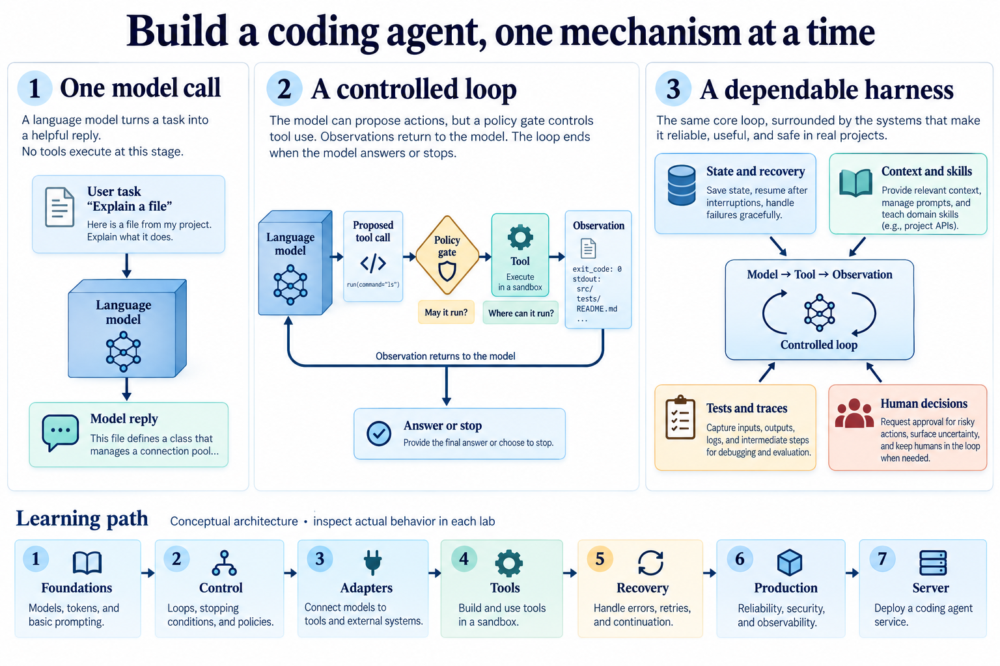

# Build a coding agent, one mechanism at a time

Ask a model to explain a file and it can produce a plausible answer. Give it a file-reading tool and it can inspect the actual contents. Feed that observation into its next request and you have the beginning of an agent loop.

This course builds the machinery around that loop: tools, skills, state, permissions, context, recovery and evaluation. Each lesson keeps a runnable implementation beside its explanation. You can ask your coding agent to execute and modify the examples while you predict, inspect and explain the behavior.



*A conceptual map of the course. Later lessons add the controls around the early loop. An illustration is not evidence that a particular sandbox, provider or deployment has passed a check.* [View full size](harness/assets/overview-v1.png).

**Begin with [Start here](harness/START-HERE.md).** Browse [all 54 lessons](harness/COURSE-MAP.md), use the [glossary](harness/GLOSSARY.md), or plan a class with the [teaching roadmap](harness/TEACHING-ROADMAP.md).

## What you will learn

- Trace a model request through a tool action and returned observation.
- Distinguish reusable skills, tool implementations, context, state and the harness that coordinates them.
- Test permission decisions, execution boundaries, stopping rules and recovery behavior.
- Compare local, SDK and hosted implementations by who owns each responsibility.
- Read tests and traces critically, then demonstrate a small working change with its limits.

**Prerequisites:** basic familiarity with files, functions and command output. No harness background is required. A coding agent can write the implementation and commands for you; reading small code examples helps you inspect its work.

**Equipment:** a CPU laptop, Python 3.10 or later for the Python lessons, and a coding agent with file and command access for guided study. Some extensions need Node, a browser, provider credentials or a running service. Offline tests use fakes; hosted runs have separate requirements and costs.

**Time:** begin with one 60–90 minute guided session. For the complete course, provisionally allow 30–50 hours of reading, discussion and small exercises, plus setup, live integrations and capstone work. This is an author planning estimate, not measured learner duration. The roadmap explains shorter routes and readiness checks.

## Seven themes, one clear path

| Theme | Original stages | What becomes possible |
|---|---|---|
| [1. From a reply to an agent](harness/01_foundations/README.md) | 1–8, including 2.1–2.4 | Follow a tool call from proposal through execution into the next model request. Explain how a saved session differs from the files it describes. |
| [2. Keep actions within limits](harness/02_control/README.md) | 9–15 | Explain why permission, sandboxing, context management and subagents solve different problems. |
| [3. Separate the harness from its provider](harness/03_adapters/README.md) | 16–20 | Explain a provider change as a change of ownership and interfaces, then name what still needs testing. |
| [4. Connect tools and observe the work](harness/04_tools/README.md) | 21–30 | Trace a request through tools, hooks and background work into an evaluation record. Explain what an offline test leaves untested. |
| [5. Resume work without guessing](harness/05_recovery/README.md) | 31–38 | Explain how instructions, context, workspace checkpoints, durable state and human decisions contribute to a recoverable capstone. |
| [6. Make a run inspectable](harness/06_production/README.md) | 39–45 | Explain why a run ended, which agent owned the next action, and how the trace supports the account. Compare the Python implementation with the smaller TypeScript core. |
| [7. Move the loop behind a service](harness/07_server/README.md) | 46–51 | Map client/server responsibilities and explain incomplete, cancelled, failed and completed turns without treating them as interchangeable. |

The first two themes form the core. SDKs and the service are comparative routes; their live integrations are optional for understanding the local loop. Follow the listed prerequisites before entering the later recovery and production themes.

## Your first instruction to the agent

Open the repository root and paste:

```text
Read harness/skills/harness-tutor/SKILL.md
and harness/START-HERE.md.
Begin the first lesson with me.
Explain one model request before adding tools.
You write commands and implementation changes.
I will predict, inspect and explain.
Run the offline check first and pause for my answer.
Keep my experiments in a separate learner copy.
```

The tutor skill is a readable procedure. An agent without native skill discovery can open the file directly. Its actual tools and execution boundaries still determine what it can do.

## Find the material

```text
README.md                         course entrance
harness/
  START-HERE.md                   setup and first session
  COURSE-MAP.md                   every lesson in learning order
  TEACHING-ROADMAP.md              routes, sessions and readiness checks
  GLOSSARY.md                     definitions and examples
  01_foundations/ ... 07_server/  themed guides and runnable lessons
  assets/                        overview and seven theme infographics
  skills/harness-tutor/           agent-guided learning procedure
genui/                           generative UI course
rsi/                             ML experiments to recursive self-improvement
how-did-i-generate-it/harness/    backup, plan, prompts and validation
run_tests.py                     offline test discovery across courses
check_snippets.py                quoted-code consistency checks
```

The [migration map](harness/MIGRATION.md) connects every old lesson path to its new home. The [original walkthrough](how-did-i-generate-it/harness/backups/README-before-reorganization.md) is retained as a historical backup. Use the current lesson READMEs for runnable paths and detailed explanations.

## Continue into another course

| Course | Question it explores | Start |
|---|---|---|
| Generative UI | How does an agent produce an interface people can use? | [GenUI](genui/README.md); its guide names the harness prerequisites |
| Recursive self-improvement | How can we test changes to an ML research process and its improver? | [RSI](rsi/README.md); 101 labs, an expanded glossary and a teaching roadmap |

RSI starts with basic ML knowledge and introduces its own harness concepts. You do not need to finish every provider example here before beginning it.

## What has been checked

The reorganization preserves the lesson snapshots and updates their discovery and navigation. Consult the [validation record](how-did-i-generate-it/harness/VALIDATION.md) for actual checks and remaining failures. Passing fake-model tests does not establish live-provider compatibility, production safety or student learning outcomes.
