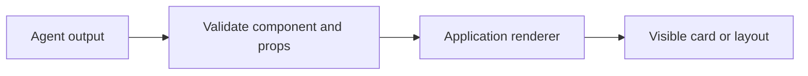

# Sub-theme 01 - Foundations: static, declarative, open-ended

<!-- genui-orientation -->
**You are here: theme 1 of 7.** [Course map](../README.md#see-the-learning-path) · [Recorded walkthrough](../WALKTHROUGH.md) · [Next theme](../02_ag_ui/README.md)



*The agent chooses; the application renders.*

<!-- /genui-orientation -->

The three ways an agent can produce an interface, built with no framework so
the mechanism is visible before the libraries hide it. The map comes from
the State of Generative UI report (June 2026),
https://www.openui.com/blog/state-of-generative-ui-report: **transport** is
where the UI appears, **generation** is what the agent emits. This
sub-theme is about generation. Every step is one Python backend
(`server.py`, FastAPI), one page (`page/index.html` + `page/app.js`), no
build step, and the same prompt: a dashboard for a lemonade stand.

Each step is a copy of the previous one plus one idea. Run them in order.

## Steps

**[Step 01 - Static components](step_01_static_components/)**. Three
components exist before the model runs. The model gets them as tools; each
tool call becomes a `{"component", "props"}` message on an SSE stream; the
page renders it with a hand-written renderer keyed by name. The agent
selects and fills, and cannot do layout.

**[Step 02 - Declarative tree](step_02_declarative_tree/)**. A catalog of
eight components, a JSON Schema built from it, and the model writing the
whole layout as JSON. The page renders while the document streams, with a
tolerant partial-JSON parser. Two document shapes, a nested tree and a flat
element map with ids, measured: the flat map's layout is known at chunk 33
of 266, the tree's at chunk 408 of 408, which is why A2UI and json-render
use the flat shape.

**[Step 03 - Open-ended HTML](step_03_open_ended_html/)**. No catalog: the
model writes the page. The host mounts it in an `<iframe sandbox>` with a
Content Security Policy and hears from it only through `postMessage`. The
same prompt in all three modes, with tokens counted: 196 / 328 / 3013, the
report's "5 to 10 times" checked at 9.2x, 9.8x and 10.4x over three runs.

**[Step 04 - Hybrid escape hatch](step_04_hybrid_escape_hatch/)**. The
report's recommendation: the step 02 catalog plus one `GeneratedView`
component whose prop is model-written HTML rendered in the step 03 sandbox.
A `Button` carries an action name; a click goes back to the server as the
next user message and the model answers with the updated layout. The loop
closes.

## Layout

```text
01_foundations/
├── README.md                         this file
├── step_01_static_components/
│   ├── server.py  llm.py  catalog.py
│   ├── page/                         index.html, app.js, render.mjs
│   ├── tests/                        render.test.mjs
│   └── test_step.py  demo.py  demo.png  package.json  README.md
├── step_02_declarative_tree/
│   ├── server.py  llm.py  catalog.py  partial_json.py  progress.py
│   ├── page/                         + partial-json.mjs
│   ├── tests/                        + partial-json.test.mjs
│   └── test_step.py  demo.py  demo.png  demo_streaming.png  package.json  README.md
├── step_03_open_ended_html/
│   ├── server.py  llm.py  catalog.py  partial_json.py  progress.py  tokens.py
│   ├── page/                         + sandbox.mjs
│   ├── tests/                        + sandbox.test.mjs
│   └── test_step.py  demo.py  demo.png  package.json  README.md
└── step_04_hybrid_escape_hatch/
    ├── server.py  llm.py  catalog.py  partial_json.py  progress.py  tokens.py
    ├── page/                         index.html, app.js, render.mjs, partial-json.mjs, sandbox.mjs
    ├── tests/                        render, partial-json and sandbox tests
    └── test_step.py  demo.py  demo.png  demo_after_action.png  package.json  README.md
```

Every step has the same shape: `server.py` (FastAPI, `/api/run` as SSE),
`llm.py` (one streamed call), `catalog.py`, a `page/` with no build step, a
`tests/` directory for `node --test`, `test_step.py` for the offline pytest
and `demo.py` to record the README. Later steps add files (`+` above) and
keep the earlier ones unchanged where the header comment still says so.

## Running

Every step: `python server.py` to use it, `python demo.py` to record the
README's demo (needs a key), `python -m pytest test_step.py` for the offline
tests, `npm test` for the JavaScript tests alone. From the repository root,
`python run_tests.py genui/01` runs all four.

## What every step guarantees

The same three rules hold in all four steps, so a reader who diffs step N
and N+1 sees only that step's idea:

- Every SSE stream ends with a terminal frame. On success it is
  `{"done": true, ...}`; when the model call fails after the headers have
  left it is `{"done": true, "error": "<type>: <message>"}`. The page
  always reaches `data-state="done"`, also when the server is down or
  answers 4xx/5xx, and the demos stop with the error instead of waiting.
- A tool call is assembled by index until the stream ends, so interleaved
  pieces and a missing index cannot corrupt it.
- The page renders what the model wrote as text, never as markup: every
  prop goes through `esc()`, array props through `list()`, component
  names through `Object.hasOwn`, and model-written HTML only ever lands in
  a sandboxed iframe.

The demos wait ten seconds for the server to start and raise if it does
not (a port in use, an import error); they never spin.
