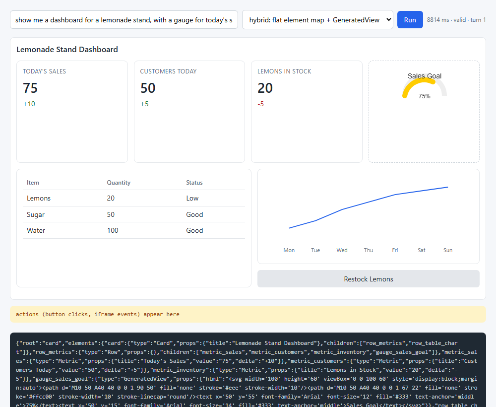

# Step 04 - Hybrid escape hatch

<!-- genui-orientation -->
**Lesson 4 of 23.** [Course](../../README.md) · [Theme](../README.md) · [Previous lesson](../step_03_open_ended_html/README.md) · [Next lesson](../../02_ag_ui/step_01_ag_ui_server/README.md)

<!-- /genui-orientation -->

**What this step adds:** the report's hybrid pattern, and a loop that
closes. The step 02 catalog gains one component, `GeneratedView`, whose
only prop is HTML the model writes; the page renders it in the step 03
sandbox. Everything else stays catalog-constrained. A `Button` carries an
`action` name; a click posts that event to the server, which appends it to
the session's transcript and runs the next model turn. The page renders the
new layout the same way it rendered the first.

## Why: what breaks without it

Step 02's catalog cannot draw a gauge; step 03's page costs ten times the
tokens and looks like nothing else in the product. Without the hybrid the
choice is all-or-nothing. With it, the catalog stays in charge and the
sandbox is rented for one component. And a dashboard the user cannot
click is a report: without the loop, a `Button` is decoration. The loop
turns the click into the next user message, which is the same shape every
later sub-theme uses for actions.

## Quick demo

```bash
python demo.py
```

```text
prompt: show me a dashboard for a lemonade stand, with a gauge for today's sales goal and a button to restock lemons
turn 1: session 021c15b36ace, valid=True, 11 elements:
  card           Card           Lemonade Stand Dashboard
  row_metrics    Row            
  metric_sales   Metric         Today's Sales
  metric_customers Metric         Customers Today
  metric_inventory Metric         Lemons in Stock
  gauge_sales_goal GeneratedView  481 chars of html
  row_table_chart Row            
  table_inventory Table          
  column_chart_button Column         
  chart_sales_trend Chart          
  button_restock Button         'Restock Lemons' -> action 'restock_lemons'
clicked 'Restock Lemons'; the page sent: {"source": "button", "action": "restock_lemons", "payload": {"label": "Restock Lemons"}}
turn 2: valid=True, 9 elements unchanged, changed ['metric_inventory', 'table_inventory'], added [], removed []
  metric_inventory: {"title": "Lemons in Stock", "value": "20", "delta": "-5"}
                    -> {"title": "Lemons in Stock", "value": "100", "delta": "+80"}
  table_inventory: {"columns": ["Item", "Quantity", "Status"], "rows": [["Lemons", "20", 
                   -> {"columns": ["Item", "Quantity", "Status"], "rows": [["Lemons", "100",
saved demo.png, demo_after_action.png
```

Turn 1. Ten catalog components and one `GeneratedView` (the gauge, dashed
border), with the model's JSON below:



Turn 2, after the click. The inventory metric and the table changed; the
rest is byte-for-byte the first layout:


## Files

```text
step_04_hybrid_escape_hatch/
├── server.py         FastAPI app: /api/run keeps a locked session transcript; POST /api/action runs the next turn; error frames
├── llm.py            one streamed call over the OpenAI-compatible API
├── catalog.py        the catalog plus GeneratedView, and the two prompt rules for the hatch and Button.action
├── partial_json.py   the step 02 tolerant JSON parser
├── progress.py       the step 02 streaming measurement
├── tokens.py         the step 03 token count
├── page/
│   ├── index.html    the page shell; default prompt and mode, generated iframe style
│   ├── app.js        consume() renders any turn; act() posts a click or a generated event to /api/action; one turn at a time
│   ├── partial-json.mjs   the step 02 parser in JavaScript
│   ├── render.mjs    the catalog renderers, walkers, and GeneratedView as a sandboxed iframe
│   └── sandbox.mjs   the step 03 box: sandbox attribute, CSP meta tag, isEvent()
├── tests/
│   ├── partial-json.test.mjs   node --test for the parser
│   ├── render.test.mjs         node --test for the renderers, GeneratedView included
│   └── sandbox.test.mjs        node --test for the CSP injection and the event shape
├── test_step.py      offline pytest: sessions, the action endpoint, the hatch, the page
├── demo.py           turn 1 headlessly, the click, turn 2; prints the element diff, saves both screenshots
├── demo.png          turn 1: ten catalog components and one GeneratedView
├── demo_after_action.png   turn 2, after the click
├── package.json      npm test = node --test (no dependencies)
└── README.md         this file
```

## The hybrid pattern

The State of Generative UI report's recommendation is not one of the three
modes but a mix: declarative by default, with an escape hatch to open-ended
generation for the one thing the catalog cannot express. Step 02 showed why
declarative is the default: typed props, a schema to check, a renderer the
product owns, and a tenth of the tokens. Step 03 showed what open-ended
costs and how to contain it. This step puts the container inside the
catalog. `GeneratedView` is a component like any other, with one string
prop. The renderer for that component is the sandbox.

The second idea is the loop. A dashboard that cannot be clicked is a
report. The catalog's `Button` has an `action` prop, which is a name the
model chose. When the user clicks, the page does not know what the name
means; it posts it back. The server turns the event into a user message on
the same transcript, and the model, which does know what it meant, answers
with the next layout. The first turn and every later turn use the same
code path and the same stream.

## The code, piece by piece

`catalog.py`: one more entry. The schema, the prompt and the renderer table
all pick it up from here.

```python
    "Button": ({"label": STRING, "action": STRING}, False),
    # The escape hatch: model-written HTML, rendered in the step 03 sandbox.
    "GeneratedView": ({"html": STRING}, False),
}
```

`catalog.py`: two more lines in the prompt. The model is told what the
hatch is for and how small to keep it, and what a button's action means.

```python
        "GeneratedView is the escape hatch: its html prop is a small self-contained HTML fragment "
        "(inline style, inline SVG, no external resources) for one thing the catalog cannot show, "
        "such as a gauge. Use it at most once and keep it short.\n"
        "Button.action is an event name. When the user clicks, the app sends you that event and "
        "you answer with the updated dashboard.\n"
```

`page/render.mjs`: the renderer for the hatch. It is the step 03 sandbox
as a component: `sandbox="allow-scripts"`, the CSP injected, and the
document escaped because here it is an attribute value.

```js
export function GeneratedView(props) {
  // The escape hatch: model-written HTML in the step 03 sandbox. The document
  // goes through esc() because it is an attribute value here; the browser
  // unescapes it when it reads srcdoc. While the html prop is still being
  // written the slot stays pending: a half document is not mounted, and not
  // mounted again on every delta.
  if (isPartial(props)) return PENDING;
  return `<iframe class="card generated" sandbox="allow-scripts" srcdoc="${esc(sandboxed(String(props.html ?? "")))}"></iframe>`;
}
```

The page re-renders the whole layout on every delta. Without the
`isPartial` check a `GeneratedView` would be mounted dozens of times per
turn, first as a cut string; and a fragment that posts an event on load
would start a turn, which re-mounts it, which posts again. The check plus
the `running()` guard in `app.js` close that loop.

`server.py`: sessions. A declarative run opens a transcript; each turn
appends the model's reply, so the next action continues from the layout
the user is looking at. A lock keeps two turns from interleaving on one
transcript, and a turn that fails takes its user message back out, so
the transcript never carries a question the model was not asked.

```python
    session = SESSIONS[session_id]
    shape = session["shape"]
    with session["lock"]:  # one turn at a time per transcript: a double click must not interleave two
        try:
            for item in stream_text(session["messages"], response_format={"type": "json_object"}):
                if isinstance(item, dict):
                    yield item
                    continue
                text, usage = item
        except Exception:
            if session["messages"][-1]["role"] == "user":
                session["messages"].pop()  # the turn never happened: no dangling user message
            raise
        session["messages"].append({"role": "assistant", "content": text})
```

`server.py`: the action endpoint. The event becomes a user message and the
same generator streams the reply.

```python
EVENT_PROMPT = (
    "Event from the dashboard: the user triggered {action!r} with payload {payload}. "
    "Apply it and answer with the whole updated dashboard, as one JSON document in the same shape as before. "
    "Change only what the event changes; keep the other elements as they were."
)
```

```python
@app.post("/api/action")
def action(body: Action, request: Request):
    """The loop closes: the event becomes a user message, the model answers with the next layout."""
    session = SESSIONS.get(body.session)
    if session is None:
        raise HTTPException(404, "unknown session")
    if session["lock"].locked():
        raise HTTPException(409, "a turn is still running on this session")
    session["turn"] += 1
    session["messages"].append({"role": "user", "content": EVENT_PROMPT.format(action=body.action, payload=json.dumps(body.payload))})
    return stream(declarative_turn(body.session), request)
```

The action name and payload are text the model wrote, sent back by the
page and pasted into a user turn. That is the loop's contract, and it is
also a prompt-injection path: a `GeneratedView` can post any `name` it
likes. Here it is one user talking to their own dashboard; a product
would whitelist action names per layout.

`page/app.js`: the two sources of events. A click on any catalog button is
one; a `postMessage` from any `GeneratedView` iframe is the other. Both go
through `act`, which posts to the server and hands the reply to the same
`consume` that rendered the first turn.

```js
export async function act(action, payload, source) {
  // The event goes to the server as the next user turn; the reply is a whole new layout.
  const event = { source, action, payload };
  inbox.push(event);
  inboxPanel.textContent += JSON.stringify(event) + "\n";
  if (!session) return; // html mode, or nothing rendered yet: logged, not acted on
  if (running()) return; // a turn is streaming: the click is logged, not sent
  timeline.length = 0;
  await consume("/api/action", { session, action, payload }, currentMode);
}

dashboard.addEventListener("click", (event) => {
  // Every Button in the catalog carries data-action; the click is the event.
  const button = event.target.closest("button.action");
  if (button) act(button.dataset.action, { label: button.textContent }, "button");
});

window.addEventListener("message", (event) => {
  // Only a window the page mounted, and only the one shape the host accepts.
  // While a turn streams, a generated iframe that posts on load is ignored:
  // otherwise its message would start a turn that re-mounts it, which posts again.
  if (running() || !isEvent(event.data)) return;
  const frames = [frame, ...dashboard.querySelectorAll("iframe.generated")];
  if (!frames.some((f) => f.contentWindow === event.source)) return;
  act(event.data.name, event.data.payload ?? null, "generated");
});
```

`consume` sets `data-state="running"` before the request leaves, so a
second click or submit during a turn is logged and dropped, and a script
driving the page never sees a stale `done`. During an action turn the
previous layout stays on screen until the new document's root has
arrived.

## Run it

Prerequisites: step 03's.

```bash
python server.py            # http://127.0.0.1:8010, run the prompt, click the button
python demo.py              # turn 1, the click, turn 2, two screenshots
python -m pytest test_step.py
npm test
```

PowerShell:

```powershell
$env:API_KEY = "sk-..."
python server.py
python demo.py
python -m pytest test_step.py
npm test
```

Expected output: the layout streams in as in step 02 with one dashed
iframe for the gauge; the status line reads `... ms · valid · turn 1`.
Click the button: the inbox panel logs `{"source": "button", ...}`, the
layout holds still until the new JSON starts, then updates, and the
status line reads `turn 2`. The quick demo above prints the element diff
between the two turns.

Sessions live in memory in `server.SESSIONS` (the oldest is dropped past
100); restart the server and the page must run a new prompt before a
click does anything, because the old session id answers 404.

## Error handling

- The model call fails on any turn: `{"done": true, "error": "..."}` is
  the last frame; on an action turn the event's user message is removed
  from the transcript, so the next click starts from a clean one.
- A click while a turn is streaming: logged in the inbox, not sent. A
  second request on the same session from elsewhere gets `409`.
- An unknown session (server restarted): `404`; the page shows
  `error: 404 ...` in the status line and stays on the old layout.
- The reply is invalid against the schema: `valid` is false, `errors`
  names the path, the page renders it anyway; `demo.py` stops with the
  errors instead of diffing a broken layout.
- A `GeneratedView` that posts on load: ignored while its own turn is
  streaming, acted on afterwards, once.
- Leave `python server.py` with ctrl-c.

## Gotchas / what this is not

- The whole layout is re-sent every turn (the prompt asks the model to
  keep the rest unchanged). A diff protocol comes in sub-themes 03 and 05.
- The loop's contract is thin on purpose: the action name is opaque text.
  It is also a prompt-injection surface; see above.
- One process, one lock per session, no persistence, no authentication.
- The step 03 sandbox limits apply to every `GeneratedView`: no host
  access, no loads, but a link inside it can still navigate the iframe.

## What to notice

- The hatch is a component. Nothing in the server knows that
  `GeneratedView` is special: it is a string prop that passes the schema.
  Only the renderer treats it differently, and it treats it the way step
  03 treated a whole page.
- The gauge cost 481 characters of HTML inside a 11-element layout. The
  same dashboard as a whole page in step 03 cost about 9000. The hatch buys
  the one thing the catalog lacks at a fraction of the price.
- The model changed two elements and left nine untouched, because the
  prompt asked for that and the transcript held the previous layout. A
  diff-based protocol (JSON Patch, as json-render streams it, or A2UI's
  `updateComponents`) would send only those two; this step re-sends the
  whole layout, which is simpler and costs a second turn of tokens.
- The action name is the model's. `restock_lemons` was never in any
  schema. The page treats it as opaque; the server treats it as text; the
  model interprets it. That is the loop's contract, and it is thin on
  purpose. Sub-theme 02 makes it a typed event stream.
- A `GeneratedView` can post events too, and they take the same route.
  The demo's model wrote a static gauge, so the click came from the
  catalog button; the message listener accepts both.

## What the next sub-theme adds

AG-UI: the ad-hoc `/api/run` and `/api/action` streams become one typed
event protocol that any client library can read.

## Diff from the previous step

```bash
diff -r ../step_03_open_ended_html .
```

Changed: `catalog.py` (`GeneratedView`, two prompt rules), `server.py`
(`SESSIONS`, `new_session`, `declarative_turn`, `EVENT_PROMPT`,
`/api/action`), `page/render.mjs` (`GeneratedView`), `page/app.js`
(`consume`, `act`, click delegation, the listener accepts generated
iframes), `page/index.html` (default prompt and mode, generated iframe
style), `demo.py`, `tests/render.test.mjs`. Everything else is step 03.
