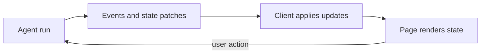

# Sub-theme 02 - AG-UI, the transport

The Python SDK can store a state-patch operation as a typed object. The browser
receives JSON after event encoding. The tests check that encoded contract and
apply its patches, rather than depending on the SDK's internal Python shape.

<!-- genui-orientation -->
**You are here: theme 2 of 7.** [Course map](../README.md#see-the-learning-path) · [Recorded walkthrough](../WALKTHROUGH.md) · [Previous theme](../01_foundations/README.md) · [Next theme](../03_a2ui/README.md)



*Events carry a run; state determines what the page displays.*

<!-- /genui-orientation -->

The State of Generative UI report (June 2026)
(https://www.openui.com/blog/state-of-generative-ui-report) separates two
choices: what the agent generates, and how it travels to the screen. This
sub-theme is about the second one. AG-UI is the transport for a product
you own: one `RunAgentInput` request, one stream of typed events back.
The three steps build the server side with `ag-ui-protocol` (PyPI), the
client side first by hand and then with `@ag-ui/client` (npm), and end by
putting the harness codelab's coding agent behind the protocol.

| Step | Adds |
|------|------|
| `step_01_ag_ui_server` | A FastAPI endpoint that streams `RUN_STARTED`, `TEXT_MESSAGE_*`, `RUN_FINISHED` from a real model call; a page that reads the stream with `fetch`. The wire format, one event per line. |
| `step_02_ag_ui_tools_and_state` | Tool calls (`TOOL_CALL_*`) and shared state (`STATE_SNAPSHOT`, `STATE_DELTA` as JSON Patch). Server tools patch a `dashboard` object and the page renders it. A client tool, `confirm_purchase`, that the page executes. |
| `step_03_ag_ui_from_the_harness` | The harness codelab's step 21 loop wrapped so every delta, tool call, permission question and todo update is an AG-UI event; `HttpAgent` from `@ag-ui/client` in the page. A coding task run from the browser. |

## Layout

```text
02_ag_ui/
├── README.md
├── step_01_ag_ui_server/
│   ├── server.py  agent.py  llm.py  sse.py
│   ├── index.html  app.js  sse.mjs  sse.test.mjs
│   ├── test_step.py  demo.py  demo.png  package.json
│   └── README.md
├── step_02_ag_ui_tools_and_state/
│   ├── server.py  agent.py  tools.py  json_patch.py  llm.py  sse.py
│   ├── index.html  app.js  render.mjs  json-patch.mjs  sse.mjs  json-patch.test.mjs  sse.test.mjs
│   ├── test_step.py  demo.py  demo.png  package.json
│   └── README.md
└── step_03_ag_ui_from_the_harness/
    ├── server.py  bridge.py  llm.py  sse.py  harness/
    ├── index.html  app.js  client-entry.mjs  http-agent.test.mjs
    ├── test_step.py  demo.py  demo.png  package.json  package-lock.json  .gitignore
    └── README.md
```

Every step has the same shape: `server.py` exposes `POST /agent` and
serves the page, `llm.py` loads the same settings, `sse.py` reads the
stream for the tests and the demo, and `test_step.py` runs offline with a
fake model. Steps 01 and 02 write the client by hand (`app.js`,
`sse.mjs`); step 03 replaces the agent with `bridge.py` over `harness/` and
the client with `@ag-ui/client`.

Each step is self-contained. Run `python demo.py` in a step for the
recorded demo (needs a model key), `python -m pytest -q test_step.py` and
`npm test` for the offline tests.

## The events, and the order the reference client enforces

| Event | Carries | Used from |
|---|---|---|
| `RUN_STARTED` | `threadId`, `runId` | step 01 |
| `TEXT_MESSAGE_START` / `CONTENT` / `END` | `messageId`, `role`; `delta` per piece | step 01 |
| `RUN_FINISHED` | optional `usage` (step 03) | step 01 |
| `RUN_ERROR` | `message` | step 01 |
| `TOOL_CALL_START` / `ARGS` / `END` | `toolCallId`, `toolCallName`, optional `parentMessageId`; `delta` per piece | step 02 |
| `TOOL_CALL_RESULT` | `messageId`, `toolCallId`, `content`, `role: tool` | step 02 |
| `STATE_SNAPSHOT` | `snapshot`, the whole state object | step 02 |
| `STATE_DELTA` | `delta`, a JSON Patch (RFC 6902) | step 02 |
| `CUSTOM` | `name`, `value`; here `permission` | step 03 |

Rules `@ag-ui/client` 0.0.59 (the vendored version) checks, and
`ag-ui-protocol` 0.1.22 on the server encodes: the first event is
`RUN_STARTED`; exactly one terminal event, `RUN_FINISHED` or `RUN_ERROR`;
`RUN_FINISHED` is refused while a text message or a tool call is open;
`RUN_ERROR` is allowed at any point after `RUN_STARTED`; a
`TEXT_MESSAGE_START` id is not reused. This client accepts a tool event
inside an open text message; earlier versions did not, so the servers
here end the text message before the first `TOOL_CALL_START`. The client
splits frames on a blank line with LF endings (`\n\n`, never CRLF) and ignores SSE comment lines, which
step 03 uses as keepalives.

Every server in this sub-theme guards the same things: a failed model
call is a `RUN_ERROR`, never a cut stream; a tool that cannot run gets an
`Error: ...` result instead of ending the run; the tool loop is capped;
and the endpoint closes the run when the browser leaves. Every page
reaches a final status (`finished` or `error: ...`) whatever the server
does, and rolls a failed run's messages back so the next run's history is
one the API accepts. The servers are local demos: 127.0.0.1, no
authentication, one user per process.
