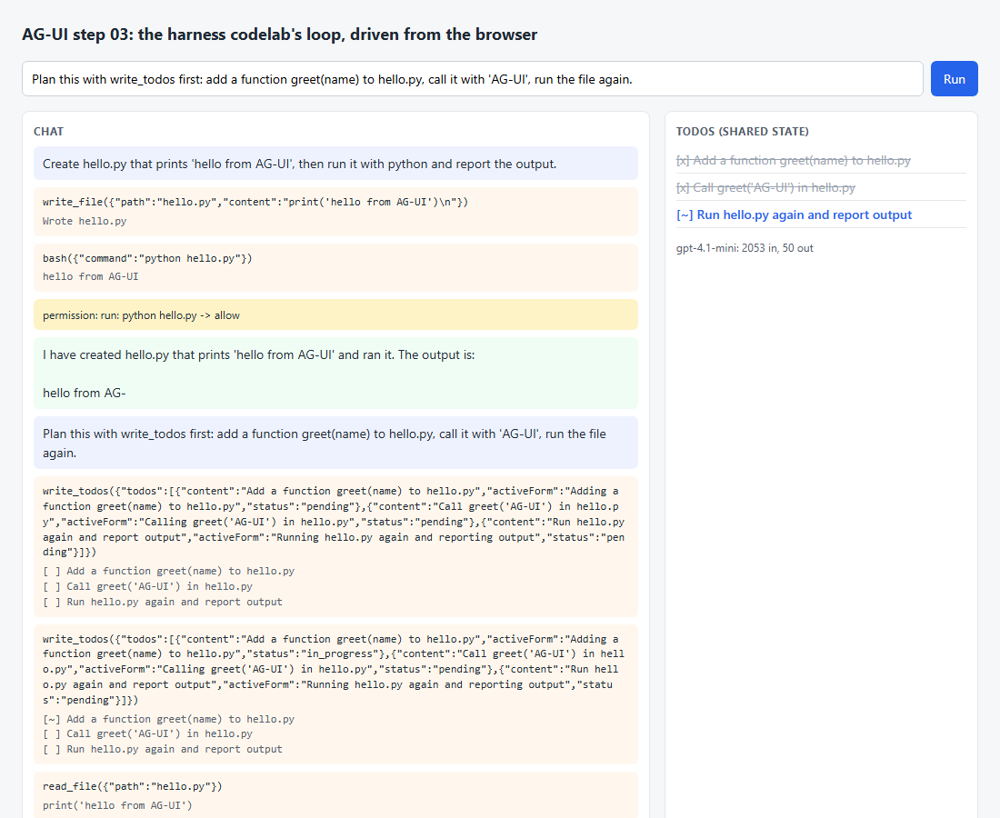

# Step 03 - The harness codelab's loop over AG-UI

**What this step adds:** the coding agent from the harness codelab, driven
from a browser. `harness/` is a verbatim copy of `step_21_streaming_headless`
(the stage 15 loop with streaming). `bridge.py` runs that loop and turns
every model delta, tool call, tool result, permission question and todo
update into an AG-UI event. On the page, the hand-written SSE reader and
message bookkeeping are gone: `@ag-ui/client`'s `HttpAgent` does the
request, the parsing, the verification and the state, and the page only
subscribes to what it draws.

## Quick demo

```bash
python demo.py
```

```text
> Create hello.py that prints 'hello from AG-UI', then run it with python and report the output.
  RUN_STARTED
  STATE_SNAPSHOT       0 todos
  TOOL_CALL_START      write_file
  TOOL_CALL_ARGS       1 events: {"path":"hello.py","content":"print('hello from AG-UI')\n"}
  TOOL_CALL_END
  TOOL_CALL_RESULT     Wrote hello.py
  TOOL_CALL_START      bash
  TOOL_CALL_ARGS       1 events: {"command":"python hello.py"}
  TOOL_CALL_END
  CUSTOM               permission: run: python hello.py -> allow
  TOOL_CALL_RESULT     hello from AG-UI
  TEXT_MESSAGE_START
  TEXT_MESSAGE_CONTENT 27 events: I have created hello.py that prints 'hello from AG-UI' and r
  TEXT_MESSAGE_END
  RUN_FINISHED         usage 1148 in, 28 out
> Plan this with write_todos first: add a function greet(name) to hello.py, call it with 'AG-UI', run the file again.
  RUN_STARTED
  STATE_SNAPSHOT       0 todos
  TOOL_CALL_START      write_todos
  TOOL_CALL_ARGS       1 events: {"todos":[{"content":"Add a function greet(name) to hello.py
  TOOL_CALL_END
  TOOL_CALL_RESULT     [ ] Add a function greet(name) to hello.py | [ ] Call greet(
  STATE_DELTA          replace /todos (3 todos)
  TOOL_CALL_START      read_file
  TOOL_CALL_ARGS       1 events: {"path":"hello.py"}
  TOOL_CALL_END
  TOOL_CALL_RESULT     print('hello from AG-UI')
  TOOL_CALL_START      bash
  TOOL_CALL_ARGS       1 events: {"command":"python hello.py"}
  TOOL_CALL_END
  CUSTOM               permission: run: python hello.py -> allow
  TOOL_CALL_RESULT     hello from AG-UI
  RUN_FINISHED         usage 2053 in, 50 out
status: finished; todos: ['[x] Add a function greet(name) to hello.py', "[x] Call greet('AG-UI') in hello.py", '[~] Run hello.py again and report output']
workdir: ['hello.py']
saved demo.png
```

The second run had 46 event lines: three more `write_todos` groups (each
followed by a `STATE_DELTA`), two `write_file` calls and the final text
message are cut here to keep the listing short.



## Two codelabs, one loop

The harness codelab built an agent loop for a terminal. Its `call_llm`
streams text through an `on_delta` callback and assembles tool calls;
`tools.execute` runs one call through the permission rules; `write_todos`
keeps a plan that is injected into every request. None of that is about
the terminal. The terminal is one *transport*, in the report's word, and
AG-UI is another.

So the bridge does not touch `harness/`. It calls the same functions and
translates their side effects. A text delta becomes `TEXT_MESSAGE_CONTENT`.
An assembled tool call becomes `TOOL_CALL_START`, `TOOL_CALL_ARGS`,
`TOOL_CALL_END`. The result of `execute` becomes `TOOL_CALL_RESULT`. The
plan becomes shared state: `STATE_SNAPSHOT {"todos": [...]}` at the start
and `STATE_DELTA replace /todos` after every `write_todos`. The token
usage the harness already collects rides on `RUN_FINISHED`. And a
permission question, which the terminal harness asks at the prompt,
becomes a `CUSTOM` event named `permission`, because the browser has no
prompt to ask at.

On the other side, `@ag-ui/client` is what a product would use. It sends
the `RunAgentInput`, verifies that the events arrive in a legal order,
rebuilds the message list from `TEXT_*` and `TOOL_*` events, applies
`STATE_*` events with JSON Patch, and calls a subscriber method per event
with useful extras such as the text buffered so far.

## The code, piece by piece

### 1. A callback turned into a generator

`bridge.py`:

```python
def streamed(messages):
    """call_llm as a generator: ("delta", text) while it streams, then ("message", (message, usage)).

    call_llm blocks and reports text through a callback. A worker thread runs
    it and pushes every callback onto a queue; this generator drains the queue.
    """
    items = queue.Queue()

    def worker():
        try:
            result = call_llm(messages, on_delta=lambda text: items.put(("delta", text)))
            items.put(("message", result))
        except Exception as error:  # noqa: BLE001 - re-raised on the generator side
            items.put(("error", error))

    threading.Thread(target=worker, daemon=True).start()
    while True:
        kind, payload = items.get()
        if kind == "error":
            raise payload
        yield kind, payload
        if kind == "message":
            return
```

`call_llm` pushes; an event stream pulls. A queue between two threads
joins them without changing the harness.

### 2. The loop, event by event

`bridge.py`:

```python
            for tool_call in message.tool_calls:
                yield ToolCallStartEvent(tool_call_id=tool_call.id, tool_call_name=tool_call.function.name, parent_message_id=message_id)
                yield ToolCallArgsEvent(tool_call_id=tool_call.id, delta=tool_call.function.arguments)
                yield ToolCallEndEvent(tool_call_id=tool_call.id)

                ASKED.clear()
                args, result = execute(tool_call)
                for reason in ASKED:
                    yield CustomEvent(name="permission", value={"reason": reason, "decision": "allow"})
                yield ToolCallResultEvent(message_id=str(uuid4()), tool_call_id=tool_call.id, content=result, role="tool")
                messages.append({"role": "tool", "tool_call_id": tool_call.id, "content": result})
                if tool_call.function.name == "write_todos":
                    yield StateDeltaEvent(delta=[{"op": "replace", "path": "/todos", "value": copy.deepcopy(todos.TODOS)}])
```

The harness assembles a tool call before the loop sees it, so the
arguments go out as one `TOOL_CALL_ARGS` delta. Step 02 streamed them
piece by piece; both are legal. `execute` is the harness's own function,
permission layer included.

### 3. Permission without a prompt

`bridge.py`:

```python
def approve_for_the_page(reason):
    """Stands in for ui.approve: the browser has no prompt, so record and allow."""
    ASKED.append(reason)
    return True


ui.approve = approve_for_the_page
```

The harness asks `ui.approve(reason)` when a bash command is not on the
allow list. The bridge answers yes and tells the page what was asked. A
real product would end the run with an interrupt outcome and let the page
answer on the next run; the harness codelab's step 35 covers that pattern
on the terminal side.

### 4. The harness works in a directory

`server.py`:

```python
STEP = Path(__file__).resolve().parent
WORKDIR = Path(os.environ.get("HARNESS_WORKDIR", STEP / "workdir")).resolve()
WORKDIR.mkdir(parents=True, exist_ok=True)
os.chdir(WORKDIR)  # before the harness is imported: it takes the cwd as its project
```

`permissions.py`, `sandbox.py` and the system prompt all read the current
directory when they are imported. The server moves first, imports second.

### 5. Bundling the client

`client-entry.mjs`:

```js
export { HttpAgent } from "@ag-ui/client";
```

`@ag-ui/client` imports `rxjs`, `zod` and others by bare name. A browser
cannot resolve those without a bundler. One `esbuild` call (`npm run
build`) flattens the package into `vendor/ag-ui-client.js`; it is the only
build step in this sub-theme, and it exists because the library under
study needs it.

### 6. Subscribing instead of parsing

`app.js`:

```js
const agent = new HttpAgent({ url: "/agent" });
...
agent.subscribe({
  onEvent({ event }) {
    wire.textContent += JSON.stringify(event) + "\n";
  },
  onTextMessageStartEvent() {
    textElement = addMessage("assistant", "");
  },
  onTextMessageContentEvent({ textMessageBuffer }) {
    textElement.textContent = textMessageBuffer; // the client keeps the buffer
  },
```

`agent.addMessage(...)` then `await agent.runAgent()` is the whole run.
After it, `agent.messages` holds the user message, the assistant messages
with their tool calls and the tool results, and `agent.state` holds the
todos; the next run sends all of it.

### 7. The client tested against the bridge's stream

`http-agent.test.mjs`:

```js
  const agent = new HttpAgent({ url: `http://127.0.0.1:${server.address().port}/agent`, threadId: "t" });
  agent.addMessage({ id: "u1", role: "user", content: "write hello.py" });
...
  assert.deepEqual(seen, SCRIPT.map((e) => e.type));
  assert.deepEqual(tools, [["write_file", "hello.py"]]);
  assert.deepEqual(agent.state, { todos: [{ content: "write it", status: "completed" }] });
  assert.deepEqual(agent.messages.map((m) => m.role), ["user", "assistant", "tool", "assistant"]);
```

A Node `http` server replays the exact event sequence `bridge.py`
produces. The test runs offline and proves the two ends agree.

## Run it

```bash
npm install
npm run build
python server.py
```

Open http://127.0.0.1:8023. The agent works in `./workdir`; set
`HARNESS_WORKDIR` to point it elsewhere. Tests, offline:

```bash
python -m pytest -q test_step.py
npm test
```

`test_step.py` runs `npm install`, `npm test` and `npm run build` itself
when `node` is on the PATH.

## What to notice

- `harness/` has no diff against the harness codelab. The bridge is 150
  lines and the page is 90; that is the cost of a second transport.
- The client owns the transcript. The harness's `history.strip` and
  compaction, which edit the server-side list, do not apply: the page
  sends the full history every run. A product would move that logic to
  the client or keep a server-side thread store.
- `STATE_SNAPSHOT` says `0 todos` at the start of the second run because
  the first task was a single step and the harness skips the plan for
  those. A third run would start from three: the todo list is a module
  global on the server, and the snapshot refreshes the page's copy.
- The `usage` on `RUN_FINISHED` is the same dict the terminal prints
  after every reply, in the protocol's `TokenUsage` shape.

## Diff from the previous step

- `harness/` is new: the harness codelab's step 21, copied.
- `bridge.py` replaces `agent.py`, `tools.py` and `json_patch.py`: the
  loop is the harness's, the tools are the harness's, the state is the
  harness's plan.
- `llm.py` only loads settings; the model call lives in `harness/llm.py`.
- `app.js` uses `HttpAgent` from `@ag-ui/client`; `sse.mjs`,
  `json-patch.mjs` and `render.mjs` are gone.
- `package.json` gains `@ag-ui/client`, `esbuild` and a `build` script;
  `http-agent.test.mjs` tests the real client against a fake server.
