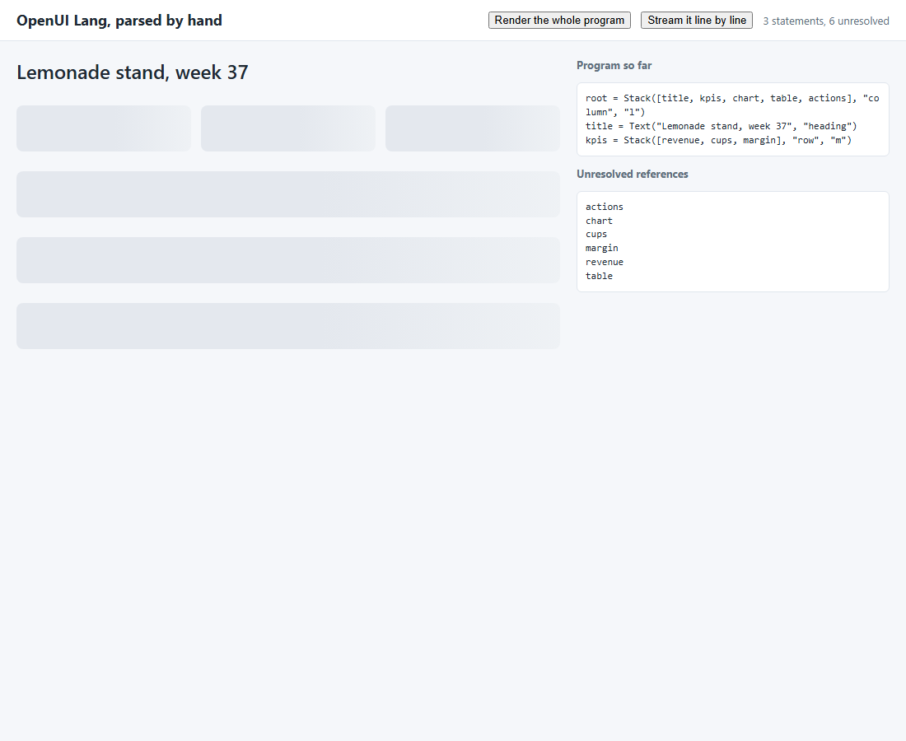
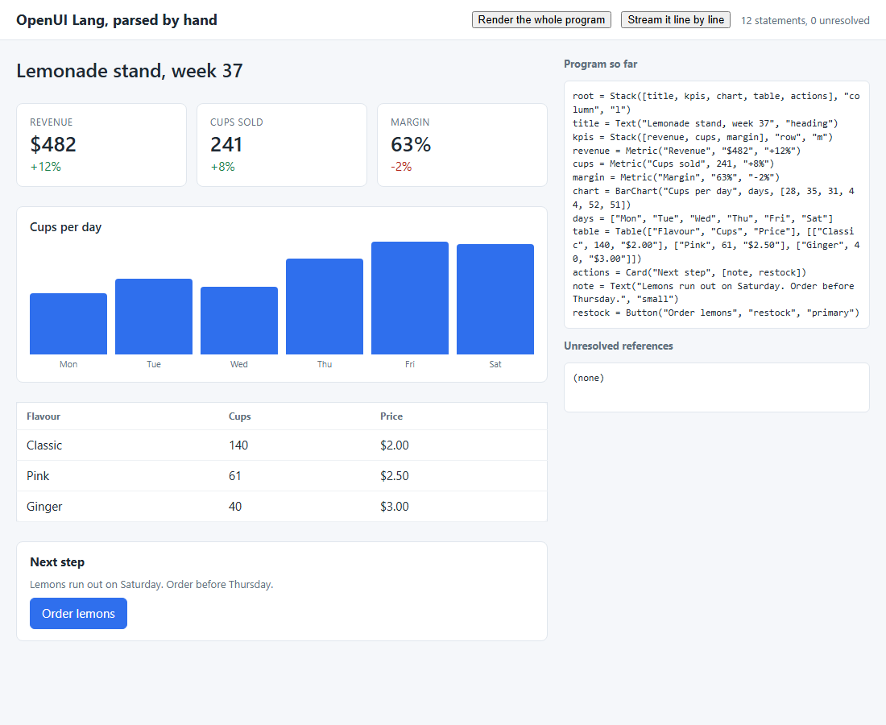

# Step 01 - OpenUI Lang, parsed by hand

**What this step adds:** the language itself, with no library. OpenUI Lang
is the report's most token-efficient declarative format: one statement per
line, `id = Component(args)`, arguments positional, references allowed
before their definition. This step writes a parser for that core twice,
once in Python (`openui_parse.py`, for the tests) and once in JavaScript
(`openui-parse.mjs`, for the page), a catalog of eight components as plain
JSON Schema (`catalog.json`), and a hand-written DOM renderer
(`render.mjs`). The page streams a fixed program line by line and shows the
skeleton that forward references produce before their definitions arrive.

## Quick demo

```
python demo.py
```

```text
== 1. parse the whole program ==
Stack  <- root
  Text  <- title
  Stack  <- kpis
    Metric  <- revenue
    Metric  <- cups
    Metric  <- margin
  BarChart  <- chart
  Table  <- table
  Card  <- actions
    Text  <- note
    Button  <- restock
unresolved: []  errors: []

== 2. stream it line by line ==
line  1: root = Stack([title, kpis, chart,  unresolved=['actions', 'chart', 'kpis', 'table', 'title']
line  2: title = Text("Lemonade stand, week unresolved=['actions', 'chart', 'kpis', 'table']
line  3: kpis = Stack([revenue, cups, margi unresolved=['actions', 'chart', 'cups', 'margin', 'revenue', 'table']
line  4: revenue = Metric("Revenue", "$482" unresolved=['actions', 'chart', 'cups', 'margin', 'table']
line  5: cups = Metric("Cups sold", 241, "+ unresolved=['actions', 'chart', 'margin', 'table']
line  6: margin = Metric("Margin", "63%", " unresolved=['actions', 'chart', 'table']
line  7: chart = BarChart("Cups per day", d unresolved=['actions', 'days', 'table']
line  8: days = ["Mon", "Tue", "Wed", "Thu" unresolved=['actions', 'table']
line  9: table = Table(["Flavour", "Cups",  unresolved=['actions']
line 10: actions = Card("Next step", [note, unresolved=['note', 'restock']
line 11: note = Text("Lemons run out on Sat unresolved=['restock']
line 12: restock = Button("Order lemons", " unresolved=[]

== 3. the page, headless ==
after 3 lines: 6 skeleton boxes -> demo_partial.png
after 12 lines: 0 skeleton boxes -> demo.png
status: 12 statements, 0 unresolved
```

After three lines the layout exists and six forward references are still
skeletons:



After the last line every skeleton has been replaced:



## Files

```text
step_01_openui_lang_parser/
├── server.py           standard-library static server; GET /stream sends program.oui one line per SSE message
├── openui_parse.py     the Python parser: tokenize, split_statements, parse, resolve, StreamingParser
├── openui-parse.mjs    the same parser in JavaScript for the page, function for function
├── catalog.json        eight components as JSON Schema $defs; property order is argument order
├── render.mjs          hand-written DOM renderer, one function per component; placeholders become skeletons
├── app.js              the page: one StreamingParser, one render() per pushed line; window.openui for the demo
├── index.html          the page shell: two buttons, the UI column, the program and unresolved panes
├── style.css           the page styles, including the grey skeleton box
├── program.oui         the fixed twelve-line lemonade-stand program the page streams
├── tree_js.mjs         prints the JavaScript parser's tree as JSON so test_step.py can diff it with Python's
├── tests/parse.test.mjs   node --test for the JavaScript parser and StreamingParser
├── test_step.py        offline pytest: the Python parser, npm test, and the Python-vs-JavaScript tree comparison
├── demo.py             parses, streams line by line, then screenshots the page after 3 and 12 lines
├── demo_partial.png    the page after three lines, six skeletons still open
├── demo.png            the page after the last line
├── package.json        npm test = node --test (no dependencies, no build step)
└── README.md           this file
```

## The idea

The State of Generative UI report (June 2026,
https://www.openui.com/blog/state-of-generative-ui-report) splits
generative UI into two independent choices: the **transport** (where the UI
appears) and the **generation** mode (what the agent emits). OpenUI Lang
sits in the **declarative** middle: the model composes a layout from a
catalog, and the renderer owns the pixels. What sets it apart from the JSON
formats in the same slot is the shape of the text the model writes.

A JSON tree pays for keys, quotes and brackets on every field, and a nested
tree cannot be rendered until its closing bracket arrives. OpenUI Lang pays
for none of that:

```text
root = Stack([title, kpis, chart, table, actions], "column", "l")
title = Text("Lemonade stand, week 37", "heading")
kpis = Stack([revenue, cups, margin], "row", "m")
```

Three rules carry the whole design:

1. **One statement per line.** A newline outside brackets ends a statement,
   so the parser can act on every complete line without waiting for the
   rest of the program.
2. **Positional arguments.** `Text("...", "heading")` has no `text:` or
   `size:` keys. The catalog supplies the names: the order of `properties`
   in the component's JSON Schema is the order of the arguments.
3. **Forward references.** `root` names `chart` five lines before `chart`
   is defined. The resolver turns a missing name into a placeholder, and the
   renderer draws a placeholder as a skeleton. The layout appears first and
   fills in top-down, which is the report's "skeleton display" behaviour.

The real `@openuidev/lang-core` parser adds expressions, `$state`,
`Query`/`Mutation` and `@builtins` on top of this core. Step 02 uses it.
This step keeps only the part that explains the token numbers of step 03.

## The code, piece by piece

The pipeline is tokenize, split into statements, parse each expression into
a small AST, resolve references into one tree.

`openui_parse.py`:

```python
def split_statements(text: str) -> tuple[list[str], str]:
    """Cut the text into complete statements and the incomplete tail.

    A statement ends at a newline that is outside every bracket and string.
    Text after the last such newline is held back as `pending`: it is a line
    the model has not finished yet. A string never spans lines: a line with
    an unclosed string ends at its newline (and is reported as an error), so
    one bad line cannot swallow the rest of the program.
    """
    complete: list[str] = []
    depth, in_str, esc = 0, False, False
    start = 0
    for i, c in enumerate(text):
        ...
        elif c in "([{":
            depth += 1
        elif c in ")]}":
            depth = max(0, depth - 1)
        elif c == "\n":
            if in_str:  # an unclosed string: the line is broken, end it here whatever the brackets say
                in_str, depth = False, 0
            if depth == 0:
                line = text[start:i].strip()
                if line:
                    complete.append(line)
                start = i + 1
    return complete, text[start:]
```

A stray `"` used to be the one character that could blank the page: with
`in_str` carried across newlines, every following line was "inside the
string" and held back as pending. Now the string ends with its line, that
line is a parse error, and the next line parses as usual. Brackets are
still allowed to span lines (a list written over several lines is one
statement), so a stray `[` does hold back the lines after it until a
matching `]` arrives; step 07's parser closes that gap too.

The resolver memoises: a statement referenced twice (`Stack([b, b])`) is
resolved once and the same node is placed twice. Without the `resolved`
map, ten levels of `a = Stack([b, b])`, `b = Stack([c, c])` cost 2^10
resolutions per push, and a model can write that by accident.

The tokenizer decides what a word is by its first letter. PascalCase is a
component, anything else is a reference:

`openui_parse.py`:

```python
        elif m := WORD.match(src, i):
            word = m.group()
            if word in ("true", "false"):
                tokens.append(Token("BOOL", word == "true"))
            elif word == "null":
                tokens.append(Token("NULL"))
            else:
                # PascalCase is a component name, anything else a reference
                tokens.append(Token("TYPE" if word[0].isupper() else "IDENT", word))
```

The resolver walks from `root`. A reference with no statement yet becomes a
placeholder and is listed in `unresolved`; a component call becomes an
element node whose positional arguments are zipped with the catalog's
parameter names:

`openui_parse.py`:

```python
    def reference(name: str) -> object:
        if name not in program.statements or name in visiting:
            unresolved.append(name)
            return {"type": "placeholder", "name": name}
        ...

    def element(node: dict) -> object:
        name = node["name"]
        if name not in catalog:
            errors.append(f"unknown component {name}")
            return None
        params = catalog[name]
        ...
        props = {param: value(arg) for param, arg in zip(params, node["args"])}
        return {"type": "element", "typeName": name, "props": props}
```

The catalog is the same shape `library.toJSONSchema()` produces in step 02:
one entry per component under `$defs`, property order as argument order:

`catalog.json`:

```json
"Metric": {
  "description": "One number with a label and an optional change",
  "properties": {
    "label": {"type": "string"},
    "value": {"type": ["string", "number"]},
    "delta": {"type": "string"}
  },
  "required": ["label", "value"]
}
```

The streaming parser re-parses the whole buffer on every push. The
reference implementation caches completed statements; the behaviour is the
same:

`openui_parse.py`:

```python
class StreamingParser:
    """Feed chunks as they arrive; every push returns the tree so far."""

    def __init__(self, catalog: dict[str, list[str]]):
        self.catalog = catalog
        self.buffer = ""

    def push(self, chunk: str) -> ParseResult:
        self.buffer += chunk
        return parse(self.buffer, self.catalog)
```

The JavaScript twin has the same functions, and the renderer keys one
function per component name. A placeholder becomes a grey box:

`render.mjs`:

```js
export function renderNode(node) {
  if (node && node.type === "placeholder") {
    const box = el("div", "skeleton");
    box.dataset.ref = node.name;
    return box;
  }
  if (node && node.type === "element") {
    const render = RENDERERS[node.typeName];
    if (!render) return el("div", "error", `no renderer for ${node.typeName}`);
    const dom = render(node.props ?? {});
    if (node.statementId) dom.dataset.statement = node.statementId;
    return dom;
  }
  return el("span", "", node == null ? "" : String(node));
}
```

The page keeps one `StreamingParser` and renders after every pushed line.
The demo script and the SSE reader go through the same two functions:

`app.js`:

```js
window.openui = {
  reset() { parser = new StreamingParser(catalog); ui.replaceChildren(); },
  push(chunk) { show(parser.push(chunk)); },
  finish() { show(parser.finish()); },
};
```

`server.py` is a standard-library static server with one extra route:
`/stream` sends `program.oui` one line per SSE message, with an optional
delay so the skeleton is visible to a human.

## Why: what breaks without it

Without a streaming grammar the page waits. A JSON tree of the same
dashboard is one object whose closing brace is the last token the model
writes; nothing can be drawn before it, and a parser that is fed half of it
raises. With one statement per line and hoisted references, the first line
of the program is already a renderable layout. The demo shows the
difference in numbers: after three of twelve lines there are six skeleton
boxes on screen; the JSON equivalent has zero elements until the end.

The parser also has to survive what a model writes. A stray quote, a
bracket nested past the interpreter's limit, a table row that is a string
instead of a list: each of these used to stop the page (the parser threw,
`show()` never ran again). Each is now an error line or a coerced value,
and the lines after it still render.

## Run it

No API key and no `npm install`: the program is a fixed file and the page
has no dependencies. Playwright and its Chromium are needed for `demo.py`
only (`pip install playwright` then `playwright install chromium`).

bash:

```
python server.py            # http://127.0.0.1:8004/  (two buttons on the page)
python demo.py              # parse, stream, and take the two screenshots
python -m pytest -q         # the Python suite; it also runs `npm test`
npm test                    # the JavaScript suite alone (no npm install needed)
```

PowerShell: the same four commands, unchanged (`python server.py`,
`python demo.py`, `python -m pytest -q`, `npm test`).

Expected output: the `Quick demo` transcript above, for `python demo.py`.
`python server.py` prints one line, `http://127.0.0.1:8004/`, and serves
until ctrl-c; on the page, `Stream` draws the program one line every 400
ms and `Render all` draws it at once. The status line under the buttons
reads `12 statements, 0 unresolved` when the stream is done.

## Error handling

- A line with an unclosed string is a parse error for that line only
  (`result.errors`; the demo prints `errors: []`), and the page keeps
  rendering the rest.
- Brackets nested deeper than Python's recursion limit (thousands of `[`)
  are a `RecursionError` in `parse_expression`; `parse_program` catches it
  and records the line as an error instead of crashing `parse()`. The
  JavaScript parser's `try/catch` already covered it.
- A table row that is not a list (`Table(["a"], ["x"])`) is drawn as a
  one-cell row, not thrown from `render()`.
- `?delay=abc` on `/stream` is 0; `?delay=99999` is clamped to 5 s per
  line (`clamp_delay`). A tab closed mid-stream is a `ConnectionError`
  the handler swallows; nothing is printed.
- If the connection drops before `event: done`, `EventSource` reconnects
  and the server replays from line 1. `app.js` resets the parser in
  `onopen` when its buffer is non-empty, so the program is not appended
  to itself, and `onerror` puts "stream lost, reconnecting" in the status.
- Leaving: ctrl-c stops `server.py`; the page has nothing to leave.

## Gotchas / What this is not

- This is the core of OpenUI Lang, not the language: no expressions, no
  `$state`, no `Query`/`Mutation`, no `@builtins`, no keyword arguments.
  Numbers have no exponent form and there are no object literals. The
  grammar the parser accepts, in one screen:

  | form | example |
  | --- | --- |
  | statement | `name = expression` (one per line; `name` is `[A-Za-z_]\w*`) |
  | string | `"text"`, JSON string syntax (JSON escapes); never spans a line |
  | number | `42`, `-1.5` |
  | bool / null | `true`, `false`, `null` |
  | list | `[a, "b", 3]`, may span lines |
  | call | `Component(arg, arg)`; PascalCase names are components |
  | reference | any other word; may name a later statement |
  | comment / fence | `# ...` and `// ...` outside strings, and markdown fences, are stripped |

- The resolver is re-run on the whole buffer at every push. Cost grows
  with program size; the reference implementation caches finished
  statements. For a twelve-line program it does not matter.
- The tree the page renders is the *resolved* tree: a statement referenced
  twice appears twice in the DOM. `resolved` makes that cheap, not shared.
- A stray `"` ends with its line; a stray `[` does not, so the lines after
  it are held back until a `]` arrives (step 07 closes that gap by
  starting a new statement at the next `name =` line).
- The catalog decides argument names, so reordering `properties` in
  `catalog.json` changes what a program means. That is the contract, not
  a bug.

## What to notice

- After line 1 the tree already has its shape: a `Stack` with five
  placeholders. Nothing in a JSON tree format is renderable at that point,
  because the root object has not closed.
- Line 7 references `days` before line 8 defines it. The chart is drawn as
  a skeleton for one line and then replaced. That is the whole hoisting
  mechanism: the resolver is re-run, not patched.
- `kpis = Stack([revenue, cups, margin], "row", "m")` has no key names at
  all. The parser cannot tell what `"row"` means; the catalog can. Change
  the order of `properties` in `catalog.json` and the same program renders
  differently. In the real library the Zod key order is that contract.
- A line the model has not finished is held back, not guessed at. The
  reference parser goes one step further and auto-closes the pending line
  so a half-written statement renders too.
- The Python and JavaScript parsers produce byte-identical trees for
  `program.oui`; `test_step.py` checks that.

## What the next step adds

Step 02 replaces both hand parsers with `@openuidev/lang-core` and
`@openuidev/react-lang`, and lets a real model write the program.
