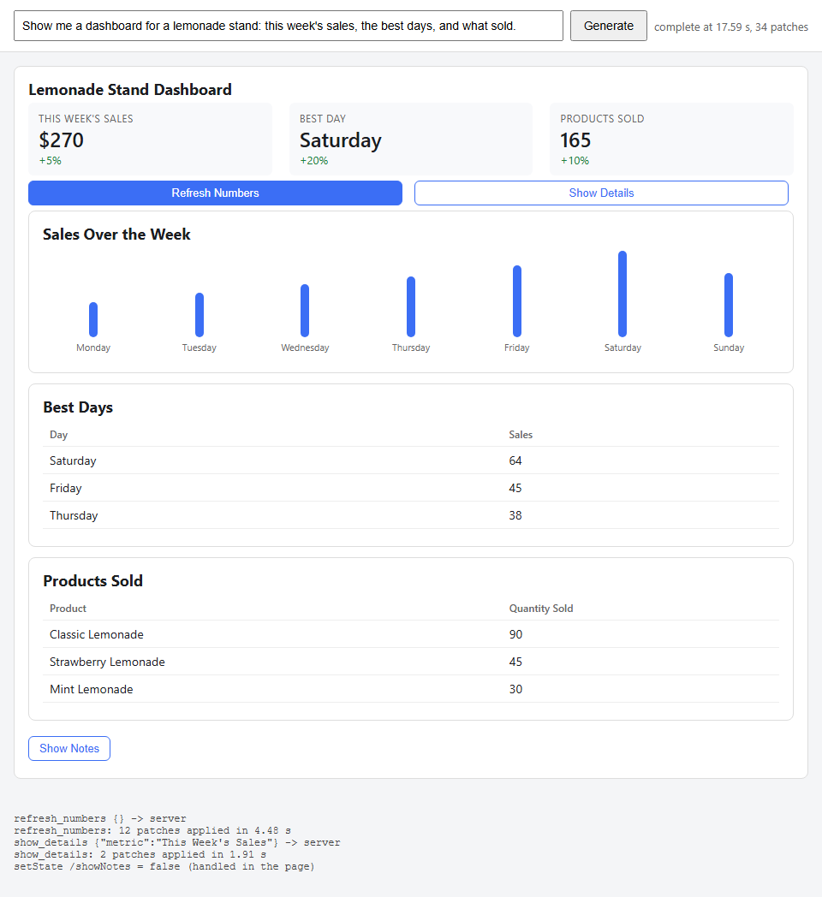

# Step 03 - Actions, and a second target

**What this step adds:** two things the flat element map makes cheap. First,
actions: a `Button` component and two catalog actions (`refresh_numbers`,
`show_details`). The library handles the built-in `setState` inside the page;
the catalog actions go to the server (`POST /action`), which runs one more
model turn on the same transcript, and the model answers with patches that
edit the spec already on screen. Second, a second renderer: the same
catalog and the same spec drawn in the terminal by `@json-render/ink`
(`ink_render.mjs`), no browser involved.

## Quick demo

```
python demo.py
```

```text
page: complete at 17.59 s, 34 patches
3 buttons, 4 cards visible
press 'Refresh Numbers':
  refresh_numbers {} -> server
  refresh_numbers: 12 patches applied in 4.48 s
  4 cards visible
press 'Show Details':
  show_details {"metric":"This Week's Sales"} -> server
  show_details: 2 patches applied in 1.91 s
  5 cards visible
press 'Hide Notes':
  setState /showNotes = false (handled in the page)
  4 cards visible
turn generate: 34 patches in 17.56 s, 1228 completion tokens
turn refresh_numbers: 12 patches in 4.45 s, 282 completion tokens
  {"op": "replace", "path": "/state/sales/thisWeekTotal", "value": "$270"}
  {"op": "replace", "path": "/state/sales/dailySales/0", "value": 22}
turn show_details: 2 patches in 1.89 s, 79 completion tokens
  {"op": "replace", "path": "/state/notes", "value": "Detailed sales analysis:\n- Total revenue increa...
  {"op": "replace", "path": "/state/showNotes", "value": true}
catalog check: ok; skipped lines: 0
saved demo_spec.json and demo.png
the same spec in the terminal (node ink_render.mjs demo_spec.json):
╭──────────────────────────────────────────────────────────────────────────────────────╮
│ Lemonade Stand Dashboard                                                             │
│ THIS WEEK'S SALES    BEST DAY    PRODUCTS SOLD                                       │
│ $270                 Saturday    165                                                 │
│ +5%                  +20%        +10%                                                │
│ [ Refresh Numbers ]  [ Show Details ]                                                │
│ ╭──────────────────────────────────────────────────────────────────────────────────╮ │
│ │ Sales Over the Week                                                              │ │
│ │ Monday    ████████                 22                                            │ │
│ │ Saturday  ████████████████████████ 64                                            │ │
│ ╰──────────────────────────────────────────────────────────────────────────────────╯ │
│ [ Hide Notes ]                                                                       │
│ ╭──────────────────────────────────────────────────────────────────────────────────╮ │
│ │ Notes                                                                            │ │
│ │ Detailed sales analysis:                                                         │ │
│ ╰──────────────────────────────────────────────────────────────────────────────────╯ │
╰──────────────────────────────────────────────────────────────────────────────────────╯
```

The output is cut to fit the 40-line limit: `python demo.py` prints every
patch of the refresh turn, the whole chart, the two tables and the full
notes card.



Read the three presses in order. `refresh_numbers` went to the server, and
the model replaced twelve values in state; the metrics and the chart
changed on screen without a new spec. `show_details` went to the server
with the metric's label as a parameter; the model wrote a note into state
and set `/showNotes`, so the notes card appeared and the toggle button's
`$cond` label became "Hide Notes". The last press was that toggle:
`setState` ran inside the page and no request left the browser.

## The idea

A spec is data, so a press is data too. json-render binds events with an
`on` field on the element, not with code in props:

```json
{
  "type": "Button",
  "props": { "label": "Refresh Numbers" },
  "on": { "press": { "action": "refresh_numbers" } },
  "children": []
}
```

Two kinds of action exist. Built-in ones (`setState`, `pushState`,
`removeState`) change the state model and never leave the page; a `visible`
condition or a `$state` prop reacts. Catalog actions are names you declare;
the page maps each to a handler, and here every handler is the same: tell
the server, run the next model turn, apply the patches that come back. That
is the loop the State of Generative UI report describes as the point of a
declarative format: the model edits a document, and the document is the UI.

The second half of the step is the reason to pick this format at all. The
element map does not mention HTML. The same `catalog.mjs` and the same
`demo_spec.json` go through `@json-render/ink`, and the dashboard appears in
a terminal. The json-render family has renderers for React, React Native,
Vue, Svelte, PDF, email and ink; a catalog written once serves all of them,
with one component map per target.

## The code, piece by piece

`catalog.mjs`: the Button and the two actions. `params` is a Zod schema, so
the model's `show_details` carries a typed `metric`.

```js
    Button: {
      props: z.object({
        label: z.string(),
        variant: z.enum(["primary", "secondary"]).nullable(),
      }),
      description: "A button. Bind its press event to an action with the on field.",
    },
  },
  actions: {
    refresh_numbers: {
      params: z.object({}),
      description: "Reload this week's numbers from the stand. The agent answers with patches that replace the values.",
    },
    show_details: {
      params: z.object({ metric: z.string() }),
      description: "Ask the agent for a details card about one metric. params.metric is the metric's label.",
    },
  },
});
```

`registry.mjs`: the component only emits. The renderer finds `on.press` on
the element and dispatches whatever action is bound there.

```js
    Button: ({ props, emit }) => html`
      <button className=${"button " + (props.variant ?? "primary")} onClick=${() => emit("press")}>${props.label}</button>`,
```

`app.mjs`: the handlers for the two catalog actions, and the trace of the
built-in one. The compiler lives in a ref now, so the second turn's patches
land on the spec the first turn built.

```js
  async function serverAction(action, params) {
    const started = performance.now();
    note(`${action} ${JSON.stringify(params)} -> server`);
    setLoading(true);
    const response = await fetch("/action", {
      method: "POST",
      headers: { "content-type": "application/json" },
      body: JSON.stringify({ action, params }),
    });
    const patches = await consume(response);
    setLoading(false);
    note(`${action}: ${patches} patches applied in ${((performance.now() - started) / 1000).toFixed(2)} s`);
  }

  const handlers = {
    refresh_numbers: (params) => serverAction("refresh_numbers", params ?? {}),
    show_details: (params) => serverAction("show_details", params ?? {}),
  };

  // setState never reaches a handler; onStateChange is the only trace of it.
  function onStateChange(changes) {
    for (const { path, value } of changes) note(`setState ${path} = ${JSON.stringify(value)} (handled in the page)`);
  }
```

`server.py`: one transcript per session. A press becomes a user message
that names the action and its params, and asks for patches against the
spec the model already produced. The library's `buildUserPrompt` builds the
same kind of message in TypeScript; here it is one string.

```python
ACTION_TURN = """The user pressed a button bound to the action "{action}" with params {params}.
Answer with JSONL patches (RFC 6902) that edit the spec you already produced: use replace for
values that change, add for new elements and for new state, remove for elements to drop. Keep
existing ids. Output only patches, one per line."""
```

`server.py`: the same `SpecStream` compiles every turn, and the reply is
appended to the transcript once the stream ends.

```python
@app.post("/action")
def action(request: ActionRequest):
    if SESSION["compiler"] is None:
        raise HTTPException(status_code=409, detail="no spec on screen yet; POST /stream first")
    known = set(catalog_json()["actions"])
    if request.action not in known:
        raise HTTPException(status_code=400, detail=f"unknown action {request.action!r}; the catalog has {sorted(known)}")
    SESSION["messages"].append({"role": "user", "content": ACTION_TURN.format(action=request.action, params=json.dumps(request.params))})
    return StreamingResponse(relay(SESSION["messages"], request.action), media_type="application/x-ndjson")
```

`spec.py`: the Python check now reads the `on` field too. An action the
catalog does not declare would be dropped by the page with a console
warning, so the server reports it first.

```python
        for event, binding in (element.get("on") or {}).items():
            for one in binding if isinstance(binding, list) else [binding]:
                action = (one or {}).get("action")
                if action not in catalog.get("actions", {}) and action not in catalog.get("builtInActions", []):
                    problems.append(f"{element_id}: on.{event}: unknown action {action!r}")
```

`ink_render.mjs`: the second target. Same catalog, a second component map,
written with ink's `Box` and `Text`. `createRenderer` wraps the providers;
the `state` prop seeds the `$state` expressions. The ink package hands
components the whole `element`, where the React one hands them `props`.

```js
export const components = {
  Card: ({ element, children }) =>
    h(Box, { flexDirection: "column", borderStyle: "round", paddingX: 1, marginBottom: 0 },
      h(Text, { bold: true }, element.props.title),
      element.props.subtitle ? h(Text, { dimColor: true }, element.props.subtitle) : null,
      children),
  Row: ({ children }) => h(Box, { flexDirection: "row", gap: 2 }, children),
  ...
  Button: ({ element }) => h(Text, { color: "cyan" }, `[ ${element.props.label} ]`),
};

export const InkRenderer = createRenderer(catalog, components);
```

`ink_render.mjs`: ink draws to a stream. A fake stdout collects the frames
and a fake stdin satisfies ink's raw-mode check, so the render works under
a test runner and in a pipe.

```js
export async function renderSpecToText(spec, { columns = 88, onAction } = {}) {
  const stdout = new FakeStdout(columns);
  const instance = render(h(InkRenderer, { spec, state: spec.state ?? {}, onAction }), {
    stdout,
    stdin: new FakeStdin(),
    debug: true,
    patchConsole: false,
    exitOnCtrlC: false,
  });
  await new Promise((resolve) => setTimeout(resolve, 30));
  instance.unmount();
  return stdout.frames.at(-1) ?? "";
}
```

## Run it

```
npm install
python server.py                     # http://127.0.0.1:8057, press Generate, then the buttons
python demo.py                       # streams, presses every button, saves demo.png, renders in the terminal
node ink_render.mjs demo_spec.json   # the terminal render alone
python -m pytest -q test_step.py
npm test
```

## What to notice

- The terminal shows the notes card and the page does not. The page's
  last press was `setState /showNotes = false`, and `setState` never
  reaches the server; the terminal renders the spec as the server compiled
  it, where the model's own patch left `/showNotes` at `true`. Built-in
  actions are local state; if the agent must know, send them.
- The model edits with `replace` on state paths more than on elements.
  Twelve patches refreshed a whole dashboard for 282 output tokens, because
  the first turn put the numbers in state and the elements read them with
  `$state`.
- One `replace` in the demo targets `/state/sales/dailySales/0`: a single
  array cell. JSON Pointer reaches into arrays, and the chart re-renders
  with one bar changed.
- A `$state` prop can resolve to `undefined` while its state patch is still
  in flight, in the browser and in the terminal alike. The `Table` and
  `Chart` components default their arrays for that reason; without the
  default, the element's error boundary swallows the component and it
  stays blank after the state arrives.
- `tests/targets.test.mjs` renders one spec with both targets and checks
  that every text the page shows, the terminal shows. That is the "one
  spec, two renderers" claim as a test.

## Diff from the previous step

- `catalog.mjs`: a `Button` component; `actions` with `refresh_numbers` and
  `show_details`; two prompt rules that make the demo exercise both kinds
  of action.
- `catalog_json.mjs` and `spec.py`: the action names (catalog and built-in)
  are exported and checked against every `on` binding.
- `registry.mjs`: the Button, which emits `press`.
- `app.mjs`: the compiler in a `useRef`, `consume()` shared by both turns,
  `handlers` for the catalog actions, `onStateChange` for the trace, and
  the `#log` element.
- `llm.py`: `stream_text(messages)` takes a transcript instead of two
  strings.
- `server.py`: `SESSION` (transcript, compiler, turns), `POST /action`,
  `ACTION_TURN`; `/last` now lists the turns with their patches and usage.
- `ink_render.mjs`: new, the terminal target and its CLI.
- `package.json`: `@json-render/ink` and `ink` pinned; `npm run ink`.
- `tests/targets.test.mjs` replaces `stream.test.mjs`.
