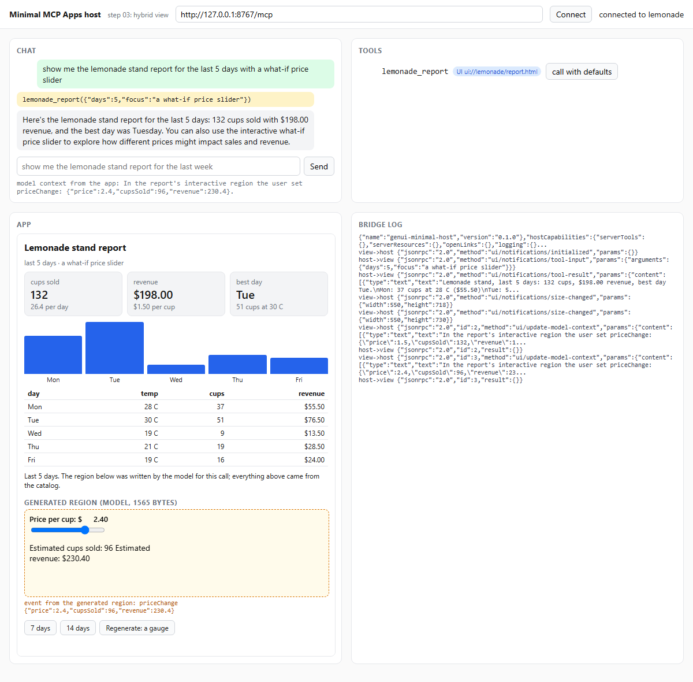
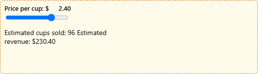

# Step 06.3 - Open-ended HTML and static components together, inside an MCP App

**What this step adds:** the report's hybrid pattern inside a host you do
not control. Step 01's tool returned rows for a view that drew them. This
step's tool, `lemonade_report(days, focus)`, returns two halves in
`structuredContent`: `components`, a small declarative spec the view
renders with four registered components (Metric, Table, BarChart, Text),
and `generated`, one open-ended HTML document the model writes for a
region the catalog does not cover, here a what-if price slider. The MCP
server makes that model call, not the host: MCP Apps keeps credentials on
the server side. The view mounts the generated document in a nested
`<iframe sandbox="allow-scripts">` with its own content security policy
injected first in its head, so the open-ended part runs one boundary
deeper than the app itself. The app's own iframe and policy from step 01
are unchanged. The host is step 01's, on new ports, with one addition: the
context the view reports goes into the next model turn.

## Quick demo

```bash
python demo.py
```

```text
host page: http://127.0.0.1:8768/?prompt=show%20me%20the%20lemonade%20stand%20report%20for%20the%20last%205%20days%20with%20a%20what-if%20price%20slider

user: show me the lemonade stand report for the last 5 days with a what-if price slider
tool: lemonade_report({"days":5,"focus":"a what-if price slider"})
assistant: Here's the lemonade stand report for the last 5 days: 132 cups sold with $198.00 revenue, and the best day was Tuesday. You can also use the interactive what-if price slider to explore how different prices might impact sales and revenue.

components: 6 (Metric, Metric, Metric, BarChart, Table, Text), 829 bytes of JSON
generated region: 1565 bytes of HTML, 56 lines, source=model
server model call: 370 prompt + 473 completion tokens
slider moved to 2.4 inside the generated region -> event: priceChange {"price": 2.4, "cupsSold": 96, "revenue": 230.4}

bridge log (condensed, from the tool call on):
  ->         tools/call                       lemonade_report({"days": 5, "focus": "a what-if price slider"})
  ->         resources/read
  <-         response #4                      structuredContent + content
  <-         response #5                      contents[0].mimeType=text/html;profile=mcp-app
  host       mount ui://lemonade/report.html  csp: default-src 'none'; script-src 'self' ...
  view->host ui/initialize
  host->view response #1                      hostContext + hostCapabilities
  view->host ui/notifications/initialized
  host->view ui/notifications/tool-input      {"days": 5, "focus": "a what-if price slider"}
  host->view ui/notifications/tool-result
  view->host ui/notifications/size-changed    550x718
  view->host ui/notifications/size-changed    550x730
  view->host ui/update-model-context          In the report's interactive region the user set priceChange:
  host->view response #2                      {}
  view->host ui/update-model-context          In the report's interactive region the user set priceChange:
  host->view response #3                      {}

screenshots: demo.png, demo_generated.png
```

The tool call took one round trip on the wire and one model call on the
server: 370 prompt and 473 completion tokens for 1,565 bytes of HTML. The
six catalog components cost 829 bytes of JSON and no model call. The demo
then moved the slider two frames down, inside the generated region. The
region's script posted `priceChange`; the app accepted it, drew it under
the frame and handed it to the host as `ui/update-model-context`, which
the host shows under the chat. The first `update-model-context` line is the
region's own load event; the second is the move. Without a key on the
server, the region is a hand-written fallback with the same slider and
`source=fallback`; without a key on the host, the demo calls the tool
directly and the chat stays empty.



The inner region on its own, after the interaction:



## Files

```text
step_03_mcp_app_hybrid/
├── server.py           FastMCP server: the lemonade_report tool (components + generated), the ui:// resource, the bundler
├── report.py           the static spec, the generation prompt, the server's model call, the offline fallback region
├── data.py             unchanged from step 01: deterministic sales rows
├── view.html           the MCP App: step 01's bridge, the catalog for components, the nested sandbox for generated
├── catalog.mjs         the view's four renderers keyed by component name, props escaped; pure strings
├── sandbox.mjs         the inner boundary: the region's CSP, the meta injection, mount(), the one accepted event shape
├── host.py             the host process: serves host.html, owns the chat model, puts the app's context in the next turn
├── host.html           step 01's host page on port 8768, showing the model context the view reports
├── mcp-http.mjs        unchanged from step 01: MCP client for the browser
├── bridge.mjs          unchanged from step 01: the host side of the bridge, the app's restrictive CSP
├── llm.py              complete() for the host with tools, generate() for the server with usage
├── bridge.test.mjs     unchanged from step 01: node --test for the bridge and the browser client
├── catalog.test.mjs    node --test for the renderers, the inner CSP, the meta injection, the event shape
├── test_step.py        offline pytest: the server with a fake region model, the wire in process, the host with a fake chat model
├── demo.py             starts both processes, drives a headless browser two frames deep, saves both screenshots
├── demo.png            the recorded host page
├── demo_generated.png  the inner region after the slider moved
├── package.json        npm test = node --test bridge.test.mjs catalog.test.mjs (no dependencies)
└── README.md           this file
```

## The idea: the hybrid, one boundary deeper

Sub-theme 01's last step built the State of Generative UI report's hybrid
pattern on a page you own: a catalog for everything the catalog can say,
and one `GeneratedView` for the rest, rendered in a sandbox. This step
puts the same pattern inside a host you do not control. The catalog lives
in the view. The generated part is one more item in the tool result. The
sandbox is nested inside the host's sandbox.

Two halves, two costs. `components` is data the view already knows how to
draw: six items, 829 bytes, no model call, and the host's restrictive
policy applies to it. `generated` is markup the model wrote for this call:
about 1.5 KB and a few hundred completion tokens, and it needs a place to
run. That place is a second iframe.

```text
host page (host.html)                                  the host's origin
└── app iframe   sandbox="allow-scripts"               the spec's CSP, built from the resource's _meta.ui.csp
    └── generated iframe   sandbox="allow-scripts"     the region CSP from sandbox.mjs, injected first in <head>: no network, inline only
```

Three parties and two boundaries. The host trusts the app as far as the
resource's declared policy. The app trusts the region not at all: the
region runs in an opaque origin, cannot reach the network, cannot call
the host's bridge, and can say one thing to the app, an event of the
shape `{type: "event", name, payload}`. The app decides what to do with
it. Here it draws it and forwards a sentence to the host with
`ui/update-model-context`, so the next model turn knows what the user did.

Who calls the model? In sub-theme 01 the page's own server did. Here the
host owns the chat model, and the MCP server owns the region's model. The
host never sees the server's key; the server never sees the host's. The
view sees neither.

## The code, piece by piece

### 1. The tool: a static spec and a generated region, from one call

`server.py`:

```python
@server.tool(meta={"ui": {"resourceUri": VIEW_URI}})
def lemonade_report(days: int = 7, focus: str = report.DEFAULT_FOCUS) -> types.CallToolResult:
    """Sales report for the lemonade stand over the last `days` days (1 to 28), with one interactive region about `focus`, such as 'a what-if price slider'."""
    days = max(1, min(int(days), 28))
    rows = data.sales(days)
    generated = report.generate_region(days, rows, focus)  # the server's own model call
    text = data.as_text(days, rows) + f"\nThe interface also shows {focus} ({generated['source']})."
    return types.CallToolResult(
        content=[types.TextContent(type="text", text=text)],
        structuredContent={"days": days, "focus": focus, "components": report.components_for(days, rows), "generated": generated},
    )
```

The result keeps step 01's two audiences. `content` is text for the model
and for hosts without UI support; it says that a region exists and where
it came from. `structuredContent` is for the view, and now has two parts.
The model that called the tool never sees the generated HTML: it stays in
the iframe, out of the context window.

### 2. The two halves

`report.py`:

```python
def components_for(days, rows):
    """The declarative half: metrics, a chart, a table and one line of text, from the same rows as step 01."""
    totals = data.summary(rows)
    best = max(rows, key=lambda row: row["cups"])
    return [
        {"component": "Metric", "props": {"title": "cups sold", "value": str(totals["total_cups"]), "delta": f"{totals['total_cups'] / days:.1f} per day"}},
        ...
        {"component": "BarChart", "props": {"labels": [row["day"] for row in rows], "values": [row["cups"] for row in rows]}},
        ...
def generate_region(days, rows, focus=DEFAULT_FOCUS):
    """The open-ended half: {"html", "source", "usage", "bytes"}, from the model or from the fallback."""
    if llm.client is None:
        html, source, usage, note = fallback_html(rows), "fallback", None, "no API key on the server"
    else:
        try:
            reply = llm.generate(generation_messages(days, rows, focus))
            html, source, usage, note = FENCE.sub("", reply["content"]).strip(), "model", reply["usage"], ""
        except Exception as error:  # the report still renders; the note says why the region is the stand-in
            html, source, usage, note = fallback_html(rows), "fallback", None, f"model call failed: {error}"
    return {"html": html, "source": source, "usage": usage, "bytes": len(html.encode("utf-8")), "note": note}
```

`components_for` is the shape of sub-theme 01's static step: a component
name and its props, nothing else. `generate_region` is the open-ended
half, and it never fails the tool. No key, or a failed call, gives the
hand-written fallback with the same slider and a note the view shows. The
prompt's contract is the same as sub-theme 01's: a complete document,
everything inline, at least one range input, and
`parent.postMessage({type: "event", ...})` on every change.

### 3. The inner boundary

`sandbox.mjs`:

```js
export const CSP = "default-src 'none'; style-src 'unsafe-inline'; script-src 'unsafe-inline'; img-src data:";

export const META = `<meta http-equiv="Content-Security-Policy" content="${CSP}">`;

export function sandboxed(html) {
  // Put the CSP meta tag first in <head>, or first in the document if there is no <head>.
  const head = /<head[^>]*>/i.exec(html);
  if (head) return html.slice(0, head.index + head[0].length) + META + html.slice(head.index + head[0].length);
  return META + html;
}

export function mount(iframe, html) {
  iframe.setAttribute("sandbox", "allow-scripts");
  iframe.srcdoc = sandboxed(html);
}

export function isEvent(data) {
  // The only shape the app accepts from the inner frame: {type: "event", name, payload?}.
  return data !== null && typeof data === "object" && data.type === "event" && typeof data.name === "string";
}
```

This is sub-theme 01's `sandbox.mjs`, one level down. The app's policy
from step 01 says `frame-src 'none'`, and the nested frame still loads:
a `srcdoc` frame has no URL for `frame-src` to match, and it inherits
the app's policy instead. So two policies apply to the region, the app's
and this one, and this one is the stricter: no `'self'`, no frames, no
connections. The meta tag goes first in `<head>` so it is in force before
any script the model wrote.

### 4. The view: two listeners, two sources

`view.html`:

```js
  const generated = document.getElementById("generated");
  const app = window.app = { latest: null, events: [] };  // the demo script reads these

  window.addEventListener("message", (event) => {
    if (event.source === window.parent) return hostMessage(event.data);
    if (event.source === generated.contentWindow && isEvent(event.data)) return regionEvent(event.data);
    // anything else, or any other shape, is dropped
  });
  ...
  function regionEvent({ name, payload }) {
    app.events.push({ name, payload });
    document.getElementById("events").textContent = `event from the generated region: ${name} ${JSON.stringify(payload ?? {})}`;
    // The region cannot reach the host. The app can: it hands the event on as model context, coalesced.
    clearTimeout(contextTimer);
    contextTimer = setTimeout(() => {
      const text = `In the report's interactive region the user set ${name}: ${JSON.stringify(payload ?? {})}.`;
      request("ui/update-model-context", { content: [{ type: "text", text }] });
    }, 250);
  }
```

Step 01's view had one listener for one source, the host. This view has
two sources and checks `event.source` before anything else. Messages from
the parent are the host's JSON-RPC. Messages from the inner frame must
pass `isEvent`; a JSON-RPC request from the region, say a `tools/call`,
fails that check and is dropped. The region cannot use the bridge. The app
can, and it forwards a sentence, not the payload, with a 250 ms debounce
so a slider does not flood the host.

### 5. The catalog, and what it does with a name it does not know

`catalog.mjs`:

```js
export const RENDERERS = { Metric, Table, BarChart, Text };

export function render(component, props) {
  // The view never trusts the name: an unknown component becomes a visible stub.
  const renderer = RENDERERS[component];
  if (!renderer) return `<div class="card unknown">unknown component: ${esc(component)}</div>`;
  return renderer(props ?? {});
}
```

Four renderers, every prop through `esc`. A `GeneratedView` in the
components list would render as a stub, not as HTML: the only way markup
runs in this view is through `generated`, and that path has its own frame.

### 6. One resource, one document

`server.py`:

```python
def bundle(html, folder=HERE):
    """view.html with its module imports inlined: one classic script, every module once, exports stripped."""
    seen = set()

    def inline(name):
        if name in seen:
            return ""
        seen.add(name)
        source = (folder / name).read_text(encoding="utf-8")
        return IMPORT.sub(lambda m: inline(m.group(1)), source).replace("export ", "")

    return MODULE_SCRIPT.sub(lambda m: "<script>" + IMPORT.sub(lambda i: inline(i.group(1)), m.group(1)) + "</script>", html)


@server.resource(VIEW_URI, name="lemonade_report_view", mime_type=MIME_TYPE, meta=VIEW_META)
def report_view() -> str:
    """The report's HTML document, self-contained. Static: the data arrives later, over postMessage."""
    return bundle(VIEW_FILE.read_text(encoding="utf-8"))
```

The app's policy allows no external script, and an `ui://` resource is
one document. `view.html` imports `catalog.mjs` and `sandbox.mjs` so
`node --test` can load them, and `bundle` inlines them when the resource
is read. After bundling every module shares one scope, which is why the
view's own draw function is called `show` and not `render`.

### 7. The host puts the app's context in the next turn

`host.py`:

```python
def chat_turn(messages, tools, context=""):
    """One model turn for the page: the system prompt, the interface's context, the transcript."""
    system = [{"role": "system", "content": SYSTEM_PROMPT}]
    if context:
        system.append({"role": "system", "content": f"Context from the interface: {context}"})
    return llm.complete(system + messages, tools or None)
```

`host.html`:

```js
      onModelContext: (params) => {  // the view speaks for the generated region; the next turn reads it
        state.modelContext = (params.content ?? []).filter((c) => c.type === "text").map((c) => c.text).join(" ");
        $("context").textContent = `model context from the app: ${state.modelContext}`;
      },
```

Step 01's host stored `ui/update-model-context` and did nothing with it.
This host sends it with the next `/chat` request, and `host.py` puts it in
front of the transcript. Ask "what did I just set?" after moving the
slider and the model answers from the sentence the app wrote.

## Run it

```bash
python server.py            # the MCP server, http://127.0.0.1:8767/mcp (holds the key for the region)
python host.py              # the host page, http://127.0.0.1:8768/
```

Open the host page, click Connect, then type a prompt or click "call with
defaults". Move the slider inside the amber frame and watch the event line
under it and the context line under the chat. "Regenerate: a gauge" calls
the tool again with another `focus`, and the server writes a new region.
`python demo.py` starts both, drives a headless browser two frames deep,
prints the log and saves both screenshots. `python server.py --stdio`
speaks the protocol over stdin and stdout, as in step 02.

Tests: `python -m pytest test_step.py` runs the server in process with a
fake region model (the fence comes off, the usage travels, the fallback
takes over without a key and after a failed call), the bundler, the
streamable HTTP round trip through an in-process ASGI transport, the
`/chat` endpoint with the context in front, and
`node --test bridge.test.mjs catalog.test.mjs` for the bridge, the browser
client, the four renderers, the inner policy and the accepted event shape.
No network, no key.

## What to notice

- Two boundaries, two policies. The host's policy comes from the
  resource's metadata and governs the app. The region's policy comes from
  `sandbox.mjs` and is stricter. A `srcdoc` frame inherits the app's
  policy too, so both apply; `frame-src 'none'` in the app's policy does
  not stop it, because the region has no URL to match.
- The region has one sentence it can say. `isEvent` accepts
  `{type: "event", name, payload}` and nothing else, and only from the
  inner frame's window. A JSON-RPC message from the region is dropped.
- The server calls the model, and the tool still cannot fail because of
  it. The fallback region has the same contract as the prompt, and the
  note says which one is on screen.
- The model that called the tool reads one line about the region and never
  its HTML. The context window grew by the `content` text only.
- After bundling, the view and its modules share one scope. Name
  functions so they do not collide, or bundle for real.
- `ui/update-model-context` is the app's voice for the region. The app
  writes the sentence, not the model in the region, so the host gets
  something it can put in a prompt without inspection.

## Diff from step 01

- `server.py`: the tool is `lemonade_report(days, focus)` and returns
  `components` and `generated`; `bundle` inlines the view's modules into
  the resource; port 8767.
- `report.py` (new): the static spec, the generation prompt, the server's
  model call, the fallback region.
- `llm.py`: `generate` alongside `complete`, returning the usage.
- `view.html`: renders `components` with `catalog.mjs`, mounts `generated`
  with `sandbox.mjs`, checks `event.source` on every message, forwards
  region events as `ui/update-model-context`; a "Regenerate" button.
- `catalog.mjs`, `sandbox.mjs`, `catalog.test.mjs` (new).
- `host.py`, `host.html`: port 8768; the app's context goes into the next
  model turn and is shown under the chat.
- `data.py`, `mcp-http.mjs`, `bridge.mjs`, `bridge.test.mjs`: unchanged.
