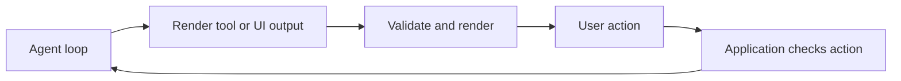

# Sub-theme 07 - Generative UI in the harness

<!-- genui-orientation -->
**You are here: theme 7 of 7.** [Course map](../README.md#see-the-learning-path) · [Recorded walkthrough](../WALKTHROUGH.md) · [Previous theme](../06_mcp_apps/README.md)



*The interface becomes one part of a complete agent workflow.*

<!-- /genui-orientation -->

The two codelabs meet here. The harness codelab built an agent loop and
then moved it onto TrueForge; the generative UI series showed the formats
an agent can emit instead of prose. This sub-theme puts a rendering
surface on both harnesses.

The State of Generative UI report (June 2026,
https://www.openui.com/blog/state-of-generative-ui-report) separates
the transport (where the UI appears) from the generation mode (what the
agent emits). The first two steps are declarative generation; the third
is the report's hybrid, declarative by default with one open-ended
component. The transports are a terminal, a browser page fed over SSE,
and the TrueForge SDK.

| Step | What it adds |
|------|--------------|
| `step_01_render_ui_tool` | The stage 15 loop gains a `render_ui(spec)` tool. The spec is a json-render element map validated against a six-component catalog. The terminal draws it with `rich`; `--web` serves it to a browser page over SSE. One agent, two surfaces. |
| `step_02_trueforge_generative_ui` | TrueForge's built-in generative UI: an agent with `generative_ui` enabled answers with an OpenUI Lang program in its reply. The step captures it over the SDK, parses the language (Python and JavaScript, streaming-first with forward references) and renders it in a page of its own, one line per event. |
| `step_03_trueforge_hybrid` | Open-ended HTML and catalog components together, on TrueForge. The agent's instructions allow one `HtmlArtifact(title, document)` statement, only when the user asks for something interactive; the page renders it in a sandboxed iframe with a Content Security Policy, the raw source showing while the line streams, and every other component through step 02's catalog renderer. TrueForge's own chat UI stays catalog-only; this page is the hosted harness's escape hatch. |

## Layout

```text
07_harness_genui/
├── README.md
├── step_01_render_ui_tool/
│   ├── harness/          the stage 15 loop plus genui.py and web.py
│   ├── web/              index.html, app.js: the browser surface
│   ├── test_step.py
│   ├── demo.py
│   ├── demo.png
│   └── README.md
├── step_02_trueforge_generative_ui/
│   ├── client/           genui.py: the TrueForge session and the fence extractor
│   ├── web/              index.html, app.js, openui-parse.mjs, render.mjs
│   ├── openui_parse.py
│   ├── server.py
│   ├── openui-parse.test.mjs
│   ├── test_step.py
│   ├── demo.py
│   ├── demo_stream.png
│   ├── demo.png
│   ├── sample_reply.md
│   ├── package.json
│   └── README.md
└── step_03_trueforge_hybrid/
    ├── client/           genui.py: step 02's session plus the HtmlArtifact instructions
    ├── web/              index.html, app.js, openui-parse.mjs, render.mjs, sandbox.mjs
    ├── artifact.py       the artifact finder, the CSP, token counts
    ├── openui_parse.py   step 02's parser plus partial()
    ├── server.py
    ├── openui-parse.test.mjs
    ├── sandbox.test.mjs
    ├── test_step.py
    ├── demo.py
    ├── demo_catalog.png
    ├── demo_streaming.png
    ├── demo.png
    ├── sample_catalog.md
    ├── sample_artifact.md
    ├── package.json
    └── README.md
```

All three steps share the same surface shape: a standard library
`http.server` in a daemon thread pushing SSE events to a `web/` page, a
`demo.py` that runs a turn and saves the page with Playwright, and a
`test_step.py` that never calls a model; step 02 swaps the local
`harness/` for a TrueForge session and pushes one line of OpenUI Lang per
event instead of a whole spec, and step 03 keeps step 02's files and adds
the artifact half (`artifact.py`, `web/sandbox.mjs`, the `partial()` read
in both parsers).

The shared handler serves only the files under `web/` with an allowed
suffix (`.html`, `.js`, and `.mjs` from step 02 on); a path that resolves
outside `web/` is a 404, so `/../server.py` never leaves the directory.
Step 01's page keeps its `EventSource` open - it is a live channel that
redraws on every `render_ui` call. Steps 02 and 03 close theirs on the
terminating event (the `null` line or chunk) so a finished stream never
replays, and a reconnect after a dropped connection resets the page's
parser before the server replays from the start. The servers listen on 127.0.0.1 only, hold one program (or one
last spec) at a time and have no authentication.

What can go wrong, and what each step does about it: a bad `render_ui`
spec, a malformed tool call or a raising tool is one `Error:` tool message
and the loop continues (step 01); a TrueForge turn that ends in any state
but `done`, or a server that is down, is one line and exit code 1, never a
truncated program rendered as complete (steps 02 and 03); one unbalanced
line in a program is one parse error, not a blank page (02 and 03); and the
model's HTML never touches the page's DOM - it runs in a sandboxed iframe
under a CSP injected before any element it wrote (03). Each step README has
an "Error handling" section with the exact strings.

Read them in order. Step 01 is the harness drawing from a spec it
validated; step 02 is a hosted harness that already speaks a UI language,
with the parser and renderer written here so the language is understood
rather than delegated; step 03 gives that hosted harness the one thing its
catalog lacks, an open-ended component, without changing anything on the
server.

From the repository root:

```bash
python run_tests.py genui/07          # offline tests for the three steps
python check_snippets.py genui/07     # every README snippet exists in its file
```

The same two commands work unchanged in PowerShell. Steps 02 and 03 also
run `node --test` from `test_step.py` when `node` is on the PATH, and skip
those tests with a note when it is not.
