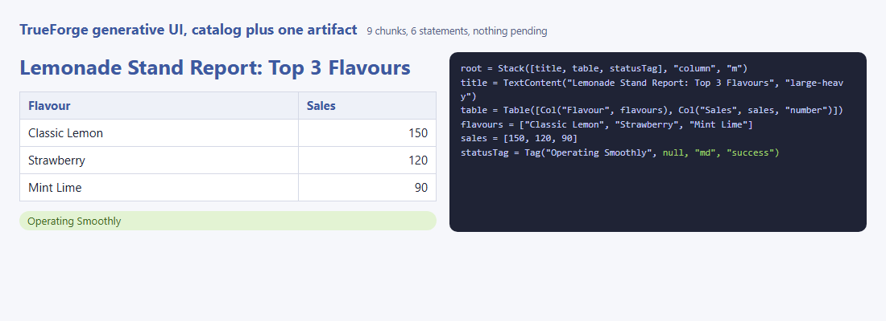
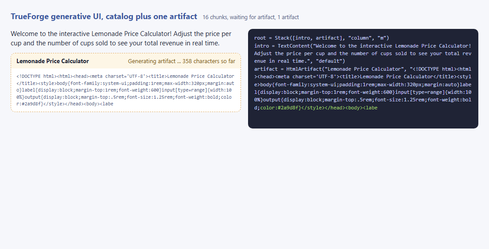
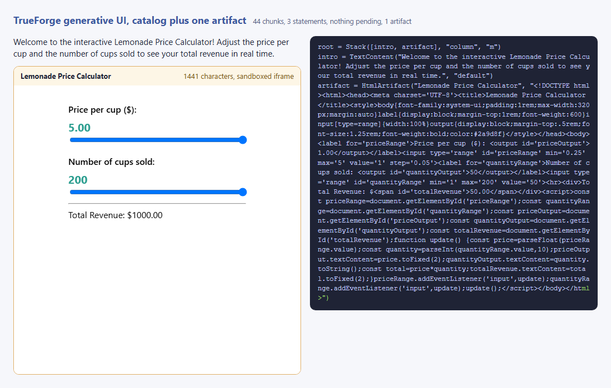

# Step 07.3 - Open-ended HTML and catalog components together, on TrueForge

Step 02 rendered TrueForge's generative UI in a page of its own. The agent
wrote an OpenUI Lang program from the harness's catalog, and the page drew
it. That catalog is static: a table, a chart, a tag. It cannot give the
user a calculator to play with. This step adds the report's other half on
our side of the SDK: one open-ended component, used only where the catalog
does not reach.

**What this step adds:** the agent's `instructions` in `client/genui.py`
allow one `HtmlArtifact("title", "<self-contained html>")` statement inside
the openui program, and only when the user asks for something interactive.
The parser learns to read a statement that is still streaming
(`partial()`), so the page can show the document growing. `web/render.mjs`
gains an `HtmlArtifact` renderer: the raw source while the line is open, a
sandboxed iframe with a Content Security Policy injected first in `<head>`
once it closes (`web/sandbox.mjs`, mirrored by `artifact.py` for the
tests). `server.py` streams chunks instead of lines, because the artifact
is one long line. Every other component is step 02's catalog renderer.

## Quick demo

```
python demo.py              # live: two turns on http://localhost:8790, then the page
python demo.py --offline    # replays sample_catalog.md and sample_artifact.md
```

Recorded output of `python demo.py` (the artifact document and the tree
outlines are shortened with `...` and the `page:` lines are dropped; the full
replies are in `sample_catalog.md` and `sample_artifact.md`):

````text
TrueForge at http://localhost:8790, model openai/gpt-4-1-mini

== catalog: catalog components only ==
> Show a lemonade stand report with a table of the top three flavours and a status tag

```openui
root = Stack([title, table, statusTag], "column", "m")
title = TextContent("Lemonade Stand Report: Top 3 Flavours", "large-heavy")
table = Table([Col("Flavour", flavours), Col("Sales", sales, "number")])
flavours = ["Classic Lemon", "Strawberry", "Mint Lime"]
sales = [150, 120, 90]
statusTag = Tag("Operating Smoothly", null, "md", "success")
```
--- program: 6 lines, 6 statements ---
[7,972 input, 124 output tokens over 2 model calls; get_openui_instructions called]
no HtmlArtifact; 108 reply tokens
artifacts on the page: 0, status: 9 chunks, 6 statements, nothing pending -> demo_catalog.png

== artifact: catalog components plus one HtmlArtifact ==
> Build me an interactive lemonade price calculator I can play with, with a short intro

```openui
root = Stack([intro, artifact], "column", "m")
intro = TextContent("Welcome to the interactive Lemonade Price Calculator! Adjust the price per cup and the number of cups sold to see your total revenue in real time.", "default")
artifact = HtmlArtifact("Lemonade Price Calculator", "<!DOCTYPE html><html><head><meta charset='UTF-8'><title>Lemonade Price Calculator</title><style>body{font-family:system-ui;padding:1rem;max-width:320px;margin:auto}...<input type='range' id='priceRange' min='0.25' max='5' value='1' step='0.05'>...<script>const priceRange=document.getElementById('priceRange');...priceRange.addEventListener('input',update);quantityRange.addEventListener('input',update);update();</script></body></html>")
```
--- program: 3 lines, 3 statements ---
Stack('column', 'm')
  TextContent('Welcome to the interactive Lemonade Price Calculator! Adjust the price per cup and the number of cups sold to see your total revenue in real t...
  HtmlArtifact('Lemonade Price Calculator', "<!DOCTYPE html><html><head><meta charset='UTF-8'><title>Lemonade Price Calculator</title><style>body{font-family...
[7,970 input, 463 output tokens over 2 model calls; get_openui_instructions called]
artifact `artifact` "Lemonade Price Calculator": 1,441 characters, 379 of 447 reply tokens (85%), checks: none
mid-stream: Generating artifact ... 438 characters so far -> demo_streaming.png
iframe: sandbox='allow-scripts', referrerpolicy='no-referrer', CSP meta first in <head>: True
inside the sandbox: set 2 input field(s); document text changed: True ['5.00', '200', 'Total Revenue: $1000.00']
status: 44 chunks, 3 statements, nothing pending, 1 artifact -> demo.png
````

The token counts in brackets come from `turn.done`; the reply and
document counts are `o200k_base` counts with `tiktoken`. Both turns made
two model calls, because TrueForge hands the agent its OpenUI catalog
through a system tool, `get_openui_instructions`, before the reply.

The report prompt: catalog components only, no artifact.



The calculator prompt while the document streams. The intro is already
drawn; the artifact shows its status line and the raw source so far, and
the same characters are the tail of the program on the right.



The same reply once complete, after the headless test moved both sliders
to their maximum inside the sandboxed iframe: the total changed from
$50.00 to $1000.00, so the document's script ran under the CSP.



## Files

```text
step_03_trueforge_hybrid/
├── client/
│   ├── __init__.py   exports ask, extract_program, open_session
│   └── genui.py      step 02's session plus the HtmlArtifact instructions; ask() also records the system tools called and the per-call usage
├── artifact.py       find_artifacts() over a parsed program (partial line included), the CSP and sandboxed() as in web/sandbox.mjs, o200k_base token counts
├── openui_parse.py   step 02's parser plus partial(): the held-back line read leniently, so a streaming HtmlArtifact appears in the tree
├── server.py         http.server + SSE: streams the program in 40-character chunks, then null; /reply for the raw text
├── web/
│   ├── index.html    the page shell: the rendered tree beside the program text; artifact and iframe styles
│   ├── app.js        one SSE chunk at a time into the parser; redraws when a statement commits or the artifact document grows
│   ├── openui-parse.mjs   the same parser in JavaScript, partial() included
│   ├── render.mjs    step 02's catalog renderers plus HtmlArtifact: raw source while partial, sandboxed iframe when complete
│   └── sandbox.mjs   the CSP, sandboxed() that injects it first in <head>, checkDocument()
├── openui-parse.test.mjs   node --test: the JS parser agrees with openui_parse.py, partial() included
├── sandbox.test.mjs        node --test: the CSP injection agrees with artifact.py
├── test_step.py      offline pytest: partial(), the artifact finder, the CSP, the SDK against a fake TrueForge that splits the document across deltas, the page server
├── demo.py           two live turns on TrueForge (or --offline replay), the page, three screenshots, a keystroke inside the iframe
├── demo_catalog.png  the report prompt: catalog components, no artifact
├── demo_streaming.png   the calculator prompt mid-stream, the artifact document growing
├── demo.png          the calculator rendered in its iframe next to the intro, after the keystroke
├── sample_catalog.md    the recorded report reply, replayed by --offline and the tests
├── sample_artifact.md   the recorded calculator reply
├── package.json      npm test = node --test (no dependencies)
└── README.md         this file
```

## The idea: the hybrid, on a harness that only knows half of it

The State of Generative UI report (June 2026) names the pattern most teams
land on: catalog primitives by default, open-ended generation only where
the catalog does not reach, and the open-ended part boxed. Sub-theme 01
built it from nothing and sub-theme 04 built it on OpenUI's own reference
example. Here the harness is hosted. TrueForge decides the wire format
(OpenUI Lang in a fence), the catalog (`Stack`, `Table`, `Tag` and the
rest of `get_openui_instructions`), and the chat UI that draws it. None of
that is ours to change, and none of it has an open-ended component.

So the escape hatch lives on the client side of the SDK. The agent's
`instructions` describe one extra component, `HtmlArtifact(title,
document)`, with the rules from OpenUI's html-artifact example: only when
the user asks for something interactive, inline CSS and JS only, one
statement on one line, the document a double-quoted string. The agent
writes it inside the same openui program as the catalog components. The
TrueForge chat UI does not know this component; a session opened in that
UI with these instructions would show the statement as text, or nothing.
This page is the surface that knows it, and the harness's own catalog stays
the default: the report prompt renders through step 02's renderers
unchanged, and the artifact prompt adds exactly one open-ended box.

Two consequences follow from the format. An `HtmlArtifact` statement is
one long line, so the page cannot wait for the line to end before it shows
anything: the parser gains a lenient read of the line in progress. And the
document is model-written HTML, so it never touches the page's DOM: it
runs in `<iframe sandbox="allow-scripts" referrerpolicy="no-referrer">`
with a Content Security Policy injected as the first element of its
`<head>`, which allows the inline style and script the rules ask for and
nothing from the network.

## The code, piece by piece

`client/genui.py` carries the rules. TrueForge's harness prompt makes the
agent call `get_openui_instructions` before any openui fence, and the guide
that tool returns teaches `Form`, `Input` and `$state`. The instructions
therefore frame the surface's catalog as the guide's, minus those, plus the
artifact, and give the exact shape of an interactive reply:

```python
The surface that renders your reply is not the standard one. Its catalog is the one get_openui_instructions describes, with two changes:
- REMOVED: Form, FormControl, Input, Buttons, Button, Action, $ state variables, @ functions and expressions. This surface does not implement them; a program that uses them renders as nothing. Never use them, and never invent components that are not in the catalog.
- ADDED: HtmlArtifact(title: string, document: string). The document is a self-contained HTML/CSS/JavaScript page, run in a sandboxed iframe. This is the only way to give the user something interactive on this surface.
...
- Inside the document: inline CSS and JavaScript only. Do not depend on external scripts, stylesheets, fonts, images, or network requests.
- Do not wrap the document in Markdown fences. Keep the whole HtmlArtifact statement on one line. Encode line breaks as \\n inside the document string.
- The document is a double-quoted openui-lang string. Prefer single quotes inside HTML and JavaScript, and escape any double quotes or backslashes.
```

`ask()` in the same file is step 02's, with two additions: the system
tools the model called and the usage of each model call, which is how the
demo knows the catalog was loaded and what it cost:

```python
            for call in data.tool_calls or []:
                if call.function is not None and call.function.name:
                    tools.append(call.function.name)
            if data.usage is not None:
                calls.append(data.usage.dict(exclude_none=True))
```

`openui_parse.py` adds `partial()`. The buffer holds the line that has not
balanced yet; a regular expression reads its head, and the arguments are
decoded as far as they go, the open string included:

```python
    def partial(self):
        """The line in progress, read leniently: (name, type, args) or None.

        Only the shape `name = Component(scalar, scalar, ...)` is read, which
        is what a streaming HtmlArtifact looks like. Closed strings are
        decoded; the open one at the end is decoded as far as it goes.
        """
        head = PARTIAL_HEAD.match(self.buffer)
        if not head:
            return None
```

`resolve()` uses it for a reference whose statement is the line in
progress, so the tree carries a node marked `partial` instead of a
`Pending` placeholder:

```python
        if name not in self.statements:
            partial = self.partial()  # the line in progress, if it is this statement
            if partial is not None and partial[0] == name:
                return {"type": partial[1], "args": partial[2], "partial": True}
            return {"type": "Pending", "ref": name}
```

`web/render.mjs` draws the two states. Partial: a status line and the raw
source. Complete: the iframe, its `srcdoc` the document with the CSP in
front, and the findings of `checkDocument()` if any:

```js
  HtmlArtifact([title = "Artifact", document = ""], partial) {
    const box = el("section", "artifact");
    box.dataset.state = partial ? "streaming" : "ready";
    const head = el("div", "artifact-head");
    head.append(el("strong", "", String(title)));
    if (partial) {
      head.append(el("span", "artifact-status", `Generating artifact ... ${document.length} characters so far`));
      box.append(head, el("pre", "artifact-raw", document));
      return box;
    }
    head.append(el("span", "artifact-status", `${document.length} characters, sandboxed iframe`));
    const frame = el("iframe", "artifact-frame");
    frame.title = String(title);
    frame.setAttribute("sandbox", "allow-scripts");
    frame.setAttribute("referrerpolicy", "no-referrer");
    frame.srcdoc = sandboxed(String(document));
```

`web/sandbox.mjs` is the policy. A CSP meta tag governs only what follows
it, so it goes first in `<head>`, and any CSP the model wrote is removed
first so the document cannot loosen it:

```js
export const CSP = "default-src 'none'; style-src 'unsafe-inline'; script-src 'unsafe-inline'; img-src data:";
```

```js
export function sandboxed(html) {
  const cleaned = html.replace(CSP_META_RE, "");
  const head = /<head[^>]*>/i.exec(cleaned);
  if (head) return cleaned.slice(0, head.index + head[0].length) + META + cleaned.slice(head.index + head[0].length);
  return META + cleaned;
}
```

`web/app.js` redraws only when something on screen can change: a
statement committed, or the artifact document grew. A chunk that only
lengthens an unfinished catalog line is skipped, which also keeps a mounted
iframe from reloading for nothing:

```js
function redraw() {
  const partial = parser.partial();
  const key = `${parser.statements.size}:${partial && partial.type === "HtmlArtifact" ? parser.buffer.length : 0}`;
  if (key === drawn) return;
  drawn = key;
  surface.replaceChildren(render(parser.tree()));
```

`server.py` sends the program in 40-character pieces, about the size of a
model delta, so the artifact's raw source visibly grows on the page:

```python
def chunks(text, size):
    """The text in pieces of `size` characters; the last one may be shorter."""
    return [text[i:i + size] for i in range(0, len(text), size)]
```

## Run it

```
python demo.py                    # two live turns on TrueForge, the page, three screenshots
python demo.py --offline          # the recorded replies, same page
python -m pytest test_step.py     # offline: fake TrueForge over SSE, parser and CSP tests, node --test
npm test                          # the JS parser and sandbox tests on their own
```

`TRUEFORGE_BASE_URL` (default `http://localhost:8790`) and `TRUEFORGE_MODEL`
(default `openai/gpt-4-1-mini`) select the server. Nothing is registered
on it: the agent is inline to the session. The tests never use the server:
they start a fake TrueForge on an ephemeral port and point the real
`trueforge_sdk` at it. Live, `demo.py` accepts a reply only when it has
the expected number of artifacts (none for the report, one for the
calculator) and otherwise asks a new session again, up to three times,
printing each attempt.

## What to notice

- The catalog is a deferred tool. Both recorded turns show
  `2 model calls; get_openui_instructions called`: the first call, about
  1,500 input tokens, is the agent asking for the guide; the second carries
  it, about 4,400 tokens of `messages` in TrueForge's usage breakdown. Step
  02's 6,954 input tokens were the same two calls.
- The instructions were changed three times after live runs. Without an
  example, gpt-4.1-mini answered the calculator prompt with the guide's own
  `$state` variables and `FormControl` inputs and never wrote `HtmlArtifact`.
  With the example and a plain rule, it still followed the guide in about
  half the runs, because the guide arrives after the instructions and
  teaches `Form`. Framing the surface's catalog as the guide's minus the
  interactive components plus `HtmlArtifact` stopped that, but the model
  then invented components (`NumInput`) or split the calculator into four
  artifacts. Naming the exact shape of an interactive reply, one intro and
  one artifact, gave six artifacts in six runs. The rules that worked are
  the ones in `client/genui.py`.
- The artifact is 85% of the reply's tokens: 379 of 447 for a two-slider
  calculator. The catalog reply for the report is 108 tokens. The report's
  argument for the hybrid is this ratio: pay for open-ended HTML only where
  a catalog component cannot do the job.
- The document ran under `default-src 'none'`: sliders, `<output>` and an
  `input` listener, all inline, and `checkDocument()` found nothing to
  report. A document that loaded a script from a CDN would list it and the
  CSP would block it; the page shows both.
- The step 02 `Table` renderer stringified a component in a cell. The
  agent puts `Tag`s in a `Col`, so the cell now renders it; the fallback
  for an unknown component is unchanged.

## Diff from the previous step

- `client/genui.py`: the `INSTRUCTIONS` grow from two sentences to the
  hybrid rules with one example; `ask()` also returns the tools the model
  called and the per-call usage.
- `openui_parse.py` and `web/openui-parse.mjs`: `read_string()` /
  `readString()` and `partial()` are new; `resolve()` consults `partial()`
  for a reference whose line is in progress. Everything else is step 02.
- `artifact.py`, `web/sandbox.mjs` and `sandbox.test.mjs` are new: the
  artifact finder, the token counts, the CSP and its injection.
- `web/render.mjs` gains the `HtmlArtifact` renderer and renders components
  inside table cells; `web/app.js` feeds chunks instead of lines and skips
  redraws that change nothing; `web/index.html` gains the artifact styles.
- `server.py` streams 40-character chunks instead of lines (`chunk_size`,
  `chunk_delay`).
- `demo.py` runs two prompts in two sessions, checks the artifact count,
  and proves the script ran with keystrokes inside the iframe; the tests
  gain the partial state, the CSP, and a fake TrueForge that calls the
  system tool and splits the document across deltas.
