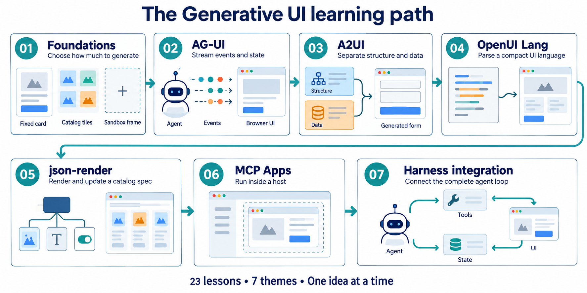
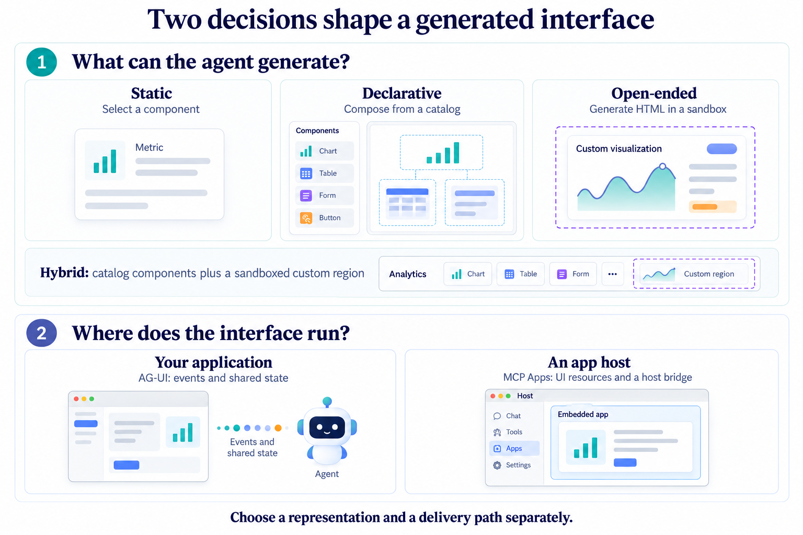
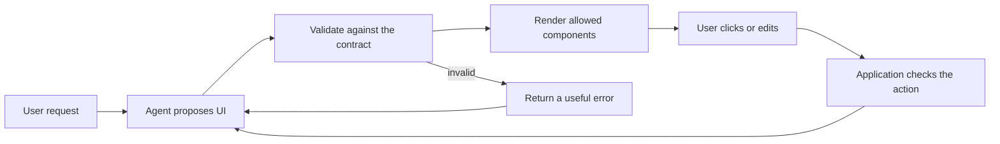

# Build interfaces with an AI agent

Ask for a sales summary. The agent could return a paragraph, or it could choose a metric card, arrange a chart and offer a button for the next action. **Generative UI turns an agent's output into an interface.** Your application still decides what it accepts, what it renders and which actions it permits.

This course starts with three components you write in advance. It then adds generated layouts, streaming state, user actions and embedded apps. You finish by connecting the interface to a coding-agent harness.

**23 lessons · 7 themes · laptop-sized examples.** Start with [01.1: Static components](01_foundations/step_01_static_components/README.md), or browse the [complete recorded walkthrough](WALKTHROUGH.md). The walkthrough retains the original explanations, commands, outputs and screenshots; it is a record, not a fresh run of every live integration.

## What you will learn

By the end, you should be able to:

- Trace a request from the model to a visible component and back through a user action.
- Choose between fixed components, a catalog-based layout and generated HTML.
- Distinguish a UI description from the protocol that carries it.
- Validate streamed updates, recover from failures and explain the limits of a sandbox.
- Compare representations using a stated tokenizer, sample and measurement method.
- Connect a UI to your application, an MCP Apps host or a coding harness.

**Before you start:** basic Python and JavaScript, familiarity with HTML, HTTP and JSON, and a terminal or coding agent that can run local commands. React helps in themes 04 and 05. You can learn the foundations without completing the parent harness course; theme 07 explains where that background becomes useful.

**Time:** allow about 1–2 hours for a first working interface, 6–10 hours for a selected route, or 18–30 hours for all 23 lessons with exercises. These are planning estimates, not measured student completion times. Installation and debugging can add time.

## See the learning path



*Follow the numbered route on your first pass. Later, return to the format or host your project needs. This is a teaching sequence, not a requirement to put every library into one application.* [Open full size](assets/illustrations/learning-path-v1.png).

| Theme | New question | What you build | Lessons |
|---|---|---|---:|
| [01 · Foundations](01_foundations/README.md) | How much should the model decide? | Fixed components, a declarative tree, generated HTML and a hybrid | 4 |
| [02 · AG-UI](02_ag_ui/README.md) | How do the agent and page stay in sync? | Run events, tool calls, state patches and a harness bridge | 3 |
| [03 · A2UI](03_a2ui/README.md) | Can structure and data change separately? | A surface, a data model, generated messages and an official renderer | 3 |
| [04 · OpenUI Lang](04_openui_lang/README.md) | Can a compact language describe the same UI? | A parser, React rendering, a token comparison and an HTML escape hatch | 4 |
| [05 · json-render](05_json_render/README.md) | Can one catalog serve several renderers? | A validated spec, incremental patches, actions and a terminal target | 3 |
| [06 · MCP Apps](06_mcp_apps/README.md) | What changes when another application hosts the UI? | A UI resource, host integration and a nested hybrid app | 3 |
| [07 · Harness integration](07_harness_genui/README.md) | How does the UI join the whole agent loop? | A render tool, a hosted harness integration and a hybrid surface | 3 |

**Short route:** take theme 01 for the generation choices; 02.1 and 02.2 for events and state; then 07.1 to join the UI to a harness. Choose theme 03, 04 or 05 for a deeper look at a representation, and theme 06 when a host must embed your app.

## Make two separate decisions



*First decide what the model may generate. Then decide how the interface reaches the user. These are separate choices; the diagram does not promise that every library works with every host.* [Open full size](assets/illustrations/two-decisions-v2.png).

A **static component** already exists in your code. The agent selects it and supplies values. A **declarative interface** describes a layout using a catalog of allowed components. **Open-ended generation** produces markup or code, which needs a restricted execution environment. A **hybrid** keeps the catalog and adds one custom region where it is needed.

The delivery path answers a different question. AG-UI defines agent–frontend events and shared state. MCP Apps lets a capable host mount a UI resource and communicate through a bridge. A2UI, OpenUI Lang and json-render describe or render interfaces; they are not interchangeable names for that delivery path. See the [AG-UI state documentation](https://docs.ag-ui.com/concepts/state), [A2UI documentation](https://a2ui.org/) and [MCP Apps overview](https://modelcontextprotocol.io/extensions/apps/overview).

## Follow one interaction



For a dashboard, the agent may propose a chart and its data. The application checks the component name and properties before drawing it. A click sends a named action back to the application; it does not grant permission to execute an arbitrary tool. The server checks the action, updates state and starts the next turn when appropriate.

The generated-HTML lessons put a custom region in a sandboxed iframe. A sandbox reduces capabilities; it does not make arbitrary model output safe by itself. Follow each lesson's content policy, message checks and local-demo limitations.

## Run the first lesson

Open this repository at `main` in a coding agent and paste:

```text
Read genui/README.md and genui/01_foundations/step_01_static_components/README.md.
Explain the request-to-component flow with one example.
Check Python and Node, prepare a local environment, and run this lesson's offline tests.
You write and run the commands. Show the actual result and explain skipped checks.
Before a paid model call, tell me what the demo will do.
Then guide me through changing one component and checking its output.
```

Tests use scripted model replies. Live demos require a model endpoint and credentials, and can incur charges. Keep credentials in the local environment or documented local configuration file, never in Git. Themes 06 and 07 have extra host or server requirements; their offline fixtures do not prove those services are available.

<details>
<summary>Commands if you prefer to run setup yourself</summary>

From the repository root, create a Python 3.12 virtual environment and **activate it with the command for your shell before installing packages**:

```bash
python -m venv .venv
```

After activation:

```bash
python -m pip install -r requirements.txt
python run_tests.py genui/01
```

Use Node.js 22 or newer. Where a lesson has a package lock, use `npm ci` in that directory; otherwise follow its `npm install` instructions. Run any build command named in the lesson. Python tests can install missing Node dependencies, so the first run may need network access.

For browser screenshots, install the separate tooling first:

```bash
python -m pip install playwright
python -m playwright install chromium
```

Then open the first lesson directory and follow its README. `demo.py` is a live model demo unless the lesson explicitly says otherwise. It is not the offline test command.

```bash
python run_tests.py genui
python check_snippets.py genui
```

A skipped test is not a pass for that capability. Token-count checks may skip when tokenizer data is unavailable. Live credentials use `API_KEY` or `OPENAI_API_KEY`; inspect the lesson's `llm.py` for its endpoint and model settings.

</details>

## Find every lesson

| # | Step | You build | You learn | Mode / transport |
|--:|---|---|---|---|
| 1 | [01.1](01_foundations/step_01_static_components/) static components | three tools, three renderers, an SSE stream | the agent selects, you draw | static |
| 2 | [01.2](01_foundations/step_02_declarative_tree/) declarative tree | a catalog, a JSON Schema, a partial-JSON parser | why flat element maps stream and nested trees do not | declarative |
| 3 | [01.3](01_foundations/step_03_open_ended_html/) open-ended HTML | a sandboxed iframe with a CSP and one message shape | what freedom costs, in tokens and seconds | open-ended |
| 4 | [01.4](01_foundations/step_04_hybrid_escape_hatch/) hybrid escape hatch | a `GeneratedView` in the catalog, buttons that close the loop | the report's recommended default | hybrid |
| 5 | [02.1](02_ag_ui/step_01_ag_ui_server/) AG-UI server | a run as a generator, encoded events, a hand-written client | typed events connect agent and page | your product |
| 6 | [02.2](02_ag_ui/step_02_ag_ui_tools_and_state/) tools and state | tool call events, state snapshots and JSON Patch deltas, a client tool | generative UI as shared state | your product |
| 7 | [02.3](02_ag_ui/step_03_ag_ui_from_the_harness/) from the harness | a bridge from the stage 21 loop to AG-UI, the official client | a loop's callbacks become a browser's events | your product |
| 8 | [03.1](03_a2ui/step_01_a2ui_messages_by_hand/) A2UI by hand | the four envelopes, schema validation, a surface renderer | structure and data as two streams | declarative |
| 9 | [03.2](03_a2ui/step_02_a2ui_from_a_model/) A2UI from a model | the agent SDK's prompt and stream parser, a correction loop, actions | validation errors are results | declarative |
| 10 | [03.3](03_a2ui/step_03_a2ui_lit_and_ag_ui/) Lit over AG-UI | the official renderer, A2UI carried as AG-UI custom events | format and transport are separate choices | declarative, your product |
| 11 | [04.1](04_openui_lang/step_01_openui_lang_parser/) OpenUI Lang parser | a tokenizer, a resolver, a streaming parser, a DOM renderer | forward references are the trick | declarative |
| 12 | [04.2](04_openui_lang/step_02_openui_react_lang/) the React renderer | a Zod catalog, a generated prompt, streaming into React | one definition, three uses | declarative |
| 13 | [04.3](04_openui_lang/step_03_format_benchmark/) format benchmark | four formats, seven scenarios, one tokenizer | token counts and declared assumptions | measurement |
| 14 | [04.4](04_openui_lang/step_04_openui_html_artifact/) OpenUI's html artifact | catalog primitives plus an `HtmlArtifact` in a sandboxed iframe | the hybrid on the reference implementation | hybrid |
| 15 | [05.1](05_json_render/step_01_json_render_catalog/) json-render catalog | a Zod catalog, the library's prompt, the React renderer | the catalog is prompt, validator and registry | declarative |
| 16 | [05.2](05_json_render/step_02_json_render_streaming_patches/) streaming patches | RFC 6902 patches into the element map, in the page and in Python | incremental rendering and first-paint measurement | declarative |
| 17 | [05.3](05_json_render/step_03_json_render_actions_and_targets/) actions and targets | buttons that round-trip to the model, the same spec in a terminal | one spec, two renderers | declarative |
| 18 | [06.1](06_mcp_apps/step_01_mcp_app_resource/) an MCP App | a tool that carries a UI resource, a minimal host with a bridge | the host decides what the iframe may do | third-party host |
| 19 | [06.2](06_mcp_apps/step_02_mcp_app_in_a_real_host/) in a real host | the harness's MCP client as a text host; Claude Desktop and Goose setup | one interface, two transports, ship both | third-party host |
| 20 | [06.3](06_mcp_apps/step_03_mcp_app_hybrid/) hybrid inside an MCP App | catalog components plus a model-generated region in a nested sandbox, the server holding the key | open-ended and static together, two boundaries deep | hybrid, third-party host |
| 21 | [07.1](07_harness_genui/step_01_render_ui_tool/) render_ui in the harness | a validated spec tool, a terminal renderer, a web surface | one agent, two surfaces | terminal and your product |
| 22 | [07.2](07_harness_genui/step_02_trueforge_generative_ui/) TrueForge generative UI | a hosted harness's OpenUI output, parsed and rendered by your page | a UI language is as portable as its parsers | the TrueForge SDK |
| 23 | [07.3](07_harness_genui/step_03_trueforge_hybrid/) hybrid on TrueForge | the hosted harness's catalog plus one `HtmlArtifact` in a sandboxed iframe on your page | the escape hatch a hosted harness does not ship | hybrid, the TrueForge SDK |

## Inspect the real examples

The conceptual illustrations above explain the architecture. These existing screenshots are recorded demo outputs; content, timings and model behavior may differ on your machine.

| A first component-based interface | A hybrid interface |
|---|---|
| [](01_foundations/step_01_static_components/README.md) | [](01_foundations/step_04_hybrid_escape_hatch/README.md) |

Every lesson keeps its run instructions, source explanation and checkpoint. The [recorded walkthrough](WALKTHROUGH.md) brings the original examples together. A token-count benchmark is not an end-to-end latency benchmark: theme 04 explicitly models latency from a token rate. A fast recorded demo is not a guarantee for another provider or machine.

## Check your understanding

1. If you replace A2UI with another catalog format, must the event transport change?
2. Why is valid JSON insufficient to authorize a tool call?
3. What would you measure before saying one representation is faster?

<details>
<summary>Discuss the answers after making your own prediction</summary>

1. Not necessarily. Representation and delivery are separate contracts. You need a compatible renderer and adapter; compatibility is not automatic.
2. Parsing checks syntax. The application still validates allowed components, property types, actions, permissions and current state.
3. Separate output tokens, first usable render, completed render, errors and model/network time. Use matched tasks and settings. Label estimated latency as an estimate.

</details>

Your next step is [01.1 · Static components](01_foundations/step_01_static_components/README.md). Trace one tool call into one visible card before adding more machinery.

[Change record and verification](../how-did-i-generate-it/genui/README.md) · [Original course backup](../how-did-i-generate-it/genui/backups/README.md) · [Parent harness course](../README.md) · [RSI course](../rsi/README.md)
