# Zero to Hero: Generative UI

## When the agent's answer is an interface, not a paragraph

**A chat box is the wrong shape for most answers.** Ask an agent how
sales went this week and the best reply is three numbers, a chart and a
button that reorders lemons, not four paragraphs. Generative UI is the
layer where an agent's output becomes an interface it composes at run
time. The agent still calls a model in a loop. What changes is what the
loop emits and what renders it.

The harness codelab in the parent directory builds the loop. This series
builds what the user sees. It goes from zero (a page that draws a metric
card when the model asks for one) to hero (the same agent rendering in a
browser, a terminal and a host you do not control, on three open
formats, with the costs measured).

Every step is a directory you can run. Every step has an offline test that
needs no key. Every step README opens with a **quick demo**: the command,
its recorded output, and a screenshot of the page when there is one. This
document walks the steps in order and shows every screenshot.

## The map: two choices, not one

The State of Generative UI report (June 2026,
https://www.openui.com/blog/state-of-generative-ui-report) separates two
decisions that are usually mixed together. This series follows it.

**Choice 1, transport: where does the UI appear?**

| The agent lives in | Use | What crosses the wire | Sub-theme |
|---|---|---|---|
| your own product | **AG-UI**, an event protocol over Server-Sent Events | typed events: run started, text, tool call, state patch, run finished | 02 |
| a host you do not control (Claude, ChatGPT, VS Code, Goose) | **MCP Apps**, HTML resources delivered over the Model Context Protocol | a tool result that points at an HTML document, mounted in a sandboxed iframe | 06 |

**Choice 2, generation: what does the agent emit?**

| Mode | The agent emits | Who decides the layout | Cost | Sub-theme |
|---|---|---|---|---|
| **static** | a component name and its props | you, ahead of time | lowest | 01 |
| **declarative** | a spec drawn from a catalog: a JSON tree, a flat element map, or a line-oriented DSL | the agent, inside your catalog | middle | 01, 03, 04, 05 |
| **open-ended** | raw HTML, CSS and JavaScript | the agent alone, inside a sandboxed iframe | five to ten times a spec | 01, 04 |

The declarative middle is where the open formats compete. **A2UI** from
Google streams flat component lists with a separate data model. **OpenUI
Lang** from Thesys is a line-oriented language with forward references.
**json-render** from Vercel streams JSON Patch against an element map and
renders to the most targets. Sub-theme 04 measures them against each
other and against YAML and the legacy Thesys C1 JSON.

**The hybrid.** The report's recommended default is a catalog with one
open-ended component in it: catalog primitives everywhere, and a sandboxed
`GeneratedView` only where the catalog does not reach. Sub-theme 01 builds
that by hand; sub-theme 04 builds it on OpenUI's own reference
implementation.

```text
┌──────────────────────────────────────────────────────────────┐
│ Heading                                catalog primitive     │
├─────────────────────────┬────────────────────────────────────┤
│ Card       catalog      │  GeneratedView (sandboxed iframe)  │
├─────────────────────────┤  open-ended, only where the        │
│ BarChart   catalog      │  catalog does not reach            │
├─────────────────────────┤                                    │
│ [ Button ] catalog      │                                    │
└─────────────────────────┴────────────────────────────────────┘
```

## The roadmap: 21 steps, seven sub-themes

Read the sub-themes in order the first time. Each one is self-contained
after that, so you can come back to the one your product needs.

| # | Step | You build | You learn | Mode / transport |
|--:|---|---|---|---|
| 1 | [01.1](01_foundations/step_01_static_components/) static components | three tools, three renderers, an SSE stream | the agent selects, you draw | static |
| 2 | [01.2](01_foundations/step_02_declarative_tree/) declarative tree | a catalog, a JSON Schema, a partial-JSON parser | why flat element maps stream and nested trees do not | declarative |
| 3 | [01.3](01_foundations/step_03_open_ended_html/) open-ended HTML | a sandboxed iframe with a CSP and one message shape | what freedom costs, in tokens and seconds | open-ended |
| 4 | [01.4](01_foundations/step_04_hybrid_escape_hatch/) hybrid escape hatch | a `GeneratedView` in the catalog, buttons that close the loop | the report's recommended default | hybrid |
| 5 | [02.1](02_ag_ui/step_01_ag_ui_server/) AG-UI server | a run as a generator, encoded events, a hand-written client | the transport is the whole protocol | your product |
| 6 | [02.2](02_ag_ui/step_02_ag_ui_tools_and_state/) tools and state | tool call events, state snapshots and JSON Patch deltas, a client tool | generative UI as shared state | your product |
| 7 | [02.3](02_ag_ui/step_03_ag_ui_from_the_harness/) from the harness | a bridge from the stage 21 loop to AG-UI, the official client | a loop's callbacks become a browser's events | your product |
| 8 | [03.1](03_a2ui/step_01_a2ui_messages_by_hand/) A2UI by hand | the four envelopes, schema validation, a surface renderer | structure and data as two streams | declarative |
| 9 | [03.2](03_a2ui/step_02_a2ui_from_a_model/) A2UI from a model | the agent SDK's prompt and stream parser, a correction loop, actions | validation errors are results | declarative |
| 10 | [03.3](03_a2ui/step_03_a2ui_lit_and_ag_ui/) Lit over AG-UI | the official renderer, A2UI carried as AG-UI custom events | format and transport are separate choices | declarative, your product |
| 11 | [04.1](04_openui_lang/step_01_openui_lang_parser/) OpenUI Lang parser | a tokenizer, a resolver, a streaming parser, a DOM renderer | forward references are the trick | declarative |
| 12 | [04.2](04_openui_lang/step_02_openui_react_lang/) the React renderer | a Zod catalog, a generated prompt, streaming into React | one definition, three uses | declarative |
| 13 | [04.3](04_openui_lang/step_03_format_benchmark/) format benchmark | four formats, seven scenarios, one tokenizer | the report's table, reproduced cell by cell | measurement |
| 14 | [04.4](04_openui_lang/step_04_openui_html_artifact/) OpenUI's html artifact | catalog primitives plus an `HtmlArtifact` in a sandboxed iframe | the hybrid on the reference implementation | hybrid |
| 15 | [05.1](05_json_render/step_01_json_render_catalog/) json-render catalog | a Zod catalog, the library's prompt, the React renderer | the catalog is prompt, validator and registry | declarative |
| 16 | [05.2](05_json_render/step_02_json_render_streaming_patches/) streaming patches | RFC 6902 patches into the element map, in the page and in Python | first paint at a third of the time | declarative |
| 17 | [05.3](05_json_render/step_03_json_render_actions_and_targets/) actions and targets | buttons that round-trip to the model, the same spec in a terminal | one spec, two renderers | declarative |
| 18 | [06.1](06_mcp_apps/step_01_mcp_app_resource/) an MCP App | a tool that carries a UI resource, a minimal host with a bridge | the host decides what the iframe may do | third-party host |
| 19 | [06.2](06_mcp_apps/step_02_mcp_app_in_a_real_host/) in a real host | the harness's MCP client as a text host; Claude Desktop and Goose setup | one interface, two transports, ship both | third-party host |
| 20 | [07.1](07_harness_genui/step_01_render_ui_tool/) render_ui in the harness | a validated spec tool, a terminal renderer, a web surface | one agent, two surfaces | terminal and your product |
| 21 | [07.2](07_harness_genui/step_02_trueforge_generative_ui/) TrueForge generative UI | a hosted harness's OpenUI output, parsed and rendered by your page | a UI language is as portable as its parsers | the TrueForge SDK |

## Before you start

```bash
git clone https://github.com/dlmastery/simple-coding-harness
cd simple-coding-harness
pip install -r requirements.txt            # includes ag-ui-protocol, a2ui-core, a2ui-agent-sdk, jsonschema, tiktoken
python -m playwright install chromium      # only for the demo screenshots
```

Put a key where the harness codelab reads it: `API_KEY` in the
environment, or `OPENAI_API_KEY=...` in `~/.simple-harness/env`. Every
`llm.py` in this series reads both, with `BASE_URL` and `MODEL` optional
(defaults: the OpenAI endpoint and `gpt-4.1-mini`). Steps with a browser
part have a `package.json`; `npm install` in that directory fetches the
one or two packages they use, and a few steps run one `esbuild` command
to bundle a library that ships no browser build. Node 22 is required.

```bash
python run_tests.py genui/01          # one sub-theme, offline, no key
python run_tests.py genui             # every genui step
python check_snippets.py genui        # every code snippet in every README exists in the code
```

## How to read a step

Every step section below has the same shape, and so does every step
README:

- **Level.** Where you are on the ladder, and which mode or transport the
  step uses.
- **What you learn** and **why now**: the idea, and what the previous step
  left open.
- **Build.** The files and the one design decision that matters, with one
  snippet that is verified against the source.
- **Run.** The command.
- **See.** The recorded result with its real numbers, and the screenshot.
- **Checkpoint.** One thing to try that proves the idea landed.
- **Takeaway.** One sentence to keep.

Each step README also has a **Files** section that lists every file with
one line of description, and each sub-theme README has a **Layout**
section with the tree of its steps.

---

<!-- SUBTHEMES -->

<!-- SUBTHEME 01 -->
# Sub-theme 01: Foundations: static, declarative and open-ended

The report separates two choices: **transport** is where the UI appears, **generation** is what the model emits. This sub-theme is about generation, and it builds the report's three modes with no framework so the mechanism stays visible. Every step is one FastAPI server, one page with a hand-written renderer, and the same prompt: a dashboard for a lemonade stand. Each step copies the previous one and adds one idea. At the end the reader has a catalog-driven dashboard with a sandboxed escape hatch and a button that drives the next model turn, measured for tokens and time to first paint.

**Roadmap of this sub-theme**

| Step | You build | You learn |
|---|---|---|
| 01.1 | Three components as tools, one SSE frame per tool call | Static generation: the model selects and fills, the page owns layout |
| 01.2 | A catalog of eight components, a schema built from it, a partial-JSON renderer | Declarative generation: the model composes; a flat element map streams layout first |
| 01.3 | The model writes the whole page; the host mounts it in a sandbox with a CSP | Open-ended generation: 10x tokens, no partial paint, a `postMessage` bridge |
| 01.4 | The catalog plus one `GeneratedView`, and a `Button` whose click is the next turn | Hybrid: the sandbox as a component, and the loop that closes |

## Step 01.1: Static components

**Level.** 1 of 21 · static generation · your own product

**What you learn.** The smallest generative UI there is: components exist before the model runs, and the model only selects one and fills its props.

**Why now.** The reader has a chat loop that returns text. This step makes the model's reply render as components instead, with the least machinery that can do it.

**Build.** `catalog.py` defines three tools, `show_metric`, `show_table` and `show_chart`, each as a strict function-calling schema with every property required. `llm.py` streams one request and yields a `tool_call` event as soon as a call is complete. `server.py` turns each call into a `{"component", "props"}` message on a server-sent event stream. `page/render.mjs` holds three pure functions from props to HTML, keyed by name, and `page/app.js` appends each frame as it arrives. The design decision: the API enforces the schema before the server sees the call, so the renderer never receives a prop it did not expect.

`01_foundations/step_01_static_components/server.py`:

```python
def components(prompt):
    """Run one model turn and yield one message per component the model chose."""
    messages = [{"role": "system", "content": SYSTEM_PROMPT}, {"role": "user", "content": prompt}]
    for event in llm.stream_chat(messages, tools=catalog.TOOL_SCHEMAS):
        if event["type"] == "tool_call":
            message = catalog.message_from_call(event["name"], event["arguments"])
            if message is not None:
                yield message
        elif event["type"] == "text":
            yield {"note": event["text"]}  # the model spoke instead of calling a tool
        elif event["type"] == "usage":
            yield {"done": True, "usage": {k: v for k, v in event.items() if k != "type"}}
```

Look at the three branches: a tool call becomes a component message, prose becomes a `note`, and the usage closes the stream. The page never learns that a model exists; it renders messages.

**Run.**

```bash
cd genui/01_foundations/step_01_static_components
python demo.py
```

**See.** The recorded run produced 6 SSE messages in 7.9s: three `Metric` frames, one `Table`, one `Chart`, then `done` with 249 prompt tokens and 295 completion tokens. The page drew the first metric while the chart was still streaming, because a new tool-call index means every earlier call is complete. The model chose only the order of its calls; it could not group the metrics in a row.

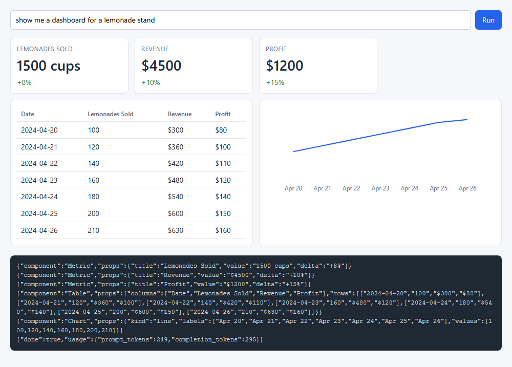

**Checkpoint.** Add a fourth tool to `catalog.py` and a fourth function to `render.mjs`. Nothing else has to change; that is the whole cost of a new component in static mode.

**Takeaway.** Static generation trades layout for safety and cost: every message is small, every prop is typed, and the page renders in one function call.

## Step 01.2: Declarative tree

**Level.** 2 of 21 · declarative generation · your own product

**What you learn.** The model composes prebuilt components into a layout of its own, as data the page can validate, and the shape of that data decides how well it streams.

**Why now.** Step 01.1 left layout to the page. This step gives the model layout without giving it code.

**Build.** `catalog.py` now holds eight components, each as a props schema plus a flag for children. The same catalog generates the prompt, the JSON Schema the server validates against, and the renderer table the page uses. `partial_json.py` and `page/partial-json.mjs` are recursive-descent parsers with one difference: running out of text returns the open object as it stands, marked partial. `page/render.mjs` re-renders the spec on every chunk. `progress.py` records the chunk at which the first component closes and the root's children become final. The design decision: two spec shapes, a nested tree and a flat element map with ids, and the flat rules ask for the root first.

`01_foundations/step_02_declarative_tree/page/render.mjs`:

```js
export function renderFlat(spec, id = spec?.root, seen = new Set()) {
  // A flat element map. A child id whose element has not arrived yet renders
  // as a pending slot, so the layout holds still while the details stream in.
  const node = spec?.elements?.[id];
  if (node === undefined || seen.has(id)) return PENDING;
  seen.add(id);
  if (!isComponent(node)) return PENDING;
  const children = (node.children ?? []).map((child) => renderFlat(spec, child, seen)).join("");
  const html = render(node.type, node.props, children);
  return isPartial(node) ? `<div class="pending-wrap">${html}</div>` : html;
}
```

Look at the `PENDING` returns: a child id whose element has not arrived draws an empty slot, so the layout holds still.

**Run.**

```bash
cd genui/01_foundations/step_02_declarative_tree
python demo.py
```

**See.** Same prompt, same model, two shapes. The tree streamed 408 chunks; its first paint came at chunk 91 (3.22s) and its layout was known at chunk 408 (6.10s), the last one. The flat map streamed 266 chunks; first paint and known layout both came at chunk 33 (1.08s), and it finished in 3.41s. Both documents validated. The first screenshot replays both streams to chunk 88: the tree has one metric inside an open card, the flat map has the whole layout with pending slots.

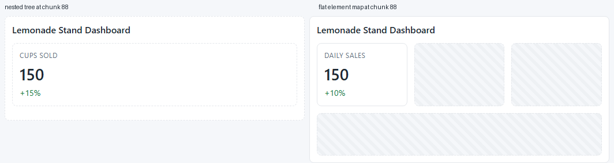

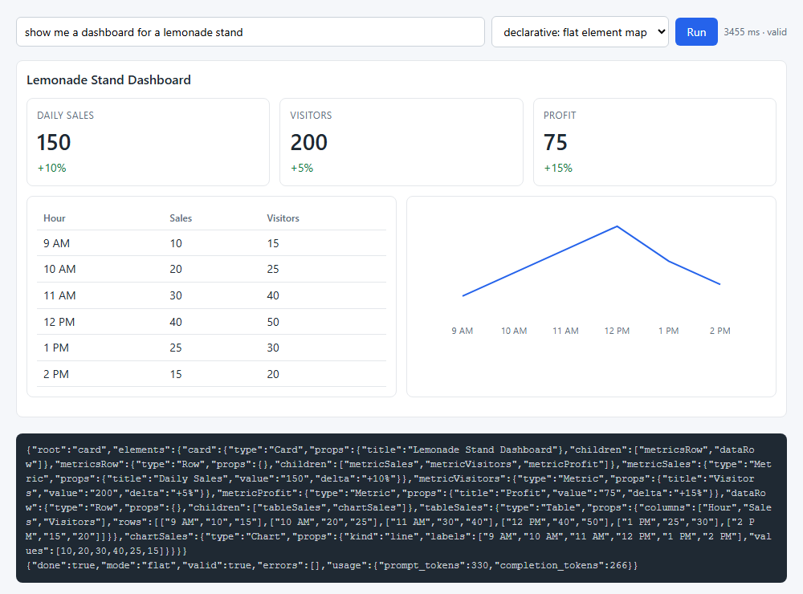

**Checkpoint.** Why is the tree's layout known only at its last chunk? Its root closes last. The flat map writes the root element and its child ids first, which is why A2UI and json-render chose that shape.

**Takeaway.** Declarative generation makes the catalog the single source of truth, and a flat element map with ids puts the layout before the details.

## Step 01.3: Open-ended HTML

**Level.** 3 of 21 · open-ended generation · your own product

**What you learn.** The model writes the whole page, and what that costs in tokens, time, trust and consistency, with the report's "5 to 10 times" claim checked.

**Why now.** Step 01.2 bounded the model to a catalog. This step removes the catalog, shows the price, and contains the trust problem.

**Build.** `server.py` gains an `html` mode with `HTML_PROMPT`, which spells out the sandbox rules because the model has to write code that works inside them; every mode's `done` message now carries `raw`, the exact text the model wrote. `page/sandbox.mjs` is the box: an `<iframe sandbox="allow-scripts">` with a Content Security Policy injected as the first tag in `<head>`. `page/app.js` listens for `postMessage` and keeps one shape from the one window it mounted. `tokens.py` counts the raw text with tiktoken. The design decision: two layers of containment. The sandbox attribute gives the document a unique origin and denies forms, popups and navigation; the CSP denies every network request.

`01_foundations/step_03_open_ended_html/page/sandbox.mjs`:

```js
export const CSP = "default-src 'none'; style-src 'unsafe-inline'; script-src 'unsafe-inline'; img-src data:";
...
export function mount(iframe, html) {
  iframe.setAttribute("sandbox", "allow-scripts");
  iframe.srcdoc = sandboxed(html);
}

export function isEvent(data) {
  // The only shape the host accepts from the iframe: {type: "event", name, payload?}.
  return data !== null && typeof data === "object" && data.type === "event" && typeof data.name === "string";
}
```

Look at `default-src 'none'`: inline code can compute but cannot phone home. `allow-scripts` without `allow-same-origin` matters; with both, the document could reach the host's cookies and DOM.

**Run.**

```bash
cd genui/01_foundations/step_03_open_ended_html
python demo.py
```

**See.** The same prompt in three modes: static wrote 196 tokens, the flat map 328, the HTML document 3013, which is 9.2x the flat map. Time to the last byte was 4.7s, 4.0s and 32.5s. The HTML was 8718 characters and 208 tags with one button; the demo clicked it and the host received a `refreshData` event. Two earlier runs gave 9.8x and 10.4x, inside the report's range. The HTML mode has no partial paint: a half-written document cannot be mounted.

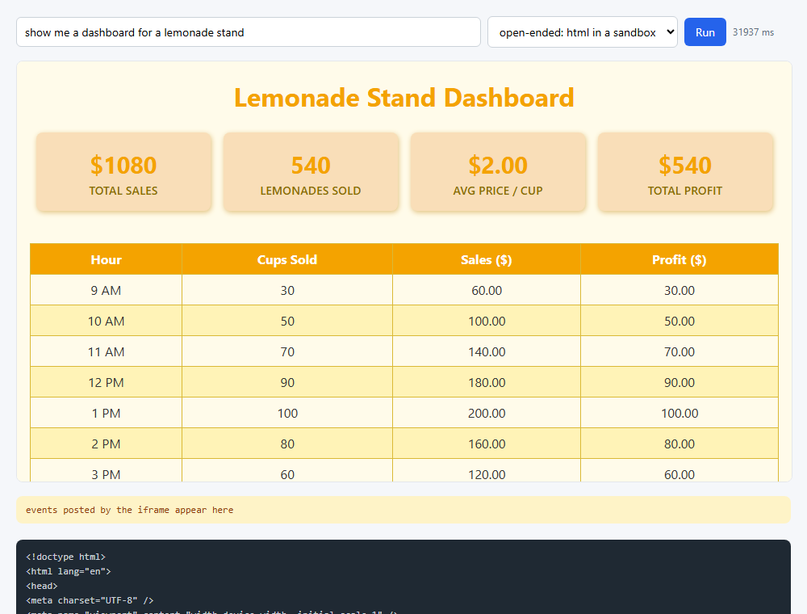

**Checkpoint.** Remove the CSP meta tag from `sandboxed` and add an `` to the generated page. The request now leaves the sandbox; restore the tag and it does not.

**Takeaway.** Open-ended generation buys any layout at ten times the tokens, no streaming paint, and a page that must run in a box.

## Step 01.4: Hybrid escape hatch

**Level.** 4 of 21 · hybrid · your own product

**What you learn.** The report's recommendation: declarative by default with one open-ended component as an escape hatch, and a click that becomes the next model turn.

**Why now.** Step 01.2 made declarative the default and step 01.3 contained open-ended output. This step puts the container inside the catalog and closes the loop.

**Build.** `catalog.py` adds one entry, `GeneratedView`, whose only prop is a string of HTML, plus two prompt rules that say what the hatch is for and how small to keep it. `page/render.mjs` renders that component as the step 01.3 sandbox, with the document escaped because it is an attribute value here. `server.py` keeps sessions: a run opens a transcript, each turn appends the model's reply, and `/api/action` turns a click into a user message on that transcript. `page/app.js` routes a button click and a `postMessage` from any generated iframe through one `act` function. The design decision: the first turn and every later turn share one code path and one stream.

`01_foundations/step_04_hybrid_escape_hatch/server.py`:

```python
@app.post("/api/action")
def action(body: Action):
    """The loop closes: the event becomes a user message, the model answers with the next layout."""
    session = SESSIONS.get(body.session)
    if session is None:
        raise HTTPException(404, "unknown session")
    session["turn"] += 1
    session["messages"].append({"role": "user", "content": EVENT_PROMPT.format(action=body.action, payload=json.dumps(body.payload))})
    return stream(declarative_turn(body.session))
```

Look at the last two lines: the event is appended as text, and the same generator that streamed the first layout streams the reply.

**Run.**

```bash
cd genui/01_foundations/step_04_hybrid_escape_hatch
python demo.py
```

**See.** Turn 1 produced a valid spec with 11 elements: ten catalog components and one `GeneratedView` holding a 481-character gauge. The demo clicked `Restock Lemons`, and the page sent `{"source": "button", "action": "restock_lemons", ...}`. Turn 2 came back valid with 9 elements unchanged and 2 changed: the inventory metric went from 20 to 100, and the table row followed. The whole page in step 01.3 cost about 9000 characters; the hatch bought the gauge for 481.


**Checkpoint.** The action name `restock_lemons` appears in no schema. Find where the page, the server and the model each handle it, and note that only the model interprets it.

**Takeaway.** The hybrid pattern keeps the catalog in charge, rents the sandbox for one component, and makes a click the next user message.

---

<!-- SUBTHEME 02 -->
# Sub-theme 02: AG-UI, the transport

The report separates what the model generates from how it travels to the screen. Sub-theme 01 was about generation; this sub-theme is about transport. AG-UI is the transport for a product you own: one `RunAgentInput` request in, one stream of typed events out. The three steps build the server side with `ag-ui-protocol`, build the client by hand so the wire stays visible, then replace it with `@ag-ui/client`. At the end the reader has the harness codelab's coding agent running from a browser, with its tool calls, permission questions and plan travelling as protocol events.

**Roadmap of this sub-theme**

| Step | You build | You learn |
|---|---|---|
| 02.1 | A FastAPI endpoint that streams `RUN_STARTED`, `TEXT_MESSAGE_*`, `RUN_FINISHED`; a page that reads it with `fetch` | The wire format: one JSON event per `data:` line, one message id as the join key, one terminal event per run |
| 02.2 | Server tools that return JSON Patches to a `dashboard` object; a client tool the page executes | Generative UI as shared state: `STATE_SNAPSHOT`, `STATE_DELTA`, and a run that stops so the page can answer |
| 02.3 | The harness codelab's loop behind the protocol; `HttpAgent` from `@ag-ui/client` in the page | A second transport for the same loop: deltas, tool calls, permissions and todos as events, the client owning the transcript |

## Step 02.1: An AG-UI server

**Level.** 5 of 21 · static generation · your own product

**What you learn.** The smallest AG-UI agent there is: a run that starts, streams one text message delta by delta, and finishes. The wire is visible before any client library hides it.

**Why now.** Sub-theme 01 sent hand-made JSON over an ad-hoc SSE stream, so only its own page could read it. This step keeps the SSE and replaces the payload with the protocol's event vocabulary.

**Build.** `agent.py` is a Python generator that takes a `RunAgentInput` and yields pydantic events from `ag_ui.core`; it never touches HTTP. `llm.py` streams one chat completion. `server.py` encodes each event with `EventEncoder` into a `StreamingResponse`, so the first event leaves before the model has finished. `sse.mjs` reads the response body with `fetch`, because `EventSource` only does GET and the request needs a JSON body. `app.js` switches on `event.type` and keeps the message list, which the page sends back in full on the next run. The design decision: the server is stateless between runs; the client owns the history.

`02_ag_ui/step_01_ag_ui_server/agent.py`:

```python
def run(input: RunAgentInput):
    """Yield the events of one run. A model failure becomes RUN_ERROR, not a broken stream."""
    yield RunStartedEvent(thread_id=input.thread_id, run_id=input.run_id)
    message_id = str(uuid4())
    try:
        yield TextMessageStartEvent(message_id=message_id, role="assistant")
        for delta in stream_text(to_openai(input.messages)):
            yield TextMessageContentEvent(message_id=message_id, delta=delta)
        yield TextMessageEndEvent(message_id=message_id)
    except Exception as error:  # noqa: BLE001 - the client must see a terminal event
        yield RunErrorEvent(message=str(error))
        return
    yield RunFinishedEvent(thread_id=input.thread_id, run_id=input.run_id)
```

Look at the two exits: every run ends with exactly one terminal event, `RUN_FINISHED` on success or `RUN_ERROR` on failure. One `message_id` links the start, every delta and the end.

**Run.**

```bash
cd genui/02_ag_ui/step_01_ag_ui_server
python demo.py
```

**See.** The recorded run posts one `RunAgentInput` and gets `200 text/event-stream` back: `RUN_STARTED`, `TEXT_MESSAGE_START`, 18 `TEXT_MESSAGE_CONTENT` events, `TEXT_MESSAGE_END`, `RUN_FINISHED`, each as one `data:` line with camelCase keys. The page then runs the same prompt as a second request and renders a different sentence word by word, with every event listed on the right.

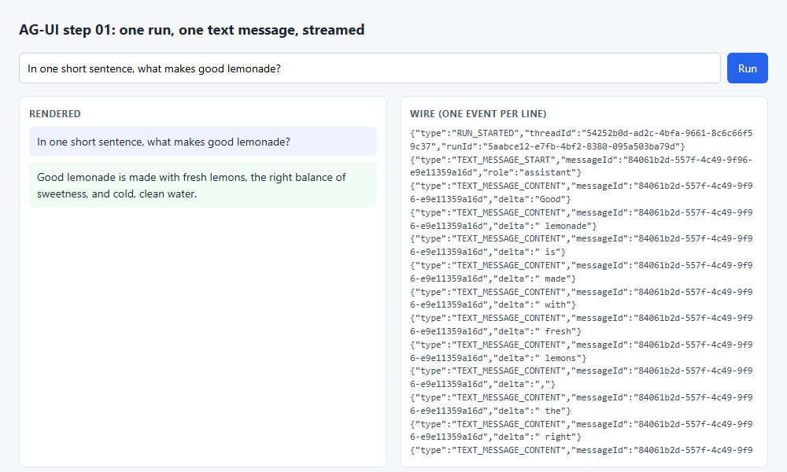

**Checkpoint.** Set `API_KEY` to a wrong value and run again. The stream still ends with one terminal event, now `RUN_ERROR`, and the page still reaches a final status.

**Takeaway.** A transport is a fixed vocabulary of events with a join key, so any AG-UI client can read any AG-UI agent.

## Step 02.2: Tool calls and shared state

**Level.** 6 of 21 · static generation · your own product

**What you learn.** Tool calls as `TOOL_CALL_START`, `TOOL_CALL_ARGS`, `TOOL_CALL_END`, `TOOL_CALL_RESULT`, and shared state as `STATE_SNAPSHOT` plus `STATE_DELTA`. Generative UI becomes a piece of state the model edits.

**Why now.** Step 02.1 streamed text only, and its `state` field was empty. This step sends patches to one object instead of one message per component, so the page can send the object back.

**Build.** `tools.py` holds three server tools that draw nothing; each returns a JSON Patch against a `dashboard` object, such as an `add` on `/dashboard/metrics/-`. `llm.py` streams tool call fragments as well as text. `agent.py` applies each patch on the server first, then emits it as `STATE_DELTA`, so both copies stay equal. `json_patch.py` and `json-patch.mjs` are the same three operations on both sides. `render.mjs` rebuilds the dashboard on every state change. The design decision: `confirm_purchase` is a client tool declared in `RunAgentInput.tools`; the server streams the call and ends the run so the page can answer.

`02_ag_ui/step_02_ag_ui_tools_and_state/agent.py`:

```python
    state = copy.deepcopy(input.state) if input.state else initial_state()
    yield StateSnapshotEvent(snapshot=state)
...
            for call_id, call in calls.items():
                if call["name"] in client_tools:
                    waiting_on_client = True  # the page runs it; its result opens the next run
                    continue
                result, operations = execute(call["name"], json.loads(call["arguments"] or "{}"))
                if operations:
                    apply_patch(state, operations)
                    yield StateDeltaEvent(delta=operations)
                yield ToolCallResultEvent(message_id=str(uuid4()), tool_call_id=call_id, content=result, role="tool")
                messages.append({"role": "tool", "tool_call_id": call_id, "content": result})
            if waiting_on_client:
                break
```

Look at the snapshot: the run starts from the state the client sent, or from an empty dashboard. Then look at the `continue`: a client tool gets no result on the server; its answer arrives on the next run.

**Run.**

```bash
cd genui/02_ag_ui/step_02_ag_ui_tools_and_state
python demo.py
```

**See.** The recorded demo drives three runs. The first opens with `STATE_SNAPSHOT` at 0 metrics, then `show_metric` three times, `show_table` in 64 `TOOL_CALL_ARGS` events and `show_chart` in 34, each followed by a `STATE_DELTA`. The second run's snapshot says 3 metrics, because the page sent the dashboard back; the model calls `confirm_purchase` and the run finishes with no result. After the click, the third run calls `record_purchase` and adds to `/dashboard/purchases/-`.

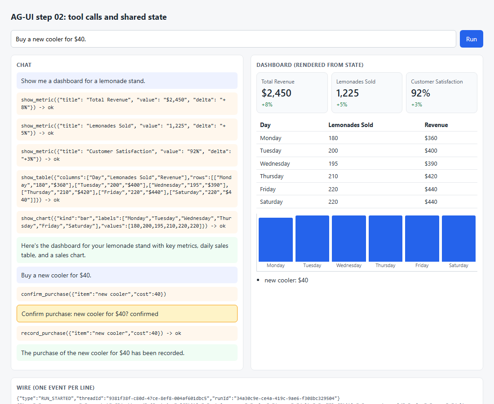

**Checkpoint.** Remove `confirm_purchase` from `CLIENT_TOOLS` in `app.js` and ask to buy something. Why does the run no longer stop early?

**Takeaway.** Nothing on the wire says "metric card": the component vocabulary lives in the state shape and the renderers.

## Step 02.3: The harness codelab's loop over AG-UI

**Level.** 7 of 21 · static generation · your own product

**What you learn.** The harness codelab's coding agent, driven from a browser with no change to its loop. A terminal and AG-UI are two transports for the same functions.

**Why now.** Steps 02.1 and 02.2 wrote the client by hand to show the wire. A product would use `@ag-ui/client` and a real agent. This step does both.

**Build.** `harness/` is a verbatim copy of the harness codelab's step 21. `bridge.py` runs `call_llm` in a worker thread, drains its `on_delta` callback through a queue, and turns each side effect into an event: a delta becomes `TEXT_MESSAGE_CONTENT`, a tool call becomes the three `TOOL_CALL_*` events, and every `write_todos` becomes a `STATE_DELTA` on `/todos`. A permission question becomes a `CUSTOM` event named `permission`, because the browser has no prompt. `server.py` moves into the work directory before it imports the harness, which reads the current directory at import time. `app.js` subscribes to `HttpAgent` from the `esbuild` bundle instead of parsing. The design decision: the bridge translates side effects and never edits `harness/`.

`02_ag_ui/step_03_ag_ui_from_the_harness/bridge.py`:

```python
            for tool_call in message.tool_calls:
                yield ToolCallStartEvent(tool_call_id=tool_call.id, tool_call_name=tool_call.function.name, parent_message_id=message_id)
                yield ToolCallArgsEvent(tool_call_id=tool_call.id, delta=tool_call.function.arguments)
                yield ToolCallEndEvent(tool_call_id=tool_call.id)

                ASKED.clear()
                args, result = execute(tool_call)
                for reason in ASKED:
                    yield CustomEvent(name="permission", value={"reason": reason, "decision": "allow"})
                yield ToolCallResultEvent(message_id=str(uuid4()), tool_call_id=tool_call.id, content=result, role="tool")
                messages.append({"role": "tool", "tool_call_id": tool_call.id, "content": result})
                if tool_call.function.name == "write_todos":
                    yield StateDeltaEvent(delta=[{"op": "replace", "path": "/todos", "value": copy.deepcopy(todos.TODOS)}])
```

Look at `execute`: it is the harness's own function, permission layer included. The arguments go out as one `TOOL_CALL_ARGS` delta because the harness assembles the call first.

**Run.**

```bash
cd genui/02_ag_ui/step_03_ag_ui_from_the_harness
python demo.py
```

`demo.py` runs `npm install` and `npm run build` first.

**See.** The recorded first task writes `hello.py`, runs it through `bash`, reports `CUSTOM permission: run: python hello.py -> allow`, streams 27 text deltas, and closes with `RUN_FINISHED usage 1148 in, 28 out`. The second task plans with `write_todos`, so `STATE_DELTA replace /todos (3 todos)` follows the first tool result; it closes with `usage 2053 in, 50 out`. The page ends with two todos completed and one in progress, drawn from `agent.state`.


**Checkpoint.** Set `HARNESS_WORKDIR` to a project of your own and ask for a change from the browser. Then diff `harness/` against the harness codelab's step 21: it is empty.

**Takeaway.** A second transport costs a bridge and a page, not a new agent.

---

<!-- SUBTHEME 03 -->
# Sub-theme 03: A2UI, Google's declarative protocol

Sub-theme 01 found that a flat element map streams best. A2UI v0.9.1 is that shape as a published protocol: four envelope messages, a flat component list joined by ids, a data model addressed by JSON Pointer, and a swappable catalog. The report places it in the declarative middle of the generation axis. This sub-theme builds the messages by hand, has the model write them through the official SDK, then renders them with Google's Lit renderer over the AG-UI transport from sub-theme 02. At the end the reader has the A2UI over AG-UI stack running, with the correction loop measured.

**Roadmap of this sub-theme**

| Step | You build | You learn |
|---|---|---|
| 03.1 | The four messages in Python, validated against the official schemas; a DOM-free surface state and a hand renderer | Why structure and data are separate messages, and why the spec's own example fails its own schema |
| 03.2 | The `a2ui-agent-sdk` prompt, stream parser and repair pass; a server mirror that answers a `Button` | Prompt-first generation, progressive rendering, and the cost of the correction loop |
| 03.3 | The official `@a2ui/lit` renderer, fed by AG-UI `CUSTOM` events from an `ag-ui-protocol` server | Where A2UI stops and AG-UI begins; one line joins them |

## Step 03.1: A2UI messages by hand

**Level.** 8 of 21 · declarative generation · your own product

**What you learn.** The server-to-client half of A2UI is four messages, and a client keeps a component map and a data model per surface.

**Why now.** Step 01.2 showed that a flat map with ids streams layout first. This step builds the protocol that standardised that shape, with no library on either side.

**Build.** `a2ui.py` builds the four messages and validates them against the official schema files in `schema/`; a registry maps the envelope's placeholder `catalog.json` to the Basic Catalog, which is how any catalog plugs in. Errors come back in the spec's `{code, surfaceId, path, message}` shape. `static/surface.mjs` is the client state with no DOM in it: JSON Pointer helpers, a `Surface` and the store that routes messages. `static/render.mjs` paints part of the Basic Catalog and draws a placeholder for a child that has not arrived. `server.py` replays the spec's own contact form over SSE. The design decision: structure and data are separate messages, so an input writes into the local data model and a bound `Text` sees it at once.

`03_a2ui/step_01_a2ui_messages_by_hand/static/surface.mjs`:

```js
  apply(message) {
    const kind = messageType(message);
    const body = message[kind];
    if (kind === 'updateComponents') {
      for (const component of body.components) this.components.set(component.id, component);
    } else if (kind === 'updateDataModel') {
      if ('value' in body) pointerSet(this.data, body.path ?? '/', body.value);
      else pointerDelete(this.data, body.path ?? '/');
    } else {
      throw new Error(`${kind} is not a surface update`);
    }
  }
...
  tree(id = 'root') {
    const component = this.components.get(id);
    if (!component) return { id, missing: true };
```

Components go into a map keyed by id; data goes through a pointer. The nested tree is never on the wire; `tree()` rebuilds it at paint time.

**Run.**

```bash
cd genui/03_a2ui/step_01_a2ui_messages_by_hand
python demo.py
```

**See.** The spec's stream is 4 messages. The second fails the spec's own schema at `/updateComponents/components/14/checks/0` because `condition` is required; `repair_checks` rewrites 3 rules and it validates. The state then holds 25 components with 0 missing refs, and the page shows 8 inputs with the first name `John` and the newsletter box checked. Clicking Send Message produces a `submitContactForm` action resolved at click time.

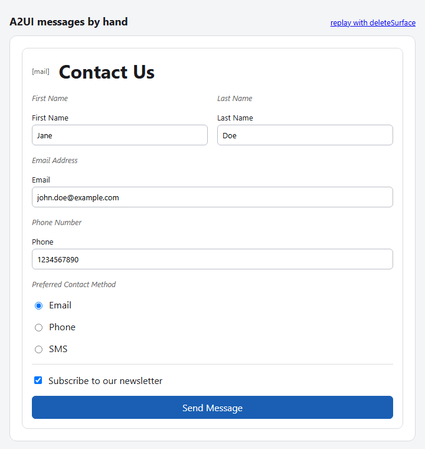

**Checkpoint.** Reorder the components in `contact_form.jsonl` so a child precedes its parent. The page renders the same form; the map ignores order.

**Takeaway.** A2UI is a flat map plus a data model; a client that keeps those two things can render any catalog.

## Step 03.2: A2UI from a model

**Level.** 9 of 21 · declarative generation · your own product

**What you learn.** A2UI is "prompt-first": the catalog schema rides in the prompt, nothing constrains the output, and a correction loop catches what the model got wrong.

**Why now.** Step 03.1 replayed messages written by people. This step has the model write them, with the official Python SDK doing prompt, streaming parse and repair.

**Build.** `prompt.py` wraps `a2ui-agent-sdk`: `DirectJsonFormat` renders the Basic Catalog into a system prompt, `DirectJsonStreamParser` yields `updateComponents` messages while the reply streams, and the full parser repairs and validates the finished reply. `server.py` runs the loop in `generate`: streamed messages go straight to the page; when the reply is complete the full parser runs, and on failure the partial surfaces are deleted and the error goes back to the model once. A `SurfaceStore` mirror lets `answer_action` find the status `Text` and answer a click with one `updateDataModel`. `static/app.mjs` reads the SSE body over `fetch` and posts actions. The design decision: streaming is an optimisation on top of the validated result, never a replacement for it.

`03_a2ui/step_02_a2ui_from_a_model/server.py`:

```python
    for attempt in range(1, ATTEMPTS + 1):
        parser = prompt.stream_parser()
        created, reply = [], []
        for chunk in stream_model(conversation):
            reply.append(chunk)
...
        text = "".join(reply)
        try:
            messages, prose = prompt.parse_reply(text)
        except ValueError as error:
            yield "note", {"attempt": attempt, "error": str(error)[:300]}
            for surface_id in created:
                yield mirror(envelope.delete_surface(surface_id))
            conversation += [{"role": "assistant", "content": text},
                             {"role": "user", "content": f"The reply failed validation. Fix it and send the complete reply again.\n{error}"}]
            continue
```

Look at the `except` branch: every surface the stream created is withdrawn, and the validator's message becomes the next user turn.

**Run.**

```bash
cd genui/03_a2ui/step_02_a2ui_from_a_model
python demo.py
```

**See.** The system prompt is 41083 characters before the user types; the request used 9929 prompt tokens and 600 completion tokens on `gpt-4.1-mini`. The POST went out at 0.40s, `createSurface` arrived at 4.86s, and 38 progressive `updateComponents` messages painted the form before the final one at 10.81s. One attempt was enough. The click at 11.00s posted `{"firstName":"Ada","email":"ada@example.com","newsletter":true}` and the status `Text` showed the server's reply.

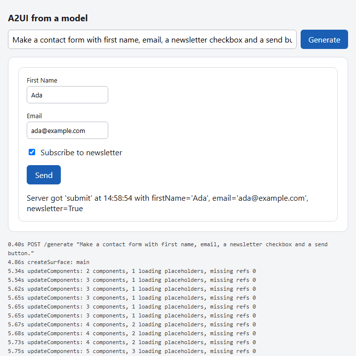

**Checkpoint.** Why are many of the 38 messages the same components again? The stream parser re-sends a component each time a cut string heals.

**Takeaway.** Prompt-first generation is cheap to build and costs a full catalog schema per request, plus a second request whenever validation fails.

## Step 03.3: The official renderer, over AG-UI

**Level.** 10 of 21 · declarative generation · your own product

**What you learn.** A2UI is a generation format and AG-UI is a transport; one `CUSTOM` event joins them.

**Why now.** Step 03.2 rendered by hand over plain SSE. This step swaps in `@a2ui/lit` and carries the same messages as AG-UI runs.

**Build.** `src/page.mjs` builds a `MessageProcessor` from `@a2ui/web_core` over the Lit Basic Catalog and appends an `A2uiSurface` element whenever a surface is created. Its event switch has one line for the join: a `CUSTOM` event named `a2ui` goes to `processor.processMessages`. `src/agui.mjs` is a small AG-UI client with a frame splitter and the `RunAgentInput` shape. `server.py` keeps the generate loop and adds `to_events`, which maps `(kind, payload)` pairs onto `ag-ui-protocol` event classes; `POST /agent` writes frames with `EventEncoder`. A click becomes a second run whose `forwardedProps` carry the action and the client data model. The design decision: nothing in A2UI changes to ride AG-UI, and nothing in AG-UI changes to carry it. One `esbuild` call bundles the renderer into `static/bundle.js`.

`03_a2ui/step_03_a2ui_lit_and_ag_ui/server.py`:

```python
def to_events(agent_input, pairs):
    """Map the loop's (kind, payload) pairs onto AG-UI event objects."""
    ids = dict(thread_id=agent_input.thread_id, run_id=agent_input.run_id)
    yield RunStartedEvent(**ids)
    for kind, payload in pairs:
        if kind is None:
            yield CustomEvent(name="a2ui", value=payload)
        elif kind == "note":
            yield CustomEvent(name="a2ui.note", value=payload)
        elif kind == "step":
            step = StepStartedEvent if payload["started"] else StepFinishedEvent
            yield step(step_name=f"attempt {payload['attempt']}")
...
        elif kind == "done":
            yield RunFinishedEvent(**ids, result=payload)
            return
```

Look at the `kind is None` branch: every A2UI envelope becomes the `value` of one `CUSTOM` event. Correction attempts become AG-UI steps; the usage rides in `RUN_FINISHED`.

**Run.**

```bash
cd genui/03_a2ui/step_03_a2ui_lit_and_ag_ui
npm install && npm run build
python demo.py
```

**See.** The page runs `@a2ui/lit` 0.11.0. The run started at 1.63s, `createSurface` arrived at 7.19s, and 54 `CUSTOM a2ui updateComponents` events followed before `RUN_FINISHED` at 15.64s with 9929 prompt tokens and 686 completion tokens. The click at 15.78s sent a second run; its wire is three lines, `RUN_STARTED`, one `CUSTOM` event with an `updateDataModel`, and `RUN_FINISHED` at 15.81s. The client data model it carried had 92 bytes.

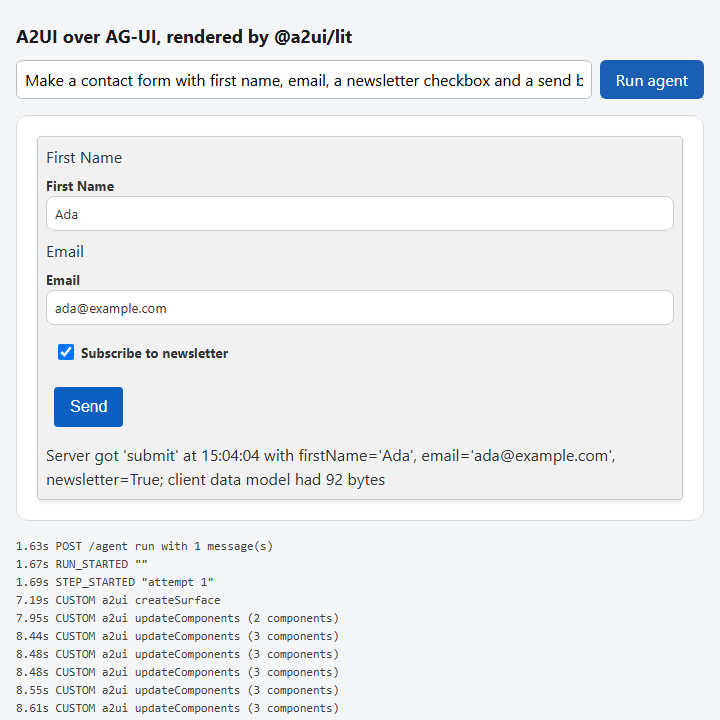

**Checkpoint.** Compare a `Text` reading `# Contact Us` here and in step 03.1. The official renderer renders markdown and runs catalog functions; the hand renderer did neither.

**Takeaway.** Transport and generation format are separate choices; one AG-UI event type carries the whole A2UI protocol.

---

<!-- SUBTHEME 04 -->
# Sub-theme 04: OpenUI Lang

This sub-theme is about generation, not transport. OpenUI Lang is the line-oriented language the report places in the declarative middle of its spectrum and measures as the most token-efficient open format: one statement per line, `id = Component(args)`, positional arguments, references allowed before their definition. Sub-theme 01 streamed a JSON element map and paid for every key and bracket; this sub-theme replaces the JSON with the language. The reader builds the parser by hand, then swaps in the real `@openuidev` packages, then recomputes the report's token table cell by cell, and finally builds the report's hybrid on OpenUI's own reference implementation.

**Roadmap of this sub-theme**

| Step | You build | You learn |
|---|---|---|
| 04.1 | A parser for the core of the language in Python and JavaScript, a JSON Schema catalog, a DOM renderer, a page that streams a program line by line | One statement per line, positional arguments, forward references; why the layout paints before its contents |
| 04.2 | The real stack: a Zod catalog, `library.prompt()`, a model streaming into `<Renderer>` | One catalog generates the prompt, the parser's parameter map and the renderers |
| 04.3 | The report's benchmark recomputed: seven scenarios, four formats, `o200k_base` | Which numbers reproduce, which do not, and why first paint is a different quantity |
| 04.4 | Catalog primitives plus one open-ended HTML artifact, on OpenUI's `html-artifact` example | Hybrid generation: the catalog by default, open-ended only where the catalog does not reach |

## Step 04.1: OpenUI Lang, parsed by hand

**Level.** 11 of 21 · declarative generation · your own product

**What you learn.** The language itself, with no library: how a line becomes a statement, a statement becomes a tree, and a missing name becomes a skeleton.

**Why now.** Sub-theme 01 streamed a flat element map that paid for keys, quotes and brackets on every field. This step keeps the streaming property and drops the cost.

**Build.** `openui_parse.py` is the Python parser: tokenize, split into statements, parse each expression, resolve references from `root` into one tree. `openui-parse.mjs` is the same parser in JavaScript for the page; `test_step.py` checks that both produce the same tree for `program.oui`. `catalog.json` holds eight components as plain JSON Schema, and the order of `properties` is the order of the arguments. `render.mjs` keys one DOM function per component name and draws a placeholder as a grey box. `server.py` sends `program.oui` one line per SSE message. The design decision: the resolver is re-run on every pushed line, never patched.

`04_openui_lang/step_01_openui_lang_parser/openui_parse.py`:

```python
    def reference(name: str) -> object:
        if name not in program.statements or name in visiting:
            unresolved.append(name)
            return {"type": "placeholder", "name": name}
        ...

    def element(node: dict) -> object:
        name = node["name"]
        if name not in catalog:
            errors.append(f"unknown component {name}")
            return None
        params = catalog[name]
        ...
        props = {param: value(arg) for param, arg in zip(params, node["args"])}
        return {"type": "element", "typeName": name, "props": props}
```

Look at the two returns: a name with no statement becomes a placeholder, and a component call zips its arguments with the catalog's parameter names. The parser never knows what `"row"` means; the catalog does.

**Run.**

```bash
cd genui/04_openui_lang/step_01_openui_lang_parser
python demo.py
```

**See.** The recorded run parses 12 statements with 0 unresolved and 0 errors. Streamed line by line, line 1 leaves five names unresolved and the layout already exists; line 7 references `days` one line before line 8 defines it. The headless page shows 6 skeleton boxes after 3 lines and 0 after 12.


**Checkpoint.** Swap the order of `direction` and `gap` under `Stack` in `catalog.json` and render `program.oui` again. The same text renders differently, which proves that the catalog, not the parser, names the arguments.

**Takeaway.** One statement per line, positional arguments and forward references are the whole design; the layout paints after the first line and fills in top-down.

## Step 04.2: The real thing: lang-core and react-lang

**Level.** 12 of 21 · declarative generation · your own product

**What you learn.** The contract the official packages add: one Zod catalog generates the system prompt, the parser's parameter map and the React renderers.

**Why now.** Step 04.1 kept the catalog, the parser and the renderer in three separate files. This step derives all three from one source and lets a real model write the program.

**Build.** `library.mjs` defines the eight components with `defineComponent()`: a name, a description, a Zod props schema and a React function, then `createLibrary()` with `Stack` as the root. `prompt.mjs` prints `library.prompt()`; `server.py` caches it in `prompt.txt` and sends it as the system message. `POST /generate` forwards every model delta as one SSE message. `app.mjs` accumulates the deltas in one string and hands it to `<Renderer>`, which wraps the `@openuidev/lang-core` streaming parser. The design decision: the key order of each `z.object()` is the argument order, so the prompt, the parser and the renderer cannot disagree. React 19 ships CommonJS only, so `nodetools.py` runs esbuild once.

`04_openui_lang/step_02_openui_react_lang/library.mjs`:

```js
const Metric = defineComponent({
  name: "Metric",
  description: "One number with a label and an optional change",
  props: z.object({
    label: z.string(),
    value: z.union([z.string(), z.number()]),
    delta: z.string().optional().describe('such as "+12%"'),
  }),
  component: ({ props }) =>
    h("div", { className: "metric" },
      h("div", { className: "label" }, props.label),
      h("div", { className: "value" }, String(props.value)),
      h("div", { className: `delta ${String(props.delta ?? "").startsWith("-") ? "down" : "up"}` }, props.delta ?? "")),
});
```

Look at the three keys of `z.object()`: they become the prompt's signature line `Metric(label: string, value: string | number, delta?: string)` and the parser's parameter map.

**Run.**

```bash
cd genui/04_openui_lang/step_02_openui_react_lang
npm install
python demo.py
```

**See.** The generated prompt has 48 lines and 3163 characters, one signature line per component. Recorded with `gpt-4.1-mini`, the lemonade-stand prompt produced 9 statements with 0 unresolved: a heading, three metrics in a row, a seven-day bar chart, an inventory table inside a card, and an order form. The model wrote an inline `Table(...)` inside a `Card`; the parser accepts it.

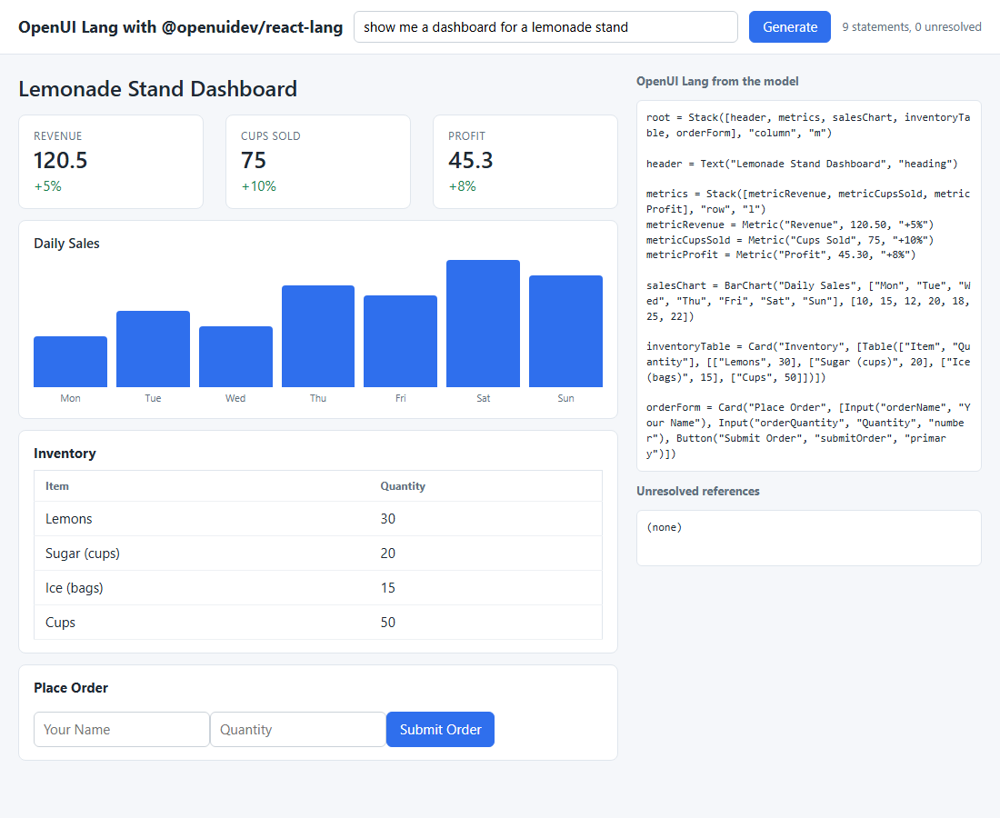

**Checkpoint.** Add a ninth `defineComponent()` to `library.mjs` and run `npm run prompt`. The new signature line appears, the parser accepts the call, and the renderer draws it, with no other file touched.

**Takeaway.** In the declarative mode the catalog is code, not prose, and the model can only produce what the catalog allows.

## Step 04.3: The token benchmark, reproduced

**Level.** 13 of 21 · declarative generation · your own product

**What you learn.** Where the report's "most token-efficient format" claim comes from, recomputed cell by cell, and which numbers reproduce.

**Why now.** Steps 04.1 and 04.2 asserted that the line-oriented syntax is cheaper than JSON. This step measures the claim on the report's own seven scenarios.

**Build.** `samples/` holds the seven `.oui` programs the report's benchmark recorded and the 53-component `schema.json`. `convert.py` projects each parsed tree into Thesys C1 JSON, json-render's element map and its RFC 6902 patch stream, and YAML; the YAML emitter ports the `yaml` npm package's quoting and folding rules. `benchmark.py` counts every text with `tiktoken`'s `o200k_base`, compares each cell with the report's table, and prints seconds at 60 tokens per second. `report/` holds the OpenUI repository's committed projections, and `test_step.py` requires a byte-for-byte match. The design decision: all four texts are projections of one parsed tree, so syntax is the only variable.

`04_openui_lang/step_03_format_benchmark/benchmark.py`:

```python
def first_paint_tokens(texts: dict[str, str]) -> dict[str, int]:
    """Tokens that must arrive before a renderer can draw anything.

    OpenUI Lang: the first line (`root = ...`) is a complete statement.
    json-render patches: the `/root` patch names an element that arrives in
    the last line (children are added before parents), so the whole stream.
    C1 and YAML are one nested document: the whole text.
    """
    first_line = texts["oui"].split("\n", 1)[0] + "\n"
    return {"oui": count(first_line), "yaml": count(texts["yaml"]), "c1": count(texts["c1"]),
            "jsonl": count(texts["jsonl"]), "map": count(texts["map"])}
```

Look at the docstring: only OpenUI Lang has a renderable prefix; the other three formats must arrive whole.

**Run.**

```bash
cd genui/04_openui_lang/step_03_format_benchmark
python demo.py
```

**See.** Every cell of the report's token table reproduces: OpenUI Lang 4800, YAML 9122, C1 JSON 9948, patches 10180 in total, and all 28 per-scenario numbers. The savings column is nearly flat, 42.4% to 61.4% against YAML, because JSON's overhead is per field. The contact form completes in 4.9 s against 14.9 s for patches, the report's "3.04x". The committed `.c1.json` files were reformatted by prettier after the count and come out 10 to 94 tokens lighter.

```text
tokens (o200k_base); * = differs from the report's table, [n] = the report's number
scenario              OpenUI    YAML  C1 JSON  patches    map  vs YAML   vs C1  vs patches
simple-table             148     316      357      340    257   -53.2%  -58.5%      -56.5%
chart-with-data          231     464      516      520    396   -50.2%  -55.2%      -55.6%
contact-form             294     762      849      893    666   -61.4%  -65.4%      -67.1%
dashboard               1226    2128     2261     2247   1738   -42.4%  -45.8%      -45.4%
pricing-page            1195    2230     2379     2487   1950   -46.4%  -49.8%      -52.0%
settings-panel           540    1077     1205     1244    946   -49.9%  -55.2%      -56.6%
e-commerce-product      1166    2145     2381     2449   1920   -45.6%  -51.0%      -52.4%
TOTAL                   4800    9122     9948    10180   7873   -47.4%  -51.7%      -52.8%
report TOTAL            4800    9122     9948    10180      -
```

**Checkpoint.** Why is the `map` column, which is not in the report, 23% cheaper than the patches column? The answer is the `{"op":"add","path":...}` envelope, about 11 tokens per element over 212 elements.

**Takeaway.** The ratio is stable near 2x because JSON pays per field, and first paint favours OpenUI Lang only when the program is written root-first.

## Step 04.4: OpenUI's html artifact: catalog by default, open-ended where needed

**Level.** 14 of 21 · hybrid · your own product

**What you learn.** The report's hybrid pattern, "catalog primitives by default, open-ended only where the catalog does not reach", as OpenUI ships it: one open-ended component inside the catalog.

**Why now.** Step 04.2 gave the model a catalog and nothing else, so an interactive request had nowhere to go. This step builds the escape hatch on OpenUI's own `examples/miscellaneous/html-artifact` reference implementation.

**Build.** `library.mjs` keeps the eight step 04.2 components and adds `Markdown` and `HtmlArtifact(title, document)`, with the example's prompt rules: the catalog for dashboards, `Markdown` for conversation, an artifact only when the user asks for something interactive. `html-artifact.mjs` shows the raw source while the document streams, then Raw and Rendered tabs. `sandbox.mjs` injects a Content Security Policy first in `<head>` and accepts one message shape from the iframe. The design decision: the document is the second string argument of one statement, so it streams like any other string, with no second endpoint and no tool call.

`04_openui_lang/step_04_openui_html_artifact/html-artifact.mjs`:

```js
function HtmlArtifactRenderer({ props }) {
  const isStreaming = useIsStreaming();
  ...
  const [view, setView] = useState(isStreaming ? "raw" : "rendered");
  ...
    isStreaming || view === "raw"
      ? h("pre", { className: "artifact-raw" }, props.document)
      : h("iframe", {
          title: props.title,
          className: "artifact-frame",
          sandbox: "allow-scripts",
          referrerPolicy: "no-referrer",
          srcDoc: sandboxed(props.document),
        }),
```

Look at the ternary: `useIsStreaming()` decides between the raw source and the iframe, and `sandboxed()` adds the CSP before the document reaches `srcDoc`.

**Run.**

```bash
cd genui/04_openui_lang/step_04_openui_html_artifact
npm install
python demo.py
```

**See.** Recorded with `gpt-4.1-mini`. The dashboard prompt produced 11 catalog statements, 262 completion tokens and no artifact. The calculator prompt produced a `Markdown` and one `HtmlArtifact`, 341 completion tokens, of which the document took 292 (86%). The headless test typed `9` into the price field inside the iframe and the total changed from $10.00 to $90.00, so the script ran under the CSP.

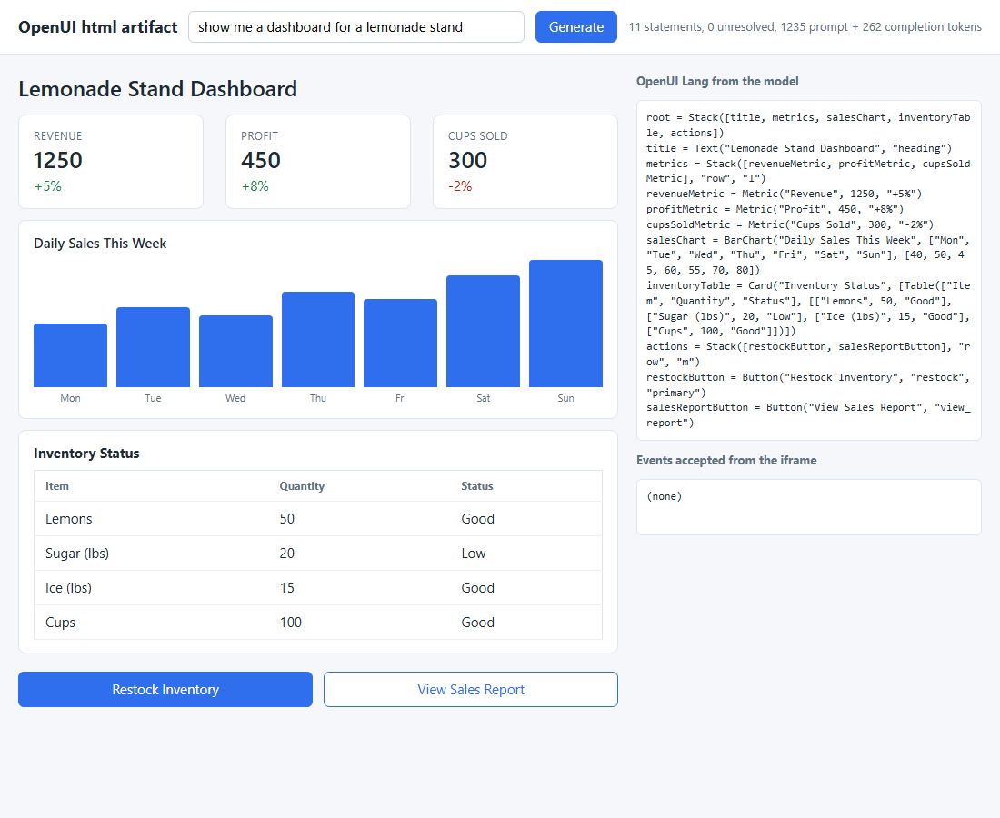

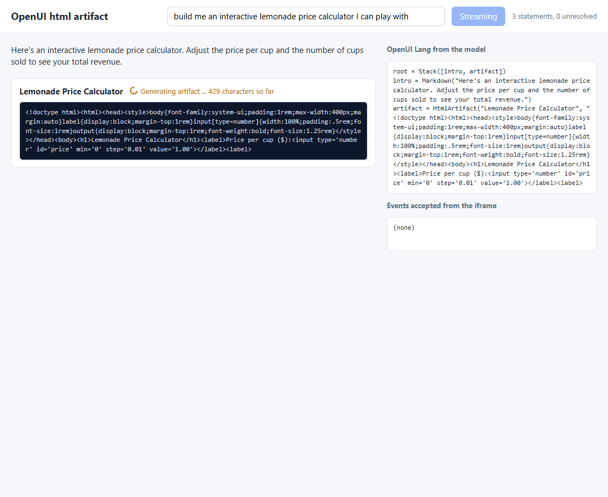

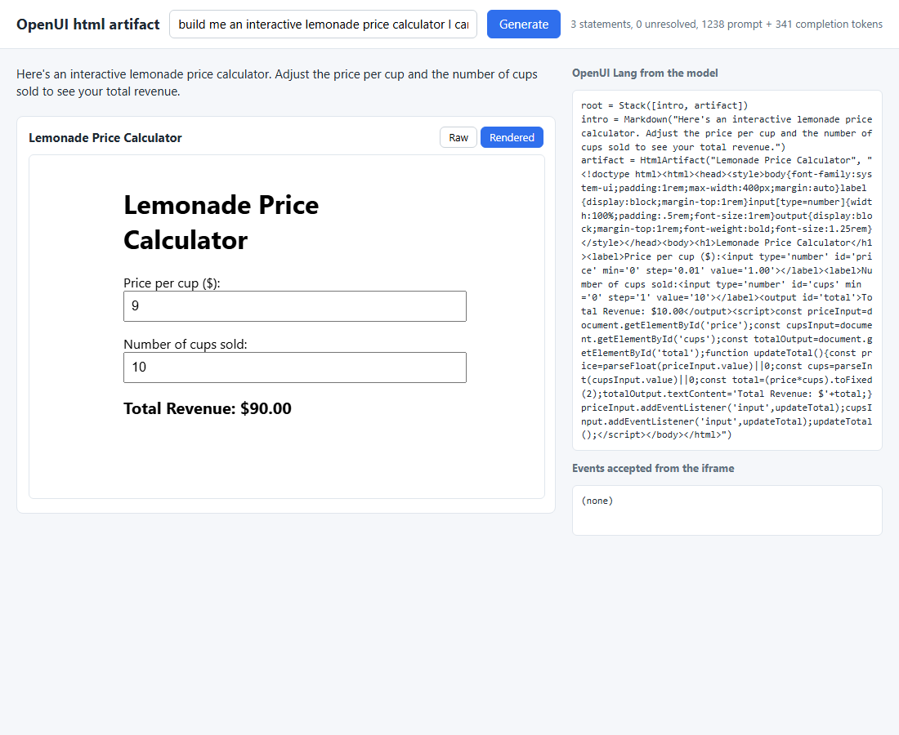

**Checkpoint.** Remove the rule "Never put a dashboard into an HtmlArtifact" from `PROMPT_OPTIONS` and ask for the dashboard again. Compare the completion tokens with 262.

**Takeaway.** The hybrid is one prompt rule and one component: open-ended generation took 86% of one reply, so the catalog is the default and the sandbox the exception.

---

<!-- SUBTHEME 05 -->
# Sub-theme 05: json-render, Vercel's declarative renderer

json-render is one of the open formats in the declarative middle of the report: the model emits a JSON document that names components from a catalog, and a renderer draws it. Sub-theme 01 built that loop by hand; this sub-theme hands the prompt, the parser and the renderer to the library. One `defineCatalog` object produces the system prompt, the typed component map, the validation and the JSON Schema. The spec is a flat element map that streams as RFC 6902 patches. At the end the reader has a streaming dashboard whose buttons drive the next model turn, and the same spec drawn in a terminal.

**Roadmap of this sub-theme**

| Step | You build | You learn |
|---|---|---|
| 05.1 | A catalog of six components with Zod props, the generated prompt, `Renderer` in the page, a Python check of the spec | The catalog is the contract: one object, four outputs; a whole spec paints once |
| 05.2 | The model streams JSON Patch lines; the page compiles them with `createSpecStreamCompiler`; `json_patch.py` mirrors it | Why a flat element map paints on its second line, and what streaming does not change |
| 05.3 | A `Button` with actions: `setState` in the page, catalog actions to the server for the next turn; the same spec in the terminal with `@json-render/ink` | The loop closes with patches against the spec on screen; one spec, two renderers |

## Step 05.1: A catalog and the React Renderer

**Level.** 15 of 21 · declarative generation · your own product

**What you learn.** How one catalog object becomes the prompt, the component map, the validation and the JSON Schema, and what the spec looks like when it arrives whole.

**Why now.** Sub-theme 01 wrote the catalog prompt, the parser and the renderer by hand. This step gives those jobs to the library and keeps the loop: one request, one complete spec.

**Build.** `catalog.mjs` declares six components with Zod props and calls `catalog.prompt()` with four extra rules that ask for one JSON object instead of the library's native JSONL. `prompt.py` runs `prompt.mjs` once and caches the text in `prompt.txt`, so the server never imports the catalog; `catalog_json.mjs` exports the props as JSON Schema for `spec.py`, which rejects unknown types, dangling child ids and wrong prop types. `registry.mjs` maps each catalog entry to a React function through `defineRegistry`, written with `htm` so the same file runs in the browser and under `react-dom/server`. `app.mjs` wraps `Renderer` in `JSONUIProvider`. The design decision: no JSX and no bundler; `index.html` carries an import map of pinned esm.sh builds that match `package.json`.

`05_json_render/step_01_json_render_catalog/catalog.mjs`:

```js
export const catalog = defineCatalog(schema, {
  components: {
    Card: {
      props: z.object({
        title: z.string(),
        subtitle: z.string().nullable(),
      }),
      description: "A titled container. Put related elements inside it.",
    },
    ...
  },
  actions: {},
});
```

Look at `.nullable()`. The prompt shows that prop as `subtitle?`, the JSON Schema allows null, and the check in `spec.py` accepts it. One annotation, three layers.

**Run.**

```bash
cd genui/05_json_render/step_01_json_render_catalog
python demo.py
```

**See.** The recorded run received the complete lemonade dashboard after 5.8 s: 9 elements, 4109 prompt tokens, 351 completion tokens. Nothing rendered before then. The model put three numbers in `state` and read them with `$state` and `$template` props. Most of the 4,100-token prompt is the library's own text about state, repeats, events and visibility.

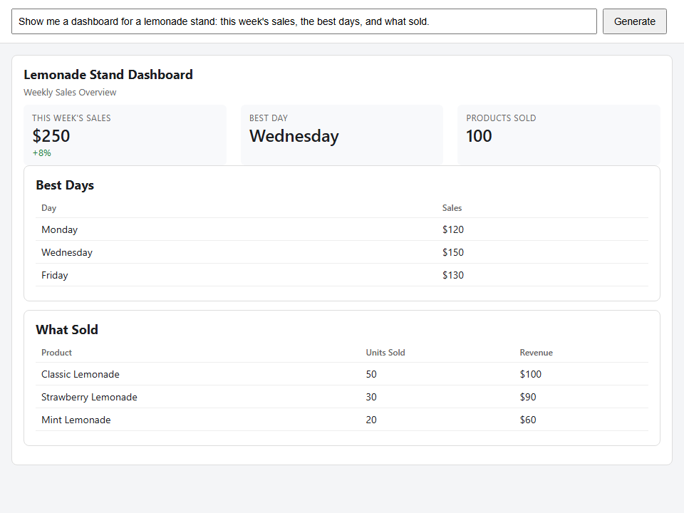

**Checkpoint.** Add a prop to `Chart` in `catalog.mjs`, delete `prompt.txt` and `catalog.json`, and restart the server. The prompt, the JSON Schema and the check all change; only `registry.mjs` needs an edit by hand.

**Takeaway.** The catalog is the contract: one object, four outputs, and a first paint that waits for the whole object.

## Step 05.2: Streaming JSON Patch into the element map

**Level.** 16 of 21 · declarative generation · your own product

**What you learn.** How a flat element map streams as RFC 6902 patches, one per line, and why the page can paint on the second line.

**Why now.** Step 05.1 showed nothing until the whole object arrived at 5.8 s. The library's native format is JSONL patches; this step removes the four rules and uses it.

**Build.** `catalog.mjs` drops the four rules; `llm.py` streams the reply with no JSON mode, because JSONL is many objects. `json_patch.py` is a small RFC 6902 implementation with the library's two tolerances: `add` creates a missing parent and `replace` creates a missing target. Its `SpecStream` applies complete lines as chunks arrive. `server.py` relays every chunk to the page unchanged and pushes a copy into a `SpecStream`, so it ends with the spec, the patches and the timings. `app.mjs` pushes each chunk into `createSpecStreamCompiler`. The design decision: the first patch sets `/root` alone, and `Renderer` has no guard for that, so the page gives it an empty element map until `/elements` arrives.

`05_json_render/step_02_json_render_streaming_patches/app.mjs`:

```js
    const compiler = createSpecStreamCompiler();
    ...
    for await (const chunk of chunks(response)) {
      const { result, newPatches } = compiler.push(chunk);
      if (newPatches.length === 0) continue;
      // The first patch sets /root alone; Renderer reads spec.elements[spec.root]
      // with no guard, so give it an empty map until /elements arrives.
      setSpec(result.elements ? result : { ...result, elements: {} });
      if (firstPaint === null && result.root && result.elements?.[result.root]) {
        firstPaint = seconds();
        setStatus(`first paint at ${firstPaint} s`);
      }
    }
    setSpec(compiler.getResult()); // applies a last line that had no newline
```

`newPatches` is empty while a line is still incomplete, and `result` is a new object whenever a patch applied, so `setSpec` re-renders only on a real change.

**Run.**

```bash
cd genui/05_json_render/step_02_json_render_streaming_patches
python demo.py
```

**See.** The page painted its first element at 3.48 s and completed at 10.14 s, after 13 patches; the server saw the first chunk at 2.53 s. Step 05.1 showed nothing until 5.8 s. The reply cost 4043 prompt tokens and 487 completion tokens: streaming changes when the user sees something, not the prompt cost. The 2.5 s before the first chunk is the model reading the prompt.

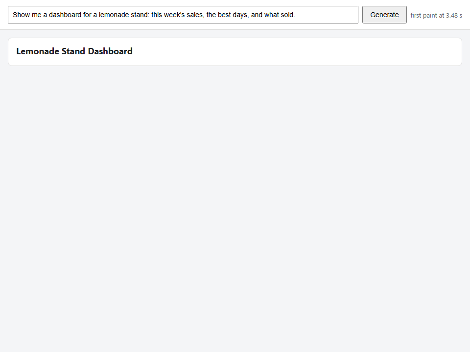

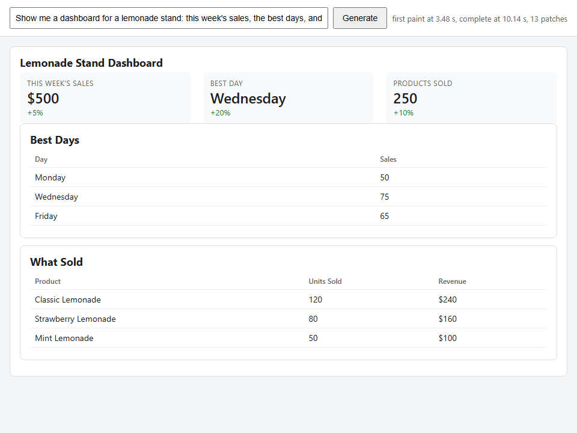

**Checkpoint.** `tests/patches.jsonl` ends without a newline. Count the patches the loop applies and the ones `getResult()` applies; `tests/stream.test.mjs` asserts 12 and then the 13th.

**Takeaway.** Each line of a flat element map is complete on its own; a parent may name a child that has not arrived, and nothing breaks.

## Step 05.3: Actions, and a second target

**Level.** 17 of 21 · declarative generation · your own product

**What you learn.** How a button press becomes the next model turn, answered with patches against the spec on screen, and how the same spec renders in a terminal.

**Why now.** Step 05.2 streams a spec and stops. The report describes the point of a declarative format as a loop: the model edits a document, and the document is the UI.

**Build.** `catalog.mjs` adds a `Button` and two actions, `refresh_numbers` and `show_details`, with Zod `params`; a spec binds a press with an `on` field on the element, not with code in props. `app.mjs` keeps the compiler in a ref and maps each catalog action to one handler: `POST /action`, then push the reply into the same compiler. `server.py` keeps one transcript per session; a press becomes a user message that asks for patches. `ink_render.mjs` is the second target: a component map written with ink's `Box` and `Text`. The design decision: catalog actions go to the server, the built-in `setState` stays in the page, and the server never learns about it.

`05_json_render/step_03_json_render_actions_and_targets/ink_render.mjs`:

```js
export const components = {
  Card: ({ element, children }) =>
    h(Box, { flexDirection: "column", borderStyle: "round", paddingX: 1, marginBottom: 0 },
      h(Text, { bold: true }, element.props.title),
      element.props.subtitle ? h(Text, { dimColor: true }, element.props.subtitle) : null,
      children),
  Row: ({ children }) => h(Box, { flexDirection: "row", gap: 2 }, children),
  ...
  Button: ({ element }) => h(Text, { color: "cyan" }, `[ ${element.props.label} ]`),
};

export const InkRenderer = createRenderer(catalog, components);
```

The ink package hands components the whole `element`, where the React one hands them `props`; the catalog and the spec are shared.

**Run.**

```bash
cd genui/05_json_render/step_03_json_render_actions_and_targets
python demo.py
```

**See.** The first turn streamed 34 patches in 17.59 s for 1228 completion tokens: three buttons, four cards. `refresh_numbers` came back as 12 patches in 4.48 s for 282 completion tokens, all `replace` on state paths. `show_details` returned 2 patches in 1.91 s that set `/showNotes` to true, so a fifth card appeared. The last press, `setState /showNotes = false`, stayed in the page.


The same spec in the terminal, cut to its top:

```text
╭──────────────────────────────────────────────────────────────────────────────────────╮
│ Lemonade Stand Dashboard                                                             │
│ THIS WEEK'S SALES    BEST DAY    PRODUCTS SOLD                                       │
│ $270                 Saturday    165                                                 │
│ +5%                  +20%        +10%                                                │
│ [ Refresh Numbers ]  [ Show Details ]                                                │
│ ╭──────────────────────────────────────────────────────────────────────────────────╮ │
│ │ Sales Over the Week                                                              │ │
│ │ Monday    ████████                 22                                            │ │
│ │ Saturday  ████████████████████████ 64                                            │ │
│ ╰──────────────────────────────────────────────────────────────────────────────────╯ │
│ [ Hide Notes ]                                                                       │
```

**Checkpoint.** Why does the terminal show the notes card when the page does not? `setState` is local; the server's spec still has the model's `/showNotes` patch.

**Takeaway.** One spec, two renderers: the element map never mentions HTML, and a press is data the model answers with more data.

---

<!-- SUBTHEME 06 -->
# Sub-theme 06: MCP Apps, UI in a host you do not control

The report's second transport. Sub-theme 02 put the agent inside a product you own. Here the agent lives in someone else's chat client, and you ship the interface to it as an MCP resource: a `ui://` URI, an HTML document, a tool that points at it, and a JSON-RPC bridge over `postMessage` between a sandboxed iframe and the host. The spec is SEP-1865. Both steps use FastMCP on the server and no SDK anywhere else. At the end the reader has one server that renders in a browser host, in a terminal host, and in Claude Desktop, unchanged.

**Roadmap of this sub-theme**

| Step | You build | You learn |
|---|---|---|
| 06.1 | A FastMCP server whose tool result carries a view, and the smallest browser host that can mount it | A tool result has two audiences: `content` for the model, `structuredContent` for the iframe; the view talks only to the host |
| 06.2 | The same server, unchanged, inside the harness's MCP client as a text host, plus the Claude Desktop and Goose configuration | The host decides what it can show; ship a text result that stands alone and a `ui://` view for hosts that can mount it |

## Step 06.1: An MCP App, a tool result that carries its interface

**Level.** 18 of 21 · static generation · a third-party host (MCP Apps)

**What you learn.** How a tool ships its interface as a resource, and how a host mounts it in a sandboxed iframe.

**Why now.** Sub-theme 02 rendered on a page you wrote. This step gives up the page, the model and the loop, and keeps one MCP server.

**Build.** `server.py` is a FastMCP server with one tool, `lemonade_dashboard`, and one resource at `ui://lemonade/dashboard.html` whose text is `view.html`. The tool's `_meta.ui.resourceUri` links the two. `view.html` speaks JSON-RPC over `postMessage` in three functions. `bridge.mjs` answers `ui/initialize`, holds the tool input and result until the view says `initialized`, and proxies every later request to the server. `host.html` builds a content security policy from the resource's metadata and mounts the HTML in an iframe with `sandbox="allow-scripts"`. `host.py` owns the model call. The design decision: the resource is static and declared up front; the data arrives later, as a notification.

`06_mcp_apps/step_01_mcp_app_resource/server.py`:

```python
@server.tool(meta={"ui": {"resourceUri": VIEW_URI}})
def lemonade_dashboard(days: int = 7) -> types.CallToolResult:
    """Sales dashboard for the lemonade stand over the last `days` days (1 to 28)."""
    days = max(1, min(int(days), 28))
    rows = data.sales(days)
    return types.CallToolResult(
        content=[types.TextContent(type="text", text=data.as_text(days, rows))],
        structuredContent={"days": days, "rows": rows, "summary": data.summary(rows)},
    )


@server.resource(VIEW_URI, name="lemonade_dashboard_view", mime_type=MIME_TYPE, meta=VIEW_META)
def dashboard_view() -> str:
    """The dashboard's HTML document. Static: the data arrives later, over postMessage."""
    return VIEW_FILE.read_text(encoding="utf-8")
```

Look at the two halves of the result. `content` is text: the model reads it, and a text-only host shows it. `structuredContent` is data: the view renders it, and the model never sees it.

**Run.**

```bash
cd genui/06_mcp_apps/step_01_mcp_app_resource
python demo.py
```

**See.** The model called `lemonade_dashboard({"days":5})` and answered in one sentence: 132 cups and $198.00, best day Tuesday. The bridge log shows the fixed order: `ui/initialize`, `initialized`, then `tool-input` and `tool-result`, then a size report of 550x458. The demo then clicked "14 days" inside the view; the view called `tools/call` through the host, and the frame grew to 550x665.

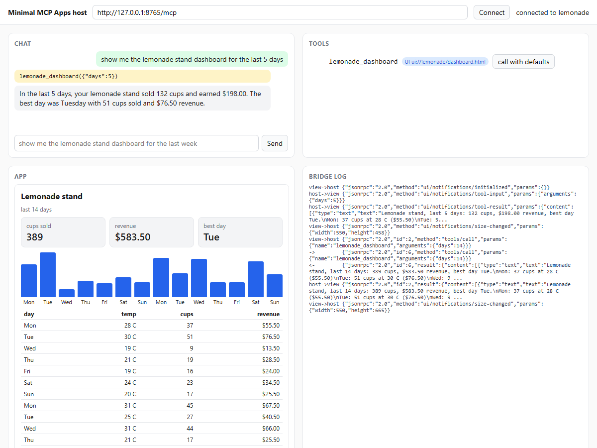

**Checkpoint.** Add `"visibility": ["app"]` to a second tool's `_meta.ui`: it leaves the model's tool list while the view can still call it.

**Takeaway.** The interface travels as a resource, the data as a tool result, and every message between them passes through a host that can refuse it.

## Step 06.2: The same server in a real host

**Level.** 19 of 21 · static generation · a third-party host (MCP Apps)

**What you learn.** What a host not written for your server does with it, and why the report says to ship both text and a view.

**Why now.** Step 06.1 built a host to prove the protocol. Real hosts are built by other people.

**Build.** The server and the browser host are unchanged from step 06.1. `harness/` is the harness codelab's step 26 MCP client, extended into a text host. `.agents/mcp.json` starts the server with `--stdio`. `harness/mcp_client.py` remembers which tools carry a `ui://` resource, reads the resource once per session, and queues the result's `structuredContent` as a card. `harness/ui_text.py` turns any JSON into text. `harness/agent.py` draws the card after the tool panel, one added line. The design decision: the card is queued, not drawn inside the call, because the call runs on a pool thread and the loop writes the terminal.

`06_mcp_apps/step_02_mcp_app_in_a_real_host/harness/mcp_client.py`:

```python
    uri = UI_TOOLS.get(tool_name(server, tool))
    if uri and not getattr(result, "isError", False):
        PENDING_APPS.append((tool_name(server, tool), server, uri, result))
    return history.cap(text)
...
def show_pending(name):
    """Draw the card queued for one tool call, if any. The loop calls this after the tool panel."""
    for entry in PENDING_APPS:
        if entry[0] == name:
            PENDING_APPS.remove(entry)
            show_app(*entry[1:])
            return True
    return False
```

Look at the return value. The string the model receives is the same as in step 26: the model never learns that a card was drawn.

**Run.**

```bash
cd genui/06_mcp_apps/step_02_mcp_app_in_a_real_host
python demo.py
```

**See.** Two panels. The first is the tool result as the model saw it: text. The second is the MCP App as this host can show it: the resource's identity (7,876 bytes, restrictive default policy), then the data as a table. The prompt went from 2,093 to 2,227 tokens: the text lines only; the table never reached the model.

```text
$ MCP_ALLOW=mcp__lemonade__* python -m harness.agent -p "Show me the lemonade stand dashboard for the last 5 days. Answer in one sentence."
  2,093 prompt · 23 completion · 1,792 cached
  ┌─────────────────────────────────────────────────────────────────────────┐
  │ mcp__lemonade__lemonade_dashboard 5                                     │
  │ ─────────────────────────────────────────────────────────────────────── │
  │ Lemonade stand, last 5 days: 132 cups, $198.00 revenue, best day Tue.   │
  ...
  ┌─ app · Lemonade dashboard ──────────────────────────────────────────────┐
  │ ui://lemonade/dashboard.html | text/html;profile=mcp-app | 7,876 bytes  │
  │ | csp: restrictive default | rendered as text                           │
  │ ─────────────────────────────────────────────────────────────────────── │
  │ days: 5                                                                 │
  ...
  2,227 prompt · 46 completion · 2,048 cached
```

Claude Desktop and Goose mount the same resource in a real iframe; the step README has the stdio configuration.

**Checkpoint.** Compare with sub-theme 02: same numbers, different contract. Who owns the page, who runs the loop, where can the interface appear?

**Takeaway.** The server did not change between three hosts: keep the interface as data, render it on your own page where you own the product, and ship a `ui://` view where you do not.

---

<!-- SUBTHEME 07 -->
# Sub-theme 07: Generative UI in the harness

The two codelabs meet here. The harness codelab ends with a coding agent that talks in prose and tool panels, then moves the loop onto TrueForge. This sub-theme gives both harnesses a rendering surface. Both steps are declarative generation in the report's terms; the transports are a terminal, a browser page fed over SSE, and the TrueForge SDK. At the end the reader has the stage 15 loop drawing a validated spec on two surfaces, and a parser plus renderer for OpenUI Lang, the language TrueForge's generative UI speaks. Sub-theme 06 put an interface into a host the reader does not control; this one lets the reader's own agent answer with one.

**Roadmap of this sub-theme**

| Step | You build | You learn |
|---|---|---|
| 07.1 | A `render_ui(spec)` tool on the stage 15 loop, a six-component catalog, a `rich` renderer and a browser page over SSE | The spec is the interface: validate once, draw on any surface, and the model never sees the picture |
| 07.2 | A TrueForge session with `generative_ui` on, an OpenUI Lang parser in Python and JavaScript, a page that draws one line per event | A hosted harness already speaks a UI language; forward references and line-oriented statements make it stream |

## Step 07.1: A render_ui tool for the harness

**Level.** 20 of 21 · declarative generation · a terminal

**What you learn.** Generative UI as one tool: the model emits a json-render element map, the harness validates it against a catalog, and every surface draws from that data.

**Why now.** The reader has the stage 15 harness and the element map from sub-theme 01. This step joins them without changing the loop.

**Build.** `harness/` is the stage 15 loop copied whole. `harness/genui.py` is new: a six-component catalog with typed props and a children flag, plus `validate()`, which returns every problem as a plain sentence. `harness/tools.py` adds `render_ui` next to `bash` and `task`, behind the same permission check. `harness/llm.py` writes the catalog into the system prompt from the dictionary the validator reads, so the two cannot drift. `harness/ui.py` is the first surface: one `rich` renderable per element, recursing over children. `harness/web.py` and `web/app.js` are the second: a standard library HTTP server pushes each spec to every open tab over SSE, and the page walks the map from `root`. The design decision: the model sees one sentence; the surface draws the picture from data.

`07_harness_genui/step_01_render_ui_tool/harness/tools.py`:

```python
def render_ui(spec: dict) -> str:
    """Validate a json-render element map and hand it to every surface.

    The terminal draws it in ui.tool(); the web page gets it over SSE. The
    model only sees this short string, never the picture: the spec is data
    that the surfaces interpret, not something the model has to describe.
    """
    problems = validate(spec)
    if problems:
        return "Invalid spec, nothing rendered:\n- " + "\n- ".join(problems)
    web.publish(spec)
    return f"Rendered {len(spec['elements'])} elements from root '{spec['root']}'."
```

Look at the two return values. A bad spec comes back as corrections, not a crash; a good one is published and acknowledged in one line.

**Run.**

```bash
cd genui/07_harness_genui/step_01_render_ui_tool
python demo.py
```

**See.** The first model call cost 1,365 prompt and 308 completion tokens and produced a ten-element map: metrics, a seven-bar chart, an inventory `Table` inside a nested `Card`, and a weather card. The terminal drew it inside the `render_ui · 10 elements` tool panel. The second call, 1,690 prompt and 43 completion tokens, was the model's summary. The demo script captured the same spec from the web surface.

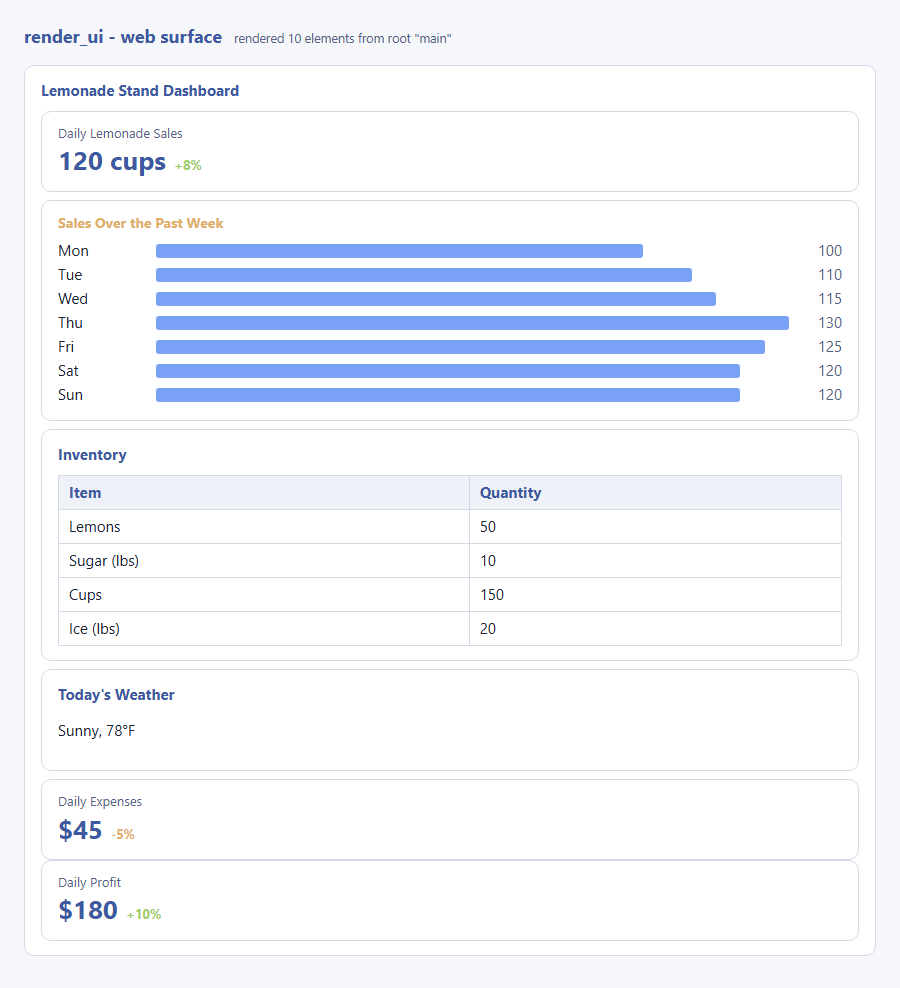

**Checkpoint.** Add a `Gauge` entry to `CATALOG` and run the tests. They fail until `_element()` and `web/app.js` can draw it; that is the cost of a new component.

**Takeaway.** One agent, one spec, two surfaces: the model composes from a catalog it saw once; a new surface changes nothing.

## Step 07.2: TrueForge's generative UI, rendered in a page of ours

**Level.** 21 of 21 · declarative generation · the TrueForge SDK

**What you learn.** How to capture a hosted harness that already speaks a UI language over its SDK, and how forward references let a page draw the skeleton before the details arrive.

**Why now.** Step 07.1 taught the local harness to draw. TrueForge, the hosted harness from Part 7, already does this with `generative_ui` enabled: its agent answers with an OpenUI Lang program inside a fence. This step renders that program in a page of its own.

**Build.** `client/genui.py` opens a session with `generative_ui` enabled, streams one turn, and `extract_program()` pulls the text out of the first ```openui fence, even one that never closed. `openui_parse.py` is a streaming-first parser: statements are `name = expr`, values are strings, numbers, lists, component calls, `+` and references, forward or backward. `web/openui-parse.mjs` is the same parser in JavaScript, tested against the same program. `web/render.mjs` maps each component name to a function of its positional args; unknown components become a labelled box, pending references a dashed placeholder. `server.py` sends one line per SSE event, and `web/app.js` feeds each line to the parser and redraws from `root`. The design decision: a statement commits at the first newline where its brackets balance, so a multi-line `Card([` waits and every finished line is drawable at once.

`07_harness_genui/step_02_trueforge_generative_ui/openui_parse.py`:

```python
    def feed(self, text):
        """Add a chunk. Every complete statement it finishes is parsed now."""
        self.buffer += text
        while True:
            # the first newline at which the text before it is balanced ends a statement
            start, cut = 0, None
            while cut is None:
                nl = self.buffer.find("\n", start)
                if nl == -1:
                    return  # the rest is an unfinished line: hold it back
                if complete(self.buffer[:nl]):
                    cut = nl
                start = nl + 1
            line, self.buffer = self.buffer[:cut], self.buffer[cut + 1:]
            self.add_line(line.replace("\n", " "))
```

Look at the inner loop: `complete()` is a bracket-balance check, and the loop walks newline by newline until the text before one balances.

**Run.**

```bash
cd genui/07_harness_genui/step_02_trueforge_generative_ui
python demo.py
```

**See.** The recorded turn cost 6,954 input and 352 output tokens; 1,288 input tokens are labelled `harness`, which is where the catalog and grammar came from. The agent was told nothing about OpenUI Lang. The reply held a 32-line program with 7 statements: a title, a table, a line chart card, two KPI cards, a tag and a sentence. Mid-stream, 25 lines in, the root line had named six children and three were still dashed placeholders.

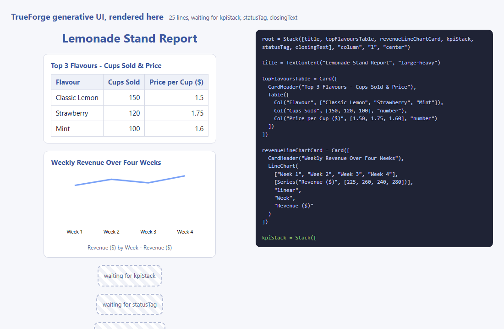

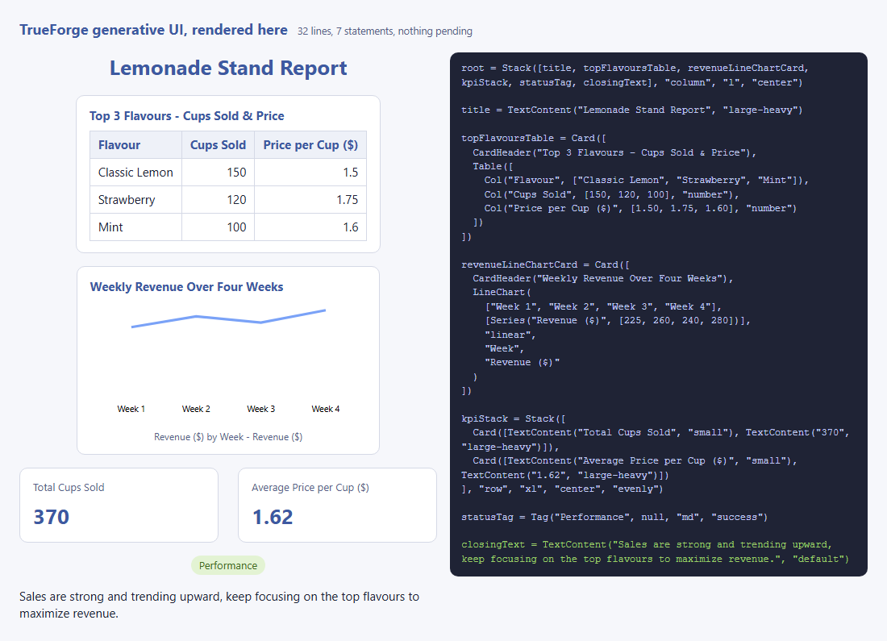

**Checkpoint.** Run `python demo.py --offline` after swapping two statements in `sample_reply.md`. The tree is the same; only the moment each box fills in moves.

**Takeaway.** A UI language is a string with a grammar: any parser that knows the grammar can draw it, and streaming follows from statements that commit line by line.

---

# Choosing for your own product

The report's decision framework, with the step that shows each option.

**Choose the transport first.**

| If | Then | Step |
|---|---|---|
| the agent runs inside a product you build | AG-UI | 02.1 to 02.3 |
| the agent must appear inside Claude, ChatGPT, VS Code or Goose | MCP Apps | 06.1, 06.2 |
| both | ship both; the same UI, two transports | 06.2 |

**Then choose the generation mode.**

| If | Then | Step |
|---|---|---|
| the answer shapes are few and your design system is strict | static: prebuilt components, the agent fills props | 01.1 |
| layouts vary and must stay inside your design system | declarative, from a catalog | 01.2, and one of 03, 04, 05 |
| you need the lowest token cost and the earliest first paint | OpenUI Lang | 04.1 to 04.3 |
| you render on Flutter, Angular or native, or need catalog negotiation | A2UI | 03.1 to 03.3 |
| you render to PDF, email, a terminal or video as well as the browser | json-render | 05.1 to 05.3 |
| one-off or creative output is part of the product | the hybrid: a catalog with a sandboxed generated view | 01.4, 04.4 |
| you distribute UI to third-party hosts | developer-authored HTML resources over MCP Apps | 06.1 |

**What the measurements in this series say.**

| Question | Measured in | Result |
|---|---|---|
| how much does open-ended HTML cost against a flat spec? | 01.3 | nine to ten times the tokens, eight times the wall time, over three runs |
| does the flat element map really paint earlier than a nested tree? | 01.2 | layout known at chunk 33 of 266 against 408 of 408 |
| does the report's format table hold? | 04.3 | every cell reproduces; OpenUI Lang 4,800 tokens against 9,122 (YAML), 9,948 (C1 JSON), 10,180 (patches) |
| does patch streaming help a real page? | 05.2 | first paint at 3.5 s against 10.1 s complete; the single-paint version took 5.8 s |
| what does a hosted harness's UI language look like on the wire? | 07.2 | an OpenUI Lang program of 32 lines and 7 statements inside a normal reply |

# Glossary

- **Catalog.** The set of components the agent may use, each with a
  schema for its props. It is the prompt, the validator and the renderer's
  registry at once.
- **Spec.** What the agent emits in declarative mode: a JSON tree, a flat
  element map, or a program in a DSL.
- **Element map.** A flat dictionary of elements keyed by id, with a root
  id and child id lists. It streams well because the layout arrives
  before the content.
- **Forward reference.** A statement that names a child before the child
  is defined. The renderer shows a placeholder until the definition
  arrives.
- **Surface.** A2UI's word for one rendered area with its own component
  list and data model.
- **Data model.** In A2UI, the values the components bind to, addressed by
  JSON Pointer, sent and updated separately from the components.
- **JSON Patch.** RFC 6902 operations (`add`, `replace`, `remove`) against
  a JSON document. json-render and AG-UI's state deltas both stream them.
- **Run.** AG-UI's unit of work: one request in, a stream of typed events
  out.
- **Client tool.** A tool the page executes rather than the server. The
  run ends when the agent calls it and resumes when the page answers.
- **UI resource.** In MCP Apps, an HTML document served by the MCP server
  and pointed at by a tool result, mounted by the host in a sandboxed
  iframe.
- **Bridge.** The `postMessage` channel between a host and an iframe,
  carrying JSON-RPC in both directions.
- **CSP.** Content Security Policy. The line that decides what a generated
  document may load and run.
- **Hybrid.** A catalog with one open-ended component in it. The report's
  recommended default.

# Wrap-up

Three rules held across all 21 steps.

1. **Structure before content.** Every format that streams well names the
   layout first and fills it later: flat maps, forward references, patches
   against ids. A nested document cannot paint until it closes.
2. **The catalog is the contract.** Prompt, validation and rendering come
   from one definition. Change the definition and all three change. This
   is what keeps declarative generation safe.
3. **Errors are results.** A spec that fails validation goes back to the
   model as text. A blocked script stays inside its iframe. The loop never
   ends because the agent drew something wrong.

The harness codelab ended with the same three rules for tools. They hold
for interfaces too.

## Sub-theme index

| Sub-theme | Steps | Packages |
|---|---|---|
| [01 foundations](01_foundations/) | static components, declarative tree, open-ended HTML, hybrid escape hatch | none |
| [02 AG-UI](02_ag_ui/) | server, tools and state, from the harness | `ag-ui-protocol`, `@ag-ui/client` |
| [03 A2UI](03_a2ui/) | messages by hand, from a model, Lit renderer over AG-UI | `a2ui-core`, `a2ui-agent-sdk`, `@a2ui/lit` |
| [04 OpenUI Lang](04_openui_lang/) | parser, React renderer, format benchmark, html artifact | `@openuidev/lang-core`, `@openuidev/react-lang`, `tiktoken` |
| [05 json-render](05_json_render/) | catalog, streaming patches, actions and targets | `@json-render/core`, `@json-render/react`, `@json-render/ink` |
| [06 MCP Apps](06_mcp_apps/) | app resource, in a real host | `mcp` |
| [07 in the harness](07_harness_genui/) | render_ui tool, TrueForge generative UI | `rich`, `trueforge_sdk` |

> **Build status.** All seven sub-themes, twenty-one steps, are built and
> tested. Every snippet in this document and in the step READMEs is
> verified against the code in continuous integration. The specification
> they were built from is `GENUI_SPEC.md`.

MIT licensed. The specifications and libraries this series uses are
Apache-2.0 (A2UI, json-render) and MIT (AG-UI, OpenUI, MCP Apps); each
step README names what it uses.
