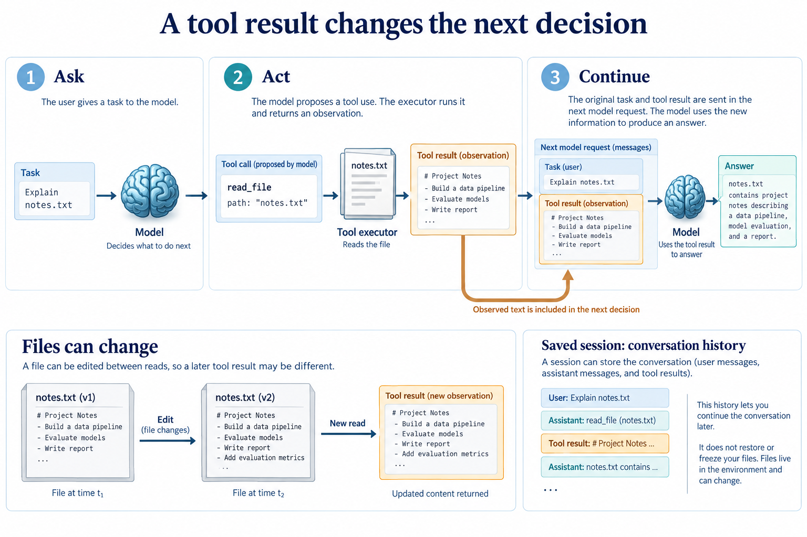

# From a reply to an agent

[Course](../../README.md) · [All lessons](../COURSE-MAP.md) · [Start here](../START-HERE.md) · [Glossary](../GLOSSARY.md)

Theme 1 of 7 · 11 lessons · Original stages 1–8, including 2.1–2.4

A model can describe a file without opening it. A tool gives it an observation. A loop lets that observation change its next action. Begin with one request, then make each new action visible.

*The early shell and editing examples are teaching mechanisms. They do not yet have the later permission and sandbox controls. This figure explains the theme; individual lessons introduce its components gradually.* [Open the full-size figure](../assets/foundations-v1.png).

## Before you start

You can describe a small file task and distinguish a request from a reply. Use [setup](../START-HERE.md) and a disposable learner workspace. Let the coding agent write commands and implementation changes. You predict behavior, inspect results and explain what happened.

## Work through the theme

Ask the agent to explain a small text file in a disposable workspace. Change the file, then compare an old description with a fresh read.

| Lesson | Runnable snapshot |
|---|---|
| [Stage 1 - Minimal chat](step_01_minimal_chat/README.md) | [Code and offline test](step_01_minimal_chat/) |
| [Stage 2.1 - Chat with a simple bash tool](step_02_1_bash_tool/README.md) | [Code and offline test](step_02_1_bash_tool/) |
| [Stage 2.2 - Generic tools](step_02_2_generic_tools/README.md) | [Code and offline test](step_02_2_generic_tools/) |
| [Stage 2.3 - A read_file tool](step_02_3_read_file/README.md) | [Code and offline test](step_02_3_read_file/) |
| [Stage 2.4 - The agent loop](step_02_4_agent_loop/README.md) | [Code and offline test](step_02_4_agent_loop/) |
| [Stage 3 - Better UI](step_03_better_ui/README.md) | [Code and offline test](step_03_better_ui/) |
| [Stage 4 - Skill discovery and reading](step_04_skills/README.md) | [Code and offline test](step_04_skills/) |
| [Stage 5 - File editing tools](step_05_file_editing/README.md) | [Code and offline test](step_05_file_editing/) |
| [Stage 6 - Late injection](step_06_late_injection/README.md) | [Code and offline test](step_06_late_injection/) |
| [Stage 7 - File freshness reminders](step_07_file_freshness/README.md) | [Code and offline test](step_07_file_freshness/) |
| [Stage 8 - Sessions, slash commands and rewind](step_08_sessions_rewind/README.md) | [Code and offline test](step_08_sessions_rewind/) |

Read the lessons in this order. Each snapshot has its own files; the agent should run its test from that snapshot's directory. Do not install several versions of the same harness command into one environment at once.

## Run, inspect and explain

Ask the tutor to open the first unfinished lesson, explain its new mechanism and run its offline test. Keep live provider calls separate: confirm the available endpoint, credentials and resource limit before using it. Save a prediction and the actual observation in your learner notes.

Try one controlled change in a copy. Predict its effect before the agent edits it. Re-run the relevant check and compare both outcomes. If a dependency or platform capability is missing, keep the error and use the source explanation until setup is repaired; do not describe that as a successful live run.

## Key takeaways

- Follow a tool call from proposal through execution into the next model request. Explain how a saved session differs from the files it describes.
- The early shell and editing examples are teaching mechanisms. They do not yet have the later permission and sandbox controls.
- Keep an actual trace or test result beside each claim about behavior.

## Check your understanding

The model says it read a file. Which evidence would distinguish a real read from a plausible answer?

Hint and explanation

First name the object whose behavior you are claiming to know. Then identify the observation that supports that claim.

Find the tool request, the actual tool result and the next request that includes that observation. A confident final sentence alone cannot establish a read.

## What's next

The next theme asks you to keep actions within limits. Continue to [Keep actions within limits](../02_control/README.md).
