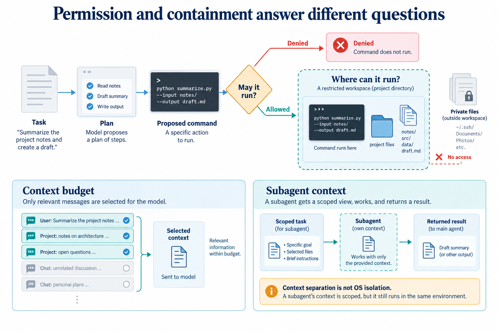

# Keep actions within limits

[Course](../../README.md) · [All lessons](../COURSE-MAP.md) · [Start here](../START-HERE.md) · [Glossary](../GLOSSARY.md)

Theme 2 of 7 · 7 lessons · Original stages 9–15

A useful tool can also make an unwanted change. Add controls that answer separate questions: what work is planned, which actions are permitted, where they execute, and what context each worker receives.

*An approval rule is not a sandbox. A subagent role is not automatically a separate operating-system boundary. This figure explains the theme; individual lessons introduce its components gradually.* [Open the full-size figure](../assets/control-v1.png).

## Before you start

You can trace the model–tool loop and inspect a saved conversation. Use [setup](../START-HERE.md) and a disposable learner workspace. Let the coding agent write commands and implementation changes. You predict behavior, inspect results and explain what happened.

## Work through the theme

Use a disposable project to compare a permitted read with a refused edit. Inspect the decision before discussing whether the command itself was correct.

| Lesson | Runnable snapshot |
|---|---|
| [Stage 9 - An installable command](step_09_installable_command/README.md) | [Code and offline test](step_09_installable_command/) |
| [Stage 10 - Todos](step_10_todos/README.md) | [Code and offline test](step_10_todos/) |
| [Stage 11 - Tool permissions](step_11_permissions/README.md) | [Code and offline test](step_11_permissions/) |
| [Stage 12 - An OS sandbox for bash](step_12_sandbox/README.md) | [Code and offline test](step_12_sandbox/) |
| [Stage 13 - Readable todos and a real input line](step_13_readable_todos_input_line/README.md) | [Code and offline test](step_13_readable_todos_input_line/) |
| [Stage 14 - Compaction and context overflow](step_14_compaction/README.md) | [Code and offline test](step_14_compaction/) |
| [Stage 15 - Exploration subagents](step_15_subagents/README.md) | [Code and offline test](step_15_subagents/) |

Read the lessons in this order. Each snapshot has its own files; the agent should run its test from that snapshot's directory. Do not install several versions of the same harness command into one environment at once.

## Run, inspect and explain

Ask the tutor to open the first unfinished lesson, explain its new mechanism and run its offline test. Keep live provider calls separate: confirm the available endpoint, credentials and resource limit before using it. Save a prediction and the actual observation in your learner notes.

Try one controlled change in a copy. Predict its effect before the agent edits it. Re-run the relevant check and compare both outcomes. If a dependency or platform capability is missing, keep the error and use the source explanation until setup is repaired; do not describe that as a successful live run.

## Key takeaways

- Explain why permission, sandboxing, context management and subagents solve different problems.
- An approval rule is not a sandbox. A subagent role is not automatically a separate operating-system boundary.
- Keep an actual trace or test result beside each claim about behavior.

## Check your understanding

If a user approves a command, does that prove it cannot read outside the project?

Hint and explanation

First name the object whose behavior you are claiming to know. Then identify the observation that supports that claim.

No. Approval decides whether an action may run. The execution boundary determines the resources it can access. Inspect and test both independently.

## What's next

The next theme asks you to separate the harness from its provider. Continue to [Separate the harness from its provider](../03_adapters/README.md).
