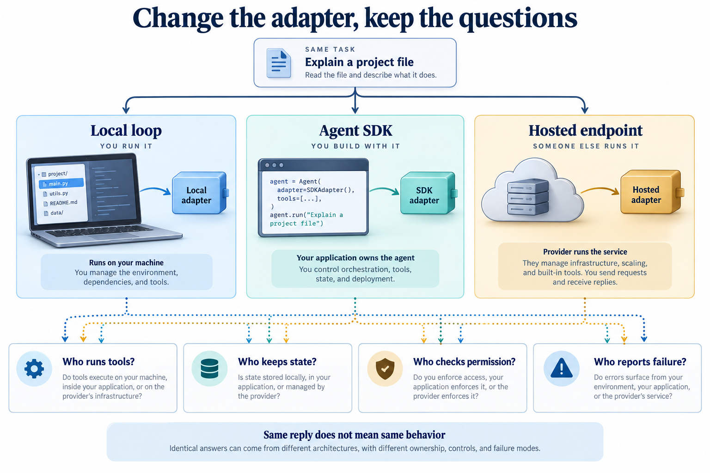

# Separate the harness from its provider

[Course](../../README.md) · [All lessons](../COURSE-MAP.md) · [Start here](../START-HERE.md) · [Glossary](../GLOSSARY.md)

Theme 3 of 7 · 5 lessons · Original stages 16–20

You now know the mechanisms you need. Compare alternative implementations by asking who owns the loop, tool execution, state and approvals. A shared API shape does not guarantee identical behavior.

*The repository contains provider-specific examples. Availability, credentials, model support and current SDK compatibility require a live check. This figure explains the theme; individual lessons introduce its components gradually.* [Open the full-size figure](../assets/adapters-v1.png).

## Before you start

Complete the first two themes. Know which responsibilities belong to your local harness. Use [setup](../START-HERE.md) and a disposable learner workspace. Let the coding agent write commands and implementation changes. You predict behavior, inspect results and explain what happened.

## Work through the theme

Trace the same small file task through one adapter. Mark which decisions your code makes and which the SDK makes.

| Lesson | Runnable snapshot |
|---|---|
| [Step 16 - The same harness on the Claude Agent SDK](step_16_claude_agent_sdk/README.md) | [Code and offline test](step_16_claude_agent_sdk/) |
| [Step 17 - The same harness on the OpenAI Agents SDK](step_17_openai_agents_sdk/README.md) | [Code and offline test](step_17_openai_agents_sdk/) |
| [Step 18 - The same harness on the Google Antigravity SDK](step_18_google_antigravity_sdk/README.md) | [Code and offline test](step_18_google_antigravity_sdk/) |
| [Step 19 - The same harness on DeepSeek Harness (dsh)](step_19_deepseek_harness/README.md) | [Code and offline test](step_19_deepseek_harness/) |
| [Step 20 - The same harness on OpenRouter](step_20_openrouter/README.md) | [Code and offline test](step_20_openrouter/) |

Read the lessons in this order. Each snapshot has its own files; the agent should run its test from that snapshot's directory. Do not install several versions of the same harness command into one environment at once.

## Run, inspect and explain

Ask the tutor to open the first unfinished lesson, explain its new mechanism and run its offline test. Keep live provider calls separate: confirm the available endpoint, credentials and resource limit before using it. Save a prediction and the actual observation in your learner notes.

Try one controlled change in a copy. Predict its effect before the agent edits it. Re-run the relevant check and compare both outcomes. If a dependency or platform capability is missing, keep the error and use the source explanation until setup is repaired; do not describe that as a successful live run.

## Key takeaways

- Explain a provider change as a change of ownership and interfaces, then name what still needs testing.
- The repository contains provider-specific examples. Availability, credentials, model support and current SDK compatibility require a live check.
- Keep an actual trace or test result beside each claim about behavior.

## Check your understanding

Two adapters return the same text. Does that prove they have the same tool and approval behavior?

Hint and explanation

First name the object whose behavior you are claiming to know. Then identify the observation that supports that claim.

No. Compare actual tool requests, who executed them, where state lives, approval decisions and failure signals. Text equivalence is only one observation.

## What's next

The next theme asks you to connect tools and observe the work. Continue to [Connect tools and observe the work](../04_tools/README.md).
