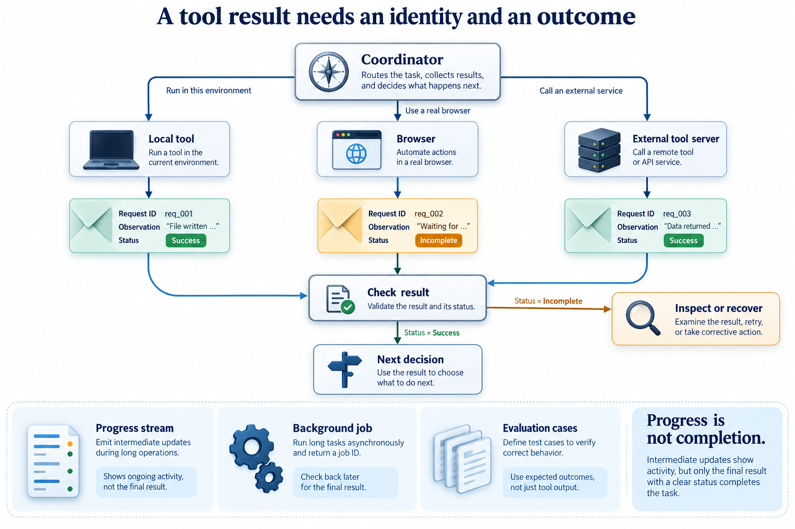

# Connect tools and observe the work

[Course](../../README.md) · [All lessons](../COURSE-MAP.md) · [Start here](../START-HERE.md) · [Glossary](../GLOSSARY.md)

Theme 4 of 7 · 10 lessons · Original stages 21–30

A loop becomes more useful when it can stream progress, use external tools and coordinate work. More capabilities also create more ways to lose a result or misread a failure. Keep each observation connected to its action.

*Browser, desktop, external server and hosted-model exercises need capabilities beyond a fake-model test. This figure explains the theme; individual lessons introduce its components gradually.* [Open the full-size figure](../assets/tools-v1.png).

## Before you start

Understand the local loop and permission boundary. The streaming branch builds on the stage-15 harness; SDK examples are comparisons, not required runtime dependencies. Use [setup](../START-HERE.md) and a disposable learner workspace. Let the coding agent write commands and implementation changes. You predict behavior, inspect results and explain what happened.

## Work through the theme

Compare one successful tool result with a failed or interrupted one. Follow their identities into the report before judging the final answer.

| Lesson | Runnable snapshot |
|---|---|
| [Step 21 - Streaming and headless mode](step_21_streaming_headless/README.md) | [Code and offline test](step_21_streaming_headless/) |
| [Step 22 - Parallel tool calls](step_22_parallel_tools/README.md) | [Code and offline test](step_22_parallel_tools/) |
| [Step 23 - Browser use](step_23_browser_use/README.md) | [Code and offline test](step_23_browser_use/) |
| [Step 24 - Computer use](step_24_computer_use/README.md) | [Code and offline test](step_24_computer_use/) |
| [Step 25 - Persistent memory](step_25_memory/README.md) | [Code and offline test](step_25_memory/) |
| [Step 26 - MCP client](step_26_mcp_client/README.md) | [Code and offline test](step_26_mcp_client/) |
| [Step 27 - Hooks](step_27_hooks/README.md) | [Code and offline test](step_27_hooks/) |
| [Step 28 - Plan mode and structured output](step_28_plan_mode/README.md) | [Code and offline test](step_28_plan_mode/) |
| [Step 29 - Background jobs and parallel subagents](step_29_jobs_parallel_subagents/README.md) | [Code and offline test](step_29_jobs_parallel_subagents/) |
| [Step 30 - Evaluation harness](step_30_eval/README.md) | [Code and offline test](step_30_eval/) |

Read the lessons in this order. Each snapshot has its own files; the agent should run its test from that snapshot's directory. Do not install several versions of the same harness command into one environment at once.

## Run, inspect and explain

Ask the tutor to open the first unfinished lesson, explain its new mechanism and run its offline test. Keep live provider calls separate: confirm the available endpoint, credentials and resource limit before using it. Save a prediction and the actual observation in your learner notes.

Try one controlled change in a copy. Predict its effect before the agent edits it. Re-run the relevant check and compare both outcomes. If a dependency or platform capability is missing, keep the error and use the source explanation until setup is repaired; do not describe that as a successful live run.

## Key takeaways

- Trace a request through tools, hooks and background work into an evaluation record. Explain what an offline test leaves untested.
- Browser, desktop, external server and hosted-model exercises need capabilities beyond a fake-model test.
- Keep an actual trace or test result beside each claim about behavior.

## Check your understanding

A tool stream stops after printing useful text. Can you record the task as successful?

Hint and explanation

First name the object whose behavior you are claiming to know. Then identify the observation that supports that claim.

Not from text alone. Check the completion status, pending work and required output checks. An interrupted stream can leave the action incomplete or uncertain.

## What's next

The next theme asks you to resume work without guessing. Continue to [Resume work without guessing](../05_recovery/README.md).
