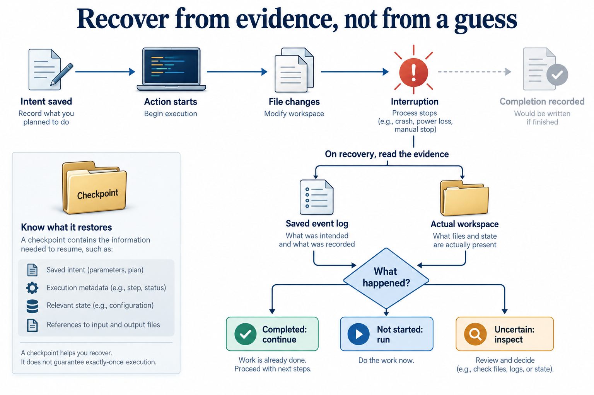

# Resume work without guessing

[Course](../../README.md) · [All lessons](../COURSE-MAP.md) · [Start here](../START-HERE.md) · [Glossary](../GLOSSARY.md)

Theme 5 of 7 · 8 lessons · Original stages 31–38

A long task can outlive a terminal or exhaust its context. Instructions, checkpoints and durable records help it continue. The hard case is an action whose effect happened before its completion record was saved.

*A transcript is not a full workspace backup. Retrying an uncertain external action can duplicate its effect. This figure explains the theme; individual lessons introduce its components gradually.* [Open the full-size figure](../assets/recovery-v1.png).

## Before you start

You can inspect tool outcomes and identify unfinished work. Use [setup](../START-HERE.md) and a disposable learner workspace. Let the coding agent write commands and implementation changes. You predict behavior, inspect results and explain what happened.

## Work through the theme

Interrupt a disposable run at a documented checkpoint. Inspect saved state and the workspace before deciding which action can safely resume.

| Lesson | Runnable snapshot |
|---|---|
| [Step 31 - Project instruction files](step_31_instruction_files/README.md) | [Code and offline test](step_31_instruction_files/) |
| [Step 32 - Context budget](step_32_context_budget/README.md) | [Code and offline test](step_32_context_budget/) |
| [Step 33 - Workspace checkpoints and /undo](step_33_checkpoints/README.md) | [Code and offline test](step_33_checkpoints/) |
| [Step 34 - Durability and recovery](step_34_durability/README.md) | [Code and offline test](step_34_durability/) |
| [Step 35 - Human in the loop](step_35_human_in_the_loop/README.md) | [Code and offline test](step_35_human_in_the_loop/) |
| [Step 36 - Orchestration patterns](step_36_orchestration/README.md) | [Code and offline test](step_36_orchestration/) |
| [Step 37 - Production harness anatomy](step_37_production_anatomy/README.md) | [Code and offline test](step_37_production_anatomy/) |
| [Step 38 - Capstone](step_38_capstone/README.md) | [Code and offline test](step_38_capstone/) |

Read the lessons in this order. Each snapshot has its own files; the agent should run its test from that snapshot's directory. Do not install several versions of the same harness command into one environment at once.

## Run, inspect and explain

Ask the tutor to open the first unfinished lesson, explain its new mechanism and run its offline test. Keep live provider calls separate: confirm the available endpoint, credentials and resource limit before using it. Save a prediction and the actual observation in your learner notes.

Try one controlled change in a copy. Predict its effect before the agent edits it. Re-run the relevant check and compare both outcomes. If a dependency or platform capability is missing, keep the error and use the source explanation until setup is repaired; do not describe that as a successful live run.

## Key takeaways

- Explain how instructions, context, workspace checkpoints, durable state and human decisions contribute to a recoverable capstone.
- A transcript is not a full workspace backup. Retrying an uncertain external action can duplicate its effect.
- Keep an actual trace or test result beside each claim about behavior.

## Check your understanding

A process dies after writing a file but before saving a success event. Should the next process blindly run the write again?

Hint and explanation

First name the object whose behavior you are claiming to know. Then identify the observation that supports that claim.

Inspect the actual file and saved action identity first. Reconcile the observed effect with the intended operation. Whether retry is safe depends on that operation.

## What's next

The next theme asks you to make a run inspectable. Continue to [Make a run inspectable](../06_production/README.md).
