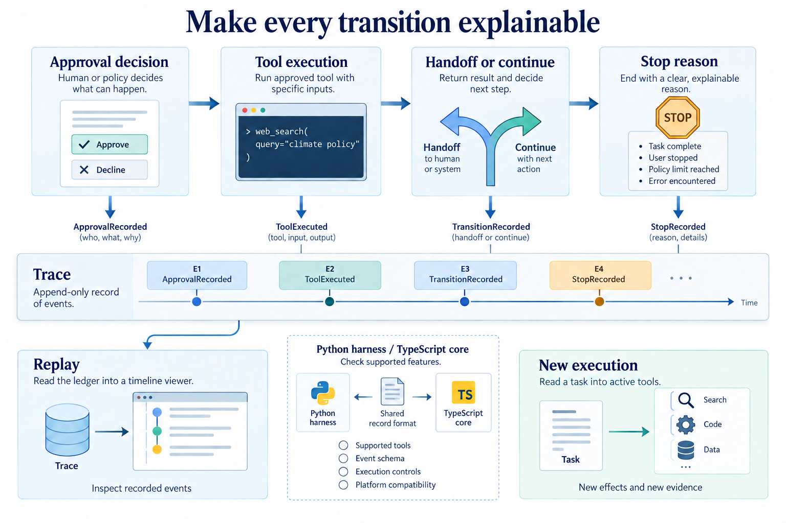

# Make a run inspectable

[Course](../../README.md) · [All lessons](../COURSE-MAP.md) · [Start here](../START-HERE.md) · [Glossary](../GLOSSARY.md)

Theme 6 of 7 · 7 lessons · Original stages 39–45

Production-oriented work needs explicit decisions, stops, handoffs and records that another person can inspect. These lessons add those surfaces to the harness; the word production is a topic, not a readiness certificate.

*Trace replay describes a recorded run. It does not automatically execute tools again or reproduce their effects. This figure explains the theme; individual lessons introduce its components gradually.* [Open the full-size figure](../assets/production-v2.png).

## Before you start

Complete the recovery and capstone theme. Know what the saved state can and cannot restore. Use [setup](../START-HERE.md) and a disposable learner workspace. Let the coding agent write commands and implementation changes. You predict behavior, inspect results and explain what happened.

## Work through the theme

Open a trace and find an approval, tool output and stopping reason. Compare replaying the record with launching a new execution.

| Lesson | Runnable snapshot |
|---|---|
| [Step 39 - Approval modes](step_39_approval_modes/README.md) | [Code and offline test](step_39_approval_modes/) |
| [Step 40 - Handoffs](step_40_handoffs/README.md) | [Code and offline test](step_40_handoffs/) |
| [Step 41 - Stop conditions](step_41_stop_conditions/README.md) | [Code and offline test](step_41_stop_conditions/) |
| [Step 42 - Streaming tool output](step_42_streaming_tool_output/README.md) | [Code and offline test](step_42_streaming_tool_output/) |
| [Step 43 - Extensions](step_43_extensions/README.md) | [Code and offline test](step_43_extensions/) |
| [Step 44 - Replay and trace viewer](step_44_replay_trace/README.md) | [Code and offline test](step_44_replay_trace/) |
| [Step 45 - The core loop in TypeScript](step_45_typescript_core/README.md) | [Code and offline test](step_45_typescript_core/) |

Read the lessons in this order. Each snapshot has its own files; the agent should run its test from that snapshot's directory. Do not install several versions of the same harness command into one environment at once.

## Run, inspect and explain

Ask the tutor to open the first unfinished lesson, explain its new mechanism and run its offline test. Keep live provider calls separate: confirm the available endpoint, credentials and resource limit before using it. Save a prediction and the actual observation in your learner notes.

Try one controlled change in a copy. Predict its effect before the agent edits it. Re-run the relevant check and compare both outcomes. If a dependency or platform capability is missing, keep the error and use the source explanation until setup is repaired; do not describe that as a successful live run.

## Key takeaways

- Explain why a run ended, which agent owned the next action, and how the trace supports the account. Compare the Python implementation with the smaller TypeScript core.
- Trace replay describes a recorded run. It does not automatically execute tools again or reproduce their effects.
- Keep an actual trace or test result beside each claim about behavior.

## Check your understanding

A replay prints the same tool output. Has it reproduced the tool action?

Hint and explanation

First name the object whose behavior you are claiming to know. Then identify the observation that supports that claim.

No. A display of saved events establishes what the record contains. A new execution needs its own inputs, tool actions, checks and resource accounting.

## What's next

The next theme asks you to move the loop behind a service. Continue to [Move the loop behind a service](../07_server/README.md).
