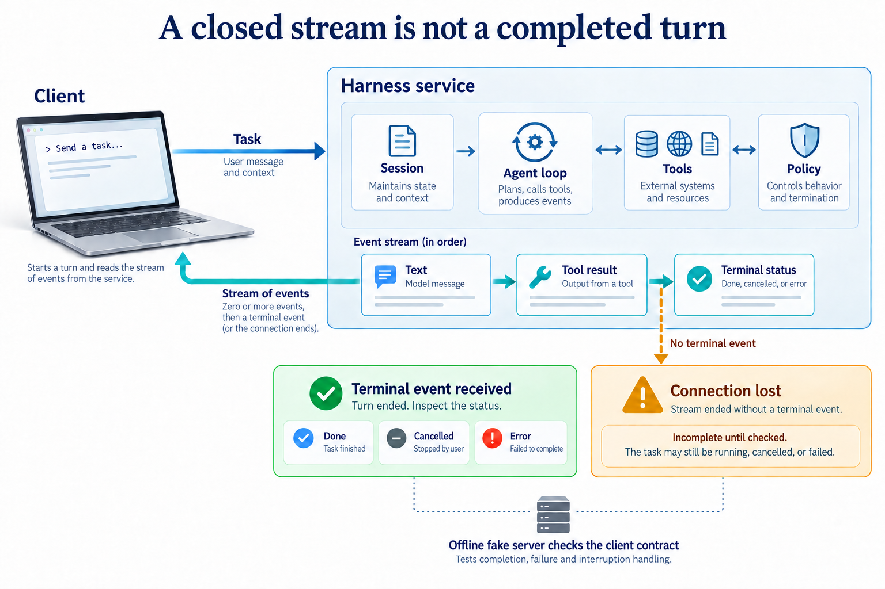

# See how the harness develops

[Original parent tutorial](../README.md) · [Every lesson](../README.md#stage-index)

These eight figures explain mechanisms. Trace one arrow, predict a result, then open the relevant lesson and inspect its actual behavior. The figures are conceptual illustrations, not benchmark results or proof that every displayed control exists in the earliest snapshot.

## The whole course

[Open the overview](assets/overview-v1.png). The seven stations group the original tutorial by mechanism: stages 1–8, stages 9–15, and steps 16–20, 21–30, 31–38, 39–45 and 46–51.

## 1. From a reply to an agent

A model can describe a file without opening it. A tool gives it an observation. A loop lets that observation change its next action. Begin with one request, then make each new action visible.

The early shell and editing examples are teaching mechanisms. They do not yet have the later permission and sandbox controls.

**Explain before running:** The model says it read a file. Which evidence would distinguish a real read from a plausible answer?

[Open stages 1–8 in the parent tutorial](../README.md#stage-1-one-api-call).

## 2. Keep actions within limits

A useful tool can also make an unwanted change. Add controls that answer separate questions: what work is planned, which actions are permitted, where they execute, and what context each worker receives.

An approval rule is not a sandbox. A subagent role is not automatically a separate operating-system boundary.

**Explain before running:** If a user approves a command, does that prove it cannot read outside the project?

[Open stages 9–15 in the parent tutorial](../README.md#stage-9-an-installable-command).

## 3. Separate the harness from its provider

You now know the mechanisms you need. Compare alternative implementations by asking who owns the loop, tool execution, state and approvals. A shared API shape does not guarantee identical behavior.

The repository contains provider-specific examples. Availability, credentials, model support and current SDK compatibility require a live check.

**Explain before running:** Two adapters return the same text. Does that prove they have the same tool and approval behavior?

[Open steps 16–20 in the parent tutorial](../README.md#step-16-claude-agent-sdk).

## 4. Connect tools and observe the work

A loop becomes more useful when it can stream progress, use external tools and coordinate work. More capabilities also create more ways to lose a result or misread a failure. Keep each observation connected to its action.

Browser, desktop, external server and hosted-model exercises need capabilities beyond a fake-model test.

**Explain before running:** A tool stream stops after printing useful text. Can you record the task as successful?

[Open steps 21–30 in the parent tutorial](../README.md#step-21-streaming-and-headless-mode).

## 5. Resume work without guessing

A long task can outlive a terminal or exhaust its context. Instructions, checkpoints and durable records help it continue. The hard case is an action whose effect happened before its completion record was saved.

A transcript is not a full workspace backup. Retrying an uncertain external action can duplicate its effect.

**Explain before running:** A process dies after writing a file but before saving a success event. Should the next process blindly run the write again?

[Open steps 31–38 in the parent tutorial](../README.md#step-31-project-instruction-files).

## 6. Make a run inspectable

Production-oriented work needs explicit decisions, stops, handoffs and records that another person can inspect. These lessons add those surfaces to the harness; the word production is a topic, not a readiness certificate.

Trace replay describes a recorded run. It does not automatically execute tools again or reproduce their effects.

**Explain before running:** A replay prints the same tool output. Has it reproduced the tool action?

[Open steps 39–45 in the parent tutorial](../README.md#step-39-approval-modes).

## 7. Move the loop behind a service

A client can send a task while a service owns the agent loop. This changes where sessions, tools and approvals live. The client must distinguish a completed turn from a connection that merely ended.

A fake server checks the client contract. It does not establish the security, availability or compatibility of a deployed service.

**Explain before running:** The socket closes after some answer text, with no terminal event. Which status should the client claim?

[Open steps 46–51 in the parent tutorial](../README.md#step-46-the-loop-on-trueforge).

The adapter figure shows illustrative ownership arrangements; not every SDK or endpoint follows them. The production figure uses conceptual event labels, not literal names to copy into code. The server figure shows one possible event sequence; a turn can emit different numbers and types of events. Read the actual protocol and trace in the lesson.

[Figure prompts, retained drafts and review notes](../how-did-i-generate-it/harness/visuals/README.md) explain how the images were produced and corrected.
