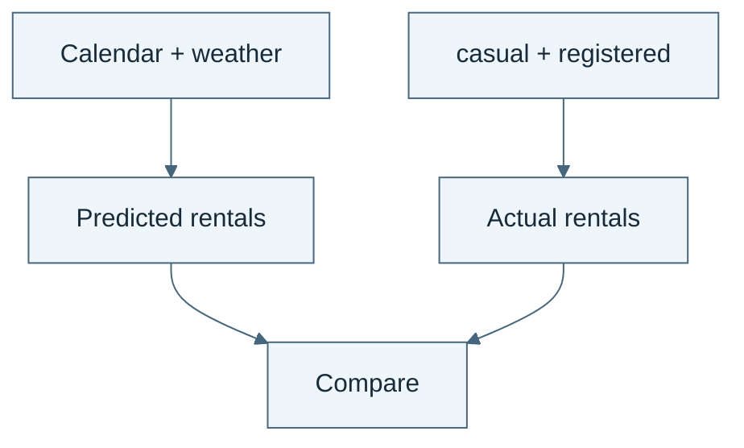

# Technical schematic review gallery

Original Mermaid diagrams. These are not Imagen-generated illustrations.

## 00.01 · Meet the prediction task

*Read the diagram:* Predict the hourly total from allowed inputs. The two component counts already contain the answer.
