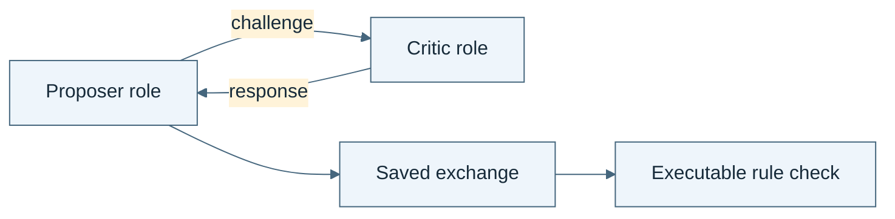

# Technical schematic review gallery

Original Mermaid diagrams. These are not Imagen-generated illustrations.

## 07.07 · Learn what self-play does and does not provide

*Read the diagram:* This role exchange illustrates interaction. It contains no training update and does not establish self-play learning.
