# Technical schematic review gallery

Original Mermaid diagrams. These are not Imagen-generated illustrations.

## 00.01 · Meet the prediction task

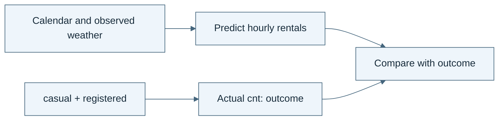

*Read the diagram:* Predict the hourly total from allowed inputs. The two component counts already contain the answer.

## 00.02 · Prepare a workspace you can inspect

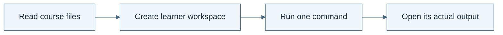

*Read the diagram:* Keep course sources separate from your own work. A command must produce an inspectable artifact.

## 00.03 · Run one baseline

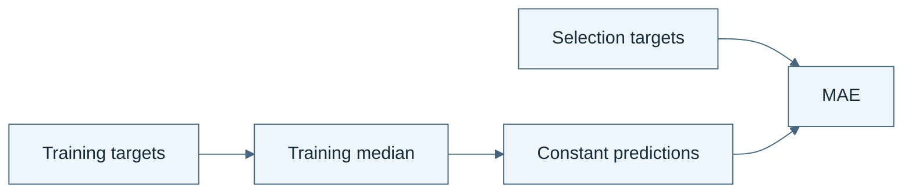

*Read the diagram:* Learn the median from training rows once. Use it to predict every selection row.

## 00.04 · Check the evidence behind the answer

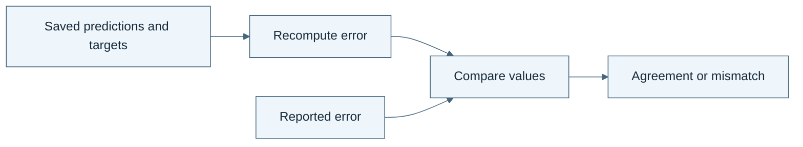

*Read the diagram:* A report is a claim. Prediction rows and a separate calculation let you check that claim.

## 01.01 · Write the data science process

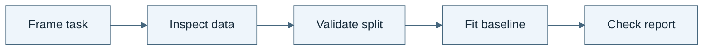

*Read the diagram:* Follow one fixed process. No outer search chooses a new recipe after the result.

## 01.02 · Run the process without changing it

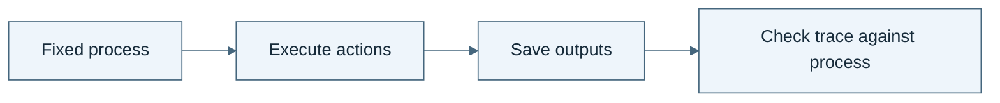

*Read the diagram:* The process becomes evidence only when its actions run and their outputs are retained.

## 01.03 · Turn the process into a skill

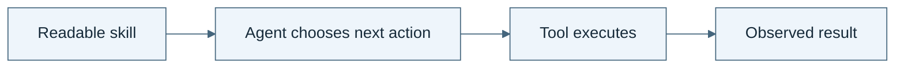

*Read the diagram:* The skill tells the agent how to carry out the process. Tools perform the concrete operations.

## 01.04 · Check outputs with a separate calculation

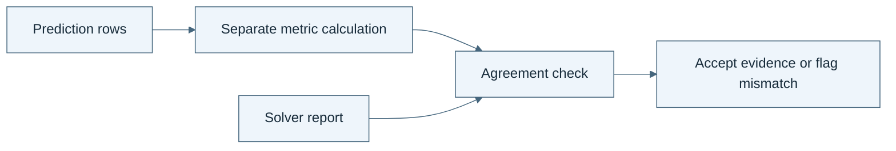

*Read the diagram:* The checker starts from prediction rows. It does not accept the solver’s reported score as its input truth.

## 01.05 · Reuse the skill in a fresh session

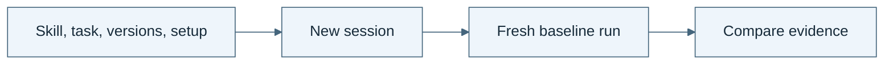

*Read the diagram:* A new session receives saved files. It should not need an unrecorded explanation from the previous chat.

## 02.01 · Let a failure motivate a second attempt

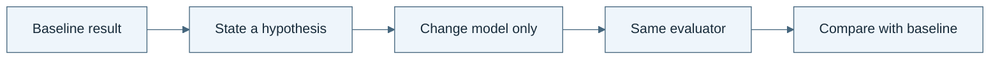

*Read the diagram:* The weak result motivates a specific new candidate. The evaluator stays fixed.

## 02.02 · Give the loop state and a budget

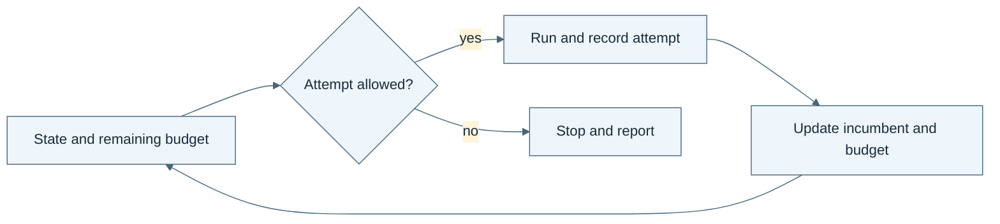

*Read the diagram:* Each admitted attempt spends budget, even when it fails. State determines whether another attempt may start.

## 02.03 · Turn an error into a different action

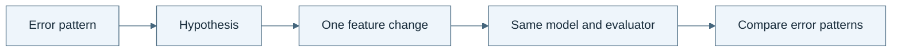

*Read the diagram:* Use an observed error to choose one intervention. Keep other factors fixed to make the comparison interpretable.

## 02.04 · Stop repeated failure and oscillation

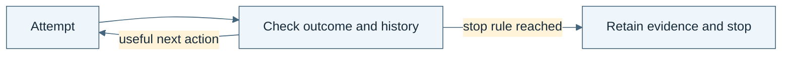

*Read the diagram:* A loop needs a path out. Repeated failure, oscillation, or exhausted budget can trigger the declared stop rule.

## 02.05 · Resume without losing the experiment

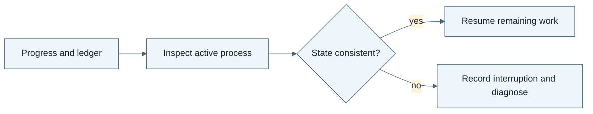

*Read the diagram:* Resume from recorded state only after reconciling unfinished work. Starting again must not erase spent attempts.

## 02.06 · Compare two ways to spend the same attempts

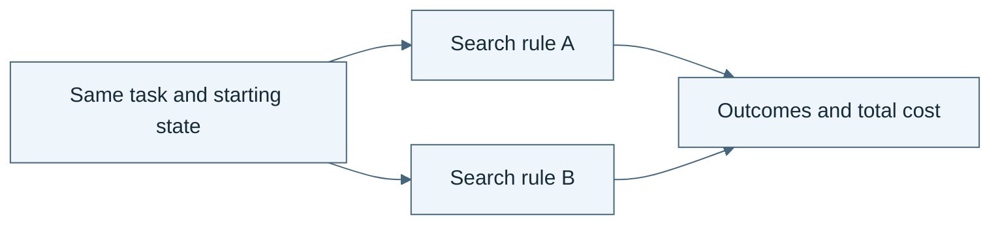

*Read the diagram:* Both search rules start from the same conditions and receive the same total attempt allowance.

## 03.01 · Draw the dependencies

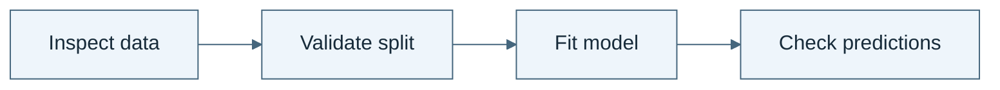

*Read the diagram:* An arrow is a prerequisite: the destination needs the source to finish first.

## 03.02 · Route different failures differently

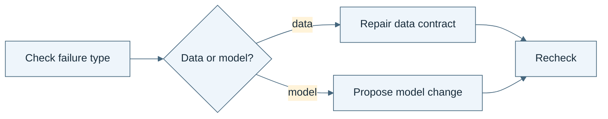

*Read the diagram:* Different failures require different routes. A data problem should not trigger an expensive model search.

## 03.03 · Join independent checks

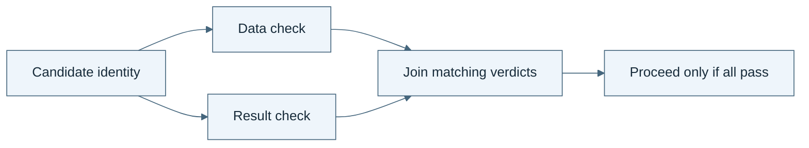

*Read the diagram:* A join waits for all required checks on the same candidate. An old pass for another candidate cannot fill the gap.

## 03.04 · Put a bounded retry inside the graph

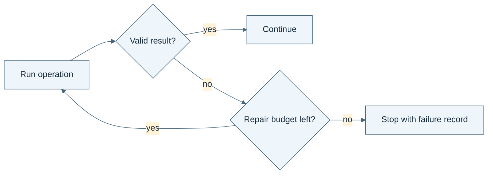

*Read the diagram:* The retry cycle has a limit. Its failure path is part of the graph.

## 03.05 · Resume only the affected work

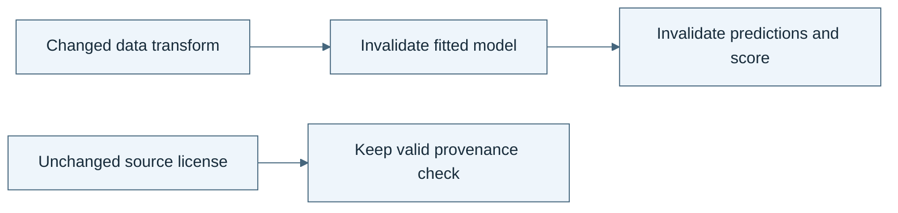

*Read the diagram:* Changing an upstream artifact invalidates its descendants. Unaffected independent work can remain valid.

## 03.06 · Read the plan, data flow, and trace

```mermaid
%%{init: {"theme":"base","themeVariables":{"background":"#ffffff","primaryColor":"#eef5fb","primaryTextColor":"#172b3a","primaryBorderColor":"#45667d","lineColor":"#45667d","secondaryColor":"#fff3d9","tertiaryColor":"#e9f6f0","fontFamily":"Arial"}}}%%
flowchart LR
A["One workflow"] --> B["Plan: what may run"]
A --> C["Data flow: what each action needs"]
A --> D["Trace: what actually ran"]
```

*Read the diagram:* Three views answer different questions. A drawn branch does not prove that branch ran.

## 04.01 · Name the objects in an experiment

```mermaid
%%{init: {"theme":"base","themeVariables":{"background":"#ffffff","primaryColor":"#eef5fb","primaryTextColor":"#172b3a","primaryBorderColor":"#45667d","lineColor":"#45667d","secondaryColor":"#fff3d9","tertiaryColor":"#e9f6f0","fontFamily":"Arial"}}}%%
flowchart LR
A["Dataset version"] -->|input to| B["Candidate recipe"]
B -->|executed in| C["Run"]
C -->|produces| D["Predictions and metric"]
```

*Read the diagram:* Name distinct objects before relating them. A dataset, a candidate, and a run are not interchangeable.

## 04.02 · Connect data, models, and evidence

```mermaid
%%{init: {"theme":"base","themeVariables":{"background":"#ffffff","primaryColor":"#eef5fb","primaryTextColor":"#172b3a","primaryBorderColor":"#45667d","lineColor":"#45667d","secondaryColor":"#fff3d9","tertiaryColor":"#e9f6f0","fontFamily":"Arial"}}}%%
flowchart LR
A["Candidate"] -->|trained on| B["Training partition"]
A -->|evaluated on| C["Selection partition"]
D["Score"] -->|measures| A
D -->|uses metric| E["MAE"]
```

*Read the diagram:* These arrows describe meaning and provenance. They are not a schedule of commands.

## 04.03 · State rules that must always hold

```mermaid
%%{init: {"theme":"base","themeVariables":{"background":"#ffffff","primaryColor":"#eef5fb","primaryTextColor":"#172b3a","primaryBorderColor":"#45667d","lineColor":"#45667d","secondaryColor":"#fff3d9","tertiaryColor":"#e9f6f0","fontFamily":"Arial"}}}%%
flowchart LR
A["Transform"] -->|must fit on| B["Training rows"]
C["Proposed fit on final rows"] --> D["Rule check"] --> E["Reject contradiction"]
```

*Read the diagram:* A rule constrains a relation. Training a transform on final data violates the declared experiment meaning.

## 04.04 · Catch a plausible but invalid experiment

```mermaid
%%{init: {"theme":"base","themeVariables":{"background":"#ffffff","primaryColor":"#eef5fb","primaryTextColor":"#172b3a","primaryBorderColor":"#45667d","lineColor":"#45667d","secondaryColor":"#fff3d9","tertiaryColor":"#e9f6f0","fontFamily":"Arial"}}}%%
flowchart LR
A["Readable facts"] --> B["Check relations against rules"]
B --> C["Target-derived input"]
B --> D["Final data used for training or selection"]
C --> E["Explain and reject"]
D --> E
```

*Read the diagram:* A syntactically valid table can describe an invalid experiment. Meaning rules expose the contradiction.

## 04.05 · Change a definition without losing its consequences

```mermaid
%%{init: {"theme":"base","themeVariables":{"background":"#ffffff","primaryColor":"#eef5fb","primaryTextColor":"#172b3a","primaryBorderColor":"#45667d","lineColor":"#45667d","secondaryColor":"#fff3d9","tertiaryColor":"#e9f6f0","fontFamily":"Arial"}}}%%
flowchart LR
A["Definition v1"] --> B["Recorded experiment v1"]
A -->|explicit revision| C["Definition v2"] --> D["Update dependent checks"] --> E["New experiment v2"]
```

*Read the diagram:* A changed definition propagates to the checks and reports that depend on it. Keep the earlier version interpretable.

## 05.01 · Combine fixed components into a useful system

```mermaid
%%{init: {"theme":"base","themeVariables":{"background":"#ffffff","primaryColor":"#eef5fb","primaryTextColor":"#172b3a","primaryBorderColor":"#45667d","lineColor":"#45667d","secondaryColor":"#fff3d9","tertiaryColor":"#e9f6f0","fontFamily":"Arial"}}}%%
flowchart LR
A["Task skill"] --> B["Domain check"] --> C["ML tool"] --> D["Result checker"] --> E["Report"]
```

*Read the diagram:* Fixed components coordinate one valid experiment. A domain check can stop an invalid request before fitting.

## 05.02 · Choose a skill for the task

```mermaid
%%{init: {"theme":"base","themeVariables":{"background":"#ffffff","primaryColor":"#eef5fb","primaryTextColor":"#172b3a","primaryBorderColor":"#45667d","lineColor":"#45667d","secondaryColor":"#fff3d9","tertiaryColor":"#e9f6f0","fontFamily":"Arial"}}}%%
flowchart LR
A["Task brief"] --> B{"Target type"}
B -->|count| C["Regression with MAE"]
B -->|binary label| D["Classification with balanced accuracy"]
B -->|unknown| E["Ask for a valid contract"]
```

*Read the diagram:* Routing selects an existing procedure appropriate to the task. It does not learn a new procedure.

## 05.03 · Retrieve what matters and retain task state

```mermaid
%%{init: {"theme":"base","themeVariables":{"background":"#ffffff","primaryColor":"#eef5fb","primaryTextColor":"#172b3a","primaryBorderColor":"#45667d","lineColor":"#45667d","secondaryColor":"#fff3d9","tertiaryColor":"#e9f6f0","fontFamily":"Arial"}}}%%
flowchart LR
A["Scoped experience"] --> B["Retrieve for current task"] --> C["Current decision"]
D["Current ledger and budget"] --> C
```

*Read the diagram:* Retrieve relevant reusable knowledge, but initialize current state from the active task.

## 05.04 · Coordinate planning, execution, and checking

```mermaid
%%{init: {"theme":"base","themeVariables":{"background":"#ffffff","primaryColor":"#eef5fb","primaryTextColor":"#172b3a","primaryBorderColor":"#45667d","lineColor":"#45667d","secondaryColor":"#fff3d9","tertiaryColor":"#e9f6f0","fontFamily":"Arial"}}}%%
flowchart LR
A["Planner: propose action"] --> B["Executor: perform action"] --> C["Checker: inspect evidence"] --> D["Record decision"]
```

*Read the diagram:* Planning, execution, and checking have different responsibilities. Separate boxes alone do not enforce separate access.

## 05.05 · Find which component makes the difference

```mermaid
%%{init: {"theme":"base","themeVariables":{"background":"#ffffff","primaryColor":"#eef5fb","primaryTextColor":"#172b3a","primaryBorderColor":"#45667d","lineColor":"#45667d","secondaryColor":"#fff3d9","tertiaryColor":"#e9f6f0","fontFamily":"Arial"}}}%%
flowchart LR
A["Same cases and budget"] --> B["Full system"]
A --> C["System minus one component"]
B --> D["Compare outcomes and costs"]
C --> D
```

*Read the diagram:* An ablation removes one component under matched conditions. Its effect may depend on the other components.

## 06.01 · Describe the harness you need

```mermaid
%%{init: {"theme":"base","themeVariables":{"background":"#ffffff","primaryColor":"#eef5fb","primaryTextColor":"#172b3a","primaryBorderColor":"#45667d","lineColor":"#45667d","secondaryColor":"#fff3d9","tertiaryColor":"#e9f6f0","fontFamily":"Arial"}}}%%
flowchart LR
A["Task, data, metric, split"] --> C["Readable harness brief"]
B["Budget, outputs, refusals"] --> C
C --> D["Resolve scientific ambiguity"]
```

*Read the diagram:* The brief fixes scientific choices and required behavior. The builder supplies implementation details.

## 06.02 · Generate a first harness

```mermaid
%%{init: {"theme":"base","themeVariables":{"background":"#ffffff","primaryColor":"#eef5fb","primaryTextColor":"#172b3a","primaryBorderColor":"#45667d","lineColor":"#45667d","secondaryColor":"#fff3d9","tertiaryColor":"#e9f6f0","fontFamily":"Arial"}}}%%
flowchart LR
A["Brief"] --> B["Builder skill: meta-harness"] --> C["Generated harness"] --> D["Actual baseline run"] --> E["Checked evidence"]
```

*Read the diagram:* The builder produces the harness. The harness then runs the task. These are different objects.

## 06.03 · Inspect what the builder decided

```mermaid
%%{init: {"theme":"base","themeVariables":{"background":"#ffffff","primaryColor":"#eef5fb","primaryTextColor":"#172b3a","primaryBorderColor":"#45667d","lineColor":"#45667d","secondaryColor":"#fff3d9","tertiaryColor":"#e9f6f0","fontFamily":"Arial"}}}%%
flowchart LR
A["Brief requirement"] --> B["Generated implementation"] --> C["Executed check"]
C --> D["Satisfied or unresolved"]
```

*Read the diagram:* Trace each important requirement to implementation and then to observed behavior.

## 06.04 · Test the generated harness’s boundaries

```mermaid
%%{init: {"theme":"base","themeVariables":{"background":"#ffffff","primaryColor":"#eef5fb","primaryTextColor":"#172b3a","primaryBorderColor":"#45667d","lineColor":"#45667d","secondaryColor":"#fff3d9","tertiaryColor":"#e9f6f0","fontFamily":"Arial"}}}%%
flowchart LR
A["Current request and identity"] --> B["Check contract and budget"]
B -->|valid| C["Fit and verify"]
B -->|invalid| D["Refuse before extra fit"]
```

*Read the diagram:* A boundary is demonstrated by a meaningful refusal tied to the current request.

## 06.05 · Generate a classification harness

```mermaid
%%{init: {"theme":"base","themeVariables":{"background":"#ffffff","primaryColor":"#eef5fb","primaryTextColor":"#172b3a","primaryBorderColor":"#45667d","lineColor":"#45667d","secondaryColor":"#fff3d9","tertiaryColor":"#e9f6f0","fontFamily":"Arial"}}}%%
flowchart LR
A["Unchanged builder"] --> B["Bike harness: MAE"]
A --> C["Wine harness: balanced accuracy"]
D["Different task briefs"] --> A
```

*Read the diagram:* A fixed builder can generate different task-specific systems. Different output does not mean the builder learned.

## 06.06 · Recreate and compare generated harnesses

```mermaid
%%{init: {"theme":"base","themeVariables":{"background":"#ffffff","primaryColor":"#eef5fb","primaryTextColor":"#172b3a","primaryBorderColor":"#45667d","lineColor":"#45667d","secondaryColor":"#fff3d9","tertiaryColor":"#e9f6f0","fontFamily":"Arial"}}}%%
flowchart LR
A["Brief, builder, code, data, versions"] --> B["Clean output folder"] --> C["Execute baseline and refusal"] --> D["Compare behavior"]
```

*Read the diagram:* Recreate behavior from saved inputs and dependencies. Generated source need not be byte-identical to satisfy the same contract.

## 07.01 · Correct one result

```mermaid
%%{init: {"theme":"base","themeVariables":{"background":"#ffffff","primaryColor":"#eef5fb","primaryTextColor":"#172b3a","primaryBorderColor":"#45667d","lineColor":"#45667d","secondaryColor":"#fff3d9","tertiaryColor":"#e9f6f0","fontFamily":"Arial"}}}%%
flowchart LR
A["Current wrong result"] --> B["Check and correct"] --> C["Corrected current result"]
```

*Read the diagram:* Correction repairs the current output. It need not create a lasting instruction for future tasks.

## 07.02 · Test a reflection before trusting it

```mermaid
%%{init: {"theme":"base","themeVariables":{"background":"#ffffff","primaryColor":"#eef5fb","primaryTextColor":"#172b3a","primaryBorderColor":"#45667d","lineColor":"#45667d","secondaryColor":"#fff3d9","tertiaryColor":"#e9f6f0","fontFamily":"Arial"}}}%%
flowchart LR
A["Failure trace"] --> B["Proposed explanation"] --> C["Counterexample test"] --> D["Scoped lesson or rejection"]
```

*Read the diagram:* A reflection is a hypothesis about the failure. Test it before treating it as a reliable lesson.

## 07.03 · Retain and use a lesson

```mermaid
%%{init: {"theme":"base","themeVariables":{"background":"#ffffff","primaryColor":"#eef5fb","primaryTextColor":"#172b3a","primaryBorderColor":"#45667d","lineColor":"#45667d","secondaryColor":"#fff3d9","tertiaryColor":"#e9f6f0","fontFamily":"Arial"}}}%%
flowchart LR
A["Prior experience"] --> B["Retained lesson"] --> C["Later decision uses lesson"] --> D["Evaluate later outcome"]
```

*Read the diagram:* Persistent learning requires a retained change that is used later. Use and benefit are separate checks.

## 07.04 · Improve a task skill with a fixed procedure

```mermaid
%%{init: {"theme":"base","themeVariables":{"background":"#ffffff","primaryColor":"#eef5fb","primaryTextColor":"#172b3a","primaryBorderColor":"#45667d","lineColor":"#45667d","secondaryColor":"#fff3d9","tertiaryColor":"#e9f6f0","fontFamily":"Arial"}}}%%
flowchart LR
A["Fixed improvement procedure"] --> B["Task skill v1"]
A --> C["Task skill v2"]
B --> D["Matched task comparison"]
C --> D
```

*Read the diagram:* The task skill changes while its updater stays fixed. This is not yet an inherited change to the updater.

## 07.05 · Let work reorganize under local rules

```mermaid
%%{init: {"theme":"base","themeVariables":{"background":"#ffffff","primaryColor":"#eef5fb","primaryTextColor":"#172b3a","primaryBorderColor":"#45667d","lineColor":"#45667d","secondaryColor":"#fff3d9","tertiaryColor":"#e9f6f0","fontFamily":"Arial"}}}%%
flowchart LR
A["Work and local routing rules"] --> B["Initial assignments"] --> C["Changed assignments"] --> D["Measure resulting behavior"]
```

*Read the diagram:* Local assignment rules can change who does which work. Reorganization alone does not establish a performance gain.

## 07.06 · Observe a collective pattern

```mermaid
%%{init: {"theme":"base","themeVariables":{"background":"#ffffff","primaryColor":"#eef5fb","primaryTextColor":"#172b3a","primaryBorderColor":"#45667d","lineColor":"#45667d","secondaryColor":"#fff3d9","tertiaryColor":"#e9f6f0","fontFamily":"Arial"}}}%%
flowchart LR
A["Local rules"] --> B["Repeated interactions"] --> C["Collective pattern"] --> D["Separate usefulness check"]
```

*Read the diagram:* A collective pattern can arise from local interactions. Observing the pattern is different from measuring useful improvement.

## 07.07 · Learn what self-play does and does not provide

```mermaid
%%{init: {"theme":"base","themeVariables":{"background":"#ffffff","primaryColor":"#eef5fb","primaryTextColor":"#172b3a","primaryBorderColor":"#45667d","lineColor":"#45667d","secondaryColor":"#fff3d9","tertiaryColor":"#e9f6f0","fontFamily":"Arial"}}}%%
flowchart LR
A["Role A"] -->|challenge| B["Role B"]
B -->|response| A
A --> C["Retained experience"] --> D["Fresh external task check"]
```

*Read the diagram:* Self-play supplies interactions or challenges. Transfer still needs an evaluation outside those interactions.

## 07.08 · Make a self-modification inspectable

```mermaid
%%{init: {"theme":"base","themeVariables":{"background":"#ffffff","primaryColor":"#eef5fb","primaryTextColor":"#172b3a","primaryBorderColor":"#45667d","lineColor":"#45667d","secondaryColor":"#fff3d9","tertiaryColor":"#e9f6f0","fontFamily":"Arial"}}}%%
flowchart LR
A["Parent component"] --> B["Proposed modification"] --> C["Execute and check"]
C -->|passes rule| D["Retain child"]
C -->|fails rule| E["Keep parent and failure"]
```

*Read the diagram:* Self-modification changes a component. Keep its parent and evaluate the change before retaining it.

## 08.01 · Distinguish a result from a reliable comparison

```mermaid
%%{init: {"theme":"base","themeVariables":{"background":"#ffffff","primaryColor":"#eef5fb","primaryTextColor":"#172b3a","primaryBorderColor":"#45667d","lineColor":"#45667d","secondaryColor":"#fff3d9","tertiaryColor":"#e9f6f0","fontFamily":"Arial"}}}%%
flowchart LR
A["Prespecified comparison"] --> B["Repeated matched runs"] --> C["All outcomes"] --> D["Difference and uncertainty"]
```

*Read the diagram:* A repeated comparison reveals variation. One favorable run cannot establish a reliable advantage.

## 08.02 · Freeze selection before final evaluation

```mermaid
%%{init: {"theme":"base","themeVariables":{"background":"#ffffff","primaryColor":"#eef5fb","primaryTextColor":"#172b3a","primaryBorderColor":"#45667d","lineColor":"#45667d","secondaryColor":"#fff3d9","tertiaryColor":"#e9f6f0","fontFamily":"Arial"}}}%%
flowchart LR
A["Training"] --> B["Selection search"] --> C["Freeze chosen recipe"] --> D["Final evaluation"] --> E["Report once"]
```

*Read the diagram:* Freeze selection before final evaluation. Final feedback does not flow back into ordinary selection.

## 08.03 · Count the cost of research

```mermaid
%%{init: {"theme":"base","themeVariables":{"background":"#ffffff","primaryColor":"#eef5fb","primaryTextColor":"#172b3a","primaryBorderColor":"#45667d","lineColor":"#45667d","secondaryColor":"#fff3d9","tertiaryColor":"#e9f6f0","fontFamily":"Arial"}}}%%
flowchart LR
A["Proposal cost"] --> E["Total research cost"]
B["Execution cost"] --> E
C["Evaluation cost"] --> E
D["Retries and failures"] --> E
```

*Read the diagram:* Research cost includes proposing, running, checking, and failed work. Fit time is only one component.

## 08.04 · Separate the effects of memory and procedure changes

```mermaid
%%{init: {"theme":"base","themeVariables":{"background":"#ffffff","primaryColor":"#eef5fb","primaryTextColor":"#172b3a","primaryBorderColor":"#45667d","lineColor":"#45667d","secondaryColor":"#fff3d9","tertiaryColor":"#e9f6f0","fontFamily":"Arial"}}}%%
flowchart LR
A["Same task and resources"] --> B["Original procedure, no memory"]
A --> C["Original procedure, memory"]
A --> D["New procedure, no memory"]
A --> E["New procedure, memory"]
```

*Read the diagram:* The four conditions separate memory and procedure changes. They also reveal whether the changes interact.

## 08.05 · Test whether the lesson transfers

```mermaid
%%{init: {"theme":"base","themeVariables":{"background":"#ffffff","primaryColor":"#eef5fb","primaryTextColor":"#172b3a","primaryBorderColor":"#45667d","lineColor":"#45667d","secondaryColor":"#fff3d9","tertiaryColor":"#e9f6f0","fontFamily":"Arial"}}}%%
flowchart LR
A["Development experience"] --> B["Freeze retained change"] --> C["Prespecified transfer task"] --> D["Scoped transfer claim"]
```

*Read the diagram:* Freeze the learned change before testing a new task. New-task feedback must not silently tune the candidate being evaluated.

## 08.06 · Reject a misleading win and roll back

```mermaid
%%{init: {"theme":"base","themeVariables":{"background":"#ffffff","primaryColor":"#eef5fb","primaryTextColor":"#172b3a","primaryBorderColor":"#45667d","lineColor":"#45667d","secondaryColor":"#fff3d9","tertiaryColor":"#e9f6f0","fontFamily":"Arial"}}}%%
flowchart LR
A["Apparent winning candidate"] --> B["Check validity and retention rule"]
B -->|valid improvement| C["Promote"]
B -->|invalid or worse| D["Retain parent and rejection"]
```

*Read the diagram:* A lower reported error does not override invalid evidence. Rollback preserves both the parent and the rejected record.

## 09.01 · Identify the solver, improver, and evaluator

```mermaid
%%{init: {"theme":"base","themeVariables":{"background":"#ffffff","primaryColor":"#eef5fb","primaryTextColor":"#172b3a","primaryBorderColor":"#45667d","lineColor":"#45667d","secondaryColor":"#fff3d9","tertiaryColor":"#e9f6f0","fontFamily":"Arial"}}}%%
flowchart LR
A["Improver"] -->|revises| B["Solver skill"]
B -->|proposes| C["ML candidate"]
C --> D["Fixed evaluator"]
D -->|development evidence| A
```

*Read the diagram:* The solver proposes task experiments. The improver changes that solver procedure. The evaluator measures outcomes.

## 09.02 · Run repeated improvement with an unchanged improver

```mermaid
%%{init: {"theme":"base","themeVariables":{"background":"#ffffff","primaryColor":"#eef5fb","primaryTextColor":"#172b3a","primaryBorderColor":"#45667d","lineColor":"#45667d","secondaryColor":"#fff3d9","tertiaryColor":"#e9f6f0","fontFamily":"Arial"}}}%%
flowchart LR
A["Fixed improver v0"] --> B["Solver v1"]
A --> C["Solver v2"]
A --> D["Solver v3"]
```

*Read the diagram:* Many solver revisions can come from one unchanged improver. Iteration count does not establish recursion in the improver.

## 09.03 · Propose a change to the improver

```mermaid
%%{init: {"theme":"base","themeVariables":{"background":"#ffffff","primaryColor":"#eef5fb","primaryTextColor":"#172b3a","primaryBorderColor":"#45667d","lineColor":"#45667d","secondaryColor":"#fff3d9","tertiaryColor":"#e9f6f0","fontFamily":"Arial"}}}%%
flowchart LR
A["Observed improver failure"] --> B["Revision hypothesis"] --> C["Improver v1"]
D["Improver v0 preserved"] --> C
```

*Read the diagram:* An improver revision is a proposal about how to improve later work. It still needs inheritance and evaluation.

## 09.04 · Use the revised improver in the next round

```mermaid
%%{init: {"theme":"base","themeVariables":{"background":"#ffffff","primaryColor":"#eef5fb","primaryTextColor":"#172b3a","primaryBorderColor":"#45667d","lineColor":"#45667d","secondaryColor":"#fff3d9","tertiaryColor":"#e9f6f0","fontFamily":"Arial"}}}%%
flowchart LR
A["Improver v1 and hash"] --> B["Later round loads v1"] --> C["Changed instruction executes"] --> D["Trace and decision"]
```

*Read the diagram:* A later round must read the revised improver and execute an action it requires. A saved file alone is insufficient.

## 09.05 · Measure whether the revised improver helps

```mermaid
%%{init: {"theme":"base","themeVariables":{"background":"#ffffff","primaryColor":"#eef5fb","primaryTextColor":"#172b3a","primaryBorderColor":"#45667d","lineColor":"#45667d","secondaryColor":"#fff3d9","tertiaryColor":"#e9f6f0","fontFamily":"Arial"}}}%%
flowchart LR
A["Matched starting solver and tasks"] --> B["Old improver"]
A --> C["Revised improver"]
B --> D["Resulting solver improvement and total cost"]
C --> D
```

*Read the diagram:* Compare the improvements produced by the two improvers from matched starts. Do not compare only their instruction text.

## 09.06 · Run bounded recursive generations

```mermaid
%%{init: {"theme":"base","themeVariables":{"background":"#ffffff","primaryColor":"#eef5fb","primaryTextColor":"#172b3a","primaryBorderColor":"#45667d","lineColor":"#45667d","secondaryColor":"#fff3d9","tertiaryColor":"#e9f6f0","fontFamily":"Arial"}}}%%
flowchart LR
A["Generation 0"] --> B["Propose revised improver"] --> C["Check and compare"]
C -->|retain| D["Generation 1 inherits revision"]
C -->|reject or budget spent| E["Keep parent and stop"]
```

*Read the diagram:* Each generation retains lineage and passes the declared checks. A failed revision can end the chain or keep the parent.

## 09.07 · State the result without overstating it

```mermaid
%%{init: {"theme":"base","themeVariables":{"background":"#ffffff","primaryColor":"#eef5fb","primaryTextColor":"#172b3a","primaryBorderColor":"#45667d","lineColor":"#45667d","secondaryColor":"#fff3d9","tertiaryColor":"#e9f6f0","fontFamily":"Arial"}}}%%
flowchart LR
A["Version and execution trace"] --> B["Structural inheritance claim"]
C["Matched improver comparison"] --> D["Effectiveness claim"]
E["Comparable rates across generations"] --> F["Acceleration claim"]
```

*Read the diagram:* Each claim needs its own evidence. Structural inheritance does not by itself establish benefit or acceleration.

## 10.01 · Use a framework without turning it into a ladder

```mermaid
%%{init: {"theme":"base","themeVariables":{"background":"#ffffff","primaryColor":"#eef5fb","primaryTextColor":"#172b3a","primaryBorderColor":"#45667d","lineColor":"#45667d","secondaryColor":"#fff3d9","tertiaryColor":"#e9f6f0","fontFamily":"Arial"}}}%%
flowchart LR
A["Observed artifacts"] --> C["Classify with stated criteria"]
B["Source definitions"] --> C
C --> D["Supported label and missing evidence"]
```

*Read the diagram:* Apply each source’s definitions to actual artifacts. Equal level numbers from different frameworks need not mean the same thing.

## 10.02 · Audit a frontier announcement

```mermaid
%%{init: {"theme":"base","themeVariables":{"background":"#ffffff","primaryColor":"#eef5fb","primaryTextColor":"#172b3a","primaryBorderColor":"#45667d","lineColor":"#45667d","secondaryColor":"#fff3d9","tertiaryColor":"#e9f6f0","fontFamily":"Arial"}}}%%
flowchart LR
A["Announcement"] --> B["Primary source and date"] --> C["Method and artifacts"] --> D["Verified claim or explicit gap"]
```

*Read the diagram:* Follow a claim back to its original evidence. A social announcement and a reproduced experiment are different endpoints.

## 10.03 · Choose experiments that reduce uncertainty

```mermaid
%%{init: {"theme":"base","themeVariables":{"background":"#ffffff","primaryColor":"#eef5fb","primaryTextColor":"#172b3a","primaryBorderColor":"#45667d","lineColor":"#45667d","secondaryColor":"#fff3d9","tertiaryColor":"#e9f6f0","fontFamily":"Arial"}}}%%
flowchart LR
A["Unknown behavior"] --> B["Discriminating experiment"] --> C["Observed outcome"] --> D["Narrower uncertainty"]
```

*Read the diagram:* Choose an experiment for the uncertainty it can resolve. A likely high score is not always the most informative next observation.

## 10.04 · Verify the outcome, then let the actor write memory

```mermaid
%%{init: {"theme":"base","themeVariables":{"background":"#ffffff","primaryColor":"#eef5fb","primaryTextColor":"#172b3a","primaryBorderColor":"#45667d","lineColor":"#45667d","secondaryColor":"#fff3d9","tertiaryColor":"#e9f6f0","fontFamily":"Arial"}}}%%
flowchart LR
A["Task outcome"] --> B["Verifier verdict"] --> C["Actor writes scoped memory"] --> D["Test memory interpretation"]
```

*Read the diagram:* The verifier checks the outcome. The actor writes memory; the verdict does not approve the wording of that memory.

## 10.05 · Evaluate with memory frozen

```mermaid
%%{init: {"theme":"base","themeVariables":{"background":"#ffffff","primaryColor":"#eef5fb","primaryTextColor":"#172b3a","primaryBorderColor":"#45667d","lineColor":"#45667d","secondaryColor":"#fff3d9","tertiaryColor":"#e9f6f0","fontFamily":"Arial"}}}%%
flowchart LR
A["Frozen memory version"] --> B["Memory condition"]
C["Matched evaluation tasks"] --> B
C --> D["No-memory condition"]
B --> E["Compare outcomes and context limits"]
D --> E
```

*Read the diagram:* Freeze memory before comparing access conditions. Evaluation does not update that memory.

## 10.06 · Separate working state from reusable experience

```mermaid
%%{init: {"theme":"base","themeVariables":{"background":"#ffffff","primaryColor":"#eef5fb","primaryTextColor":"#172b3a","primaryBorderColor":"#45667d","lineColor":"#45667d","secondaryColor":"#fff3d9","tertiaryColor":"#e9f6f0","fontFamily":"Arial"}}}%%
flowchart LR
A["Reusable experience"] --> C["Current decision"]
B["New run state"] --> C
D["Old run state"] --> E["Archive with old run"]
```

*Read the diagram:* Working state belongs to this run. Scoped experience can inform another run without carrying over stale candidate IDs or budgets.

## 10.07 · Build a tree of attempted solutions

```mermaid
%%{init: {"theme":"base","themeVariables":{"background":"#ffffff","primaryColor":"#eef5fb","primaryTextColor":"#172b3a","primaryBorderColor":"#45667d","lineColor":"#45667d","secondaryColor":"#fff3d9","tertiaryColor":"#e9f6f0","fontFamily":"Arial"}}}%%
flowchart LR
A["Measured baseline"] --> B["Measured child 1"]
A --> C["Measured child 2"]
A -.-> D["Unexecuted branch: unknown"]
```

*Read the diagram:* The tree stores attempted descendants and actual outcomes. An unexecuted branch remains unknown.

## 10.08 · Replay only what the history can answer

```mermaid
%%{init: {"theme":"base","themeVariables":{"background":"#ffffff","primaryColor":"#eef5fb","primaryTextColor":"#172b3a","primaryBorderColor":"#45667d","lineColor":"#45667d","secondaryColor":"#fff3d9","tertiaryColor":"#e9f6f0","fontFamily":"Arial"}}}%%
flowchart LR
A["Frozen discovery tree"] --> C["Replay under budget"]
B["Node-order policy"] --> C
C --> D["Known recorded outcome"]
C --> E["Uncovered query: unknown"]
```

*Read the diagram:* Replay can answer only questions covered by recorded work. It does not create new environment outcomes.

## 10.09 · Test the replay winner on fresh work

```mermaid
%%{init: {"theme":"base","themeVariables":{"background":"#ffffff","primaryColor":"#eef5fb","primaryTextColor":"#172b3a","primaryBorderColor":"#45667d","lineColor":"#45667d","secondaryColor":"#fff3d9","tertiaryColor":"#e9f6f0","fontFamily":"Arial"}}}%%
flowchart LR
A["Replay comparison"] --> B["Freeze policy"] --> C["New environment execution"] --> D["Check transfer and total cost"]
```

*Read the diagram:* A policy selected by replay still needs a fresh online check. Discovery and fresh evaluation answer different questions.

## 10.10 · Localize a harness problem

```mermaid
%%{init: {"theme":"base","themeVariables":{"background":"#ffffff","primaryColor":"#eef5fb","primaryTextColor":"#172b3a","primaryBorderColor":"#45667d","lineColor":"#45667d","secondaryColor":"#fff3d9","tertiaryColor":"#e9f6f0","fontFamily":"Arial"}}}%%
flowchart LR
A["Success and failure traces"] --> B["Recurring failure pattern"] --> C["Responsible module"] --> D["Bounded module edit"]
```

*Read the diagram:* Use repeated contrasting traces to localize a failure, then restrict the proposed edit to a declared module.

## 10.11 · Integrate edits and test transfer

```mermaid
%%{init: {"theme":"base","themeVariables":{"background":"#ffffff","primaryColor":"#eef5fb","primaryTextColor":"#172b3a","primaryBorderColor":"#45667d","lineColor":"#45667d","secondaryColor":"#fff3d9","tertiaryColor":"#e9f6f0","fontFamily":"Arial"}}}%%
flowchart LR
A["Module edit A"] --> C["Integrated harness"]
B["Module edit B"] --> C
C --> D["Interaction checks"] --> E["Frozen transfer check"]
```

*Read the diagram:* Two useful edits can conflict when combined. Test the integrated system and its transfer separately.

## 10.12 · Compare agent evolution and improver evolution

```mermaid
%%{init: {"theme":"base","themeVariables":{"background":"#ffffff","primaryColor":"#eef5fb","primaryTextColor":"#172b3a","primaryBorderColor":"#45667d","lineColor":"#45667d","secondaryColor":"#fff3d9","tertiaryColor":"#e9f6f0","fontFamily":"Arial"}}}%%
flowchart LR
A["Parent system"] --> B["Child agent artifact"]
A --> C["Child improvement procedure"]
B --> D["Audit changed object and later use"]
C --> D
```

*Read the diagram:* A lineage must identify what each child changes. Agent changes and changes to the agent’s updater support different claims.

## 10.13 · Inspect an inner ML researcher

```mermaid
%%{init: {"theme":"base","themeVariables":{"background":"#ffffff","primaryColor":"#eef5fb","primaryTextColor":"#172b3a","primaryBorderColor":"#45667d","lineColor":"#45667d","secondaryColor":"#fff3d9","tertiaryColor":"#e9f6f0","fontFamily":"Arial"}}}%%
flowchart LR
A["Fixed researcher skill"] --> B["Propose ML candidate"] --> C["Run and evaluate"] --> D["Update search state"]
D -->|budget remains| B
```

*Read the diagram:* The inner researcher uses a fixed procedure to search ML candidates. Keep its search record and budget visible.

## 10.14 · Improve the inner researcher under a total budget

```mermaid
%%{init: {"theme":"base","themeVariables":{"background":"#ffffff","primaryColor":"#eef5fb","primaryTextColor":"#172b3a","primaryBorderColor":"#45667d","lineColor":"#45667d","secondaryColor":"#fff3d9","tertiaryColor":"#e9f6f0","fontFamily":"Arial"}}}%%
flowchart LR
A["Outer research procedure"] --> B["Revised inner researcher"] --> C["Fresh matched ML tasks"] --> D["Gain and full research cost"]
```

*Read the diagram:* The outer experiment changes the inner researcher. Count the cost of discovering that change as well as its later use.

## 10.15 · Test the ignition claim separately

```mermaid
%%{init: {"theme":"base","themeVariables":{"background":"#ffffff","primaryColor":"#eef5fb","primaryTextColor":"#172b3a","primaryBorderColor":"#45667d","lineColor":"#45667d","secondaryColor":"#fff3d9","tertiaryColor":"#e9f6f0","fontFamily":"Arial"}}}%%
flowchart LR
A["Initial outer change"] --> B["Later improvement work"] --> C["Comparable generations"] --> D["Evidence for or against sustained benefit"]
```

*Read the diagram:* An ignition claim concerns whether improvement can sustain further improvement. It needs a different comparison from one useful outer edit.

## 10.16 · Improve task skills with a fixed pipeline

```mermaid
%%{init: {"theme":"base","themeVariables":{"background":"#ffffff","primaryColor":"#eef5fb","primaryTextColor":"#172b3a","primaryBorderColor":"#45667d","lineColor":"#45667d","secondaryColor":"#fff3d9","tertiaryColor":"#e9f6f0","fontFamily":"Arial"}}}%%
flowchart LR
A["Fixed skill updater"] --> B["Candidate task skill"] --> C["Execute fresh task checks"]
C -->|retain rule passes| D["Active task skill"]
C -->|fails| E["Keep parent"]
```

*Read the diagram:* The fixed pipeline changes a task skill, tests it, and retains only an eligible revision.

## 10.17 · Update the skill updater on a slower schedule

```mermaid
%%{init: {"theme":"base","themeVariables":{"background":"#ffffff","primaryColor":"#eef5fb","primaryTextColor":"#172b3a","primaryBorderColor":"#45667d","lineColor":"#45667d","secondaryColor":"#fff3d9","tertiaryColor":"#e9f6f0","fontFamily":"Arial"}}}%%
flowchart LR
A["Task-skill update history"] --> B["Revise updater at checkpoint"] --> C["Later updater version"] --> D["New task-skill update uses it"]
```

*Read the diagram:* Task skills can change frequently while the updater changes less often. The new updater must govern a later skill revision.

## 10.18 · Turn a limitation into a scientific hypothesis

```mermaid
%%{init: {"theme":"base","themeVariables":{"background":"#ffffff","primaryColor":"#eef5fb","primaryTextColor":"#172b3a","primaryBorderColor":"#45667d","lineColor":"#45667d","secondaryColor":"#fff3d9","tertiaryColor":"#e9f6f0","fontFamily":"Arial"}}}%%
flowchart LR
A["Observed limitation"] --> B["Hypothesis"] --> C["Predicted difference"] --> D["Prespecified experiment"]
```

*Read the diagram:* Turn an observed limitation into a falsifiable hypothesis before changing the experiment.

## 10.19 · Screen ideas and test their contributions

```mermaid
%%{init: {"theme":"base","themeVariables":{"background":"#ffffff","primaryColor":"#eef5fb","primaryTextColor":"#172b3a","primaryBorderColor":"#45667d","lineColor":"#45667d","secondaryColor":"#fff3d9","tertiaryColor":"#e9f6f0","fontFamily":"Arial"}}}%%
flowchart LR
A["Several hypotheses"] --> B["Bounded screening"] --> C["Selected candidate"] --> D["Remove one contribution"] --> E["Compare under same checks"]
```

*Read the diagram:* Screening selects promising ideas. Ablation then asks which part contributes under a controlled comparison.

## 10.20 · Answer a criticism with evidence

```mermaid
%%{init: {"theme":"base","themeVariables":{"background":"#ffffff","primaryColor":"#eef5fb","primaryTextColor":"#172b3a","primaryBorderColor":"#45667d","lineColor":"#45667d","secondaryColor":"#fff3d9","tertiaryColor":"#e9f6f0","fontFamily":"Arial"}}}%%
flowchart LR
A["Research claim"] --> B["Specific criticism"] --> C["Targeted check"] --> D["Evidence-based response"]
```

*Read the diagram:* A criticism leads to a targeted check. The response should cite its result, including a result that weakens the claim.

## 10.21 · Distinguish better discoveries from a better scientist

```mermaid
%%{init: {"theme":"base","themeVariables":{"background":"#ffffff","primaryColor":"#eef5fb","primaryTextColor":"#172b3a","primaryBorderColor":"#45667d","lineColor":"#45667d","secondaryColor":"#fff3d9","tertiaryColor":"#e9f6f0","fontFamily":"Arial"}}}%%
flowchart LR
A["Successive research artifacts"] --> B["Artifact-quality comparison"]
C["Old and revised scientist procedures"] --> D["Matched fresh-task comparison"]
```

*Read the diagram:* Better research outputs and a better research procedure are distinct objects of evaluation.

## 10.22 · Turn a researcher correction into a task

```mermaid
%%{init: {"theme":"base","themeVariables":{"background":"#ffffff","primaryColor":"#eef5fb","primaryTextColor":"#172b3a","primaryBorderColor":"#45667d","lineColor":"#45667d","secondaryColor":"#fff3d9","tertiaryColor":"#e9f6f0","fontFamily":"Arial"}}}%%
flowchart LR
A["Researcher request and correction"] --> B["Executable task"] --> C["Observable rubric"] --> D["Checked discovery example"]
```

*Read the diagram:* A human correction becomes a learning opportunity only after its task, evidence, and acceptance rubric are explicit.

## 10.23 · Adapt the harness to the rubric

```mermaid
%%{init: {"theme":"base","themeVariables":{"background":"#ffffff","primaryColor":"#eef5fb","primaryTextColor":"#172b3a","primaryBorderColor":"#45667d","lineColor":"#45667d","secondaryColor":"#fff3d9","tertiaryColor":"#e9f6f0","fontFamily":"Arial"}}}%%
flowchart LR
A["Fixed model and rubric"] --> B["Parent harness"]
A --> C["Edited harness"]
B --> D["Matched task outcomes"]
C --> D
```

*Read the diagram:* Hold the model fixed while testing a harness edit. Keep the rubric fixed during this comparison.

## 10.24 · See what grouped rewards contribute

```mermaid
%%{init: {"theme":"base","themeVariables":{"background":"#ffffff","primaryColor":"#eef5fb","primaryTextColor":"#172b3a","primaryBorderColor":"#45667d","lineColor":"#45667d","secondaryColor":"#fff3d9","tertiaryColor":"#e9f6f0","fontFamily":"Arial"}}}%%
flowchart LR
A["Labelled reward group"] --> B["Group mean and spread"] --> C["Relative advantages"] --> D["Toy update or zero-variance handling"]
```

*Read the diagram:* The numerical exercise turns a group of rewards into relative advantages. This is not an LLM training run or full GRPO.

## 10.25 · Track model–harness pairs across cycles

```mermaid
%%{init: {"theme":"base","themeVariables":{"background":"#ffffff","primaryColor":"#eef5fb","primaryTextColor":"#172b3a","primaryBorderColor":"#45667d","lineColor":"#45667d","secondaryColor":"#fff3d9","tertiaryColor":"#e9f6f0","fontFamily":"Arial"}}}%%
flowchart LR
A["Model 0, harness 0"] -->|harness change| B["Model 0, harness 1"]
B -->|model update| C["Model 1, harness 1"]
C --> D["Check pair before next cycle"]
```

*Read the diagram:* Track model and harness versions as a pair. Changing either can alter compatibility with the other.

## 10.26 · Read the ScienceBuddy results precisely

```mermaid
%%{init: {"theme":"base","themeVariables":{"background":"#ffffff","primaryColor":"#eef5fb","primaryTextColor":"#172b3a","primaryBorderColor":"#45667d","lineColor":"#45667d","secondaryColor":"#fff3d9","tertiaryColor":"#e9f6f0","fontFamily":"Arial"}}}%%
flowchart LR
A["Paper table or figure"] --> B["Task, split, attempt count, metric"] --> C["Correct scoped comparison"] --> D["Claim and limits"]
```

*Read the diagram:* Read each result with its protocol. Single-attempt accuracy and multi-attempt coverage cannot be exchanged.

## 10.27 · Keep traces, knowledge, and active skills separate

```mermaid
%%{init: {"theme":"base","themeVariables":{"background":"#ffffff","primaryColor":"#eef5fb","primaryTextColor":"#172b3a","primaryBorderColor":"#45667d","lineColor":"#45667d","secondaryColor":"#fff3d9","tertiaryColor":"#e9f6f0","fontFamily":"Arial"}}}%%
flowchart LR
A["Raw execution traces"] --> B["Scoped knowledge store"] --> C["Candidate skill edit"] --> D["Promotion check"]
D -->|accepted| E["Active skill"]
```

*Read the diagram:* Raw traces, a knowledge store, and active instructions have different roles. Rejected instruction edits need not erase the trace.

## 10.28 · Refine a procedure graph

```mermaid
%%{init: {"theme":"base","themeVariables":{"background":"#ffffff","primaryColor":"#eef5fb","primaryTextColor":"#172b3a","primaryBorderColor":"#45667d","lineColor":"#45667d","secondaryColor":"#fff3d9","tertiaryColor":"#e9f6f0","fontFamily":"Arial"}}}%%
flowchart LR
A["Failure trace"] --> B["Bounded graph edit"] --> C["Development checks"] --> D["Freeze selected graph"] --> E["Fresh evaluation"]
```

*Read the diagram:* A procedure graph specifies actions and transitions. Freeze the selected graph before testing it on fresh cases.

## 10.29 · Repair a skill for an experiment-results page

```mermaid
%%{init: {"theme":"base","themeVariables":{"background":"#ffffff","primaryColor":"#eef5fb","primaryTextColor":"#172b3a","primaryBorderColor":"#45667d","lineColor":"#45667d","secondaryColor":"#fff3d9","tertiaryColor":"#e9f6f0","fontFamily":"Arial"}}}%%
flowchart LR
A["Browser action"] --> B["Observed UI outcome"] --> C["Scoped skill repair"] --> D["New execution and check"]
```

*Read the diagram:* Observe an actual page action and its result. A revised GUI skill needs another execution to establish that the repair works.

## 10.30 · Reduce cost without hiding quality loss

```mermaid
%%{init: {"theme":"base","themeVariables":{"background":"#ffffff","primaryColor":"#eef5fb","primaryTextColor":"#172b3a","primaryBorderColor":"#45667d","lineColor":"#45667d","secondaryColor":"#fff3d9","tertiaryColor":"#e9f6f0","fontFamily":"Arial"}}}%%
flowchart LR
A["Candidate harness"] --> B["Measure full cost and quality"] --> C{"Quality floor met?"}
C -->|yes| D["Compare efficiency"]
C -->|no| E["Reject apparent saving"]
```

*Read the diagram:* A cheaper harness is eligible only if it still meets the declared quality requirement.

## 10.31 · Compare harness generation and harness improvement

```mermaid
%%{init: {"theme":"base","themeVariables":{"background":"#ffffff","primaryColor":"#eef5fb","primaryTextColor":"#172b3a","primaryBorderColor":"#45667d","lineColor":"#45667d","secondaryColor":"#fff3d9","tertiaryColor":"#e9f6f0","fontFamily":"Arial"}}}%%
flowchart LR
A["HarnessDev"] --> B["Created or revised agent harness"]
C["Harness-of-Harness"] --> D["Evolving software and evidence"]
E["Fixed agent configuration"] --> D
```

*Read the diagram:* Name the object that changes. In Harness-of-Harness, the developed software changes while the agent configuration remains fixed.

## 10.32 · Compare raw history and summarized memory

```mermaid
%%{init: {"theme":"base","themeVariables":{"background":"#ffffff","primaryColor":"#eef5fb","primaryTextColor":"#172b3a","primaryBorderColor":"#45667d","lineColor":"#45667d","secondaryColor":"#fff3d9","tertiaryColor":"#e9f6f0","fontFamily":"Arial"}}}%%
flowchart LR
A["Original events"] --> B["Raw-history input"]
A --> C["Summary plus later events"]
A --> D["Exact state checker"]
B --> E["Compare answers"]
C --> E
D --> E
```

*Read the diagram:* Both memory representations refer to the same event history. The checker computes truth from the original events.

## 10.33 · Compare action hints and richer observations

```mermaid
%%{init: {"theme":"base","themeVariables":{"background":"#ffffff","primaryColor":"#eef5fb","primaryTextColor":"#172b3a","primaryBorderColor":"#45667d","lineColor":"#45667d","secondaryColor":"#fff3d9","tertiaryColor":"#e9f6f0","fontFamily":"Arial"}}}%%
flowchart LR
A["Same task"] --> B["Hint about next action"]
A --> C["More state information"]
B --> D["Assisted outcomes"]
C --> D
D --> E["Fresh unassisted check"]
```

*Read the diagram:* Action hints and richer observations supply different assistance. Remove help in a separate fresh check.

## 10.34 · Keep model training aligned with its harness

```mermaid
%%{init: {"theme":"base","themeVariables":{"background":"#ffffff","primaryColor":"#eef5fb","primaryTextColor":"#172b3a","primaryBorderColor":"#45667d","lineColor":"#45667d","secondaryColor":"#fff3d9","tertiaryColor":"#e9f6f0","fontFamily":"Arial"}}}%%
flowchart LR
A["Response fixture"] --> B["Fixed parser"] --> C["Mismatch"] --> D["Local correction"] --> E["Rerun parser check"]
```

*Read the diagram:* An otherwise sensible answer can violate a harness interface. The local correction restores compatibility without training model weights.

## 10.35 · Compose changes to data, harness, and model

```mermaid
%%{init: {"theme":"base","themeVariables":{"background":"#ffffff","primaryColor":"#eef5fb","primaryTextColor":"#172b3a","primaryBorderColor":"#45667d","lineColor":"#45667d","secondaryColor":"#fff3d9","tertiaryColor":"#e9f6f0","fontFamily":"Arial"}}}%%
flowchart LR
A["Versioned evidence"] --> B["Scheduler policy"]
B --> C["Data operator"]
B --> D["Harness operator"]
B --> E["Model-state operator"]
C --> F["Fixed external checks"]
D --> F
E --> F
```

*Read the diagram:* The simulation composes typed changes and can revise their schedule. Its synthetic values are not model-training results.

## 10.36 · Diagnose failures with checked reference trajectories

```mermaid
%%{init: {"theme":"base","themeVariables":{"background":"#ffffff","primaryColor":"#eef5fb","primaryTextColor":"#172b3a","primaryBorderColor":"#45667d","lineColor":"#45667d","secondaryColor":"#fff3d9","tertiaryColor":"#e9f6f0","fontFamily":"Arial"}}}%%
flowchart LR
A["Reference trajectory"] --> B["Verify genuine execution"] --> C["Diagnose failed trace"] --> D["Propose skill edit"] --> E["Quality and performance gates"]
```

*Read the diagram:* Check a reference before using it to diagnose failure. A proposed edit must also pass leakage and regression checks.

## 10.37 · Compare systems without flattening their differences

```mermaid
%%{init: {"theme":"base","themeVariables":{"background":"#ffffff","primaryColor":"#eef5fb","primaryTextColor":"#172b3a","primaryBorderColor":"#45667d","lineColor":"#45667d","secondaryColor":"#fff3d9","tertiaryColor":"#e9f6f0","fontFamily":"Arial"}}}%%
flowchart LR
A["Different systems"] --> B["Changed object, feedback, inheritance"] --> C["Evaluation and resources"] --> D["Source-linked comparison"]
```

*Read the diagram:* Compare systems on common questions before comparing scores. Missing evidence stays visible.

## 10.38 · Reason about bottlenecks and acceleration

```mermaid
%%{init: {"theme":"base","themeVariables":{"background":"#ffffff","primaryColor":"#eef5fb","primaryTextColor":"#172b3a","primaryBorderColor":"#45667d","lineColor":"#45667d","secondaryColor":"#fff3d9","tertiaryColor":"#e9f6f0","fontFamily":"Arial"}}}%%
flowchart LR
A["Proposal time"] --> B["Execution time"] --> C["Evaluation time"] --> D["Total time per checked result"]
```

*Read the diagram:* The slow stage limits total speedup. The calculator uses declared synthetic costs, not a forecast.

## 11.01 · Build a harness for a new prediction brief

```mermaid
%%{init: {"theme":"base","themeVariables":{"background":"#ffffff","primaryColor":"#eef5fb","primaryTextColor":"#172b3a","primaryBorderColor":"#45667d","lineColor":"#45667d","secondaryColor":"#fff3d9","tertiaryColor":"#e9f6f0","fontFamily":"Arial"}}}%%
flowchart LR
A["New task brief"] --> B["Generated harness"] --> C["Baseline and invalid request"] --> D["Evidence and peer handoff"]
```

*Read the diagram:* A new scientific brief should produce a runnable system and a meaningful refusal. Files alone are insufficient.

## 11.02 · Run and audit a bounded recursive experiment

```mermaid
%%{init: {"theme":"base","themeVariables":{"background":"#ffffff","primaryColor":"#eef5fb","primaryTextColor":"#172b3a","primaryBorderColor":"#45667d","lineColor":"#45667d","secondaryColor":"#fff3d9","tertiaryColor":"#e9f6f0","fontFamily":"Arial"}}}%%
flowchart LR
A["Prespecified protocol"] --> B["Improver revision"] --> C["Later round uses revision"] --> D["Matched comparison"] --> E["Scoped final claim"]
```

*Read the diagram:* The capstone joins revision, inheritance, and matched evaluation in a bounded experiment.

## 11.03 · Test transfer and portability separately

```mermaid
%%{init: {"theme":"base","themeVariables":{"background":"#ffffff","primaryColor":"#eef5fb","primaryTextColor":"#172b3a","primaryBorderColor":"#45667d","lineColor":"#45667d","secondaryColor":"#fff3d9","tertiaryColor":"#e9f6f0","fontFamily":"Arial"}}}%%
flowchart LR
A["Saved system"] --> B["New task check"]
A --> C["New coding-agent check"]
A --> D["New compute-backend check"]
```

*Read the diagram:* Task transfer, agent portability, and compute portability require different checks. One passing check does not certify the others.

## 11.04 · Audit an unfamiliar RSI claim

```mermaid
%%{init: {"theme":"base","themeVariables":{"background":"#ffffff","primaryColor":"#eef5fb","primaryTextColor":"#172b3a","primaryBorderColor":"#45667d","lineColor":"#45667d","secondaryColor":"#fff3d9","tertiaryColor":"#e9f6f0","fontFamily":"Arial"}}}%%
flowchart LR
A["Unfamiliar RSI claim"] --> B["Primary source and artifacts"] --> C["Alternative explanation"] --> D["Discriminating evidence or unresolved gap"]
```

*Read the diagram:* Audit an unfamiliar claim through its source, artifacts, and strongest alternative explanation.

## 11.05 · Teach the mechanism and defend the evidence

```mermaid
%%{init: {"theme":"base","themeVariables":{"background":"#ffffff","primaryColor":"#eef5fb","primaryTextColor":"#172b3a","primaryBorderColor":"#45667d","lineColor":"#45667d","secondaryColor":"#fff3d9","tertiaryColor":"#e9f6f0","fontFamily":"Arial"}}}%%
flowchart LR
A["Explain the mechanism"] --> B["Show actual evidence"] --> C["Predict a changed case"] --> D["Defend the claim and its limit"]
```

*Read the diagram:* Teach-back connects the mechanism to an observation and then to a new case. Repeating vocabulary is not enough.
