# Illustrations for the RSI course

Forty-six selected illustrations were produced on 20 September 2026 with the built-in image-generation tool. The user [approved this alternative](../GENERATOR-DECISION.md) to the original Imagen preference. The tool returns the image and an output hint but no model identifier. These assets are not labelled Imagen-generated. The [student visual guide](../../../../rsi/VISUAL-GUIDE.md) shows only the selected figures and links back to their lessons and maps.

All seventy-six generated versions are retained. The [manifest](MANIFEST.csv) records each PNG, exact prompt, original output filename, dimensions, byte count, SHA-256, and selected course copy. The [manifest source](../../scripts/build-illustration-manifest.mjs) verifies that selected copies match. The course publisher embeds selected assets through [the illustration map](../../scripts/lesson-illustrations.mjs), so rebuilding lessons preserves them. The [visual-guide publisher](../../scripts/build-visual-guide.mjs) generates the student companion from the same reviewed captions.

These are conceptual explanations, not empirical result figures. Numerical plots remain separate and use recorded experiment data. Each course embed has descriptive alternative text, a caption, and a full-size link. The corresponding precise step diagram remains available in a disclosure.

The new navigation maps appear first in the student guide. They support early visual feedback; the remaining focused lesson illustrations are still in progress. Following the user's cost correction, review technical labels and relations before generation and use no more than three attempts per figure.

All seven theme-09 labs and all five capstones now have mapped generated infographics. The [per-lab inventory](../../validation/INFOGRAPHIC-COVERAGE.md) distinguishes these from the rest of the unfinished course. The five new theme-09 figures used six outputs: the first fixed-improver draft needed one connector correction; the other four were selected on their first attempts. The [first fixed-improver draft](fixed-improver-v1.png) and [prompt](fixed-improver-v1.prompt.md) remain available.

## Lab 10.22

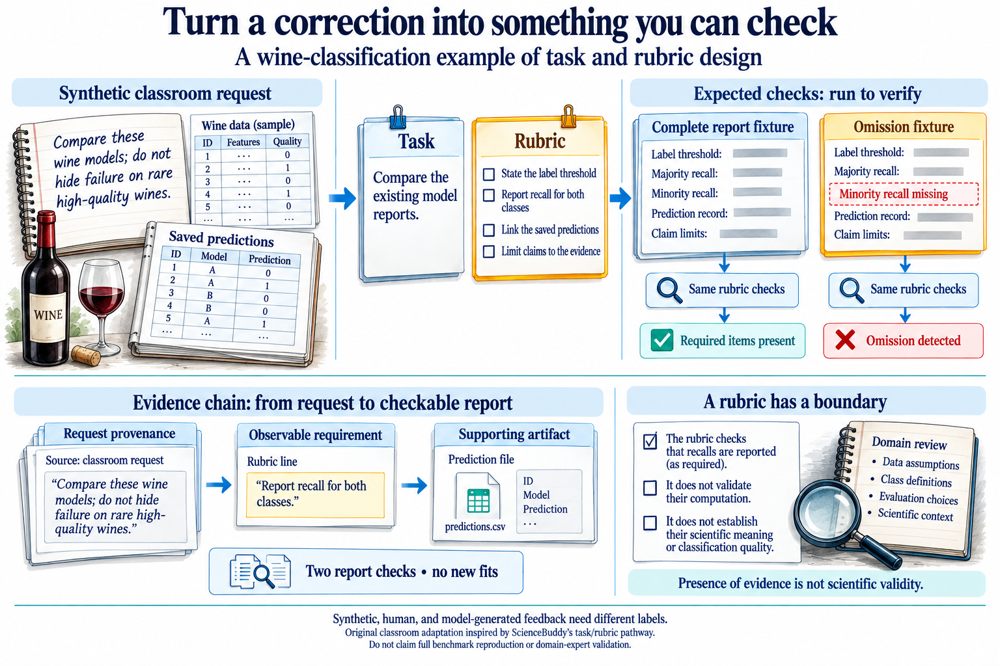

Selected: [correction-to-rubric-v1.png](correction-to-rubric-v1.png). Exact [prompt](correction-to-rubric-v1.prompt.md). The miniature rows are illustrative placeholders, not saved course predictions. Their zero/one values represent derived class labels; the original wine-quality rating is not binary. Use your actual predictions and declared threshold in the activity. The pictured verdicts are expected fixture outcomes to verify. This request is a classroom construction, not a real researcher interview. The presence check detects an omission; validating metric computation and scientific meaning requires further evidence.

## Lab 10.23

Selected: [reporting-skill-adaptation-v2.png](reporting-skill-adaptation-v2.png). Exact [prompt](reporting-skill-adaptation-v2.prompt.md). Changing instructions can change outputs while model weights stay fixed. The parent text is an intentionally weak teaching example. Supply the same evidence packet to both versions within each column, and record actual outputs and context limits. An honest missing-evidence statement can satisfy a declared limitation criterion, but it does not supply the missing recall or earn a full evidence pass. The matrix remains unexecuted in this illustration; no candidate improvement is assumed.

## Lab 10.24

Selected: [grouped-rewards-v1.png](grouped-rewards-v1.png). Exact [prompt](grouped-rewards-v1.prompt.md). The stabilizer makes the advantage magnitude 0.999998000004, shown approximately as one. For the pictured toy, start four softmax logits at zero and take gradient ascent on the displayed weighted log-probability objective with step size 0.1. “Weight” here means probability assigned to a toy action, not an LLM checkpoint. The wrong-reward card belongs to the separate edge case; rerun a four-item group with one corrupted score. The illustration specifies arithmetic to execute and is not full GRPO or evidence of scientific correctness.

## Lab 10.26

Selected: [sciencebuddy-result-audit-v1.png](sciencebuddy-result-audit-v1.png). Exact [prompt](sciencebuddy-result-audit-v1.prompt.md). Read these as paper-reported comparisons, not our reproductions. The primary result sections are 4.2, 4.3, and 4.4. Section 4.2’s heading says “Two-Cycle,” but its setup and Figure 8 describe three cycles; the course follows that explicit protocol. Preserve the distinctions among scientific task families, splits, attempt budgets, and feedback sources in your audit. The fixed reflector limits what can be claimed about improvement of the improvement procedure itself.

## Lab 10.35

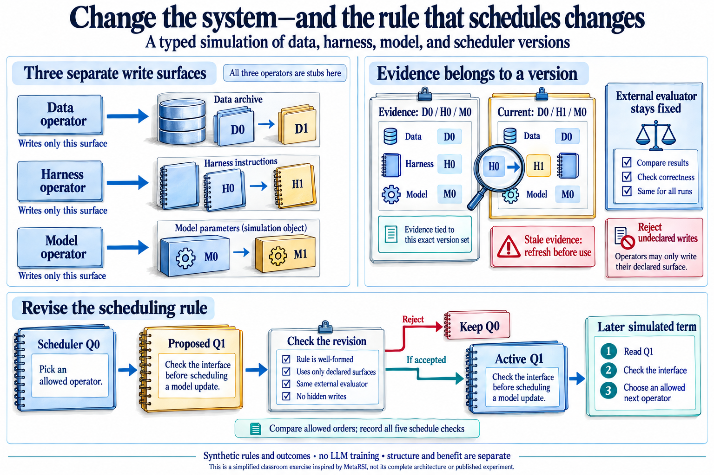

Selected: [operator-composition-v1.png](operator-composition-v1.png). Exact [prompt](operator-composition-v1.prompt.md). The write-surface rows are separate examples, not one sequential run. The evidence panel compares two exact version sets and requires a fresh diagnosis after the harness changes. Q1’s interface rule is an original classroom example. Its accepted path shows structural inheritance; the checks and outcome still need execution and do not establish benefit. Preserve Q0 if the revision fails. This five-check simulation omits much of MetaRSI’s full architecture and does not train an LLM. The external evaluator and allowed write boundaries remain fixed.

## Lab 10.36

Selected: [checked-reference-v1.png](checked-reference-v1.png). Exact [prompt](checked-reference-v1.prompt.md). These are constructed trace fixtures. The usable-reference marks represent the example’s required execution evidence, not a completed source reproduction. Check the actual traces before diagnosis. The candidate must pass its quality check before proceeding to the two fixture evaluations; reject a failed quality check immediately. “Independent fixtures” means distinct current and prior cases, not proof of isolated agent contexts. The alternative orders are valid for this particular audit. The general instruction contains no case answer, and the final keep-or-reject result is unresolved.

## Lab 10.37

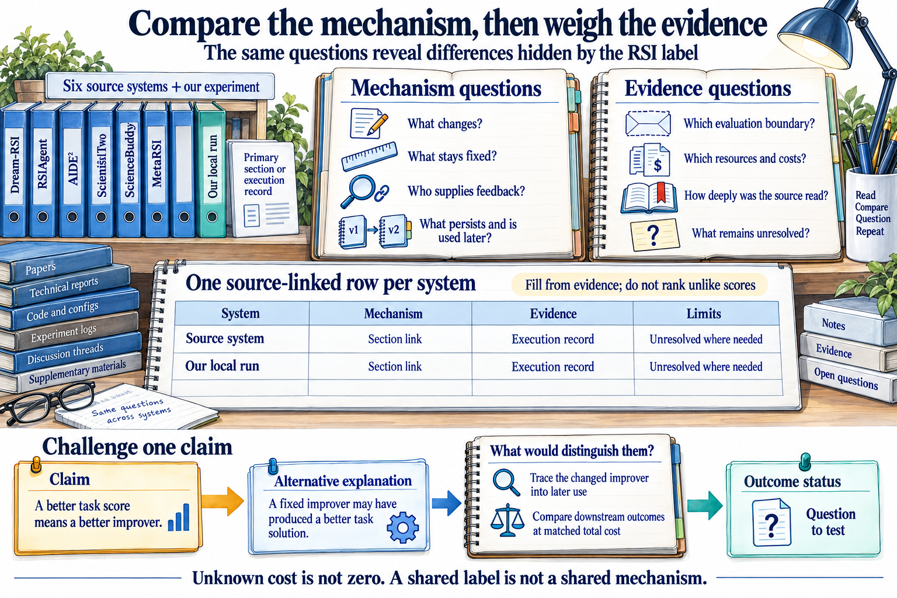

Selected: [compare-research-systems-v1.png](compare-research-systems-v1.png). Exact [prompt](compare-research-systems-v1.prompt.md). The ledger is a template to fill, not a completed comparison. Link paper claims to their primary method and result sections; use raw execution records where available and mark missing evidence unresolved. Link local claims to the course’s actual records. The named folders carry no rank or inferred method assignment. The lower challenge needs two distinct checks: whether an improver changed and governed later work, and whether its downstream outcomes improved under a fair total-resource comparison. A task-score gain alone answers neither.

## Lab 10.38

Selected: [research-bottlenecks-v1.png](research-bottlenecks-v1.png). Exact [prompt](research-bottlenecks-v1.prompt.md). Use the explicit numbers, not the decorative clock faces, to read the example. The five scenarios are alternatives; they are not successive generations. Execution time is set to zero only for this teaching calculation. Restore measured execution, failures, retries, and other costs in a real ledger. The instant-proposal limit follows from the baseline and is not a sixth run. The gain units below are a separate illustration; an acceleration claim must also account for resources and difficulty. This is neither a forecast nor the economics paper’s calibrated model.

## Lab 10.32

Selected: [memory-interface-v2.png](memory-interface-v2.png). Exact [prompt](memory-interface-v2.prompt.md). These counts are a synthetic teaching example. After adding three and removing one, the checkpoint is two; adding two more gives four. The faulty summary omits the removal. Do not pre-fill the actor’s answer or supply the checker’s result in its input. The two extra-description conditions change wording, not state transitions. The drawn counters and tally frame are props; the explicit event tape defines the arithmetic. This external-memory exercise does not reproduce S3Gym’s game or training protocols, and a shorter representation is not presumed better.

## Lab 10.33

Selected: [feedback-scaffolds-v1.png](feedback-scaffolds-v1.png). Exact [prompt](feedback-scaffolds-v1.prompt.md). The dataset names and field values are illustrative form fixtures, not real dataset results. The task cards specify required values; they are distinct from the added hints. Use a genuinely fresh fixture for the unassisted attempt and record any shared-context exposure. The stale-hint case asks what the actor actually does; no recovery is assumed. Compare all four traces with executable checks. This inference exercise illustrates assistance types discussed in Environments as Scaffold; it does not reproduce reinforcement learning or demonstrate a parameter update.

## Lab 10.34

Selected: [harness-compatibility-v1.png](harness-compatibility-v1.png). Exact [prompt](harness-compatibility-v1.prompt.md). The displayed verdicts are expected outcomes of these constructed format fixtures, not archived test results. Run all four checks. Accepting the field labels does not establish that candidate A is valid or that a task succeeded. The parser remains unchanged. The source study concerns broader planning compatibility and actual model training; the local field repair is only an analogy. Its separate training inset does not turn this four-check activity into an LLM-training experiment.

## Lab 10.30

Selected: [quality-cost-v1.png](quality-cost-v1.png). Exact [prompt](quality-cost-v1.prompt.md). This classroom change removes redundant report work; it is not an implementation of SoL-Pi’s four mechanisms. Both variants must meet the declared quality requirement before an efficiency conclusion is allowed. Fill the ledger with actual observations, include proposal and checking overhead, and keep unknown usage unknown. The failure tray represents recorded attempts whose costs remain in the ledger. The separate fit-stub example fails because required evidence is absent. The figure contains no measured saving or recursive compounding result.

## Lab 10.31

Selected: [builder-and-artifact-v2.png](builder-and-artifact-v2.png). Exact [prompt](builder-and-artifact-v2.prompt.md). Read the two source panels separately. A source system’s name does not identify its changed object. The lower experiment evaluates a generated ML harness under an unchanged builder. Both H0 and H1 feed the matched check before a decision; checklist marks name operations, not successful measurements. The final strip proposes a different experiment for a builder claim: the same fresh briefs are inputs to both builders, and their generated systems must be evaluated. It is not a completed extension to this lab’s two-check-or-fit budget. No model-weight update or general builder improvement is established.

## Lab 10.27

Selected: [knowledge-stores-v1.png](knowledge-stores-v1.png). Exact [prompt](knowledge-stores-v1.prompt.md). The notebook can contain lessons from earlier failures and receives the new result after checking. It is not rolled back with a rejected skill edit. In this controlled activity, the actor reads the active skill; the improver can consult the trace and notebook. Record actual reads: role instructions alone do not enforce isolation. The rejected S1 is illustrative, not a measured course result. This is a small WikiSkill-inspired exercise with two fixtures and no new model fit.

## Lab 10.28

Selected: [procedure-graph-v1.png](procedure-graph-v1.png). Exact [prompt](procedure-graph-v1.prompt.md). The left map explains conditional routing; the notebook isolates an example bug and its proposed repair. Test the target failure and a regression case before retaining a graph, then freeze that version for the fresh case. A rejected edit leaves the prior graph in place. The fourth fixture checks meaning: a target component can have the expected numeric type and still be forbidden as an input. The graph and domain rule have distinct jobs. All four fixtures use a fit stub; the figure records no successful test or model training.

## Lab 10.29

Selected: [gui-skill-repair-v1.png](gui-skill-repair-v1.png). Exact [prompt](gui-skill-repair-v1.prompt.md). The enlarged warning is a reader callout to information already present on the page. It was not observed in the pictured failed attempt and must not be added to that attempt’s critic packet. Supply only the declared visible trace, not the skill package or answer key. Use a separate critic context where available; otherwise label the shared context. The rule-check ticks name operations, not recorded passes. Compare the critic’s verdict with the executable result. This EvoSkill-inspired classroom task allows two actual UI attempts and no new model fits; the illustration is not an execution record.

## Lab 09.02

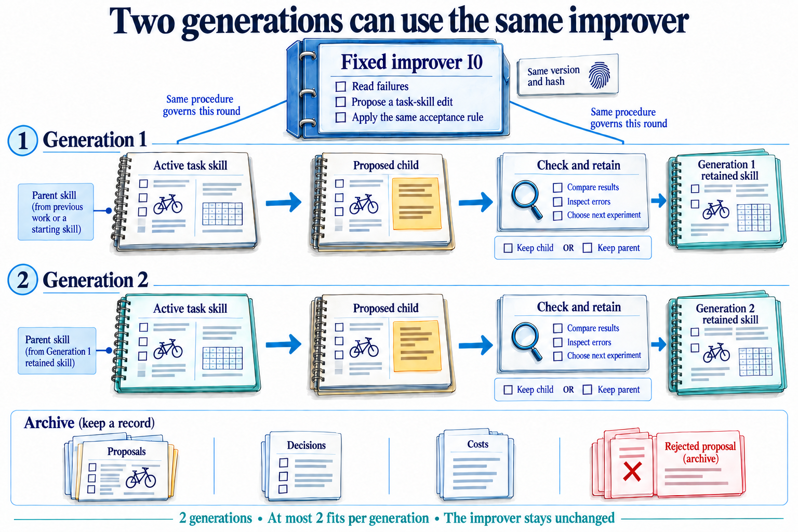

Selected: [fixed-improver-v2](fixed-improver-v2.png). Exact [prompt](fixed-improver-v2.prompt.md). I0 remains the same in both rounds. Match the Generation 1 retained skill to the named parent of Generation 2. A rejected proposal never becomes that parent. The pictured decisions are unselected possibilities; these generation numbers do not demonstrate a changed improver or guaranteed improvement.

## Lab 09.03

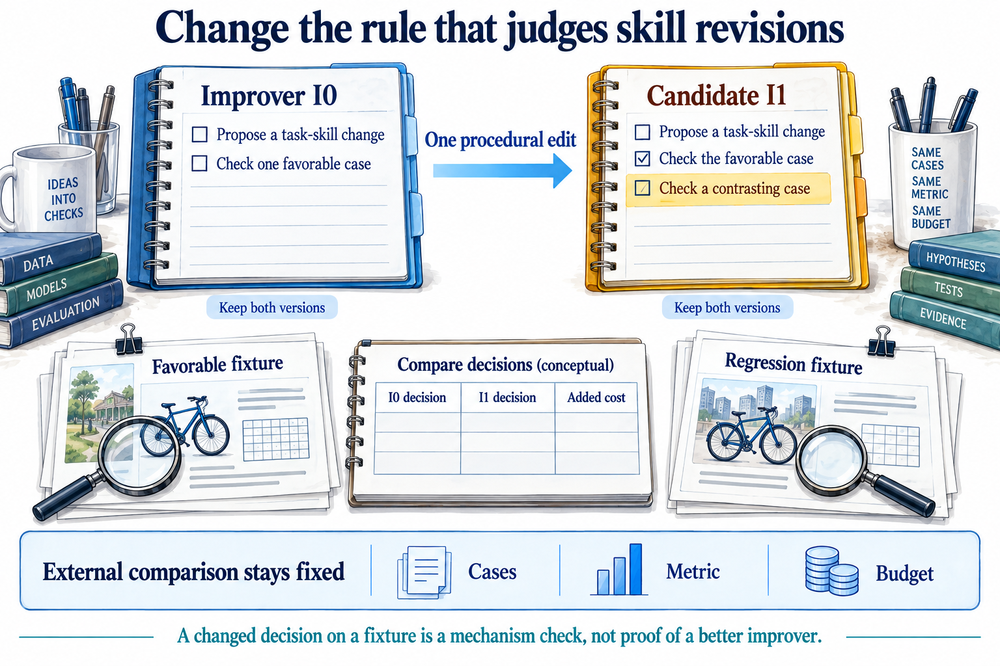

Selected: [improver-proposal-v1](improver-proposal-v1.png). Exact [prompt](improver-proposal-v1.prompt.md). This intentionally weak I0 is a classroom example. The added internal rule changes how task-skill proposals are tested; it does not change the external evaluation contract. Notebook marks identify actions, not successful measured fixture results. Keep both versions and compare actual decisions and overhead before making a benefit claim.

## Lab 09.05

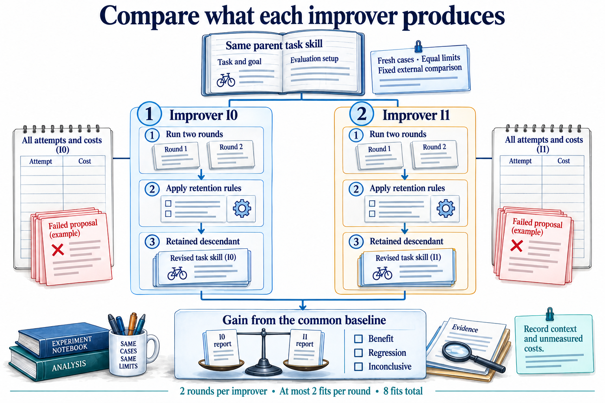

Selected: [improver-comparison-v1](improver-comparison-v1.png). Exact [prompt](improver-comparison-v1.prompt.md). Apply the declared retention rules during each round. The I0 and I1 labels on the descendant reports identify the producing improver; give task skills their own version identities. Compare retained results and all known costs, including failures. Separate folders do not establish independent contexts. Eight fits is a maximum; benefit, regression, and inconclusive outcomes are all possible.

## Lab 09.06

Selected: [bounded-lineage-v1](bounded-lineage-v1.png). Exact [prompt](bounded-lineage-v1.prompt.md). A finished check does not by itself promote a proposal: record the keep-or-reject decision. On resume, read the saved active versions and cumulative budget. Preserve rejected proposals as evidence without activating them. The image is a procedure; the recorded course run rejected both improver revisions and did not demonstrate a successful changed-improver lineage.

## Lab 09.07

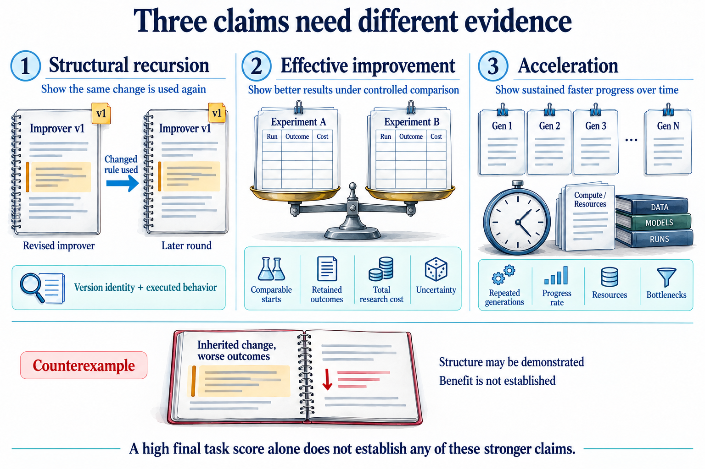

Selected: [claim-evidence-v1](claim-evidence-v1.png). Exact [prompt](claim-evidence-v1.prompt.md). Structural recursion needs executed later use of the changed improvement procedure. Benefit needs a fair comparison of what the procedures produce. Acceleration concerns an increasing progress rate across generations after accounting for resources and bottlenecks; a constant speed advantage or two favorable points is insufficient. The records are conceptual, not measured results.

The five individual capstone figures are now published, separate from the capstone overview. Four used one draft; 11.05 used two. Its retained [first draft](capstone-teach-back-v1.png) and [prompt](capstone-teach-back-v1.prompt.md) document the corrected leakage and missing changed-rule problems. The [source preflight and review](../../validation/RSI-AND-CAPSTONE-ILLUSTRATIONS.md) record the check for each lab.

## Lab 11.01

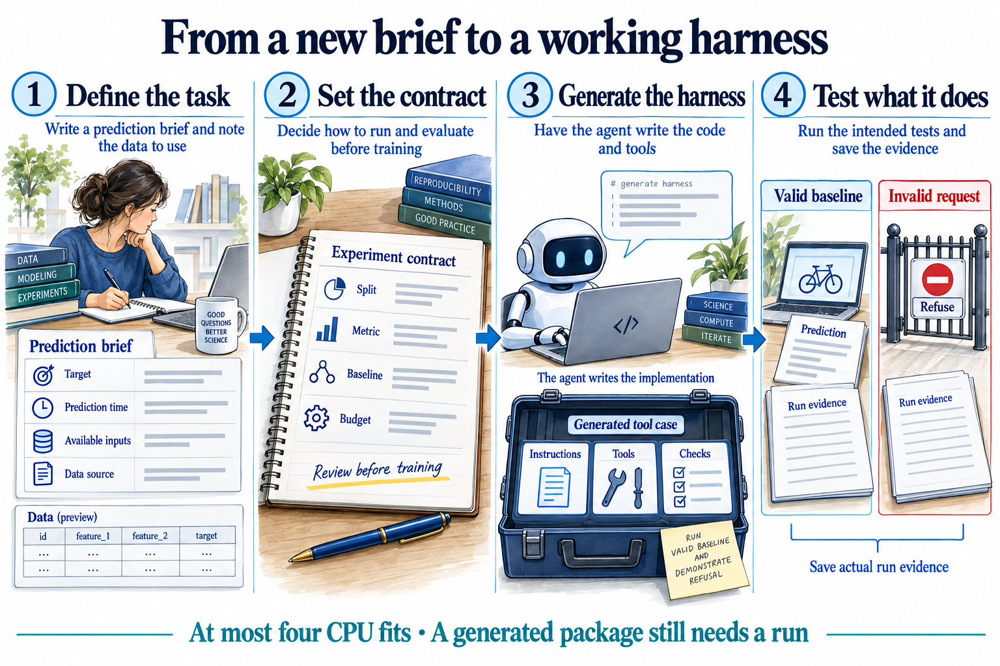

Selected: [capstone-new-brief-v1](capstone-new-brief-v1.png). Exact [prompt](capstone-new-brief-v1.prompt.md). Choose the scientific task before generating its harness. The two stations are tests to perform, not passed results. Record actual execution and a meaningful refusal. The tool-case checklist denotes components; it does not certify their behavior. Keep the required path within four CPU fits.

## Lab 11.02

Selected: [capstone-recursion-v1](capstone-recursion-v1.png). Exact [prompt](capstone-recursion-v1.prompt.md). These are the evidence needed to inspect the experiment. Distinguish a candidate trial from retained use; promote only through the declared decision and trace whichever version actually governs the next round. Match starting artifacts and external comparison rules. Eight fits is the total maximum across the two-generation protocol, with agent-inference limits declared separately.

## Lab 11.03

Selected: [capstone-portability-v1](capstone-portability-v1.png). Exact [prompt](capstone-portability-v1.prompt.md). Test these dimensions separately. Describe what changed in Task B; a different label does not establish task transfer. Choose two small tests you can actually run and leave other combinations explicitly untested. The pictured notebooks and machines are examples, not certified environments.

## Lab 11.04

Selected: [capstone-audit-v1](capstone-audit-v1.png). Exact [prompt](capstone-audit-v1.prompt.md). A source announcement, supported result, and independent reproduction are different evidence. Record the source date, version, and what you actually read. State the strongest support and the main limitation, then propose an observation that could change your conclusion. No pictured source or experiment is a reported result.

## Lab 11.05

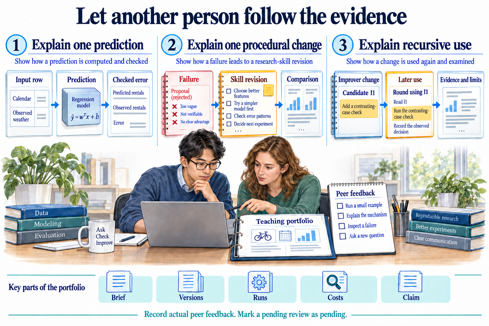

Selected: [capstone-teach-back-v2](capstone-teach-back-v2.png). Exact [prompt](capstone-teach-back-v2.prompt.md). Keep the target out of model inputs; it belongs in the error check. Trace the added contrasting-case rule into an executed later action. The small strip can represent a candidate trial; it does not itself prove retention or benefit. Show the real comparison and decisions in the portfolio. The peer scene is illustrative: record a session only after it occurs and mark pending review honestly.

## Your route through the course

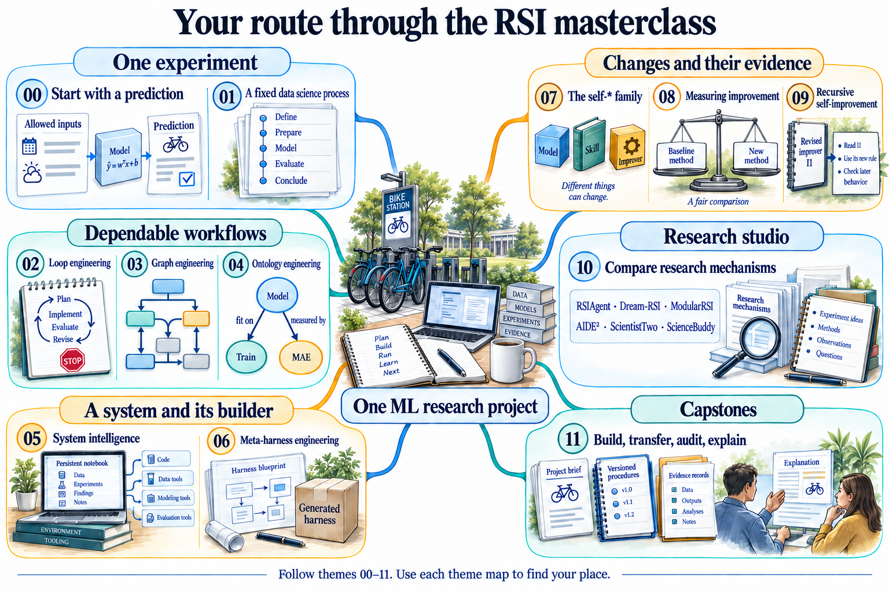

Selected: [v2](course-mindmap-v2.png). Prompts: [initial](course-mindmap-v1.prompt.md), [revision](course-mindmap-v2.prompt.md). Earlier output: [v1](course-mindmap-v1.png).

V2 corrects the premature RSI label on the generated harness, replaces unclear ontology edges with explicit model relations, and shows the revised improver's later use. All twelve theme numbers are present. Its grouping lines are conceptual, not execution dependencies. Embedded in the main README, guided course map, and theme orientation.

## Inside the research studio

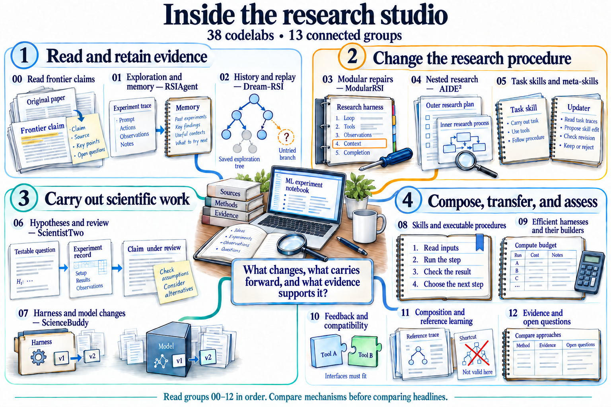

Selected: [v3](research-studio-map-v3.png). Prompts: [v1](research-studio-map-v1.prompt.md), [v2](research-studio-map-v2.prompt.md), [v3](research-studio-map-v3.prompt.md). Earlier outputs: [v1](research-studio-map-v1.png), [v2](research-studio-map-v2.png).

The review corrected an invented modular-component list, separated task-skill actions from updater actions, and removed a misleading connector. The final numbered procedure avoids a route that bypassed checking. All thirteen group IDs are present. The nearby caption distinguishes abridged scenes from actual source results and the ScienceBuddy laptop examples from LLM training.

## The five capstones

Selected: [v3](capstone-map-v3.png). Prompts: [v1](capstone-map-v1.prompt.md), [v2](capstone-map-v2.prompt.md), [v3](capstone-map-v3.prompt.md). Earlier outputs: [v1](capstone-map-v1.png), [v2](capstone-map-v2.png).

The recursive panel now has four explicit stages: propose I1, run matched trials with changed-rule use, compare outcomes and cost, and keep or reject. V2 corrected automatic-looking inheritance and an audit label that presumed support; v3 removed one remaining ambiguous data connector. The map names all five labs and preserves the two-generation, eight-fit maximum. No acceptance or portability result is selected. See the [review record](../../validation/COURSE-NAVIGATION-ILLUSTRATIONS.md).

## From an experiment to RSI

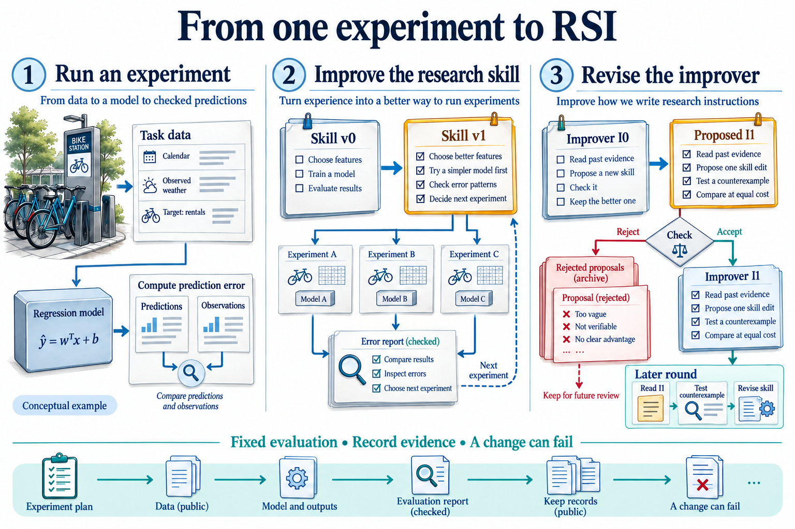

Selected: [v2](main-overview-v2.png). Prompts: [initial](main-overview-v1.prompt.md), [revision](main-overview-v2.prompt.md). Earlier output: [v1](main-overview-v1.png).

Full-size review found two problems in v1: invented table/prediction values could resemble measurements, and the accepted improver did not preserve the proposed revised rules. V2 removes those values and repeats the counterexample rule in proposed I1, accepted I1, and the later round. It retains a rejection branch, public records, fixed evaluation, and the warning that a change can fail. Its accepted revision is a conceptual possibility, not an observed successful recursive result. The main README and 09.01 caption make that limit explicit.

## The answer hidden in an input

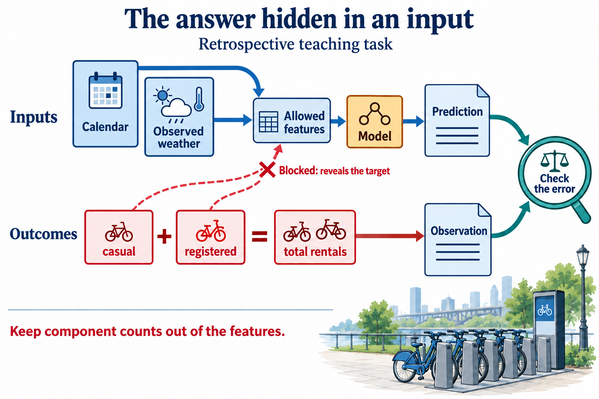

Selected: [v2](target-leakage-v2.png). Prompts: [initial](target-leakage-v1.prompt.md), [revision](target-leakage-v2.prompt.md). Earlier output: [v1](target-leakage-v1.png).

V1's two input connectors both appeared to start at the weather card. It also added decorative curves and ascending bars. V2 gives calendar and observed weather separate connectors and replaces the chart marks with neutral records and a comparison symbol. Full-size review confirms the addition relation, blocked shortcut, and two inputs to the error check. Observed weather is permitted for this retrospective task, without a day-ahead availability claim.

## A loop needs memory and a way out

Selected: [v1](bounded-loop-v1.png). Exact [prompt](bounded-loop-v1.prompt.md). No revised output was needed after full-size mechanism review.

The normal route is Propose → Run → Check → Record → Continue. The limit branch stops. A failed fit bypasses successful-result checking, reaches Record, and still consumes an attempt. The central notebook holds identity, incumbent, allowance, and last checked step. The resume strip reads the same state and budget. The caption adds reconciliation of in-progress attempts before resumption. The small model-surface icon is conceptual and has no measured axes or values.

## The builder and the system it builds

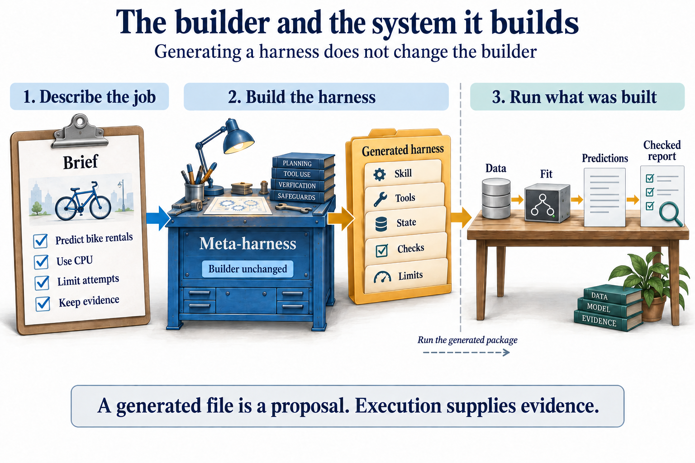

Selected: [v2](meta-harness-v2.png). Prompts: [initial](meta-harness-v1.prompt.md), [revision](meta-harness-v2.prompt.md). Earlier output: [v1](meta-harness-v1.png).

V1 separated brief, builder, package, and execution correctly but added decorative result bars and a curve. V2 replaces those with neutral document lines and a tree symbol. Full-size review confirms one-way generation, an unchanged builder, the five package components, and a separate run stage. The caption states that this fixed-builder example does not establish RSI. Checked execution is evidence of behavior, not a guarantee that a model improved.

## Workflow and domain meaning

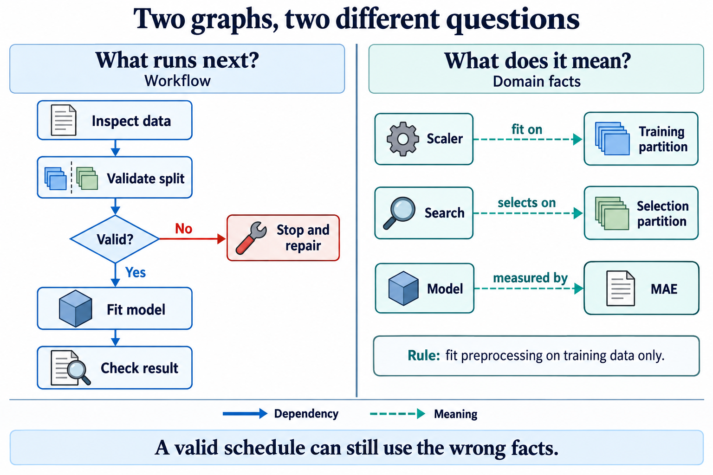

Selected: [v1](graph-ontology-v1.png). Exact [prompt](graph-ontology-v1.prompt.md).

Full-size review confirms the valid/invalid split branch, the separate scaler/train and search/selection relations, and the distinct edge legend. The right panel contains selected facts and one constraint, not a complete ontology. Its caption requires checking implementation against declared facts. Added to 04.02.

## Similar words, different changes

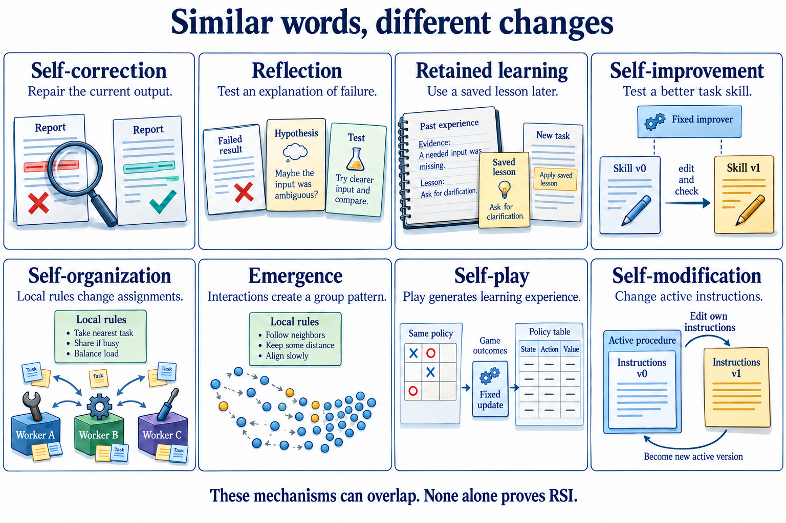

Selected: [v2](self-star-v2.png). Prompts: [initial](self-star-v1.prompt.md), [revision](self-star-v2.prompt.md). Earlier output: [v1](self-star-v1.png).

V1 depicted the updated policy as another game board and overgeneralized the memory example. V2 shows a policy table, a valid nonterminal game position, and a specific missing-input observation. The fixed improver and fixed self-play update remain separate from active instruction modification. The emergence panel is an illustrative group-pattern analogy, not measured queue evidence. Added to the self-* theme overview and 07.08.

## The next round must use the change

Selected: [v1](inherited-improver-v1.png). Exact [prompt](inherited-improver-v1.prompt.md).

Full-size review confirms consistent proposed/active I1 instructions, an executed check connected to the new rule, retention of I0 on rejection, and separate rejection of a later skill proposal. The accepted path is conceptual. Its caption preserves the negative outcome of the actual two-generation comparison. Added to 09.04.

## Replay stops at the edge of the record

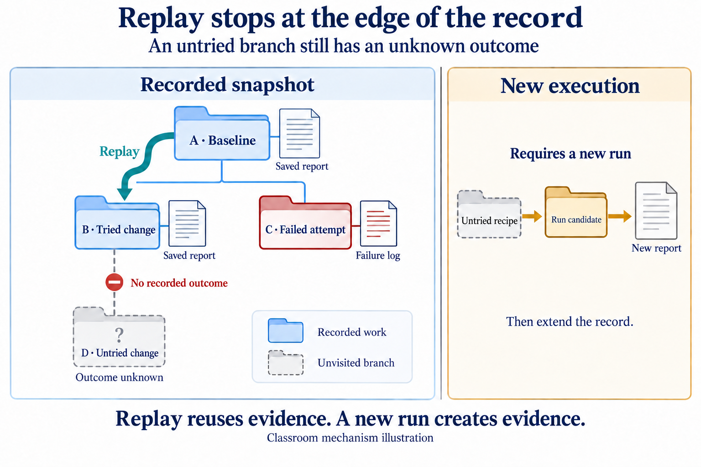

Selected: [v2](replay-boundary-v2.png). Prompts: [initial](replay-boundary-v1.prompt.md), [revision](replay-boundary-v2.prompt.md). Earlier output: [v1](replay-boundary-v1.png).

Both versions preserve the recorded baseline, tried change, failed attempt, and unknown branch. V2 removes unrequested small-print prose; Markdown carries the source and scope explanation. The left snapshot never gains an invented result from the separate new-execution panel. Added to 10.08 as an original Dream-RSI-inspired classroom explanation.

## Two ways to improve a scientific agent

Selected: [v4](model-harness-v4.png). Prompts: [initial](model-harness-v1.prompt.md), [technical revision](model-harness-v2.prompt.md), [visual redesign](model-harness-v3.prompt.md), [targeted correction](model-harness-v4.prompt.md). Earlier outputs: [v1](model-harness-v1.png), [v2](model-harness-v2.png), [v3](model-harness-v3.png).

V1 added wording that conflated training evidence with external evaluation. V2 corrected the routes but relied on repetitive folders, chips, and boxes. After the user reported declining visual quality, v3 used the actual main overview as a style reference and rebuilt the explanation as three detailed research workbenches. V4 makes the unchanged H1 blue in the final scene, removes a mug slogan, replaces report bars with neutral lines, and avoids an unsupported implication of unseen-topic evaluation. The requested tiny book-spine correction did not render cleanly; it is a cosmetic residual, not a method label. The caption preserves the laptop exercise's synthetic-score and no-LLM-training limits. Added to 10.25.

## Check the result, then write the lesson

Selected: [v2](actor-memory-v2.png). Prompts: [initial](actor-memory-v1.prompt.md), [correction](actor-memory-v2.prompt.md). Earlier output: [v1](actor-memory-v1.png).

Used the main overview as the style reference. The first image added an incorrect verifier claim about sound reasoning and implied only successful outcomes could precede a lesson. V2 instead lists task requirement, observed result, success or failure, and supporting evidence. It routes the verdict to the actor's pen, adds an explicit freeze handoff, and preserves read-only use on a later task. The notebook fields are our teaching aid. The primary method's role and freezing descriptions were rechecked in [RSIAgent sections 3.1–3.2](https://arxiv.org/html/2609.15364v1); no new benchmark or execution claim is made. Added to 10.04.

## Move the compute, preserve the evidence

Selected: [v2](compute-contract-v2.png). Prompts: [initial](compute-contract-v1.prompt.md), [revision](compute-contract-v2.prompt.md). Earlier output: [v1](compute-contract-v1.png).

V1 omitted the adapter-to-CPU connection. V2 adds the third branch while preserving alternative backends, shared run records, failure accounting, and conditional checkpoint/resume support. The CPU path is labelled tested; the other adapters explicitly require validation. Added to the larger-compute guide.

## Research and process additions

The next authoring set adds the three figures below. All use the initial overview as the actual style reference. They have full-size checks; the complete published-page review remains queued under the user's authoring-first direction.

## Before the first improvement loop

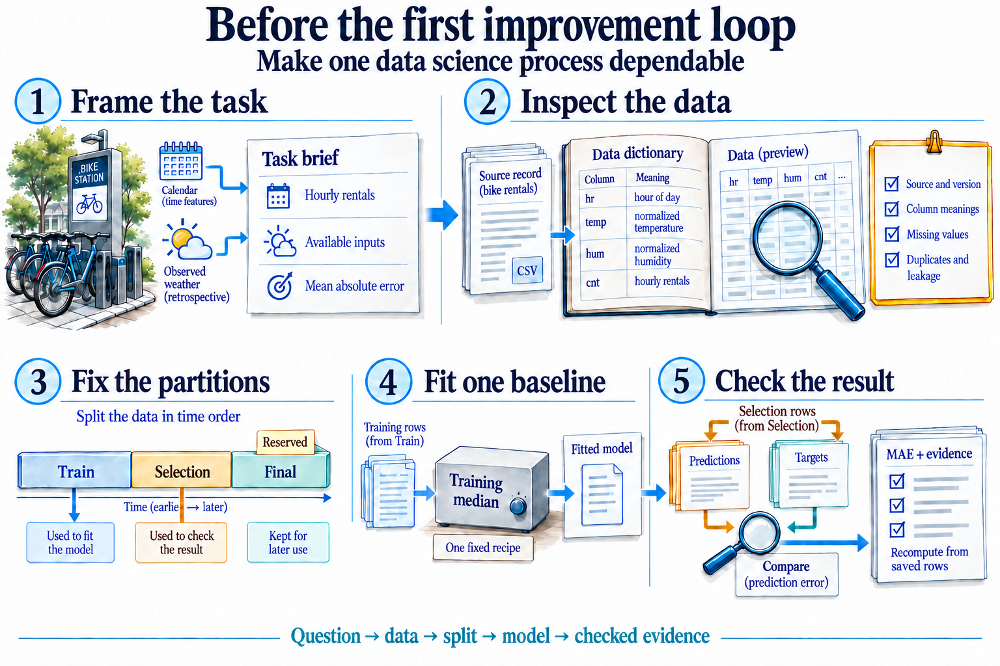

Selected: [v4](data-science-process-v4.png). Prompts: [v1](data-science-process-v1.prompt.md), [v2](data-science-process-v2.prompt.md), [v3](data-science-process-v3.prompt.md), [v4](data-science-process-v4.prompt.md). Earlier outputs: [v1](data-science-process-v1.png), [v2](data-science-process-v2.png), [v3](data-science-process-v3.png).

The first draft misrouted partition evidence and invented unnormalized units and field names. V2 fixed the field meanings and training route but left an ambiguous selection endpoint. V3 removed that route but broke part of the training connector. V4 removes both remaining fragments. Matching Train and Selection labels now identify data roles across scenes; local arrows show fitting and checking. Final remains reserved. This is an example of why a targeted image edit still needs a whole-image check. Added to 01.01 and its theme overview.

## Improve the researcher, then test the improver

Selected: [v2](nested-research-v2.png). Prompts: [v1](nested-research-v1.prompt.md), [v2](nested-research-v2.prompt.md). Earlier output: [v1](nested-research-v1.png).

V2 removes decorative bars and explicitly runs the proposed researchers before comparing their behavior. Different proposals no longer share an implied accepted R2 identity. The middle decision keeps both parent and child as possible outcomes. The caption separates the classroom identities from the published system and preserves uncertainty in the ignition test. Added to 10.14 and the AIDE² group README.

## Turn a limitation into a tested claim

Selected: [v2](scientific-claim-v2.png). Prompts: [v1](scientific-claim-v1.prompt.md), [v2](scientific-claim-v2.prompt.md). Earlier output: [v1](scientific-claim-v1.png).

V1 sent a weather input directly to an output sheet and incorrectly connected a manuscript to the new experimental records. V2 routes both permitted inputs through the with-weather model, keeps the removed feature disconnected, and routes the follow-up experiment through its records to the revised claim. It also replaces an unsupported underfitting assertion with diagnostic questions and separates the two screening ideas. The paper drawing is illustrative; no generated scientific result or venue acceptance is claimed. Added to 10.18 and the ScientistTwo group README.

## Repair a component. Check the system.

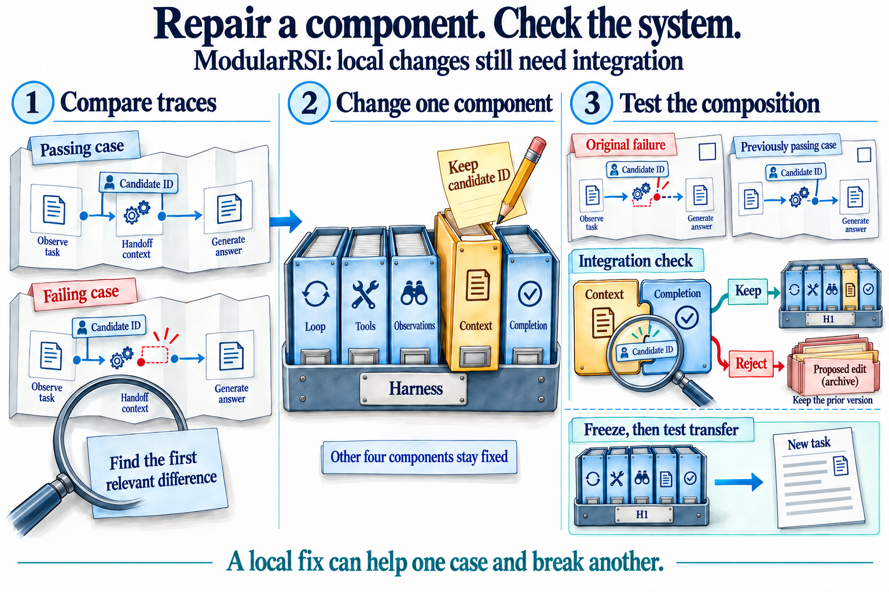

Selected: [v2](modular-harness-v2.png). Prompts: [v1](modular-harness-v1.prompt.md), [v2](modular-harness-v2.prompt.md). Earlier output: [v1](modular-harness-v1.png).

V1's brackets included the edited Context module among unchanged neighbors. V2 replaces them with an explicit statement about the other four components and preserves the same H1 identity at transfer. The candidate-ID fixture is an original classroom example. Empty checkboxes do not claim execution. The retained version is a possible accepted outcome. Added to 10.10 and the modular-harness group; 10.11 extends the idea to interactions between two edits.

## Improve the skill—and the way you revise it

Selected: [v3](meta-skill-schedules-v3.png). Prompts: [v1](meta-skill-schedules-v1.prompt.md), [v2](meta-skill-schedules-v2.prompt.md), [v3](meta-skill-schedules-v3.prompt.md). Earlier outputs: [v1](meta-skill-schedules-v1.png), [v2](meta-skill-schedules-v2.png).

V1 confused updater instructions with model-fitting instructions and introduced an invalid bike-count input. V2 separates their roles, removes invented fields, and puts the later proposal before its check. It introduced an archive-to-activation arrow; v3 removes that connection and gives rejection two independent outcomes: retain U0 and archive the proposal. Matching U1 labels bridge activation and later use. The notebooks contain teaching examples, not full executable procedures. Added to 10.17 and the meta-skill group. The lab now explicitly applies the retained pipeline to its own instructions and keeps the later comparison within four fits.

## Save the state. Check the handoff.

Selected: [v3](system-coordination-v3.png). Prompts: [v1](system-coordination-v1.prompt.md), [v2](system-coordination-v2.prompt.md), [v3](system-coordination-v3.prompt.md). Earlier outputs: [v1](system-coordination-v1.png), [v2](system-coordination-v2.png).

V1 invented station-level forecasting and routed fitting directly from ready. V2 corrects the task brief and expected C1 identity but misroutes the new start-fit arrow and leaves a disconnected elbow. V3 removes both and uses numbered actions with the explicit precondition “Requires saved running.” The genuine laptop-to-predictions route remains. Saved state bridges the new process, and failure paths cannot enter complete. Read-only is a procedural description, not a permission claim. Added to 05.04 and its theme. The image illustrates the mechanism; the existing execution record remains separate.

## Review scope

All seventeen selected PNGs were inspected at full size for wording, arrows, fixed and mutable components, missing stages, and scientific meaning. The rejected or superseded versions remain above. After checkpoint `b7550be`, the first four assets were inspected in actual GitHub Markdown pages at about 814 pixels wide; the main and 00.01 also at a 390-pixel viewport. During the next review, the self-* comparison was seen at reading width, but the graph figure's lower part was outside the screenshot. Do not count that as a complete graph review. Browser screenshots were observed, not exported. The user then prioritized authoring and GitHub checkpoints before the full verification pass. Viewport overrides were reset. The new RSIAgent and revised ScienceBuddy images have full-size checks; their published-width review remains queued. Dense secondary labels require full-size viewing on phones. See [the authoring plan](../../AUTHORING-FIRST.md) for the current sequence and deferred checks.
