# Illustrations for the RSI course

One hundred five selected illustrations were produced on 20–21 September 2026 with the built-in image-generation tool. The user [approved this alternative](../GENERATOR-DECISION.md) to the original Imagen preference. The tool returns the image and an output hint but no model identifier. These assets are not labelled Imagen-generated. The [student visual guide](../../../../rsi/VISUAL-GUIDE.md) shows only the selected figures and links back to their lessons and maps.

All 154 generated versions are retained. The [manifest](MANIFEST.csv) records each PNG, exact prompt, original output filename, dimensions, byte count, SHA-256, and selected course copy. The [manifest source](../../scripts/build-illustration-manifest.mjs) verifies that selected copies match. The course publisher embeds selected assets through [the illustration map](../../scripts/lesson-illustrations.mjs), so rebuilding lessons preserves them. The [visual-guide publisher](../../scripts/build-visual-guide.mjs) generates the student companion from the same reviewed captions.

These are conceptual explanations, not empirical result figures. Numerical plots remain separate and use recorded experiment data. Each course embed has descriptive alternative text, a caption, and a full-size link. The corresponding precise step diagram remains available in a disclosure.

The new navigation maps appear first in the student guide. They support early visual feedback; all 101 labs now have individual illustrations. Following the user's cost correction, review technical labels and relations before generation and use no more than three attempts per figure.

All seven theme-09 labs and all five capstones now have mapped generated infographics. The [per-lab inventory](../../validation/INFOGRAPHIC-COVERAGE.md) distinguishes these from the rest of the unfinished course. The five new theme-09 figures used six outputs: the first fixed-improver draft needed one connector correction; the other four were selected on their first attempts. The [first fixed-improver draft](fixed-improver-v1.png) and [prompt](fixed-improver-v1.prompt.md) remain available.

## Lab 08.01

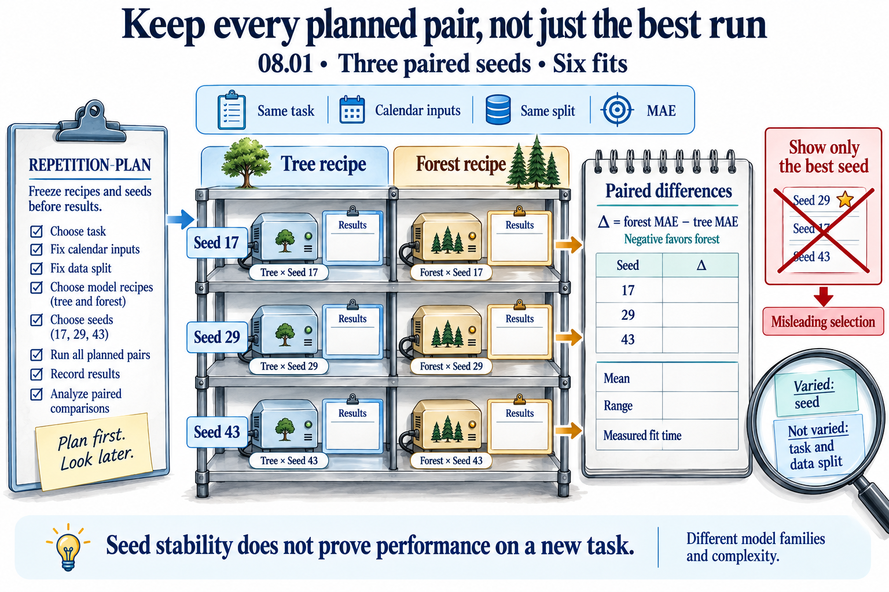

Selected: [paired-seeds-comparison-v1.png](paired-seeds-comparison-v1.png). Exact [prompt](paired-seeds-comparison-v1.prompt.md). The difference is forest MAE minus tree MAE, so a negative value favors the forest. Recipe families and complexity differ; seeds are paired within that comparison. The star on seed 29 is an arbitrary example of selective reporting, not the best seed in the archived run. Blank cells and checklist marks specify planned work, not new measurements. The measured plot below uses the actual recorded results. Three seeds do not establish transfer to other tasks or data splits.

## Lab 08.02

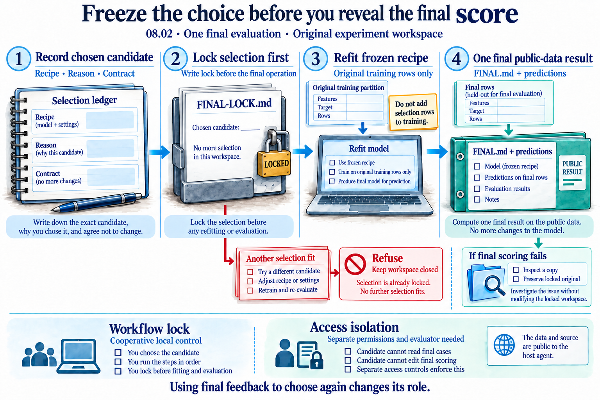

Selected: [freeze-before-final-v2.png](freeze-before-final-v2.png). Exact [prompt](freeze-before-final-v2.prompt.md). Use the original experiment workspace, not a new experiment with a reset selection history. The final operation permits a refit of the frozen recipe on original training rows only; it does not permit another selection fit or adding selection rows to training. Preserve the lock even if final scoring fails. The pictured lock is a cooperative local control over public data. Actual access isolation requires separate permissions and an evaluator; this course does not claim those controls exist. The recipe, reason, and contract belong in the decision record, not extra fields invented for FINAL-LOCK.md.

## Lab 08.03

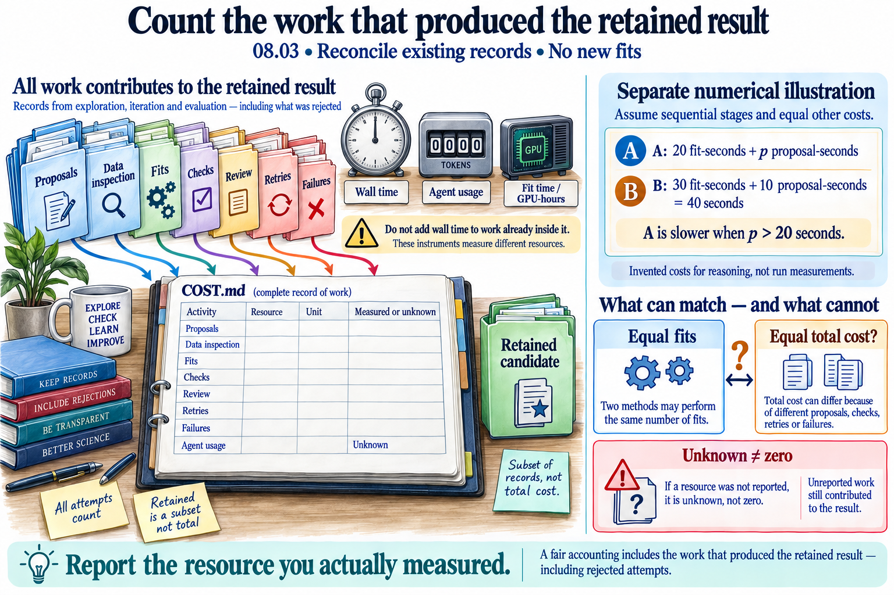

Selected: [research-cost-ledger-v1.png](research-cost-ledger-v1.png). Exact [prompt](research-cost-ledger-v1.prompt.md). Account for the full search effort, including work that failed or did not help. Wall time, tokens, fit time, and GPU-hours measure different resources; do not add overlapping durations or unlike units. The token counter is an instrument icon, not a zero-usage observation. Leave unavailable usage unknown. The 20+p versus 30+10 comparison is invented arithmetic with sequential stages and equal other costs. It is not a measured result from this course, and equal fit counts do not establish equal total cost.

## Lab 08.04

Selected: [memory-skill-factorial-v1.png](memory-skill-factorial-v1.png). Exact [prompt](memory-skill-factorial-v1.prompt.md). Keep the same memory version in both memory-present arms and the same parent or child instructions across its row. The blank records do not assume the child wins or memory helps. Differences between the two memory effects describe an interaction in these observations; noisy results need uncertainty analysis before a broader claim. The four main checks or fits and the separate follow-up have distinct budgets. Fresh folders do not isolate agent knowledge. The archived worked example below replays deterministic decisions over cached predictions; it is not an LLM training experiment.

## Lab 08.05

Selected: [frozen-skill-transfer-v1.png](frozen-skill-transfer-v1.png). Exact [prompt](frozen-skill-transfer-v1.prompt.md). The frozen objects are the research instructions and their declared interfaces. The left-hand cards list task-specific material those instructions operate on; do not reuse a fitted bike model as a wine classifier or treat model code as the skill itself. Declare target, inputs, split, model interface, and maximizing balanced accuracy before wine outcomes. Keep both class recalls and all four attempts. The author already knew the public wine task, so the archived exercise is a transfer replay, not a fresh unseen-task test. No result is filled in here.

## Lab 08.06

Selected: [metric-switch-and-rollback-v1.png](metric-switch-and-rollback-v1.png). Exact [prompt](metric-switch-and-rollback-v1.prompt.md). The constant predictor has recalls one and zero when both classes occur, giving balanced accuracy 0.5. The failure concerns this fixture's unsupported promotion and omitted evidence; a majority baseline is not invalid for every task and is not automatically worse than every candidate. Checklist marks describe required checks, not a new execution. Restore the prior valid version only if the fixture replaced it. A new accuracy objective requires an explicit new task and tradeoff; it cannot relabel the earlier comparison.

The [first final-boundary draft](freeze-before-final-v1.png) and its [prompt](freeze-before-final-v1.prompt.md) are preserved. The selected revision corrects selection-fit versus final-refit language, lock fields, and access controls. See the [measurement review](../../validation/MEASUREMENT-ILLUSTRATIONS.md).

## Lab 07.01

Selected: [local-output-correction-v1.png](local-output-correction-v1.png). Exact [prompt](local-output-correction-v1.prompt.md). The later-session panel depicts a conditional example in which only the unchanged procedure is reused. Inspect the host’s actual context, saved memory, and available files; a new process or chat is not proof that the correction was forgotten. The table headings name conceptual row identities and values, not the complete prediction-file schema. Recompute from the actual matched rows and reference targets, then correct conclusions that depended on the wrong number. The blank value is not an experimental result, and the illustration’s checkmarks show the intended corrected state.

## Lab 07.02

Selected: [reflection-hypothesis-checks-v2.png](reflection-hypothesis-checks-v2.png). Exact [prompt](reflection-hypothesis-checks-v2.prompt.md). Trees are a visual mnemonic for model families, not a claim about either pictured landscape. Use the actual trace for observations and label causal explanations as hypotheses. A helpful-case label predicts an outcome; it does not establish one. Compare the broad and narrow rules on the same two checked cases without extra undeclared fits. Reusing the cases that inspired the reflection is a replay, not fresh validation. Retaining a note does not guarantee future use or prevent repeated errors; both require their own evidence.

## Lab 07.03

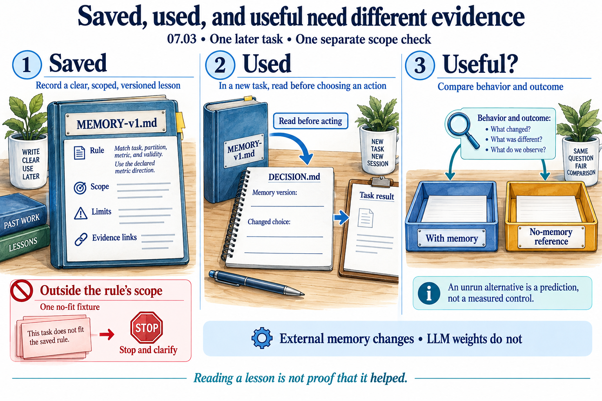

Selected: [memory-save-use-benefit-v1.png](memory-save-use-benefit-v1.png). Exact [prompt](memory-save-use-benefit-v1.prompt.md). A new-session label describes the intended exercise, not proof of an independent context. Record what the host actually exposes. The with-memory and no-memory trays are evidence slots; an empty tray is not a measured control. Within this lab’s budget, compare with a suitable existing no-memory result or state the unrun alternative as a prediction. The separate scope fixture tests refusal when comparison requirements are missing or incompatible. This memory-based adaptation changes an external artifact; it does not update language-model weights or the procedure that creates memories.

## Lab 07.04

Selected: [task-skill-fixed-improver-v1.png](task-skill-fixed-improver-v1.png). Exact [prompt](task-skill-fixed-improver-v1.prompt.md). The constant baselines are separate charged fits under the two skill versions, not one shared free result. Predeclare the parent’s second choice and the child’s diagnosis-to-choice rule. Record the second choice before fitting it. Blank outcome and cost fields must come from execution; comparison checkmarks depict required checking, not a new observed win. Preserve failed proposals and state shared-context or unmeasured inference-cost limits. The dashed follow-up changes the target of a future experiment and is not an executed new improver here.

## Lab 07.05

Selected: [organization-shared-queue-v1.png](organization-shared-queue-v1.png). Exact [prompt](organization-shared-queue-v1.prompt.md). The duration cards define this teaching fixture; ticks are simulation units, not wall-clock seconds. FCFS means first come, first served; with all jobs arriving together, the listed input order breaks the tie. Both workers can do the same jobs. The machines represent simulated workers, not launched coding agents. Define simultaneous-event tie handling before execution and preserve every job ID. A speed difference matters only after completion and correctness checks. An optional coordination-delay run changes a declared cost assumption and may reverse the result; it does not make the workers learn.

## Lab 07.06

Selected: [emergence-pattern-and-cost-v2.png](emergence-pattern-and-cost-v2.png). Exact [prompt](emergence-pattern-and-cost-v2.prompt.md). Either worker can process either type. Count neighboring jobs within each worker’s ordered trace, then divide the pooled same-type-pair count by the pooled adjacent-pair count; do not join the end of one worker’s trace to another’s start. FIFO means first in, first out. Use the same inputs and tie rules across the three main simulations and a fixed seed for randomized history. The urgent-job pair is a separate two-run fixture. Empty report fields are not results. A pattern produced by fixed local rules is not proof that a learning procedure improved.

## Lab 07.07

Selected: [self-play-policy-and-trainer-v2.png](self-play-policy-and-trainer-v2.png). Exact [prompt](self-play-policy-and-trainer-v2.prompt.md). The X/O arrows denote table lookup, not separate player-specific tables. Each visited move is updated after the completed game from its mover’s return. The 0-to-0.2 example is arithmetic for a return of +1, not a new measured improvement; a loss gives a negative update from zero. Training explores with probability 0.2; otherwise it chooses a highest-valued legal move with random tie-breaking. Evaluation uses greedy selection with random ties and no exploration or updates. Equal seed schedules do not guarantee identical board trajectories. Fill counts from the actual run and verify unchanged policy hashes. The learned object is a tabular policy, not an LLM or its fixed trainer.

## Lab 06.01

Selected: [readable-harness-brief-v1.png](readable-harness-brief-v1.png). Exact [prompt](readable-harness-brief-v1.prompt.md). This example brief permits calendar inputs and describes retrospective estimation. H1 and H2 mean the first and second halves of the year; the small split arrows mark chronological order, not permission to move final data into training. The final partition is reserved, not evaluated in this lab. Include resource and stop rules in the actual brief as well as the illustrated fields. Blank boxes invite a real ambiguity review. Ask the builder to review only; implementation and execution begin in the next lab.

## Lab 06.03

Selected: [requirements-implementation-evidence-v1.png](requirements-implementation-evidence-v1.png). Exact [prompt](requirements-implementation-evidence-v1.prompt.md). The two-versus-ten mismatch is a diagnostic example, not a report that your generated code has that defect. One successful baseline cannot establish an attempt limit. Trace the actual requirement into code and its relevant records; leave unexecuted behavior unverified for the later refusal lab. A failing case and an absent case need different explanations, even though neither establishes acceptance. The documentation-only change leaves code untouched and should expose disagreement. Inspect real preprocessing inputs and selection partitions without another fit.

## Lab 06.04

Selected: [request-bound-refusal-v1.png](request-bound-refusal-v1.png). Exact [prompt](request-bound-refusal-v1.prompt.md). The fit-column icons denote one fit for the first request and zero for the other two; record actual counts and exit statuses. These are expected outcomes for this declared admitted-attempt policy. An invalid request can consume a slot even though no model fit starts. The old pass may remain valid for its original run; the red mark rejects its use for this request. Keep the unrelated-report and missing-ID fixtures separate from real model execution. These local checks do not establish isolation from a host agent that can edit the workspace.

## Lab 06.05

Selected: [fixed-builder-new-task-v1.png](fixed-builder-new-task-v1.png). Exact [prompt](fixed-builder-new-task-v1.prompt.md). Keep the builder version fixed across this comparison. Class 1 means quality at least 7; class 0 is below that threshold. The pinned wine-v1 split keeps identical input vectors together; it does not establish independence of every near-duplicate. Fit preprocessing on training rows only and compare both candidates on the same selection partition. Fill the blank evidence table from checked predictions, including an unfavorable logistic result if it occurs. Changing the generated package to suit a new brief does not demonstrate improvement of the builder.

## Lab 06.06

Selected: [repeat-saved-harnesses-v1.png](repeat-saved-harnesses-v1.png). Exact [prompt](repeat-saved-harnesses-v1.prompt.md). Create new output folders; the broom is a clean-state symbol, not an instruction to erase prior evidence. Package tabs identify required provenance and dependencies, which may include the course repository rather than a self-contained archive. Run one baseline and one wrong-task refusal per package; the refusal adds no model fit. Compare actual predictions, metrics, contracts, and environments without replacing the original result. The other two cards describe separate experiments: a fair builder comparison needs prespecified tasks, matched budgets, and candidate-specific evidence. A fresh output folder alone does not create an independent agent context.

## Lab 05.01

Selected: [fixed-components-system-v2.png](fixed-components-system-v2.png). Exact [prompt](fixed-components-system-v2.prompt.md). These are expected paths to execute, not a recorded success. The small tables show selected fields and blank rows, not a full schema or invented predictions. The constant task model learns one training median; that ordinary fit is separate from updating an LLM or an agent procedure. Reference selection targets and row identities belong to the output check, not model fitting. Record each component’s actual versions, inputs, outputs, and checks. Test the removed-guard extension with a dry-run stub and inspect any remaining protection.

## Lab 05.02

Selected: [fixed-task-routing-v1.png](fixed-task-routing-v1.png). Exact [prompt](fixed-task-routing-v1.prompt.md). The wine exercise uses the pinned red-wine dataset; the bottle collection is a laboratory motif, not a claim that white or rosé samples enter this task. The rental sketch is also illustrative. The recall calculation describes a constant majority-class predictor when both classes occur in evaluation; obtain your actual class counts and results from the separate wine run. Group identical wine feature rows within partitions. Execute one fit per task and preserve the unknown-task and missing-target-type refusals. The route table stays fixed.

## Lab 05.03

Selected: [context-rules-knowledge-state-v1.png](context-rules-knowledge-state-v1.png). Exact [prompt](context-rules-knowledge-state-v1.prompt.md). The budget example is specific to this two-attempt contract. Verify contract and run identity and reconcile active work before trusting the current ledger; a file called ledger is not automatically authoritative. Record the stale claim and its source without refunding past work. The context packet is a derived guide to those records. Keep wine metric instructions out of the bike task’s active instructions, and retain the input-availability rule needed for its scientific meaning. Execute both context checks without fitting another model.

## Lab 05.05

Selected: [ablation-overlapping-checks-v1.png](ablation-overlapping-checks-v1.png). Exact [prompt](ablation-overlapping-checks-v1.prompt.md). The circuits show configured routes, not proof that an input traversed every module. Each fixture runs separately. The expected table applies to the depicted overlapping guards; preserve your actual outcomes even if they differ. Here casual is an outcome component excluded by the task contract. Four main executions isolate removal of the domain check. Two separate follow-up executions remove both protections and answer a different question. The red Yes means an invalid request reached the stub, not successful learning. No real fit or prediction-quality comparison occurs.

## Lab 04.01

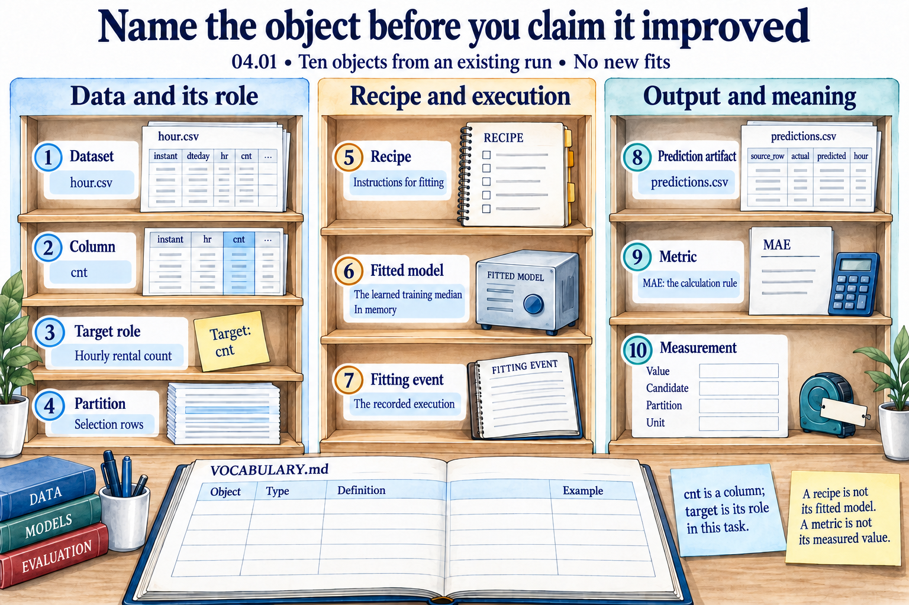

Selected: [name-experiment-objects-v2.png](name-experiment-objects-v2.png). Exact [prompt](name-experiment-objects-v2.prompt.md). The fitted model shown here is the constant baseline: it learns the training median. Other model families learn different parameters. This runner keeps the fitted object in memory during execution and saves its recipe and predictions; the picture does not imply a saved weights file. A fitting event is the action, and its trace is evidence of that action. Fill the blank measurement fields from the actual report, with candidate, partition, unit, and metric definition. No new fit is needed.

## Lab 04.03

Selected: [three-domain-invariants-v1.png](three-domain-invariants-v1.png). Exact [prompt](three-domain-invariants-v1.prompt.md). The headings state expected behavior, not recorded verdicts. The leakage case needs both the feature-use fact and its direct derivation from the target. Absence of that fact does not prove an input is valid. The supplied checker does not infer missing facts, follow arbitrary chains of derivation, or verify the table against a real run. Execute all six base cases. Then test the separate units extension with one present-unit and one missing-unit case; the original tool does not enforce that rule.

## Lab 04.04

Selected: [semantic-contradiction-repair-v1.png](semantic-contradiction-repair-v1.png). Exact [prompt](semantic-contradiction-repair-v1.prompt.md). The corrected-copy icon marks the intended repair; obtain an actual verdict by rechecking the table. Run the original failure, the corrected copy, and a separate renamed copy of the original: three checks, with no fits. Rename total_users in both related facts. The lower panel isolates those two facts; the full renamed table still contains the other two violations. Keep all reports. If the bad facts described an executed experiment, changing this document would not repair its model or validate its scores.

## Lab 04.05

Selected: [task-definition-availability-v1.png](task-definition-availability-v1.png). Exact [prompt](task-definition-availability-v1.prompt.md). Compare availability time with prediction origin, not with event time. A forecast can describe tomorrow and still be available today. These timestamps are synthetic examples in one time zone; a real source also needs release history, version identity, and the other task checks. The pinned bike data do not supply the required forecast archive. The exercise tests an availability rule and traces the impact of a changed definition; it does not train or score a day-ahead model. Preserve earlier results with their original task version.

## Lab 03.01

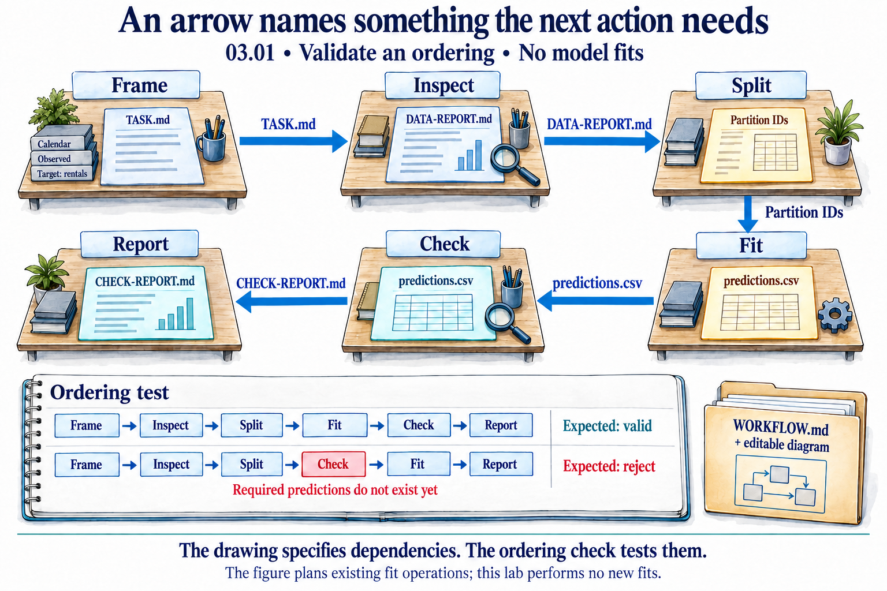

Selected: [artifact-dependencies-v2.png](artifact-dependencies-v2.png). Exact [prompt](artifact-dependencies-v2.prompt.md). Each edge names one dependency, not every input required by its destination. The fit also needs task data and a recipe; the checker also needs reference targets and row identities. A document shown at a desk can be an input being read or an output being written: follow the edge label to determine its role. Test ordering from an initial state without the candidate predictions, so a leftover file cannot conceal the invalid order. The small report icons are illustrative. This lab validates the graph without fitting another model.

## Lab 03.02

Selected: [valid-invalid-unknown-routes-v1.png](valid-invalid-unknown-routes-v1.png). Exact [prompt](valid-invalid-unknown-routes-v1.prompt.md). Valid means passing the declared local fixture check, not proof of all possible data-quality rules. Missing cnt supplies evidence of a violation; no check result supplies no verdict. Both stop this route, for different reasons. Ready for modeling is a routing decision only: no model fits run in this lab. Keep mutated fixtures outside the pinned data and record all three actual routes, exit statuses, and refusal reasons.

## Lab 03.03

Selected: [join-matching-evidence-v1.png](join-matching-evidence-v1.png). Exact [prompt](join-matching-evidence-v1.prompt.md). A and B denote candidate identities; v1 and v2 denote contract versions. The table gives expected fixture behavior, not observed resource availability. Run all four cases and retain actual verdicts. Missing evidence remains incomplete until the declared wait limit or stop rule applies. A matching pair can be processed sequentially; converging arrows do not prove concurrent execution or independent agent contexts. The fourth wrong-contract case is a new explicit requirement and remains unverified by the earlier three-case author run.

## Lab 03.04

Selected: [bounded-repair-cycle-v1.png](bounded-repair-cycle-v1.png). Exact [prompt](bounded-repair-cycle-v1.prompt.md). The blue notebook supplies the unchanged validation rule; the return edge carries the changed report and accumulated counter. Reserve each repair attempt before running it, and keep failed attempts in that fixture’s count. Two repair slots apply to each fixture, with at most four across the two runs; the expected examples use three. The smaller strips omit intermediate checks for space, but the executable controller must recheck after every repair. A third ineffective repair is not permitted. Success and failure are expected paths to test, not new execution claims.

## Lab 03.05

Selected: [recover-affected-descendants-v1.png](recover-affected-descendants-v1.png). Exact [prompt](recover-affected-descendants-v1.prompt.md). These chains show dependencies among actions and artifacts; they are not claims that a node just executed. In the required recovery exercise, reuse the checked baseline predictions and repair the report without another fit. The changed-split case is a simulation that plans invalidation, not authorization to mix old evidence into a new task or quietly retrain. Old results remain valid records of their original inputs. Record hashes or other reliable input identities, completion state, reuse decisions, and the absence of an extra fit.

## Lab 03.06

Selected: [plan-flow-trace-views-v2.png](plan-flow-trace-views-v2.png). Exact [prompt](plan-flow-trace-views-v2.prompt.md). Fit abbreviates the tool operation that fits on training rows and predicts for selection inputs; selection targets do not fit model parameters. A and its paths are illustrative identities to replace with the actual run’s records. The table states required flow, not proof that each file exists. The two gray trace entries mark actions not reached in this example, not fabricated executed events. For the real lab, inspect both completed and failed traces and confirm the relevant outputs before making a completion claim.

## Lab 02.01

Selected: [one-factor-model-change-v1.png](one-factor-model-change-v1.png). Exact [prompt](one-factor-model-change-v1.prompt.md). Both recipes receive the same calendar feature group; the constant predictor ignores its inputs. Hour, weekday, and season illustrate some permitted calendar fields, not the entire schema. The shared strip names fixed conditions, and the lower arrows collect comparison evidence; it is not a fitting operation. Blank cells must come from your two new fits. Inspect hourly slices as well as the aggregate score, and keep both candidates if the proposed improvement fails.

## Lab 02.03

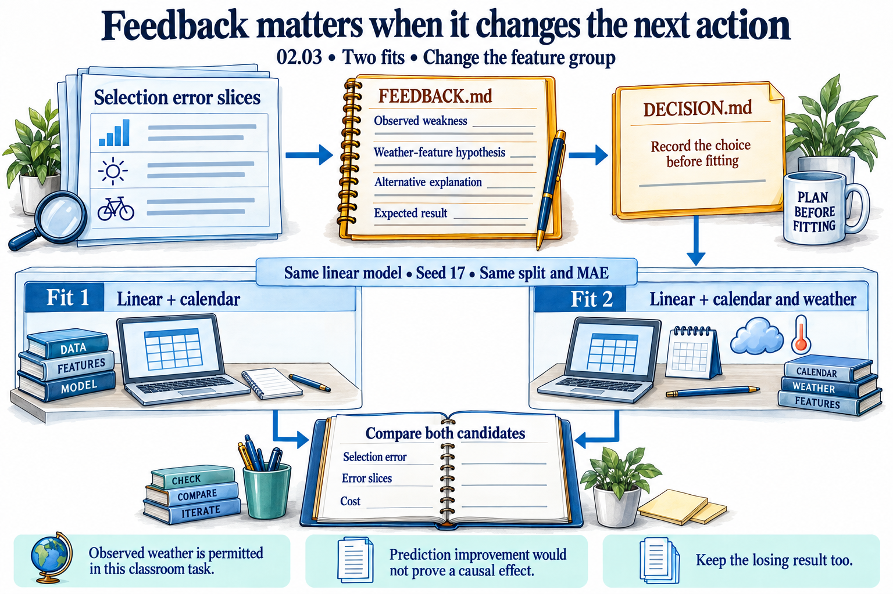

Selected: [feedback-to-feature-choice-v1.png](feedback-to-feature-choice-v1.png). Exact [prompt](feedback-to-feature-choice-v1.prompt.md). The top report is the prerequisite candidate’s saved selection evidence. The two new fits form the controlled comparison in this lab. Report icons do not establish a weather-related cause: write the actual observation, alternative explanation, and proposed test. The right-hand recipe corresponds to the tool’s all feature group, which adds permitted observed weather to calendar fields. Record the decision before that fit; an explanation written afterward does not show feedback governed the action. Fill costs and outcomes from execution.

## Lab 02.04

Selected: [duplicate-and-budget-stops-v1.png](duplicate-and-budget-stops-v1.png). Exact [prompt](duplicate-and-budget-stops-v1.prompt.md). This sequence assumes requests 1 and 2 have consumed the two allowed fit slots. Check duplicates before budget so request 3 records the duplicate reason; request 4 is distinct and demonstrates the budget refusal. The tree and forest drawings are mnemonics for model names. The request trace records admitted and refused work; the fit ledger records actual attempts. A refusal has no executed model score, but proposal and checking costs can still exist. The drawn gates state intended controller behavior, which you must test.

## Lab 02.05

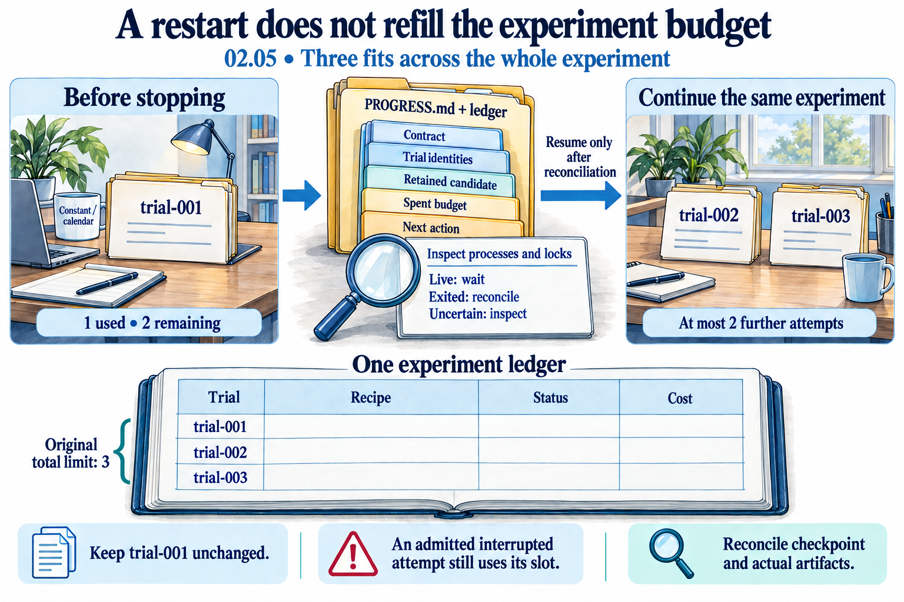

Selected: [resume-shared-budget-v1.png](resume-shared-budget-v1.png). Exact [prompt](resume-shared-budget-v1.prompt.md). This depicts an orderly pause after trial-001, not interruption during its fit. The right-hand files represent the remaining possible attempt identities, not already successful results. Inspect live work and actual artifacts before resuming; a saved lock alone does not prove a process is active. An admitted attempt that is later interrupted still occupies its slot and keeps its known cost. Reconcile a stale progress note with the durable ledger rather than silently refilling the budget. A program restart does not itself establish a fresh agent context.

## Lab 02.06

Selected: [matched-search-budgets-v1.png](matched-search-budgets-v1.png). Exact [prompt](matched-search-budgets-v1.prompt.md). The four fit cards are four actual attempts to execute in separate workspaces; arm B cannot reuse arm A’s first fit as its own. A1 to A2 shows execution order, not an updated baseline recipe. Predeclare the replication allowance for arm A so a duplicate guard does not change its method. The arm-B decision precedes B2, and neither a plausible diagnosis nor this drawing establishes a win. Record context exposure and costs beyond fitting. This small comparison tests two fixed search procedures, not an improver revising itself.

## Lab 01.02

Selected: [fixed-process-trace-v2.png](fixed-process-trace-v2.png). Exact [prompt](fixed-process-trace-v2.prompt.md). The five numbered rows are actions to record, not evidence that they succeeded. Fill the trace as each action occurs and preserve failures. Compare the new run with the earlier recipe and artifacts after execution; never copy old predictions into the new run as if they were newly fitted. A matching rounded score alone does not establish matching predictions. The one-fit limit includes the attempt you record; this lab does not introduce search or recipe revision.

## Lab 01.03

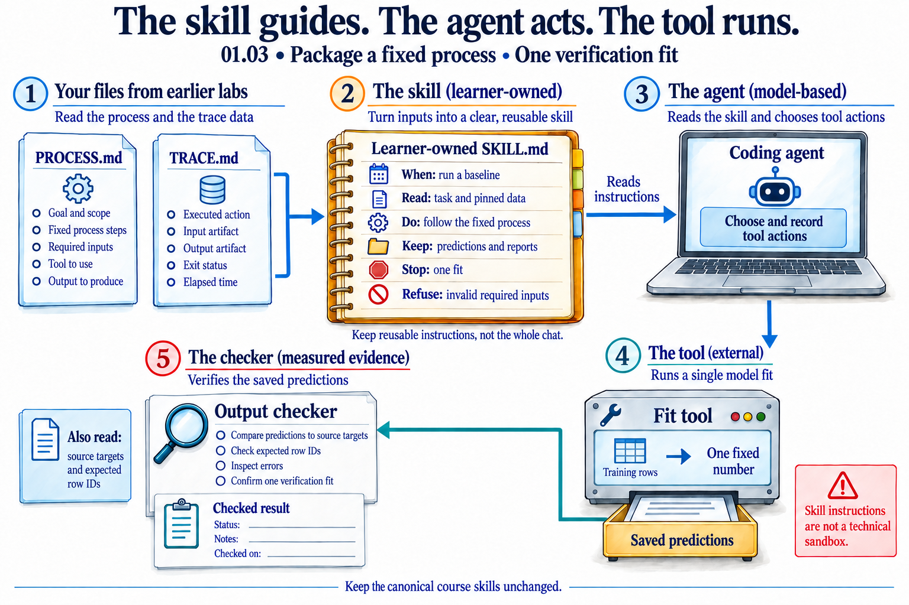

Selected: [skill-agent-tool-check-v2.png](skill-agent-tool-check-v2.png). Exact [prompt](skill-agent-tool-check-v2.prompt.md). These are distinct responsibilities within one agent workflow, not independent security domains. The one fitted number is the training median. The learner skill must name actual dependencies and concrete refusal checks; the compact notebook is an outline, not a complete runnable skill. To confirm the one-fit budget, inspect the trial ledger and instruction-to-action trace as well as predictions. Blank checker results must be filled from execution. Preserve the canonical course skills.

## Lab 01.04

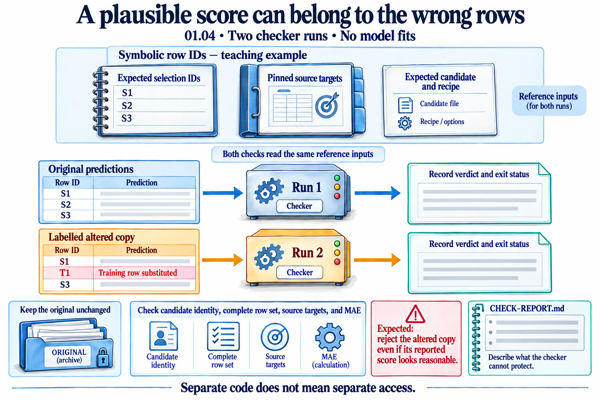

Selected: [row-identity-check-v1.png](row-identity-check-v1.png). Exact [prompt](row-identity-check-v1.prompt.md). S1, S2, S3, and T1 are symbolic IDs. The red text in the altered table is an annotation, not a prediction value. Change only the ID in the real teaching copy; preserve prediction values and the original file. Both runs use the same checker code and reference inputs despite the different illustration colors. Check the full row set, duplicates, candidate identity, and targets from pinned data. The archive lock means preserve the original; it does not establish access control. Record actual verdicts and nonzero failure status.

## Lab 01.05

Selected: [fresh-session-handoff-v2.png](fresh-session-handoff-v2.png). Exact [prompt](fresh-session-handoff-v2.prompt.md). The bridge shows the intended file-based handoff, not proven isolation. The new session must be able to read the exact skill and dependencies; a hash without the file is insufficient. Inspect imported conversation, host memory, and other exposure before describing the boundary. If the host cannot provide a fresh session, label the exercise a same-context demonstration. The earlier checkmarks depict prepared inputs; the output tray contains no measured result yet. Compare after execution, without supplying the old score as a target. Reusing the same skill establishes no adaptive improvement.

## Lab 00.02

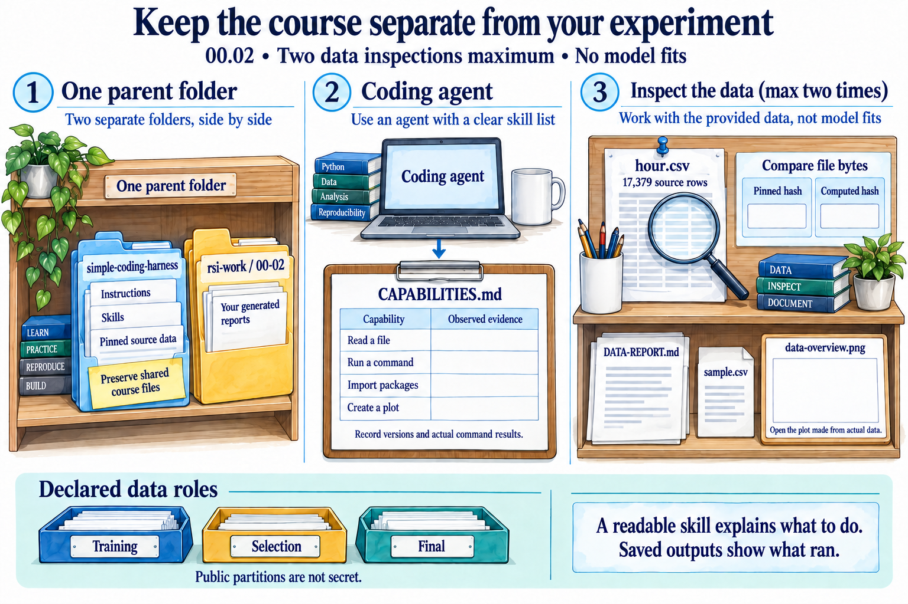

Selected: [inspectable-workspace-v2.png](inspectable-workspace-v2.png). Exact [prompt](inspectable-workspace-v2.prompt.md). The two folders are siblings. The slash in rsi-work / 00-02 shows the lab subfolder inside the learner workspace. Blank cells are evidence to collect, not passed checks. A skill list can be read from files; native skill discovery is not required. The blank frame stands for your generated plot; the measured author example appears below. A matching hash establishes file identity, not data quality or secrecy. Preserve the shared course files by following the workspace rule; this drawing does not establish access-control isolation.

## Lab 00.03

Selected: [training-median-baseline-v1.png](training-median-baseline-v1.png). Exact [prompt](training-median-baseline-v1.prompt.md). All values in the notebooks are invented to explain the calculation. Rows A, B, and C are different selection cases, not three more training points. The predictor learns the median from training only and does not use input features. Save the actual recipe, predictions, result, and trial ledger in your run; your measured full-partition MAE will differ from this toy value. One fit gives a baseline, not evidence of an improvement loop.

## Lab 00.04

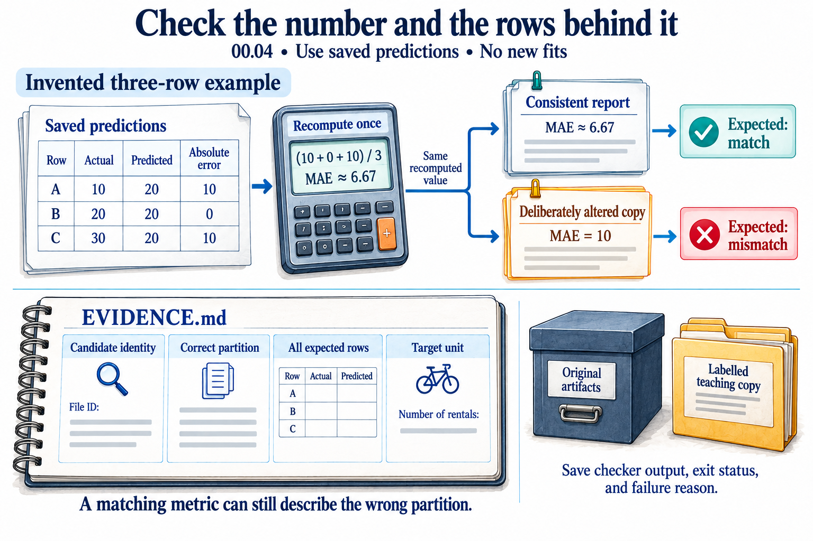

Selected: [evidence-beyond-score-v1.png](evidence-beyond-score-v1.png). Exact [prompt](evidence-beyond-score-v1.prompt.md). The branches mean compare the recomputed value with each report; they do not rewrite either report. Expected match and mismatch apply to the invented example, not an unexecuted student run. For the actual baseline, preserve the original artifacts, alter only a labelled report copy, and save both checker outcomes. Use the report’s declared numerical precision when comparing rounded values. Verify the target unit as rentals per hour and establish the complete row set; a correct average alone cannot establish the right partition.

## Lab 10.13

Selected: [inner-ml-researcher-v2.png](inner-ml-researcher-v2.png). Exact [prompt](inner-ml-researcher-v2.prompt.md). The four tickets include failed attempts. Fill the ledger from actual execution and keep the retained recipe distinct from the best intermediate number. Calendar and permitted weather inputs follow the classroom hourly-bike contract; the figure adds no new features or dates. A fixed procedure can select different actions without rewriting itself. This local four-fit exercise does not reproduce the full AIDE² run.

## Lab 10.15

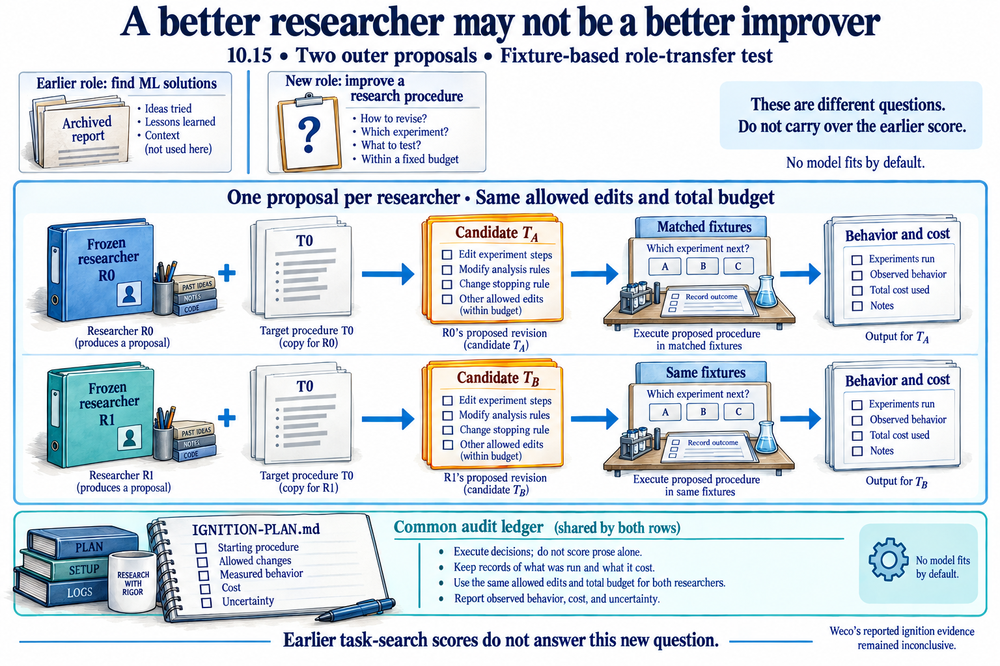

Selected: [ignition-role-transfer-v1.png](ignition-role-transfer-v1.png). Exact [prompt](ignition-role-transfer-v1.prompt.md). R0 and R1 are the producers; T0 is the object they revise. The pictured edits are examples subject to your declared allowed edits, not permission to change the evaluator. Fixtures execute the affected decisions without model fitting by default. Record both proposal and checking costs. Do not carry an earlier task-search score into this new comparison. Weco reported insufficient ignition evidence; this tiny role-transfer exercise cannot establish sustained recursive gains.

## Lab 10.16

Selected: [fixed-meta-skill-v2.png](fixed-meta-skill-v2.png). Exact [prompt](fixed-meta-skill-v2.prompt.md). The lock means the updater bytes must remain unchanged, which the agent checks before and after. The four responsibilities simplify the paper’s full pipeline. Regression case means a case that detects lost behavior, not necessarily an ML regression task. The two blank reports are child checks; saved parent evidence must be comparable before it can support a gain. A missing comparable parent result requires a revised claim or a separately declared budget, not hidden extra executions. Neither outcome is assumed.

## Lab 10.09

Selected: [replay-to-online-v2.png](replay-to-online-v2.png). Exact [prompt](replay-to-online-v2.prompt.md). The repeated P1 label links the earlier selection to the right-hand candidate; P0 remains the baseline. No online result is assumed. Frozen code can choose actions from new observations under its declared rule without rewriting itself. Record what makes the new work distinct, what the author or agent already knew, and any exposure that weakens the confirmation claim. Keep historical replay costs and new execution costs separate in the ledger, then report the full cost without double-counting shared work. This is a classroom plan, not a Dream-RSI reproduction.

## Lab 10.11

Selected: [integration-seven-checks-v1.png](integration-seven-checks-v1.png). Exact [prompt](integration-seven-checks-v1.prompt.md). The units conflict is an illustrative fixture design, not a recorded diagnosis of the paper. Fill all observed-outcome cells from execution. The missing-field refusal is expected behavior to test; record whether the fit stub was actually avoided. The storage tray is illustrative: retain all four harness versions, including the baseline and combined A+B, along with all three fixtures and their hashes. A passing local check does not automatically establish transfer, and a single fresh fixture provides only narrow evidence.

## Lab 10.12

Selected: [agent-and-improver-lineages-v1.png](agent-and-improver-lineages-v1.png). Exact [prompt](agent-and-improver-lineages-v1.prompt.md). A0, A1, and A2 identify agent versions, not scores or task conditions. The two strips illustrate possibilities; neither is assigned to DGM or HyperAgents. DGM reuses evolving coding agents for self-modification, so labelling it a fixed-operator system from this cartoon would be misleading. In the lower example, later use of O1 needs an actual trace; improved effectiveness needs an additional fair comparison. Read each original source and record which procedure, code, model, and evaluation components remain fixed.

## Lab 10.05

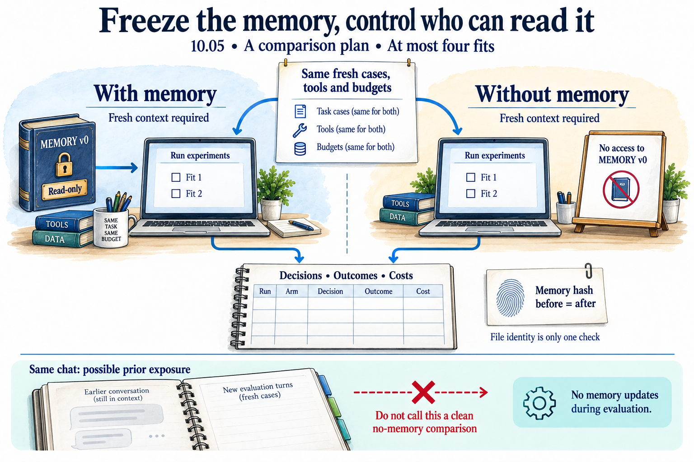

Selected: [frozen-memory-comparison-v1.png](frozen-memory-comparison-v1.png). Exact [prompt](frozen-memory-comparison-v1.prompt.md). This depicts the intended comparison, not established isolation or a measured memory benefit. Confirm what each arm can actually read, including prior conversation, files, and other retrieval sources. The hash equality is a condition to check after the run. If the agent cannot start separate controlled contexts, label the activity a shared-context demonstration and limit the claim. The crossed arrow below rejects a clean-ablation inference; it does not suggest that disabling writes erases earlier exposure.

## Lab 10.06

Selected: [working-state-and-experience-v1.png](working-state-and-experience-v1.png). Exact [prompt](working-state-and-experience-v1.prompt.md). Run A, run B, and the remaining-attempt values are constructed fixtures. They do not authorize fits in this no-fit lab. The green and red markers show expected retrieval decisions that the learner must verify. Replace generic evidence labels with actual source-run IDs and artifact links. An old candidate can remain in its historical record without becoming the new run's active candidate. Useful retrieval still needs correct application; keeping a lesson alone establishes no performance gain.

## Lab 10.07

Selected: [discovery-tree-evidence-v1.png](discovery-tree-evidence-v1.png). Exact [prompt](discovery-tree-evidence-v1.prompt.md). This is a record layout to fill from actual execution. A, B, and C consume at most three attempted fits, including failures. D's generic attachment icon is only a placeholder for a proposal record; its explicit no-fit label means no execution evidence exists. Record proposal costs even for ideas never fitted. The unscored R matches the source distinction between an initial workspace and trial outcomes. This simplified recipe-ancestry tree does not implement Dream-RSI's full online node-eligibility, concurrency, or replay transition rules.

## Lab 10.01

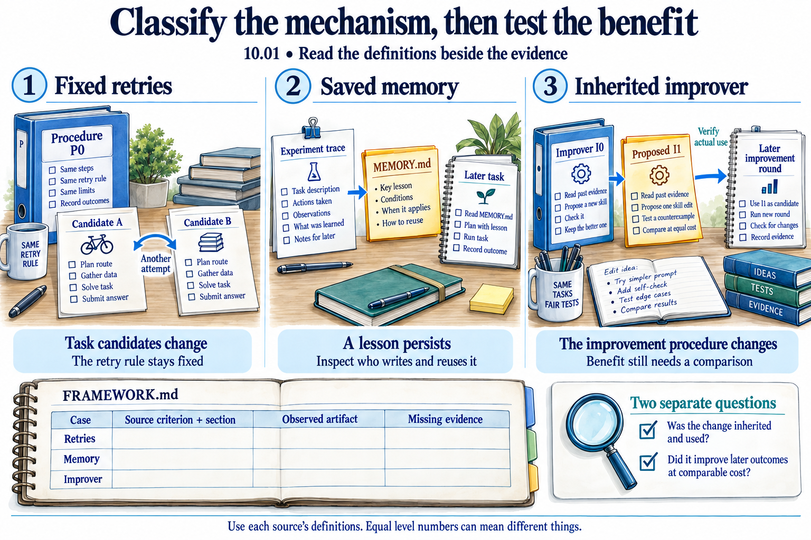

Selected: [classify-the-mechanism-v1.png](classify-the-mechanism-v1.png). Exact [prompt](classify-the-mechanism-v1.prompt.md). The three numbered panels are cases to inspect, not universal levels or a required ladder. The pictured task sheets and improver edits are examples; substitute your saved artifacts. The two question markers are reminders to ask for evidence, not passing verdicts. Reading a memory or testing candidate I1 does not establish a benefit. Map the actual retained state and later behavior to the chosen source definition, then assess effectiveness separately.

## Lab 10.02

Selected: [announcement-evidence-trail-v2.png](announcement-evidence-trail-v2.png). Exact [prompt](announcement-evidence-trail-v2.prompt.md). The quotation is invented for teaching and is not attributed to a real author or lab. The 20 August–20 September 2026 window is the authoring example; roll it forward to the preceding month when you run the lab. Inspect available links and record missing ones. A blocked thread does not invalidate a separately accessible paper, but its contents remain unread. A reproduction has its own methods and limitations. Document the original release and any substantive revision separately from repost and crawl dates.

## Lab 10.03

Selected: [broad-probes-focused-test-v2.png](broad-probes-focused-test-v2.png). Exact [prompt](broad-probes-focused-test-v2.prompt.md). The course predicts hourly bike rentals. Calendar and weather labels are examples from permitted groups, not the complete schema; weather category is not a precipitation measurement. The constant baseline learns its mean from training data. Choose the third recipe from actual selection errors before fitting, and record its question and cost. Observed weather is allowed by this teaching contract; it does not establish that the same inputs would be available in a real forecast. The exploration rule itself can remain fixed.

## Lab 10.19

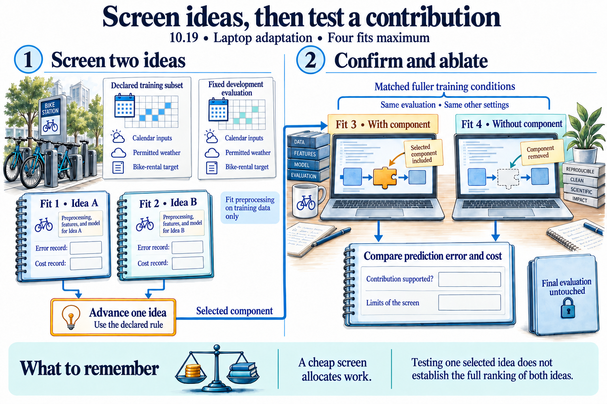

Selected: [screen-and-ablate-v2.png](screen-and-ablate-v2.png). Exact [prompt](screen-and-ablate-v2.prompt.md). The four numbered fits exhaust the budget. The upper data cards describe shared training and evaluation roles; the bike-rental target is the value to predict, never a feature. Fit preprocessing only on the declared training subset. The selected component advances to Fit 3 and is removed in Fit 4. This tests its contribution under fuller conditions; it does not reveal the full-scale ranking of both screened ideas. Read labels rather than decorative calendar cells as the split specification.

## Lab 10.20

Selected: [review-to-evidence-v1.png](review-to-evidence-v1.png). Exact [prompt](review-to-evidence-v1.prompt.md). This is an illustrative follow-up to the earlier linear-model study, not an already observed criticism or result. Predeclare the tree recipe and comparison, then retain both sets of predictions and errors. A one-pair follow-up can narrow the tested scope; it cannot establish universality across models or quantify all sources of variation. The outcome cards are alternatives. The main horizontal arrows show the reading order; write the response only after inspecting the evidence. Automated review is not human conference acceptance.

## Lab 10.21

Selected: [discovery-and-researcher-v2.png](discovery-and-researcher-v2.png). Exact [prompt](discovery-and-researcher-v2.prompt.md). A1 and A2 name retained-state records, not guaranteed new or better solutions. Rejection can preserve the previous artifact. An unchanged procedure hash says nothing by itself about changing memory, context, tools, or model versions, so record those too. The lower scene is the proposed comparison from the transfer exercise; this lab requires no new fits. Compare research outcomes under matched conditions before making a claim about a better research procedure.

## Lab 10.22

Selected: [correction-to-rubric-v1.png](correction-to-rubric-v1.png). Exact [prompt](correction-to-rubric-v1.prompt.md). The miniature rows are illustrative placeholders, not saved course predictions. Their zero/one values represent derived class labels; the original wine-quality rating is not binary. Use your actual predictions and declared threshold in the activity. The pictured verdicts are expected fixture outcomes to verify. This request is a classroom construction, not a real researcher interview. The presence check detects an omission; validating metric computation and scientific meaning requires further evidence.

## Lab 10.23

Selected: [reporting-skill-adaptation-v2.png](reporting-skill-adaptation-v2.png). Exact [prompt](reporting-skill-adaptation-v2.prompt.md). Changing instructions can change outputs while model weights stay fixed. The parent text is an intentionally weak teaching example. Supply the same evidence packet to both versions within each column, and record actual outputs and context limits. An honest missing-evidence statement can satisfy a declared limitation criterion, but it does not supply the missing recall or earn a full evidence pass. The matrix remains unexecuted in this illustration; no candidate improvement is assumed.

## Lab 10.24

Selected: [grouped-rewards-v1.png](grouped-rewards-v1.png). Exact [prompt](grouped-rewards-v1.prompt.md). The stabilizer makes the advantage magnitude 0.999998000004, shown approximately as one. For the pictured toy, start four softmax logits at zero and take gradient ascent on the displayed weighted log-probability objective with step size 0.1. “Weight” here means probability assigned to a toy action, not an LLM checkpoint. The wrong-reward card belongs to the separate edge case; rerun a four-item group with one corrupted score. The illustration specifies arithmetic to execute and is not full GRPO or evidence of scientific correctness.

## Lab 10.26

Selected: [sciencebuddy-result-audit-v1.png](sciencebuddy-result-audit-v1.png). Exact [prompt](sciencebuddy-result-audit-v1.prompt.md). Read these as paper-reported comparisons, not our reproductions. The primary result sections are 4.2, 4.3, and 4.4. Section 4.2’s heading says “Two-Cycle,” but its setup and Figure 8 describe three cycles; the course follows that explicit protocol. Preserve the distinctions among scientific task families, splits, attempt budgets, and feedback sources in your audit. The fixed reflector limits what can be claimed about improvement of the improvement procedure itself.

## Lab 10.35

Selected: [operator-composition-v1.png](operator-composition-v1.png). Exact [prompt](operator-composition-v1.prompt.md). The write-surface rows are separate examples, not one sequential run. The evidence panel compares two exact version sets and requires a fresh diagnosis after the harness changes. Q1’s interface rule is an original classroom example. Its accepted path shows structural inheritance; the checks and outcome still need execution and do not establish benefit. Preserve Q0 if the revision fails. This five-check simulation omits much of MetaRSI’s full architecture and does not train an LLM. The external evaluator and allowed write boundaries remain fixed.

## Lab 10.36

Selected: [checked-reference-v1.png](checked-reference-v1.png). Exact [prompt](checked-reference-v1.prompt.md). These are constructed trace fixtures. The usable-reference marks represent the example’s required execution evidence, not a completed source reproduction. Check the actual traces before diagnosis. The candidate must pass its quality check before proceeding to the two fixture evaluations; reject a failed quality check immediately. “Independent fixtures” means distinct current and prior cases, not proof of isolated agent contexts. The alternative orders are valid for this particular audit. The general instruction contains no case answer, and the final keep-or-reject result is unresolved.

## Lab 10.37

Selected: [compare-research-systems-v1.png](compare-research-systems-v1.png). Exact [prompt](compare-research-systems-v1.prompt.md). The ledger is a template to fill, not a completed comparison. Link paper claims to their primary method and result sections; use raw execution records where available and mark missing evidence unresolved. Link local claims to the course’s actual records. The named folders carry no rank or inferred method assignment. The lower challenge needs two distinct checks: whether an improver changed and governed later work, and whether its downstream outcomes improved under a fair total-resource comparison. A task-score gain alone answers neither.

## Lab 10.38

Selected: [research-bottlenecks-v1.png](research-bottlenecks-v1.png). Exact [prompt](research-bottlenecks-v1.prompt.md). Use the explicit numbers, not the decorative clock faces, to read the example. The five scenarios are alternatives; they are not successive generations. Execution time is set to zero only for this teaching calculation. Restore measured execution, failures, retries, and other costs in a real ledger. The instant-proposal limit follows from the baseline and is not a sixth run. The gain units below are a separate illustration; an acceleration claim must also account for resources and difficulty. This is neither a forecast nor the economics paper’s calibrated model.

## Lab 10.32

Selected: [memory-interface-v2.png](memory-interface-v2.png). Exact [prompt](memory-interface-v2.prompt.md). These counts are a synthetic teaching example. After adding three and removing one, the checkpoint is two; adding two more gives four. The faulty summary omits the removal. Do not pre-fill the actor’s answer or supply the checker’s result in its input. The two extra-description conditions change wording, not state transitions. The drawn counters and tally frame are props; the explicit event tape defines the arithmetic. This external-memory exercise does not reproduce S3Gym’s game or training protocols, and a shorter representation is not presumed better.

## Lab 10.33

Selected: [feedback-scaffolds-v1.png](feedback-scaffolds-v1.png). Exact [prompt](feedback-scaffolds-v1.prompt.md). The dataset names and field values are illustrative form fixtures, not real dataset results. The task cards specify required values; they are distinct from the added hints. Use a genuinely fresh fixture for the unassisted attempt and record any shared-context exposure. The stale-hint case asks what the actor actually does; no recovery is assumed. Compare all four traces with executable checks. This inference exercise illustrates assistance types discussed in Environments as Scaffold; it does not reproduce reinforcement learning or demonstrate a parameter update.

## Lab 10.34

Selected: [harness-compatibility-v1.png](harness-compatibility-v1.png). Exact [prompt](harness-compatibility-v1.prompt.md). The displayed verdicts are expected outcomes of these constructed format fixtures, not archived test results. Run all four checks. Accepting the field labels does not establish that candidate A is valid or that a task succeeded. The parser remains unchanged. The source study concerns broader planning compatibility and actual model training; the local field repair is only an analogy. Its separate training inset does not turn this four-check activity into an LLM-training experiment.

## Lab 10.30

Selected: [quality-cost-v1.png](quality-cost-v1.png). Exact [prompt](quality-cost-v1.prompt.md). This classroom change removes redundant report work; it is not an implementation of SoL-Pi’s four mechanisms. Both variants must meet the declared quality requirement before an efficiency conclusion is allowed. Fill the ledger with actual observations, include proposal and checking overhead, and keep unknown usage unknown. The failure tray represents recorded attempts whose costs remain in the ledger. The separate fit-stub example fails because required evidence is absent. The figure contains no measured saving or recursive compounding result.

## Lab 10.31

Selected: [builder-and-artifact-v2.png](builder-and-artifact-v2.png). Exact [prompt](builder-and-artifact-v2.prompt.md). Read the two source panels separately. A source system’s name does not identify its changed object. The lower experiment evaluates a generated ML harness under an unchanged builder. Both H0 and H1 feed the matched check before a decision; checklist marks name operations, not successful measurements. The final strip proposes a different experiment for a builder claim: the same fresh briefs are inputs to both builders, and their generated systems must be evaluated. It is not a completed extension to this lab’s two-check-or-fit budget. No model-weight update or general builder improvement is established.

## Lab 10.27

Selected: [knowledge-stores-v1.png](knowledge-stores-v1.png). Exact [prompt](knowledge-stores-v1.prompt.md). The notebook can contain lessons from earlier failures and receives the new result after checking. It is not rolled back with a rejected skill edit. In this controlled activity, the actor reads the active skill; the improver can consult the trace and notebook. Record actual reads: role instructions alone do not enforce isolation. The rejected S1 is illustrative, not a measured course result. This is a small WikiSkill-inspired exercise with two fixtures and no new model fit.

## Lab 10.28

Selected: [procedure-graph-v1.png](procedure-graph-v1.png). Exact [prompt](procedure-graph-v1.prompt.md). The left map explains conditional routing; the notebook isolates an example bug and its proposed repair. Test the target failure and a regression case before retaining a graph, then freeze that version for the fresh case. A rejected edit leaves the prior graph in place. The fourth fixture checks meaning: a target component can have the expected numeric type and still be forbidden as an input. The graph and domain rule have distinct jobs. All four fixtures use a fit stub; the figure records no successful test or model training.

## Lab 10.29

Selected: [gui-skill-repair-v1.png](gui-skill-repair-v1.png). Exact [prompt](gui-skill-repair-v1.prompt.md). The enlarged warning is a reader callout to information already present on the page. It was not observed in the pictured failed attempt and must not be added to that attempt’s critic packet. Supply only the declared visible trace, not the skill package or answer key. Use a separate critic context where available; otherwise label the shared context. The rule-check ticks name operations, not recorded passes. Compare the critic’s verdict with the executable result. This EvoSkill-inspired classroom task allows two actual UI attempts and no new model fits; the illustration is not an execution record.

## Lab 09.02

Selected: [fixed-improver-v2](fixed-improver-v2.png). Exact [prompt](fixed-improver-v2.prompt.md). I0 remains the same in both rounds. Match the Generation 1 retained skill to the named parent of Generation 2. A rejected proposal never becomes that parent. The pictured decisions are unselected possibilities; these generation numbers do not demonstrate a changed improver or guaranteed improvement.

## Lab 09.03

Selected: [improver-proposal-v1](improver-proposal-v1.png). Exact [prompt](improver-proposal-v1.prompt.md). This intentionally weak I0 is a classroom example. The added internal rule changes how task-skill proposals are tested; it does not change the external evaluation contract. Notebook marks identify actions, not successful measured fixture results. Keep both versions and compare actual decisions and overhead before making a benefit claim.

## Lab 09.05

Selected: [improver-comparison-v1](improver-comparison-v1.png). Exact [prompt](improver-comparison-v1.prompt.md). Apply the declared retention rules during each round. The I0 and I1 labels on the descendant reports identify the producing improver; give task skills their own version identities. Compare retained results and all known costs, including failures. Separate folders do not establish independent contexts. Eight fits is a maximum; benefit, regression, and inconclusive outcomes are all possible.

## Lab 09.06

Selected: [bounded-lineage-v1](bounded-lineage-v1.png). Exact [prompt](bounded-lineage-v1.prompt.md). A finished check does not by itself promote a proposal: record the keep-or-reject decision. On resume, read the saved active versions and cumulative budget. Preserve rejected proposals as evidence without activating them. The image is a procedure; the recorded course run rejected both improver revisions and did not demonstrate a successful changed-improver lineage.

## Lab 09.07

Selected: [claim-evidence-v1](claim-evidence-v1.png). Exact [prompt](claim-evidence-v1.prompt.md). Structural recursion needs executed later use of the changed improvement procedure. Benefit needs a fair comparison of what the procedures produce. Acceleration concerns an increasing progress rate across generations after accounting for resources and bottlenecks; a constant speed advantage or two favorable points is insufficient. The records are conceptual, not measured results.

The five individual capstone figures are now published, separate from the capstone overview. Four used one draft; 11.05 used two. Its retained [first draft](capstone-teach-back-v1.png) and [prompt](capstone-teach-back-v1.prompt.md) document the corrected leakage and missing changed-rule problems. The [source preflight and review](../../validation/RSI-AND-CAPSTONE-ILLUSTRATIONS.md) record the check for each lab.

## Lab 11.01

Selected: [capstone-new-brief-v1](capstone-new-brief-v1.png). Exact [prompt](capstone-new-brief-v1.prompt.md). Choose the scientific task before generating its harness. The two stations are tests to perform, not passed results. Record actual execution and a meaningful refusal. The tool-case checklist denotes components; it does not certify their behavior. Keep the required path within four CPU fits.

## Lab 11.02

Selected: [capstone-recursion-v1](capstone-recursion-v1.png). Exact [prompt](capstone-recursion-v1.prompt.md). These are the evidence needed to inspect the experiment. Distinguish a candidate trial from retained use; promote only through the declared decision and trace whichever version actually governs the next round. Match starting artifacts and external comparison rules. Eight fits is the total maximum across the two-generation protocol, with agent-inference limits declared separately.

## Lab 11.03

Selected: [capstone-portability-v1](capstone-portability-v1.png). Exact [prompt](capstone-portability-v1.prompt.md). Test these dimensions separately. Describe what changed in Task B; a different label does not establish task transfer. Choose two small tests you can actually run and leave other combinations explicitly untested. The pictured notebooks and machines are examples, not certified environments.

## Lab 11.04

Selected: [capstone-audit-v1](capstone-audit-v1.png). Exact [prompt](capstone-audit-v1.prompt.md). A source announcement, supported result, and independent reproduction are different evidence. Record the source date, version, and what you actually read. State the strongest support and the main limitation, then propose an observation that could change your conclusion. No pictured source or experiment is a reported result.

## Lab 11.05

Selected: [capstone-teach-back-v2](capstone-teach-back-v2.png). Exact [prompt](capstone-teach-back-v2.prompt.md). Keep the target out of model inputs; it belongs in the error check. Trace the added contrasting-case rule into an executed later action. The small strip can represent a candidate trial; it does not itself prove retention or benefit. Show the real comparison and decisions in the portfolio. The peer scene is illustrative: record a session only after it occurs and mark pending review honestly.

## Your route through the course

Selected: [v2](course-mindmap-v2.png). Prompts: [initial](course-mindmap-v1.prompt.md), [revision](course-mindmap-v2.prompt.md). Earlier output: [v1](course-mindmap-v1.png).

V2 corrects the premature RSI label on the generated harness, replaces unclear ontology edges with explicit model relations, and shows the revised improver's later use. All twelve theme numbers are present. Its grouping lines are conceptual, not execution dependencies. Embedded in the main README, guided course map, and theme orientation.

## Inside the research studio

Selected: [v3](research-studio-map-v3.png). Prompts: [v1](research-studio-map-v1.prompt.md), [v2](research-studio-map-v2.prompt.md), [v3](research-studio-map-v3.prompt.md). Earlier outputs: [v1](research-studio-map-v1.png), [v2](research-studio-map-v2.png).

The review corrected an invented modular-component list, separated task-skill actions from updater actions, and removed a misleading connector. The final numbered procedure avoids a route that bypassed checking. All thirteen group IDs are present. The nearby caption distinguishes abridged scenes from actual source results and the ScienceBuddy laptop examples from LLM training.

## The five capstones

Selected: [v3](capstone-map-v3.png). Prompts: [v1](capstone-map-v1.prompt.md), [v2](capstone-map-v2.prompt.md), [v3](capstone-map-v3.prompt.md). Earlier outputs: [v1](capstone-map-v1.png), [v2](capstone-map-v2.png).

The recursive panel now has four explicit stages: propose I1, run matched trials with changed-rule use, compare outcomes and cost, and keep or reject. V2 corrected automatic-looking inheritance and an audit label that presumed support; v3 removed one remaining ambiguous data connector. The map names all five labs and preserves the two-generation, eight-fit maximum. No acceptance or portability result is selected. See the [review record](../../validation/COURSE-NAVIGATION-ILLUSTRATIONS.md).

## From an experiment to RSI

Selected: [v2](main-overview-v2.png). Prompts: [initial](main-overview-v1.prompt.md), [revision](main-overview-v2.prompt.md). Earlier output: [v1](main-overview-v1.png).

Full-size review found two problems in v1: invented table/prediction values could resemble measurements, and the accepted improver did not preserve the proposed revised rules. V2 removes those values and repeats the counterexample rule in proposed I1, accepted I1, and the later round. It retains a rejection branch, public records, fixed evaluation, and the warning that a change can fail. Its accepted revision is a conceptual possibility, not an observed successful recursive result. The main README and 09.01 caption make that limit explicit.

## The answer hidden in an input

Selected: [v2](target-leakage-v2.png). Prompts: [initial](target-leakage-v1.prompt.md), [revision](target-leakage-v2.prompt.md). Earlier output: [v1](target-leakage-v1.png).

V1's two input connectors both appeared to start at the weather card. It also added decorative curves and ascending bars. V2 gives calendar and observed weather separate connectors and replaces the chart marks with neutral records and a comparison symbol. Full-size review confirms the addition relation, blocked shortcut, and two inputs to the error check. Observed weather is permitted for this retrospective task, without a day-ahead availability claim.

## A loop needs memory and a way out

Selected: [v1](bounded-loop-v1.png). Exact [prompt](bounded-loop-v1.prompt.md). No revised output was needed after full-size mechanism review.

The normal route is Propose → Run → Check → Record → Continue. The limit branch stops. A failed fit bypasses successful-result checking, reaches Record, and still consumes an attempt. The central notebook holds identity, incumbent, allowance, and last checked step. The resume strip reads the same state and budget. The caption adds reconciliation of in-progress attempts before resumption. The small model-surface icon is conceptual and has no measured axes or values.

## The builder and the system it builds

Selected: [v2](meta-harness-v2.png). Prompts: [initial](meta-harness-v1.prompt.md), [revision](meta-harness-v2.prompt.md). Earlier output: [v1](meta-harness-v1.png).

V1 separated brief, builder, package, and execution correctly but added decorative result bars and a curve. V2 replaces those with neutral document lines and a tree symbol. Full-size review confirms one-way generation, an unchanged builder, the five package components, and a separate run stage. The caption states that this fixed-builder example does not establish RSI. Checked execution is evidence of behavior, not a guarantee that a model improved.

## Workflow and domain meaning

Selected: [v1](graph-ontology-v1.png). Exact [prompt](graph-ontology-v1.prompt.md).

Full-size review confirms the valid/invalid split branch, the separate scaler/train and search/selection relations, and the distinct edge legend. The right panel contains selected facts and one constraint, not a complete ontology. Its caption requires checking implementation against declared facts. Added to 04.02.

## Similar words, different changes

Selected: [v2](self-star-v2.png). Prompts: [initial](self-star-v1.prompt.md), [revision](self-star-v2.prompt.md). Earlier output: [v1](self-star-v1.png).

V1 depicted the updated policy as another game board and overgeneralized the memory example. V2 shows a policy table, a valid nonterminal game position, and a specific missing-input observation. The fixed improver and fixed self-play update remain separate from active instruction modification. The emergence panel is an illustrative group-pattern analogy, not measured queue evidence. Added to the self-* theme overview and 07.08.

## The next round must use the change

Selected: [v1](inherited-improver-v1.png). Exact [prompt](inherited-improver-v1.prompt.md).

Full-size review confirms consistent proposed/active I1 instructions, an executed check connected to the new rule, retention of I0 on rejection, and separate rejection of a later skill proposal. The accepted path is conceptual. Its caption preserves the negative outcome of the actual two-generation comparison. Added to 09.04.

## Replay stops at the edge of the record

Selected: [v2](replay-boundary-v2.png). Prompts: [initial](replay-boundary-v1.prompt.md), [revision](replay-boundary-v2.prompt.md). Earlier output: [v1](replay-boundary-v1.png).

Both versions preserve the recorded baseline, tried change, failed attempt, and unknown branch. V2 removes unrequested small-print prose; Markdown carries the source and scope explanation. The left snapshot never gains an invented result from the separate new-execution panel. Added to 10.08 as an original Dream-RSI-inspired classroom explanation.

## Two ways to improve a scientific agent

Selected: [v4](model-harness-v4.png). Prompts: [initial](model-harness-v1.prompt.md), [technical revision](model-harness-v2.prompt.md), [visual redesign](model-harness-v3.prompt.md), [targeted correction](model-harness-v4.prompt.md). Earlier outputs: [v1](model-harness-v1.png), [v2](model-harness-v2.png), [v3](model-harness-v3.png).

V1 added wording that conflated training evidence with external evaluation. V2 corrected the routes but relied on repetitive folders, chips, and boxes. After the user reported declining visual quality, v3 used the actual main overview as a style reference and rebuilt the explanation as three detailed research workbenches. V4 makes the unchanged H1 blue in the final scene, removes a mug slogan, replaces report bars with neutral lines, and avoids an unsupported implication of unseen-topic evaluation. The requested tiny book-spine correction did not render cleanly; it is a cosmetic residual, not a method label. The caption preserves the laptop exercise's synthetic-score and no-LLM-training limits. Added to 10.25.

## Check the result, then write the lesson

Selected: [v2](actor-memory-v2.png). Prompts: [initial](actor-memory-v1.prompt.md), [correction](actor-memory-v2.prompt.md). Earlier output: [v1](actor-memory-v1.png).

Used the main overview as the style reference. The first image added an incorrect verifier claim about sound reasoning and implied only successful outcomes could precede a lesson. V2 instead lists task requirement, observed result, success or failure, and supporting evidence. It routes the verdict to the actor's pen, adds an explicit freeze handoff, and preserves read-only use on a later task. The notebook fields are our teaching aid. The primary method's role and freezing descriptions were rechecked in [RSIAgent sections 3.1–3.2](https://arxiv.org/html/2609.15364v1); no new benchmark or execution claim is made. Added to 10.04.

## Move the compute, preserve the evidence

Selected: [v2](compute-contract-v2.png). Prompts: [initial](compute-contract-v1.prompt.md), [revision](compute-contract-v2.prompt.md). Earlier output: [v1](compute-contract-v1.png).

V1 omitted the adapter-to-CPU connection. V2 adds the third branch while preserving alternative backends, shared run records, failure accounting, and conditional checkpoint/resume support. The CPU path is labelled tested; the other adapters explicitly require validation. Added to the larger-compute guide.

## Research and process additions

The next authoring set adds the three figures below. All use the initial overview as the actual style reference. They have full-size checks; the complete published-page review remains queued under the user's authoring-first direction.

## Before the first improvement loop

Selected: [v4](data-science-process-v4.png). Prompts: [v1](data-science-process-v1.prompt.md), [v2](data-science-process-v2.prompt.md), [v3](data-science-process-v3.prompt.md), [v4](data-science-process-v4.prompt.md). Earlier outputs: [v1](data-science-process-v1.png), [v2](data-science-process-v2.png), [v3](data-science-process-v3.png).

The first draft misrouted partition evidence and invented unnormalized units and field names. V2 fixed the field meanings and training route but left an ambiguous selection endpoint. V3 removed that route but broke part of the training connector. V4 removes both remaining fragments. Matching Train and Selection labels now identify data roles across scenes; local arrows show fitting and checking. Final remains reserved. This is an example of why a targeted image edit still needs a whole-image check. Added to 01.01 and its theme overview.

## Improve the researcher, then test the improver

Selected: [v2](nested-research-v2.png). Prompts: [v1](nested-research-v1.prompt.md), [v2](nested-research-v2.prompt.md). Earlier output: [v1](nested-research-v1.png).

V2 removes decorative bars and explicitly runs the proposed researchers before comparing their behavior. Different proposals no longer share an implied accepted R2 identity. The middle decision keeps both parent and child as possible outcomes. The caption separates the classroom identities from the published system and preserves uncertainty in the ignition test. Added to 10.14 and the AIDE² group README.

## Turn a limitation into a tested claim

Selected: [v2](scientific-claim-v2.png). Prompts: [v1](scientific-claim-v1.prompt.md), [v2](scientific-claim-v2.prompt.md). Earlier output: [v1](scientific-claim-v1.png).

V1 sent a weather input directly to an output sheet and incorrectly connected a manuscript to the new experimental records. V2 routes both permitted inputs through the with-weather model, keeps the removed feature disconnected, and routes the follow-up experiment through its records to the revised claim. It also replaces an unsupported underfitting assertion with diagnostic questions and separates the two screening ideas. The paper drawing is illustrative; no generated scientific result or venue acceptance is claimed. Added to 10.18 and the ScientistTwo group README.

## Repair a component. Check the system.

Selected: [v2](modular-harness-v2.png). Prompts: [v1](modular-harness-v1.prompt.md), [v2](modular-harness-v2.prompt.md). Earlier output: [v1](modular-harness-v1.png).

V1's brackets included the edited Context module among unchanged neighbors. V2 replaces them with an explicit statement about the other four components and preserves the same H1 identity at transfer. The candidate-ID fixture is an original classroom example. Empty checkboxes do not claim execution. The retained version is a possible accepted outcome. Added to 10.10 and the modular-harness group; 10.11 extends the idea to interactions between two edits.

## Improve the skill—and the way you revise it

Selected: [v3](meta-skill-schedules-v3.png). Prompts: [v1](meta-skill-schedules-v1.prompt.md), [v2](meta-skill-schedules-v2.prompt.md), [v3](meta-skill-schedules-v3.prompt.md). Earlier outputs: [v1](meta-skill-schedules-v1.png), [v2](meta-skill-schedules-v2.png).

V1 confused updater instructions with model-fitting instructions and introduced an invalid bike-count input. V2 separates their roles, removes invented fields, and puts the later proposal before its check. It introduced an archive-to-activation arrow; v3 removes that connection and gives rejection two independent outcomes: retain U0 and archive the proposal. Matching U1 labels bridge activation and later use. The notebooks contain teaching examples, not full executable procedures. Added to 10.17 and the meta-skill group. The lab now explicitly applies the retained pipeline to its own instructions and keeps the later comparison within four fits.

## Save the state. Check the handoff.

Selected: [v3](system-coordination-v3.png). Prompts: [v1](system-coordination-v1.prompt.md), [v2](system-coordination-v2.prompt.md), [v3](system-coordination-v3.prompt.md). Earlier outputs: [v1](system-coordination-v1.png), [v2](system-coordination-v2.png).

V1 invented station-level forecasting and routed fitting directly from ready. V2 corrects the task brief and expected C1 identity but misroutes the new start-fit arrow and leaves a disconnected elbow. V3 removes both and uses numbered actions with the explicit precondition “Requires saved running.” The genuine laptop-to-predictions route remains. Saved state bridges the new process, and failure paths cannot enter complete. Read-only is a procedural description, not a permission claim. Added to 05.04 and its theme. The image illustrates the mechanism; the existing execution record remains separate.

## Review scope

All seventeen selected PNGs were inspected at full size for wording, arrows, fixed and mutable components, missing stages, and scientific meaning. The rejected or superseded versions remain above. After checkpoint `b7550be`, the first four assets were inspected in actual GitHub Markdown pages at about 814 pixels wide; the main and 00.01 also at a 390-pixel viewport. During the next review, the self-* comparison was seen at reading width, but the graph figure's lower part was outside the screenshot. Do not count that as a complete graph review. Browser screenshots were observed, not exported. The user then prioritized authoring and GitHub checkpoints before the full verification pass. Viewport overrides were reset. The new RSIAgent and revised ScienceBuddy images have full-size checks; their published-width review remains queued. Dense secondary labels require full-size viewing on phones. See [the authoring plan](../../AUTHORING-FIRST.md) for the current sequence and deferred checks.
