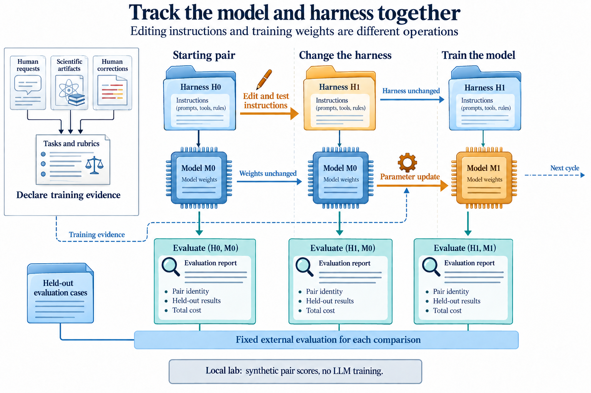

# Illustrations for the RSI course

Ten selected illustrations were produced on 20 September 2026 with the built-in image-generation tool. The user [approved this alternative](../GENERATOR-DECISION.md) to the original Imagen preference. The tool returns the image and an output hint but no model identifier. These assets are not labelled Imagen-generated. The [student visual guide](../../../../rsi/VISUAL-GUIDE.md) shows only the selected figures and links back to their lessons.

All seventeen generated versions are retained. The [manifest](MANIFEST.csv) records each PNG, exact prompt, original output filename, dimensions, byte count, SHA-256, and selected course copy. The [manifest source](../../scripts/build-illustration-manifest.mjs) verifies that selected copies match. The course publisher embeds selected assets through [the illustration map](../../scripts/lesson-illustrations.mjs), so rebuilding lessons preserves them. The [visual-guide publisher](../../scripts/build-visual-guide.mjs) generates the student companion from the same reviewed captions.

These are conceptual explanations, not empirical result figures. Numerical plots remain separate and use recorded experiment data. Each course embed has descriptive alternative text, a caption, and a full-size link. The corresponding precise step diagram remains available in a disclosure.

## From an experiment to RSI

Selected: [v2](main-overview-v2.png). Prompts: [initial](main-overview-v1.prompt.md), [revision](main-overview-v2.prompt.md). Earlier output: [v1](main-overview-v1.png).

Full-size review found two problems in v1: invented table/prediction values could resemble measurements, and the accepted improver did not preserve the proposed revised rules. V2 removes those values and repeats the counterexample rule in proposed I1, accepted I1, and the later round. It retains a rejection branch, public records, fixed evaluation, and the warning that a change can fail. Its accepted revision is a conceptual possibility, not an observed successful recursive result. The main README and 09.01 caption make that limit explicit.

## The answer hidden in an input

Selected: [v2](target-leakage-v2.png). Prompts: [initial](target-leakage-v1.prompt.md), [revision](target-leakage-v2.prompt.md). Earlier output: [v1](target-leakage-v1.png).

V1's two input connectors both appeared to start at the weather card. It also added decorative curves and ascending bars. V2 gives calendar and observed weather separate connectors and replaces the chart marks with neutral records and a comparison symbol. Full-size review confirms the addition relation, blocked shortcut, and two inputs to the error check. Observed weather is permitted for this retrospective task, without a day-ahead availability claim.

## A loop needs memory and a way out

Selected: [v1](bounded-loop-v1.png). Exact [prompt](bounded-loop-v1.prompt.md). No revised output was needed after full-size mechanism review.

The normal route is Propose → Run → Check → Record → Continue. The limit branch stops. A failed fit bypasses successful-result checking, reaches Record, and still consumes an attempt. The central notebook holds identity, incumbent, allowance, and last checked step. The resume strip reads the same state and budget. The caption adds reconciliation of in-progress attempts before resumption. The small model-surface icon is conceptual and has no measured axes or values.

## The builder and the system it builds

Selected: [v2](meta-harness-v2.png). Prompts: [initial](meta-harness-v1.prompt.md), [revision](meta-harness-v2.prompt.md). Earlier output: [v1](meta-harness-v1.png).

V1 separated brief, builder, package, and execution correctly but added decorative result bars and a curve. V2 replaces those with neutral document lines and a tree symbol. Full-size review confirms one-way generation, an unchanged builder, the five package components, and a separate run stage. The caption states that this fixed-builder example does not establish RSI. Checked execution is evidence of behavior, not a guarantee that a model improved.

## Workflow and domain meaning

Selected: [v1](graph-ontology-v1.png). Exact [prompt](graph-ontology-v1.prompt.md).

Full-size review confirms the valid/invalid split branch, the separate scaler/train and search/selection relations, and the distinct edge legend. The right panel contains selected facts and one constraint, not a complete ontology. Its caption requires checking implementation against declared facts. Added to 04.02.

## Similar words, different changes

Selected: [v2](self-star-v2.png). Prompts: [initial](self-star-v1.prompt.md), [revision](self-star-v2.prompt.md). Earlier output: [v1](self-star-v1.png).

V1 depicted the updated policy as another game board and overgeneralized the memory example. V2 shows a policy table, a valid nonterminal game position, and a specific missing-input observation. The fixed improver and fixed self-play update remain separate from active instruction modification. The emergence panel is an illustrative group-pattern analogy, not measured queue evidence. Added to the self-* theme overview and 07.08.

## The next round must use the change

Selected: [v1](inherited-improver-v1.png). Exact [prompt](inherited-improver-v1.prompt.md).

Full-size review confirms consistent proposed/active I1 instructions, an executed check connected to the new rule, retention of I0 on rejection, and separate rejection of a later skill proposal. The accepted path is conceptual. Its caption preserves the negative outcome of the actual two-generation comparison. Added to 09.04.

## Replay stops at the edge of the record

Selected: [v2](replay-boundary-v2.png). Prompts: [initial](replay-boundary-v1.prompt.md), [revision](replay-boundary-v2.prompt.md). Earlier output: [v1](replay-boundary-v1.png).

Both versions preserve the recorded baseline, tried change, failed attempt, and unknown branch. V2 removes unrequested small-print prose; Markdown carries the source and scope explanation. The left snapshot never gains an invented result from the separate new-execution panel. Added to 10.08 as an original Dream-RSI-inspired classroom explanation.

## Track the model and harness together

Selected: [v2](model-harness-v2.png). Prompts: [initial](model-harness-v1.prompt.md), [revision](model-harness-v2.prompt.md). Rejected output: [v1](model-harness-v1.png).

V1 added a paragraph that conflated training evidence with external evaluation. It was rejected despite the correct version labels. V2 sends training evidence only to the parameter update and separate held-out cases to the evaluation track. It also removes dense unrequested paragraphs and lists pair identity, held-out results, and cost in each report. All three pair labels match the visible components. The local-lab notice and caption state that the exercise uses synthetic scores and does not train an LLM. Added to 10.25.

## Move the compute, preserve the evidence

Selected: [v2](compute-contract-v2.png). Prompts: [initial](compute-contract-v1.prompt.md), [revision](compute-contract-v2.prompt.md). Earlier output: [v1](compute-contract-v1.png).

V1 omitted the adapter-to-CPU connection. V2 adds the third branch while preserving alternative backends, shared run records, failure accounting, and conditional checkpoint/resume support. The CPU path is labelled tested; the other adapters explicitly require validation. Added to the larger-compute guide.

## Review scope

All ten selected PNGs were inspected at full size for wording, arrows, fixed and mutable components, missing stages, and scientific meaning. The rejected or superseded versions remain above. After checkpoint `b7550be`, the first four assets were inspected in their actual GitHub Markdown pages at about 814 pixels wide. The main README and 00.01 were also checked at a 390-pixel viewport. Captions and full-size links remained readable; dense secondary labels require opening the image or zooming on a phone. The 00.01 companion-diagram disclosure opened and loaded correctly. The six new assets still need their published-width review at this checkpoint. See [the visual review](../REVIEW.md) for actual observations and limits. Ten illustrations do not complete every thematic or lesson-specific figure review, execution check, or learner assessment.
