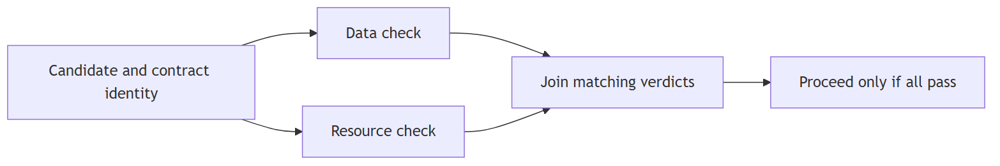

# Matching data and resource checks

Lab 03.03 joins two different checks only when candidate and contract match. The revised figure replaces the earlier generic result-check label with the resource check used by the lesson. Original source and rendered versions remain archived.

[Editable source](rendered-v7/matching-join.mmd).
