# Technical schematic review gallery

Original Mermaid diagrams. These are not Imagen-generated illustrations.

## 00.01 · Meet the prediction task

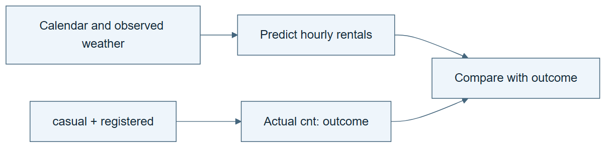

*Read the diagram:* Predict the hourly total from allowed inputs. The two component counts already contain the answer.

## 00.02 · Prepare a workspace you can inspect

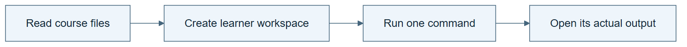

*Read the diagram:* Keep course sources separate from your own work. A command must produce an inspectable artifact.

## 00.03 · Run one baseline

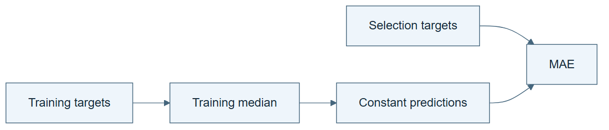

*Read the diagram:* Learn the median from training rows once. Use it to predict every selection row.

## 00.04 · Check the evidence behind the answer

*Read the diagram:* A report is a claim. Prediction rows and a separate calculation let you check that claim.

## 01.01 · Write the data science process

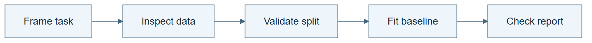

*Read the diagram:* Follow one fixed process. No outer search chooses a new recipe after the result.

## 01.02 · Run the process without changing it

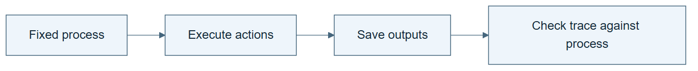

*Read the diagram:* The process becomes evidence only when its actions run and their outputs are retained.

## 01.03 · Turn the process into a skill

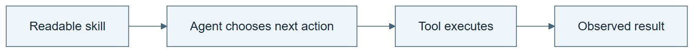

*Read the diagram:* The skill tells the agent how to carry out the process. Tools perform the concrete operations.

## 01.04 · Check outputs with a separate calculation

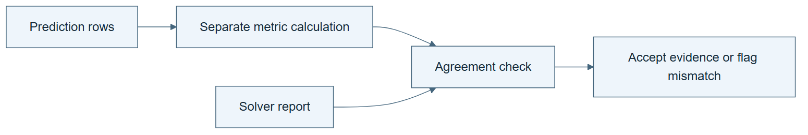

*Read the diagram:* The checker starts from prediction rows. It does not accept the solver’s reported score as its input truth.

## 01.05 · Reuse the skill in a fresh session

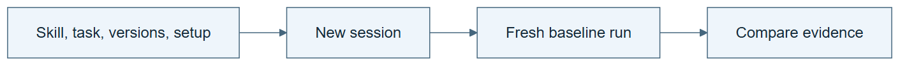

*Read the diagram:* A new session receives saved files. It should not need an unrecorded explanation from the previous chat.

## 02.01 · Let a failure motivate a second attempt

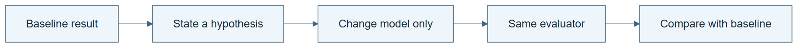

*Read the diagram:* The weak result motivates a specific new candidate. The evaluator stays fixed.

## 02.02 · Give the loop state and a budget

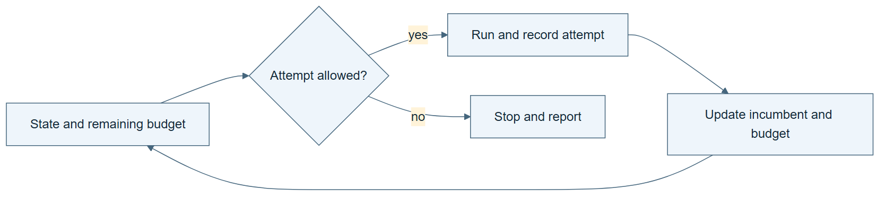

*Read the diagram:* Each admitted attempt spends budget, even when it fails. State determines whether another attempt may start.

## 02.03 · Turn an error into a different action

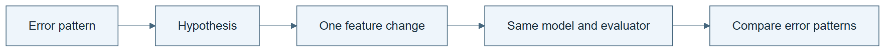

*Read the diagram:* Use an observed error to choose one intervention. Keep other factors fixed to make the comparison interpretable.

## 02.04 · Stop repeated failure and oscillation

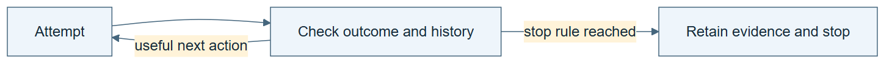

*Read the diagram:* A loop needs a path out. Repeated failure, oscillation, or exhausted budget can trigger the declared stop rule.

## 02.05 · Resume without losing the experiment

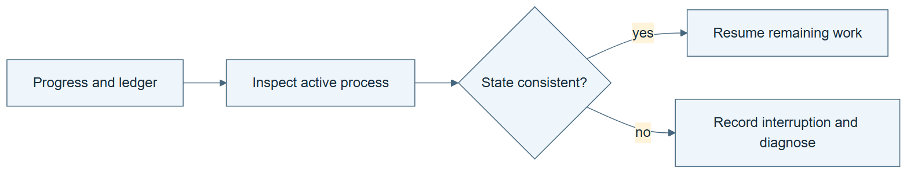

*Read the diagram:* Resume from recorded state only after reconciling unfinished work. Starting again must not erase spent attempts.

## 02.06 · Compare two ways to spend the same attempts

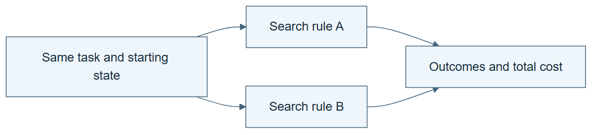

*Read the diagram:* Both search rules start from the same conditions and receive the same total attempt allowance.

## 03.01 · Draw the dependencies

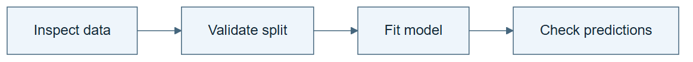

*Read the diagram:* An arrow is a prerequisite: the destination needs the source to finish first.

## 03.02 · Route different failures differently

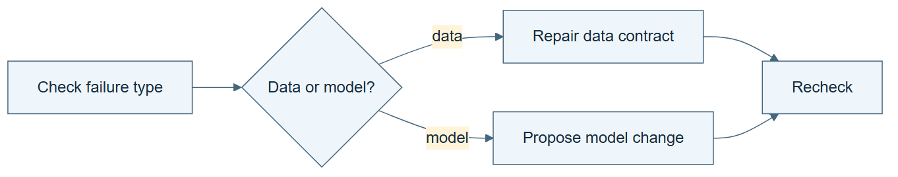

*Read the diagram:* Different failures require different routes. A data problem should not trigger an expensive model search.

## 03.03 · Join independent checks

*Read the diagram:* A join waits for all required checks on the same candidate. An old pass for another candidate cannot fill the gap.

## 03.04 · Put a bounded retry inside the graph

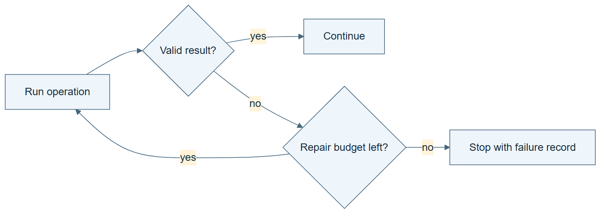

*Read the diagram:* The retry cycle has a limit. Its failure path is part of the graph.

## 03.05 · Resume only the affected work

*Read the diagram:* Changing an upstream artifact invalidates its descendants. Unaffected independent work can remain valid.

## 03.06 · Read the plan, data flow, and trace

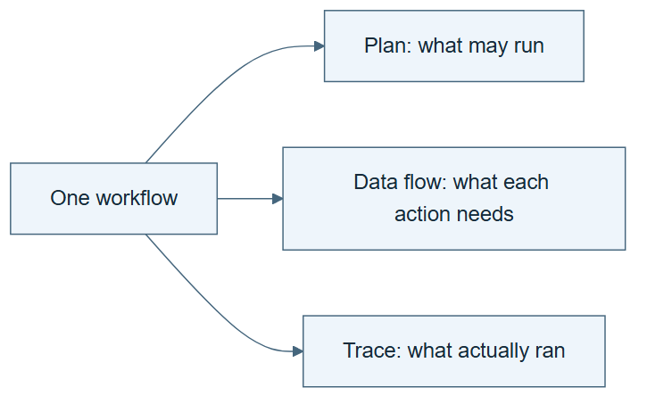

*Read the diagram:* Three views answer different questions. A drawn branch does not prove that branch ran.

## 04.01 · Name the objects in an experiment

*Read the diagram:* Name distinct objects before relating them. A dataset, a candidate, and a run are not interchangeable.

## 04.02 · Connect data, models, and evidence

*Read the diagram:* These arrows describe meaning and provenance. They are not a schedule of commands.

## 04.03 · State rules that must always hold

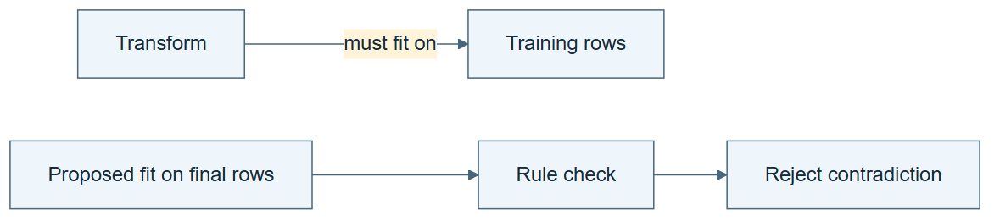

*Read the diagram:* A rule constrains a relation. Training a transform on final data violates the declared experiment meaning.

## 04.04 · Catch a plausible but invalid experiment

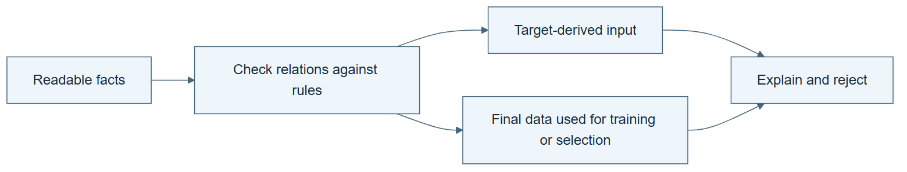

*Read the diagram:* A syntactically valid table can describe an invalid experiment. Meaning rules expose the contradiction.

## 04.05 · Change a definition without losing its consequences

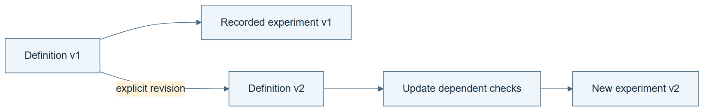

*Read the diagram:* A changed definition propagates to the checks and reports that depend on it. Keep the earlier version interpretable.

## 05.01 · Combine fixed components into a useful system

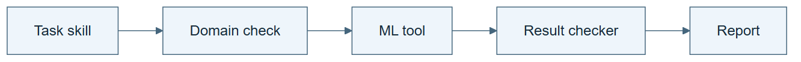

*Read the diagram:* Fixed components coordinate one valid experiment. A domain check can stop an invalid request before fitting.

## 05.02 · Choose a skill for the task

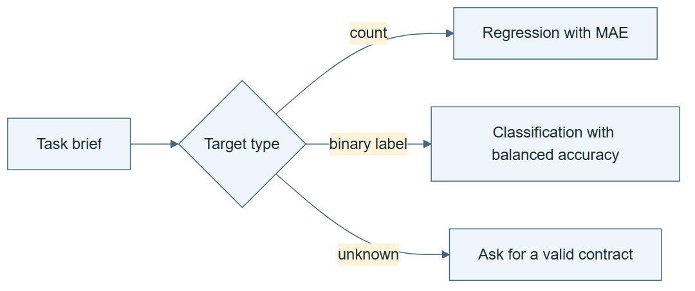

*Read the diagram:* Routing selects an existing procedure appropriate to the task. It does not learn a new procedure.

## 05.03 · Retrieve what matters and retain task state

*Read the diagram:* Retrieve relevant reusable knowledge, but initialize current state from the active task.

## 05.04 · Coordinate planning, execution, and checking

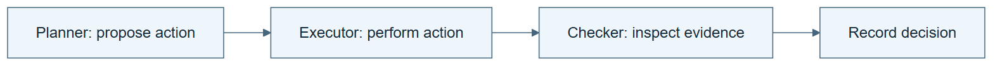

*Read the diagram:* Planning, execution, and checking have different responsibilities. Separate boxes alone do not enforce separate access.

## 05.05 · Find which component makes the difference

*Read the diagram:* An ablation removes one component under matched conditions. Its effect may depend on the other components.

## 06.01 · Describe the harness you need

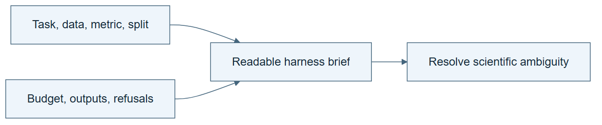

*Read the diagram:* The brief fixes scientific choices and required behavior. The builder supplies implementation details.

## 06.02 · Generate a first harness

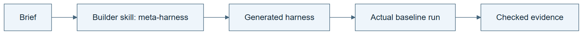

*Read the diagram:* The builder produces the harness. The harness then runs the task. These are different objects.

## 06.03 · Inspect what the builder decided

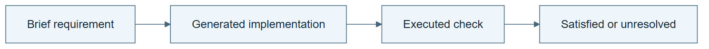

*Read the diagram:* Trace each important requirement to implementation and then to observed behavior.

## 06.04 · Test the generated harness’s boundaries

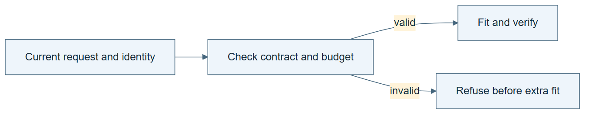

*Read the diagram:* A boundary is demonstrated by a meaningful refusal tied to the current request.

## 06.05 · Generate a classification harness

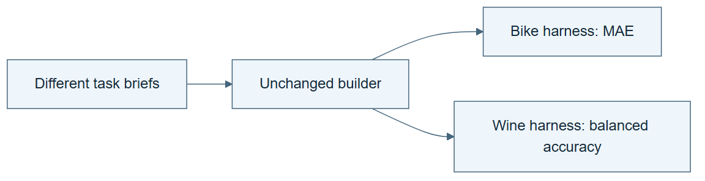

*Read the diagram:* A fixed builder can generate different task-specific systems. Different output does not mean the builder learned.

## 06.06 · Recreate and compare generated harnesses

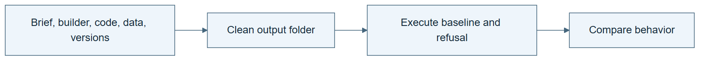

*Read the diagram:* Recreate behavior from saved inputs and dependencies. Generated source need not be byte-identical to satisfy the same contract.

## 07.01 · Correct one result

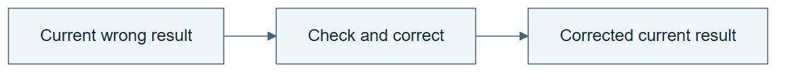

*Read the diagram:* Correction repairs the current output. It need not create a lasting instruction for future tasks.

## 07.02 · Test a reflection before trusting it

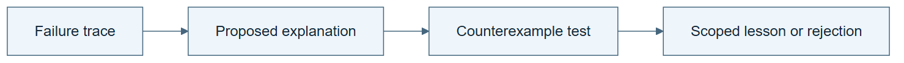

*Read the diagram:* A reflection is a hypothesis about the failure. Test it before treating it as a reliable lesson.

## 07.03 · Retain and use a lesson

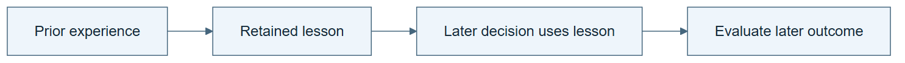

*Read the diagram:* Persistent learning requires a retained change that is used later. Use and benefit are separate checks.

## 07.04 · Improve a task skill with a fixed procedure

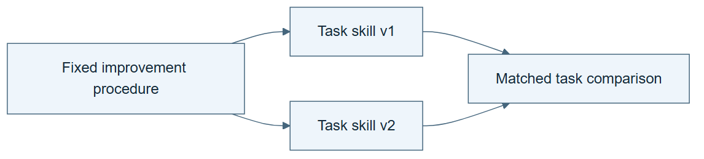

*Read the diagram:* The task skill changes while its updater stays fixed. This is not yet an inherited change to the updater.

## 07.05 · Let work reorganize under local rules

*Read the diagram:* Local assignment rules can change who does which work. Reorganization alone does not establish a performance gain.

## 07.06 · Observe a collective pattern

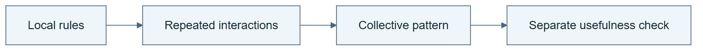

*Read the diagram:* A collective pattern can arise from local interactions. Observing the pattern is different from measuring useful improvement.

## 07.07 · Learn what self-play does and does not provide

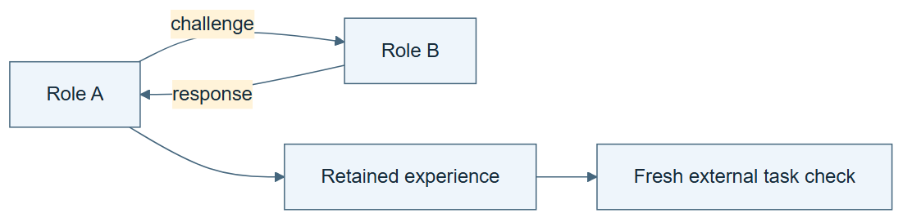

*Read the diagram:* Self-play supplies interactions or challenges. Transfer still needs an evaluation outside those interactions.

## 07.08 · Make a self-modification inspectable

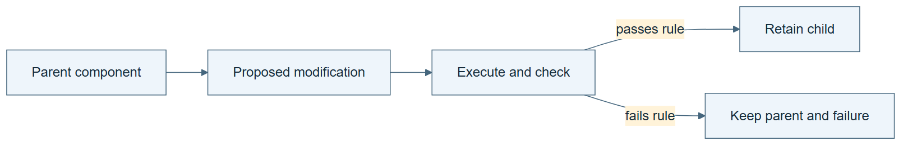

*Read the diagram:* Self-modification changes a component. Keep its parent and evaluate the change before retaining it.

## 08.01 · Distinguish a result from a reliable comparison

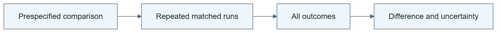

*Read the diagram:* A repeated comparison reveals variation. One favorable run cannot establish a reliable advantage.

## 08.02 · Freeze selection before final evaluation

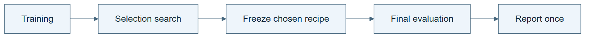

*Read the diagram:* Freeze selection before final evaluation. Final feedback does not flow back into ordinary selection.

## 08.03 · Count the cost of research

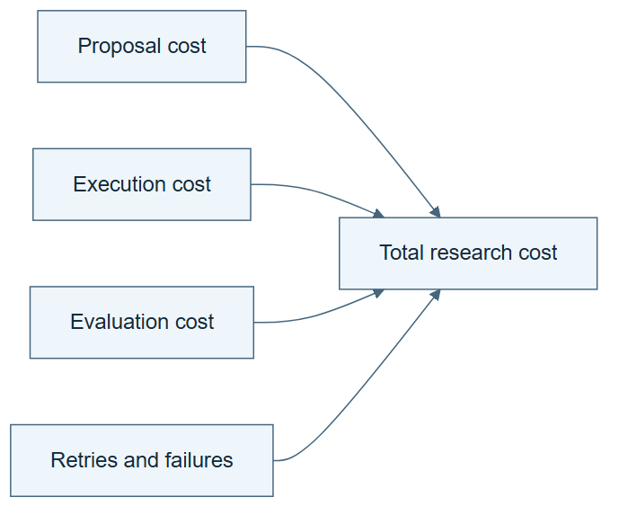

*Read the diagram:* Research cost includes proposing, running, checking, and failed work. Fit time is only one component.

## 08.04 · Separate the effects of memory and procedure changes

*Read the diagram:* The four conditions separate memory and procedure changes. They also reveal whether the changes interact.

## 08.05 · Test whether the lesson transfers

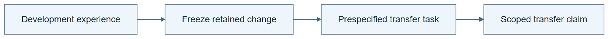

*Read the diagram:* Freeze the learned change before testing a new task. New-task feedback must not silently tune the candidate being evaluated.

## 08.06 · Reject a misleading win and roll back

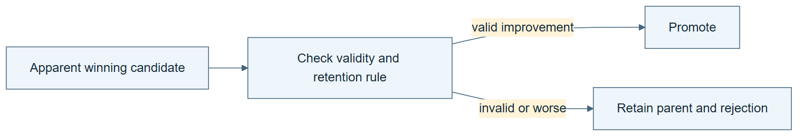

*Read the diagram:* A lower reported error does not override invalid evidence. Rollback preserves both the parent and the rejected record.

## 09.01 · Identify the solver, improver, and evaluator

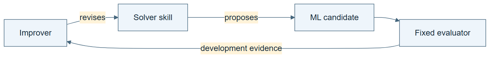

*Read the diagram:* The solver proposes task experiments. The improver changes that solver procedure. The evaluator measures outcomes.

## 09.02 · Run repeated improvement with an unchanged improver

*Read the diagram:* Many solver revisions can come from one unchanged improver. Iteration count does not establish recursion in the improver.

## 09.03 · Propose a change to the improver

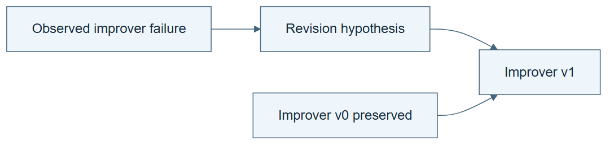

*Read the diagram:* An improver revision is a proposal about how to improve later work. It still needs inheritance and evaluation.

## 09.04 · Use the revised improver in the next round

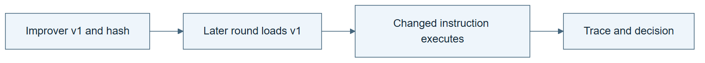

*Read the diagram:* A later round must read the revised improver and execute an action it requires. A saved file alone is insufficient.

## 09.05 · Measure whether the revised improver helps

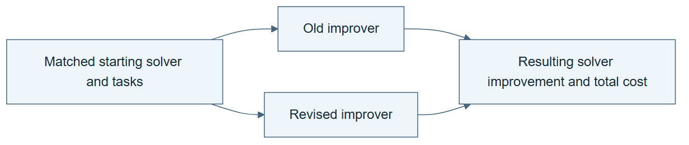

*Read the diagram:* Compare the improvements produced by the two improvers from matched starts. Do not compare only their instruction text.

## 09.06 · Run bounded recursive generations

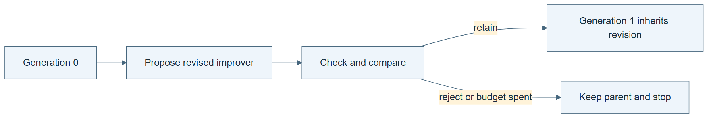

*Read the diagram:* Each generation retains lineage and passes the declared checks. A failed revision can end the chain or keep the parent.

## 09.07 · State the result without overstating it

*Read the diagram:* Each claim needs its own evidence. Structural inheritance does not by itself establish benefit or acceleration.

## 10.01 · Use a framework without turning it into a ladder

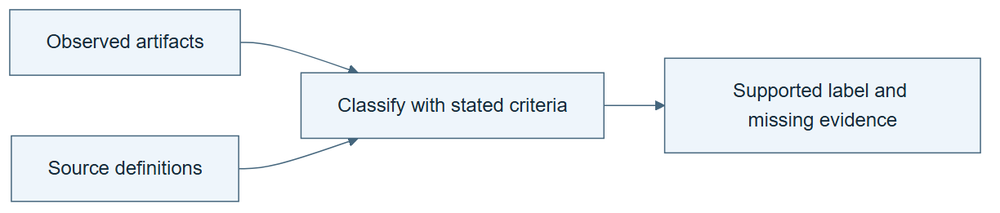

*Read the diagram:* Apply each source’s definitions to actual artifacts. Equal level numbers from different frameworks need not mean the same thing.

## 10.02 · Audit a frontier announcement

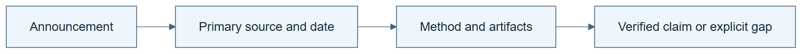

*Read the diagram:* Follow a claim back to its original evidence. A social announcement and a reproduced experiment are different endpoints.

## 10.03 · Choose experiments that reduce uncertainty

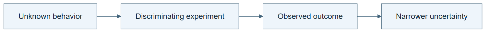

*Read the diagram:* Choose an experiment for the uncertainty it can resolve. A likely high score is not always the most informative next observation.

## 10.04 · Verify the outcome, then let the actor write memory

*Read the diagram:* The verifier checks the outcome. The actor writes memory; the verdict does not approve the wording of that memory.

## 10.05 · Evaluate with memory frozen

*Read the diagram:* Freeze memory before comparing access conditions. Evaluation does not update that memory.

## 10.06 · Separate working state from reusable experience

*Read the diagram:* Working state belongs to this run. Scoped experience can inform another run without carrying over stale candidate IDs or budgets.

## 10.07 · Build a tree of attempted solutions

*Read the diagram:* The tree stores attempted descendants and actual outcomes. An unexecuted branch remains unknown.

## 10.08 · Replay only what the history can answer

*Read the diagram:* Replay can answer only questions covered by recorded work. It does not create new environment outcomes.

## 10.09 · Test the replay winner on fresh work

*Read the diagram:* A policy selected by replay still needs a fresh online check. Discovery and fresh evaluation answer different questions.

## 10.10 · Localize a harness problem

*Read the diagram:* Use repeated contrasting traces to localize a failure, then restrict the proposed edit to a declared module.

## 10.11 · Integrate edits and test transfer

*Read the diagram:* Two useful edits can conflict when combined. Test the integrated system and its transfer separately.

## 10.12 · Compare agent evolution and improver evolution

*Read the diagram:* A lineage must identify what each child changes. Agent changes and changes to the agent’s updater support different claims.

## 10.13 · Inspect an inner ML researcher

*Read the diagram:* The inner researcher uses a fixed procedure to search ML candidates. Keep its search record and budget visible.

## 10.14 · Improve the inner researcher under a total budget

*Read the diagram:* The outer experiment changes the inner researcher. Count the cost of discovering that change as well as its later use.

## 10.15 · Test the ignition claim separately

*Read the diagram:* An ignition claim concerns whether improvement can sustain further improvement. It needs a different comparison from one useful outer edit.

## 10.16 · Improve task skills with a fixed pipeline

*Read the diagram:* The fixed pipeline changes a task skill, tests it, and retains only an eligible revision.

## 10.17 · Update the skill updater on a slower schedule

*Read the diagram:* Task skills can change frequently while the updater changes less often. The new updater must govern a later skill revision.

## 10.18 · Turn a limitation into a scientific hypothesis

*Read the diagram:* Turn an observed limitation into a falsifiable hypothesis before changing the experiment.

## 10.19 · Screen ideas and test their contributions

*Read the diagram:* Screening selects promising ideas. Ablation then asks which part contributes under a controlled comparison.

## 10.20 · Answer a criticism with evidence

*Read the diagram:* A criticism leads to a targeted check. The response should cite its result, including a result that weakens the claim.

## 10.21 · Distinguish better discoveries from a better scientist

*Read the diagram:* Better research outputs and a better research procedure are distinct objects of evaluation.

## 10.22 · Turn a researcher correction into a task

*Read the diagram:* A human correction becomes a learning opportunity only after its task, evidence, and acceptance rubric are explicit.

## 10.23 · Adapt the harness to the rubric

*Read the diagram:* Hold the model fixed while testing a harness edit. Keep the rubric fixed during this comparison.

## 10.24 · See what grouped rewards contribute

*Read the diagram:* The numerical exercise turns a group of rewards into relative advantages. This is not an LLM training run or full GRPO.

## 10.25 · Track model–harness pairs across cycles

*Read the diagram:* Track model and harness versions as a pair. Changing either can alter compatibility with the other.

## 10.26 · Read the ScienceBuddy results precisely

*Read the diagram:* Read each result with its protocol. Single-attempt accuracy and multi-attempt coverage cannot be exchanged.

## 10.27 · Keep traces, knowledge, and active skills separate

*Read the diagram:* Raw traces, a knowledge store, and active instructions have different roles. Rejected instruction edits need not erase the trace.

## 10.28 · Refine a procedure graph

*Read the diagram:* A procedure graph specifies actions and transitions. Freeze the selected graph before testing it on fresh cases.

## 10.29 · Repair a skill for an experiment-results page

*Read the diagram:* Observe an actual page action and its result. A revised GUI skill needs another execution to establish that the repair works.

## 10.30 · Reduce cost without hiding quality loss

*Read the diagram:* A cheaper harness is eligible only if it still meets the declared quality requirement.

## 10.31 · Compare harness generation and harness improvement

*Read the diagram:* Name the object that changes. In Harness-of-Harness, the developed software changes while the agent configuration remains fixed.

## 10.32 · Compare raw history and summarized memory

*Read the diagram:* Both memory representations refer to the same event history. The checker computes truth from the original events.

## 10.33 · Compare action hints and richer observations

*Read the diagram:* Action hints and richer observations supply different assistance. Remove help in a separate fresh check.

## 10.34 · Keep model training aligned with its harness

*Read the diagram:* An otherwise sensible answer can violate a harness interface. The local correction restores compatibility without training model weights.

## 10.35 · Compose changes to data, harness, and model

*Read the diagram:* The simulation composes typed changes and can revise their schedule. Its synthetic values are not model-training results.

## 10.36 · Diagnose failures with checked reference trajectories

*Read the diagram:* Check a reference before using it to diagnose failure. A proposed edit must also pass leakage and regression checks.

## 10.37 · Compare systems without flattening their differences

*Read the diagram:* Compare systems on common questions before comparing scores. Missing evidence stays visible.

## 10.38 · Reason about bottlenecks and acceleration

*Read the diagram:* The slow stage limits total speedup. The calculator uses declared synthetic costs, not a forecast.

## 11.01 · Build a harness for a new prediction brief

*Read the diagram:* A new scientific brief should produce a runnable system and a meaningful refusal. Files alone are insufficient.

## 11.02 · Run and audit a bounded recursive experiment

*Read the diagram:* The capstone joins revision, inheritance, and matched evaluation in a bounded experiment.

## 11.03 · Test transfer and portability separately

*Read the diagram:* Task transfer, agent portability, and compute portability require different checks. One passing check does not certify the others.

## 11.04 · Audit an unfamiliar RSI claim

*Read the diagram:* Audit an unfamiliar claim through its source, artifacts, and strongest alternative explanation.

## 11.05 · Teach the mechanism and defend the evidence

*Read the diagram:* Teach-back connects the mechanism to an observation and then to a new case. Repeating vocabulary is not enough.
