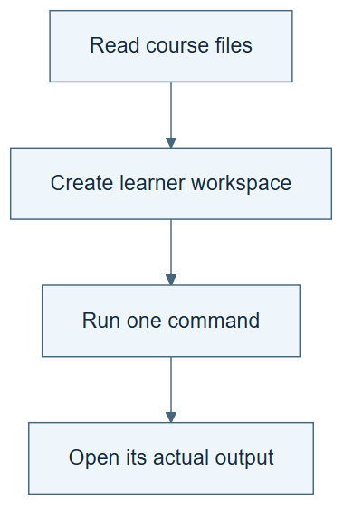

# 00.02 · Prepare a workspace you can inspect

[Course](../../README.md) · [Theme](../README.md)

**You are here:** Theme 00, One experiment → lab 2 of 4. [Find this theme in the course map](../../COURSE-MAP.md#theme-00) · [Whole-course mindmap](../../COURSE-MAP.md#whole-course-mindmap).

## What you will build

A separate learner workspace, a capability report, and a verified data report.

## Why this matters

“I can run this” is a claim. A small successful command supplies evidence for it.

## Before you start

Complete [00.01: Meet the prediction task](../step_01_meet_the_task/README.md). You need the concepts and the reports named below, not its old chat. If you start here directly, ask the tutor to prepare the listed starting state and explain the missing prerequisite first.

Open the coding agent at the repository root. Read [the tutor skill](../../skills/rsi-tutor/SKILL.md) and this lab's [brief](BRIEF.md). The agent creates a separate sibling workspace named <code>rsi-work/00-02</code> and reports its absolute path. It checks local Python and the [tool requirements](../../tools/README.md) before execution. You do not write code or configuration.

**Starting state:** The task brief from 00.01 and the repository’s pinned source files.

**Budget:** Two data inspections, no model fits. Initial package installation needs network access. Plan about 20–35 minutes of reading and discussion; this is an author estimate, not a measured student duration. Coding-agent inference may use a paid online service. Record its cost separately when available.

## How it works

The agent reads instructions, writes generated files, and runs tools. These are separate capabilities. The workspace holds your outputs; the course directory holds the shared instructions and source data. Keeping them separate makes restart and comparison easier.

**A concrete example.** A text-only agent can explain MAE and draft TASK.md. It cannot produce evidence that a local model ran. An agent with file access may save that brief but still lack a working Python environment. Ask each capability to produce its own small observable result: a read file, an executed command, an imported package, or an opened plot.


*The two folders are siblings. The slash in rsi-work / 00-02 shows the lab subfolder inside the learner workspace. Blank cells are evidence to collect, not passed checks. A skill list can be read from files; native skill discovery is not required. The blank frame stands for your generated plot; the measured author example appears below. A matching hash establishes file identity, not data quality or secrecy. Preserve the shared course files by following the workspace rule; this drawing does not establish access-control isolation.*

[Open the illustration at full size](../../assets/illustrations/inspectable-workspace-v2.png).

<details>
<summary>See the step diagram</summary>



*Read the diagram:* Keep course sources separate from your own work. A command must produce an inspectable artifact.

</details>


This author-run chart uses all public teaching rows. It describes the data; it is not model evaluation.

## Run the lab

Start with this prompt. The tutor pauses for your prediction before it runs the next step.

```text
Read rsi/AGENTS.md and
rsi/skills/rsi-tutor/SKILL.md.
Guide me through lab 00.02, Prepare a
workspace you can inspect, one step at a
time.
Read its README and BRIEF. Prepare its
separate workspace.
You write and run the implementation. Keep
the reports and failures.
Ask me to predict the result before the
experiment.
```

**Make a prediction:** Which capability would fail first if the agent could read files but could not run commands?

### 1. Check capabilities

Find the actual execution path.

```text
Read the tutor skill and tool README. Check
file access, command execution, Python,
package installation, and plot creation. Set
up the project-local environment. Save
CAPABILITIES.md with versions, what you
executed, and any missing capability. Do not
display credentials.
```

**Observe:** The report names executed checks, not only advertised features.

### 2. Inspect the data

Confirm that the supplied source is intact.

```text
Run the bike data inspection in this lab
workspace. Open DATA-REPORT.md and
data-overview.png. Explain the row count and
fixed partitions.
```

**Observe:** The pinned file contains 17,379 rows. The chart and report come from actual data.

## Check your result

CAPABILITIES.md identifies the runtime. DATA-REPORT.md and a readable chart exist. Source checksum verification passes. The report states that public partitions are not secret.

### Open these outputs

The agent keeps these in your lab workspace or records the original experiment path when reusing evidence.

| Output | What to inspect |
|---|---|
| CAPABILITIES.md | Names the actual Python and package versions, executed checks, and any missing capability. |
| DATA-REPORT.md | Reports 17,379 source rows and the fixed training, selection, and final roles. |
| sample.csv and data-overview.png | Preserve inspected rows and a readable chart from the pinned data. |

Ask the agent to open the actual files and show the command exit status. A written description of a run is not a run. Keep a short <code>LAB-NOTE.md</code> with your prediction, measured observation, explanation, and one limit. The tutor must mark skipped learner responses as skipped.

## Try one change

Ask the agent what it could still do if command execution were disabled. Separate explanation from completion of the experiment.

## If something goes wrong

If package installation fails, save the command error and environment path. Have the agent repair that project environment and repeat only the failed capability check. If the data checksum differs, inspect which file was opened; do not edit the expected checksum to accept another dataset. If a chart exists but cannot be viewed, report that display gap separately from plot generation.

Say “Stop this lab” to stop further work. Ask the agent to save <code>PROGRESS.md</code> with the last completed step and remaining budget. To resume, have it read that file and inspect active processes first. A reset creates a new sibling workspace; it does not erase failures or alter the source data. See the [recovery rules](../../tools/README.md) for interrupted tool runs.

## Key takeaways

- An executed capability check is stronger than a promise.
- A separate workspace makes generated work easier to inspect and preserve.
- Pinned data supports repeatability, not secrecy.

## Check your understanding

Answer before opening the explanation. You can ask the tutor for a hint.

1. Is reading a skill the same as executing it?
2. Why keep the workspace outside the lesson directory?
3. What does the source hash check establish?
4. Can a public final partition be called inaccessible to this agent?

<details>
<summary>Hint</summary>

Separate “the agent knows how” from “the agent executed it here.” Match each capability claim to a file or command result that could disprove it.

</details>

<details>
<summary>Explained answers</summary>

1. No. Reading supplies instructions; tool calls and their outputs establish execution.

2. It protects the shared starting material and keeps your run state distinct from course content.

3. That the bytes match the pinned file. It does not prove the dataset is unbiased or appropriate.

4. No. The host agent can read the supplied source. A stronger boundary needs separate access control.

</details>

## What's next

With execution verified, make one prediction recipe run from start to finish. Continue to [00.03: Run one baseline](../step_03_one_attempt/README.md).
