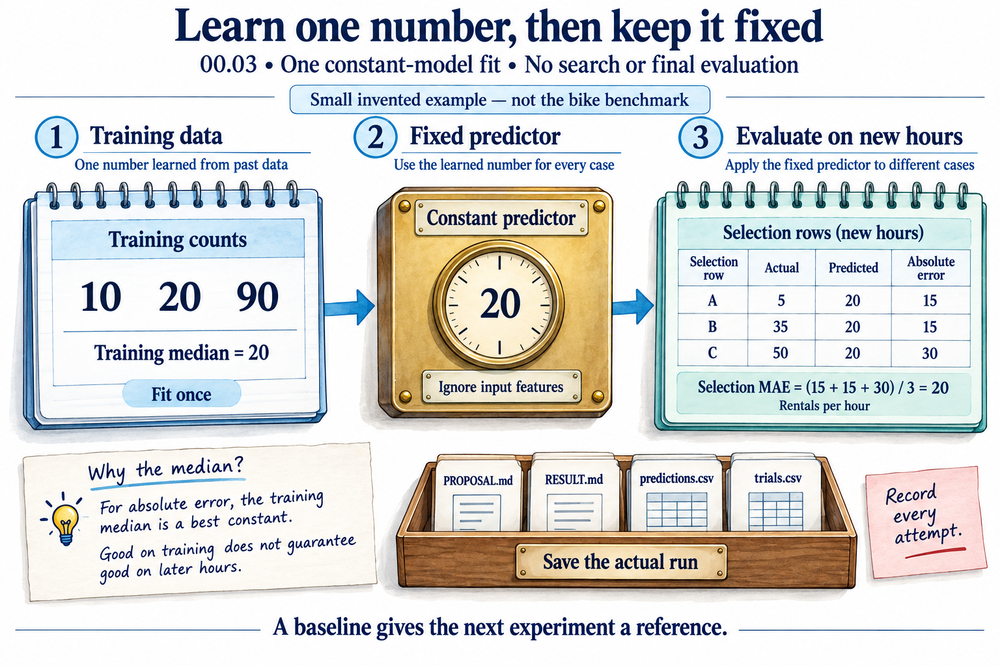

# 00.03 · Run one baseline

[Course](../../README.md) · [Theme](../README.md)

**You are here:** Theme 00, One experiment → lab 3 of 4. [Find this theme in the course map](../../COURSE-MAP.md#theme-00) · [Whole-course mindmap](../../COURSE-MAP.md#whole-course-mindmap).

## What you will build

A real constant-prediction baseline with a measured error and saved predictions.

## Why this matters

Before asking whether a system improved, you need a clear starting result.

## Before you start

Complete [00.02: Prepare a workspace you can inspect](../step_02_prepare_the_workspace/README.md). You need the concepts and the reports named below, not its old chat. If you start here directly, ask the tutor to prepare the listed starting state and explain the missing prerequisite first.

Open the coding agent at the repository root. Read [the tutor skill](../../skills/rsi-tutor/SKILL.md) and this lab's [brief](BRIEF.md). The agent creates a separate sibling workspace named <code>rsi-work/00-03</code> and reports its absolute path. It checks local Python and the [tool requirements](../../tools/README.md) before execution. You do not write code or configuration.

**Starting state:** A fresh workspace, the verified bike data, and the fixed task brief.

**Budget:** One constant-model fit. No search and no final evaluation. Plan about 20–35 minutes of reading and discussion; this is an author estimate, not a measured student duration. Coding-agent inference may use a paid online service. Record its cost separately when available.

## How it works

The baseline predicts the training median for every selection row. A median minimizes total absolute distance on the training values. Other constants can tie when the median is not unique. MAE is the average distance between predictions and actual counts. It stays in rentals per hour.

**A concrete example.** For a tiny invented training set of 10, 20, and 90 rentals, the median is 20. Predicting 20 gives absolute errors 10, 0, and 70: a total of 80. Predicting the mean, 40, gives 30, 20, and 50: a total of 100. The median wins for absolute error. This explains the baseline choice; it does not guarantee a good error on later hours.



*All values in the notebooks are invented to explain the calculation. Rows A, B, and C are different selection cases, not three more training points. The predictor learns the median from training only and does not use input features. Save the actual recipe, predictions, result, and trial ledger in your run; your measured full-partition MAE will differ from this toy value. One fit gives a baseline, not evidence of an improvement loop.*

[Open the illustration at full size](../../assets/illustrations/training-median-baseline-v1.png).

<details>
<summary>See the step diagram</summary>


*Read the diagram:* Learn the median from training rows once. Use it to predict every selection row.

</details>

## Run the lab

Start with this prompt. The tutor pauses for your prediction before it runs the next step.

```text
Read rsi/AGENTS.md and
rsi/skills/rsi-tutor/SKILL.md.
Guide me through lab 00.03, Run one
baseline, one step at a time.
Read its README and BRIEF. Prepare its
separate workspace.
You write and run the implementation. Keep
the reports and failures.
Ask me to predict the result before the
experiment.
```

**Make a prediction:** Will one fixed count handle both quiet nights and busy afternoons well?

### 1. Run the fixed recipe

Create an actual baseline.

```text
Use the run-ml-experiment skill. Fit the
bike constant model once, using all
permitted features and seed 17. State that
the median predictor ignores those features.
Do not try another model. Open its proposal
and result.
```

**Observe:** The selection MAE is about 159.948 with the pinned runtime. Your measured report is the authority for your run.

### 2. Check three errors

Connect the score to individual predictions.

```text
Show three saved prediction rows. For each,
calculate the absolute error. Average those
three and explain why that small mean can
differ from the full MAE. Save the
calculation in BASELINE-NOTE.md.
```

**Observe:** The score summarizes many ordinary prediction errors.

## Check your result

There is exactly one successful trial. The prediction is constant. The reported full MAE matches a recomputation over saved predictions. No final evaluation has run.

### Open these outputs

The agent keeps these in your lab workspace or records the original experiment path when reusing evidence.

| Output | What to inspect |
|---|---|
| trial-001/PROPOSAL.md and RESULT.md | Identify the one constant recipe and its measured selection MAE. |
| trial-001/predictions.csv | Contains one prediction per selection row. The predicted value is constant. |
| BASELINE-NOTE.md | Shows three absolute errors and explains why their mean need not equal the full-partition MAE. |
| trials.csv | Contains one completed fit; further candidate search has not started. |

Ask the agent to open the actual files and show the command exit status. A written description of a run is not a run. Keep a short <code>LAB-NOTE.md</code> with your prediction, measured observation, explanation, and one limit. The tutor must mark skipped learner responses as skipped.

## Try one change

Without another fit, compare an error at a quiet hour with one at a busy hour. Explain why a single prediction can be wrong in different directions.

## If something goes wrong

If predictions vary by hour, inspect the recorded model: this lab requires the constant baseline. If your score differs, first compare source identity, partition rows, runtime, and the saved recipe. Recompute from predictions before fitting again. A second fit is not automatically allowed inside this one-fit experiment; preserve the first attempt and diagnose it.

Say “Stop this lab” to stop further work. Ask the agent to save <code>PROGRESS.md</code> with the last completed step and remaining budget. To resume, have it read that file and inspect active processes first. A reset creates a new sibling workspace; it does not erase failures or alter the source data. See the [recovery rules](../../tools/README.md) for interrupted tool runs.

## Key takeaways

- A baseline gives later results a reference.
- An aggregate metric comes from concrete row-level errors.
- One successful fit is an executed process, not an improvement loop.

## Check your understanding

Answer before opening the explanation. You can ask the tutor for a hint.

1. What did the model learn?
2. Does one large error invalidate the MAE calculation?
3. Why can a three-row average differ from full MAE?
4. Is the coding agent’s internal tool loop RSI?

<details>
<summary>Hint</summary>

The baseline learns one number from training. Check where that number comes from, then follow one selection row through subtraction, absolute value, and averaging.

</details>

<details>
<summary>Explained answers</summary>

1. One number: the training target median. It did not learn hourly patterns.

2. No. MAE includes it with every other absolute error. Whether the metric suits the task is a separate question.

3. The three rows are only a small sample of the evaluated partition.

4. No. Internal iteration alone shows neither inherited changes to an improver nor improved future improvement.

</details>

## What's next

A score exists. Learn to check whether it supports the story written around it. Continue to [00.04: Check the evidence behind the answer](../step_04_check_the_evidence/README.md).
