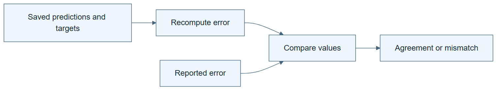

# 00.04 · Check the evidence behind the answer

[Course](../../README.md) · [Theme](../README.md)

## What you will build

A short evidence report that ties a claim to predictions, data roles, and a reproducible calculation.

## Why this matters

A polished report can describe a run that never happened or claim more than the run establishes.

## Before you start

Complete [00.03: Run one baseline](../step_03_one_attempt/README.md). You need the concepts and the reports named below, not its old chat. If you start here directly, ask the tutor to prepare the listed starting state and explain the missing prerequisite first.

Open the coding agent at the repository root. Read [the tutor skill](../../skills/rsi-tutor/SKILL.md) and this lab's [brief](BRIEF.md). The agent creates a separate sibling workspace named <code>rsi-work/00-04</code> and reports its absolute path. It checks local Python and the [tool requirements](../../tools/README.md) before execution. You do not write code or configuration.

**Starting state:** The one-attempt baseline from 00.03. Copy its artifacts as inputs; do not overwrite that run.

**Budget:** No new fits. Recompute one metric from existing predictions. Plan about 20–35 minutes of reading and discussion; this is an author estimate, not a measured student duration. Coding-agent inference may use a paid online service. Record its cost separately when available.

## How it works

A claim needs a chain of support. The report names a candidate; that candidate has settings and predictions; the predictions use a declared partition; the metric calculation turns those rows into a number. A break anywhere in that chain weakens the conclusion.

**A concrete example.** For illustrative true counts 10, 20, and 30, predicting 20 each time gives absolute errors 10, 0, and 10. Their mean is 6.67. A report claiming MAE 1 is contradicted by those rows. Yet a report claiming 6.67 still needs a second question: were these the correct selection rows? Arithmetic and the meaning of the measurement are separate checks.



*Read the diagram:* A report is a claim. Prediction rows and a separate calculation let you check that claim.

## Run the lab

Start with this prompt. The tutor pauses for your prediction before it runs the next step.

```text
Read rsi/AGENTS.md and
rsi/skills/rsi-tutor/SKILL.md.
Guide me through lab 00.04, Check the
evidence behind the answer, one step at a
time.
Read its README and BRIEF. Prepare its
separate workspace.
You write and run the implementation. Keep
the reports and failures.
Ask me to predict the result before the
experiment.
```

**Make a prediction:** Could a report say “MAE 10” while its prediction file implies a much larger error?

### 1. Trace the result

Follow evidence from claim to rows.

```text
Audit the baseline result. Recompute MAE
from its prediction file with generated
code. Check row count, candidate identity,
partition, and target unit. Save EVIDENCE.md
with file paths and the observed result.
```

**Observe:** The score and underlying predictions agree.

### 2. Catch a false summary

Test the check with a deliberate mistake.

```text
Make a clearly labelled teaching copy of the
report with its MAE changed to 10. Keep the
predictions unchanged. Run the same check
and preserve the failure.
```

**Observe:** The checker rejects the copied claim. The original evidence remains intact.

## Check your result

EVIDENCE.md links the actual files. The correct report passes and the altered summary fails. The report does not claim an independent evaluator or RSI.

### Open these outputs

The agent keeps these in your lab workspace or records the original experiment path when reusing evidence.

| Output | What to inspect |
|---|---|
| EVIDENCE.md | Connects the declared candidate and partition to prediction rows and a recomputed MAE. |
| Labelled altered report | Preserves the deliberate false summary separately from the original. |
| Checker results | Show the valid report passing and the false summary failing, with exit status and reason. |

Ask the agent to open the actual files and show the command exit status. A written description of a run is not a run. Keep a short <code>LAB-NOTE.md</code> with your prediction, measured observation, explanation, and one limit. The tutor must mark skipped learner responses as skipped.

## Try one change

Imagine the metric matches but the predictions came from training rows. Explain why an arithmetic check would pass while the scientific claim fails.

## If something goes wrong

If both reports pass, inspect whether the checker actually reads the predictions and compares the reported value. If both fail, first check paths and candidate identity on the unchanged original. Do not change the correct predictions to make the deliberately wrong summary pass.

Say “Stop this lab” to stop further work. Ask the agent to save <code>PROGRESS.md</code> with the last completed step and remaining budget. To resume, have it read that file and inspect active processes first. A reset creates a new sibling workspace; it does not erase failures or alter the source data. See the [recovery rules](../../tools/README.md) for interrupted tool runs.

## Key takeaways

- Correct arithmetic is necessary but not sufficient.
- Candidate identity and partition role are part of the evidence.
- A negative check shows whether the verifier detects the intended mistake.

## Check your understanding

Answer before opening the explanation. You can ask the tutor for a hint.

1. What does the altered-summary exercise test?
2. Does a matching number prove the correct split was used?
3. Why preserve the failed report?
4. What can the baseline evidence establish?

<details>
<summary>Hint</summary>

Ask which fact each file can establish. A metric number has no row identities; a prediction table does not by itself explain which partition the rows belong to.

</details>

<details>
<summary>Explained answers</summary>

1. Whether the checker derives the metric from evidence instead of trusting prose.

2. No. Row identity and split rules must also be checked.

3. It records the tested failure mode and demonstrates the checker’s behavior.

4. That the specified recipe ran and achieved that metric on that partition. It does not establish generalization to every setting.

</details>

## What's next

You can inspect a result. Now make the whole process explicit enough to repeat. Continue to [01.01: Write the data science process](../../01_process_without_loops/step_01_describe_the_process/README.md).
