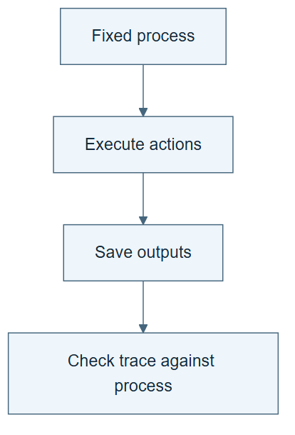

# 01.02 · Run the process without changing it

[Course](../../README.md) · [Theme](../README.md)

## What you will build

A clean-start execution trace for the fixed bike baseline process.

## Why this matters

A written sequence may omit setup or depend on forgotten state. A fresh run exposes those gaps.

## Before you start

Complete [01.01: Write the data science process](../step_01_describe_the_process/README.md). You need the concepts and the reports named below, not its old chat. If you start here directly, ask the tutor to prepare the listed starting state and explain the missing prerequisite first.

Open the coding agent at the repository root. Read [the tutor skill](../../skills/rsi-tutor/SKILL.md) and this lab's [brief](BRIEF.md). The agent creates a separate sibling workspace named <code>rsi-work/01-02</code> and reports its absolute path. It checks local Python and the [tool requirements](../../tools/README.md) before execution. You do not write code or configuration.

**Starting state:** PROCESS.md from 01.01 and a new empty lab workspace.

**Budget:** One constant-model fit and one data inspection. Plan about 20–35 minutes of reading and discussion; this is an author estimate, not a measured student duration. Coding-agent inference may use a paid online service. Record its cost separately when available.

## How it works

Reproducibility begins with a fixed recipe and known inputs. Record versions and hashes, then execute the same actions. A trace says what actually happened. It can differ from the intended process if a command fails or an assumption is missing.




*Read the diagram:* The process becomes evidence only when its actions run and their outputs are retained.


## Run the lab

Start with this prompt. The tutor pauses for your prediction before it runs the next step.

```text
Read rsi/AGENTS.md and rsi/skills/rsi-tutor/SKILL.md.
Guide me through lab 01.02, Run the process without changing it, one step at a time.
Read its README and BRIEF. Prepare its separate workspace.
You write and run the implementation. Keep the reports and failures.
Ask me to predict the result before the experiment.
```

**Make a prediction:** Should this run reproduce the earlier baseline score? Which differences would be harmless?

### 1. Execute the sequence

Test whether the written process is sufficient.

```text
Follow PROCESS.md from a clean workspace. Use pinned data and the constant bike model. Record each action, input artifact, output artifact, exit status, and elapsed time in TRACE.md. Do not improve the recipe.
```

**Observe:** The same data and recipe give the same metric within numerical tolerance.

### 2. Compare the runs

Separate reproducibility from performance improvement.

```text
Compare the new and old baseline settings, row identities, predictions, score, and runtime. Save REPEATABILITY.md. Explain any difference instead of replacing it.
```

**Observe:** Wall time may differ even when predictions match.

## Check your result

The trace contains all five actions. The score recomputes from the new predictions. Any version difference is visible.

Ask the agent to open the actual files and show the command exit status. A written description of a run is not a run. Keep a short <code>LAB-NOTE.md</code> with your prediction, measured observation, explanation, and one limit. The tutor must mark skipped learner responses as skipped.

## Try one change

Remove an output report from a copy of the new workspace. Have the agent distinguish a missing artifact from an unexecuted model fit.

## If something goes wrong

If the expected artifact is missing, inspect the last command and its exit status before running again. If a check fails, preserve the failing result and diagnose that check; do not weaken it to obtain a pass.

Say “Stop this lab” to stop further work. Ask the agent to save <code>PROGRESS.md</code> with the last completed step and remaining budget. To resume, have it read that file and inspect active processes first. A reset creates a new sibling workspace; it does not erase failures or alter the source data. See the [recovery rules](../../tools/README.md) for interrupted tool runs.

## Key takeaways

- A fresh run tests hidden dependencies.
- A trace records events; a process specifies intended events.
- Repeatability is not evidence that the method improved.

## Check your understanding

Answer before opening the explanation. You can ask the tutor for a hint.

1. If the same recipe runs twice, did it learn?
2. Must wall-clock time match exactly?
3. Why keep the new predictions?
4. Does a missing report prove no training occurred?

<details>
<summary>Hint</summary>

Trace what changed, what stayed fixed, and which observation supports the conclusion. A filename or a confident explanation is not enough evidence.

</details>

<details>
<summary>Explained answers</summary>

1. Not necessarily. Reusing fixed instructions changes no retained method.

2. No. Scheduling and startup vary. State the measured scope and environment.

3. They allow comparison of the executed output, not only the reported metric.

4. No. Inspect the ledger and predictions; reporting may have failed after training.

</details>

## What's next

Package the process so another session can use it. Continue to [01.03: Turn the process into a skill](../step_03_make_a_skill/README.md).
