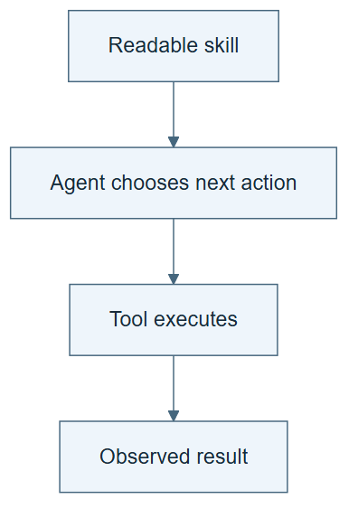

# 01.03 · Turn the process into a skill

[Course](../../README.md) · [Theme](../README.md)

**You are here:** Theme 01, One experiment → lab 3 of 5. [Find this theme in the course map](../../COURSE-MAP.md#theme-01) · [Whole-course mindmap](../../COURSE-MAP.md#whole-course-mindmap).

## What you will build

A short Markdown skill that runs the fixed baseline process.

## Why this matters

A chat history is a poor substitute for a reusable procedure. A skill makes the intended behavior explicit.

## Before you start

Complete [01.02: Run the process without changing it](../step_02_run_the_process/README.md). You need the concepts and the reports named below, not its old chat. If you start here directly, ask the tutor to prepare the listed starting state and explain the missing prerequisite first.

Open the coding agent at the repository root. Read [the tutor skill](../../skills/rsi-tutor/SKILL.md) and this lab's [brief](BRIEF.md). The agent keeps this lab's notes in <code>rsi-work/01-03</code>, outside the repository, and reports the absolute path. If the lab continues an earlier experiment, keep that experiment in its original workspace with its existing budget and locks. A new notes folder does not reset an experiment. The agent checks local Python and the [tool requirements](../../tools/README.md) before execution. You do not write code or configuration.

**Starting state:** PROCESS.md and TRACE.md from the preceding labs.

**Budget:** One verification fit to demonstrate execution; no search. Plan about 20–35 minutes of reading and discussion; this is an author estimate, not a measured student duration. Coding-agent inference may use a paid online service. Record its cost separately when available.

## How it works

A skill describes when to act, what to read, which tools to use, what outputs to keep, and when to stop. The host coding agent interprets it. The tool performs operations such as fitting a model. The evaluator checks an output. These roles cooperate but are not identical.

**A concrete example.** A usable instruction says: read the task, verify the pinned data, fit the training-median baseline once, save predictions, recompute MAE, then stop. A tool supplies the fitting operation. The host agent chooses the tool call by following the skill. The skill file contains neither the language model nor a technical barrier that prevents the agent from ignoring it.


*These are distinct responsibilities within one agent workflow, not independent security domains. The one fitted number is the training median. The learner skill must name actual dependencies and concrete refusal checks; the compact notebook is an outline, not a complete runnable skill. To confirm the one-fit budget, inspect the trial ledger and instruction-to-action trace as well as predictions. Blank checker results must be filled from execution. Preserve the canonical course skills.*

[Open the illustration at full size](../../assets/illustrations/skill-agent-tool-check-v2.png).

<details>
<summary>See the step diagram</summary>



*Read the diagram:* The skill tells the agent how to carry out the process. Tools perform the concrete operations.

</details>

## Run the lab

Start with this prompt. The tutor pauses for your prediction before it runs the next step.

```text
Read rsi/AGENTS.md and
rsi/skills/rsi-tutor/SKILL.md.
Guide me through lab 01.03, Turn the process
into a skill, one step at a time.
Read its README and BRIEF. Prepare its
separate workspace.
You write and run the implementation. Keep
the reports and failures.
Ask me to predict the result before the
experiment.
```

**Make a prediction:** If a skill says “never use leaked features,” what would show that the restriction is actually checked?

### 1. Write a focused skill

Preserve the process outside chat.

```text
Create a learner-owned baseline skill in
Markdown from PROCESS.md. Include inputs,
actions, evidence, one-fit limit, and
refusal conditions. Keep it shorter than the
execution report. Do not modify the
canonical course skills.
```

**Observe:** The skill is a procedure, not a copied transcript.

### 2. Read and follow it

Check that its instructions govern execution.

```text
Read the new skill and run its one-attempt
process in a fresh workspace. Record which
instruction led to each action. Compare its
outputs with the prior process.
```

**Observe:** The tool outputs support the skill’s completion claim.

## Check your result

The skill names its stop condition and reports. An actual execution follows it. A prose restriction is not described as a sandbox.

### Open these outputs

The agent keeps these in your lab workspace or records the original experiment path when reusing evidence.

| Output | What to inspect |
|---|---|
| Learner-owned baseline skill | Contains its trigger, required inputs, ordered actions, one-fit limit, evidence, and refusal conditions. |
| Instruction-to-action trace | Connects specific skill instructions to actual operations in the new run. |
| Checked baseline artifacts | Demonstrate that the saved procedure was followed, rather than merely written. |

Ask the agent to open the actual files and show the command exit status. A written description of a run is not a run. Keep a short <code>LAB-NOTE.md</code> with your prediction, measured observation, explanation, and one limit. The tutor must mark skipped learner responses as skipped.

## Try one change

Add an ambiguous instruction, “use the best data.” Identify two conflicting interpretations, then replace it with a concrete input-availability rule.

## If something goes wrong

If the skill grows into a copy of the whole chat, keep the procedure and move run-specific observations into the trace. If it says “use the best data,” name the permitted data and prediction-time rule. If execution needs an unstated file, add that dependency before claiming the skill is reusable.

Say “Stop this lab” to stop further work. Ask the agent to save <code>PROGRESS.md</code> with the last completed step and remaining budget. To resume, have it read that file and inspect active processes first. A reset creates a new sibling workspace; it does not erase failures or alter the source data. See the [recovery rules](../../tools/README.md) for interrupted tool runs.

## Key takeaways

- Skills retain instructions; tools perform operations.
- Readable rules still need observable checks.
- Specific inputs and stop conditions make a skill reusable.

## Check your understanding

Answer before opening the explanation. You can ask the tutor for a hint.

1. Does the skill contain the language model?
2. What proves a rule is enforced?
3. Why avoid copying the whole chat?
4. Has creating this skill produced RSI?

<details>
<summary>Hint</summary>

Point to three different things: the written instruction, the operation that implements it, and the evidence that checks its output. Do not treat them as interchangeable.

</details>

<details>
<summary>Explained answers</summary>

1. No. The host agent supplies the model and execution capabilities.

2. A meaningful check and an attempted violation that is rejected, within the stated boundary.

3. The reusable procedure should retain decisions and actions without unrelated history.

4. No. You packaged a fixed process. No improver has revised and inherited its own method.

</details>

## What's next

Add an output check that does not simply repeat the author’s claim. Continue to [01.04: Check outputs with a separate calculation](../step_04_separate_the_check/README.md).
