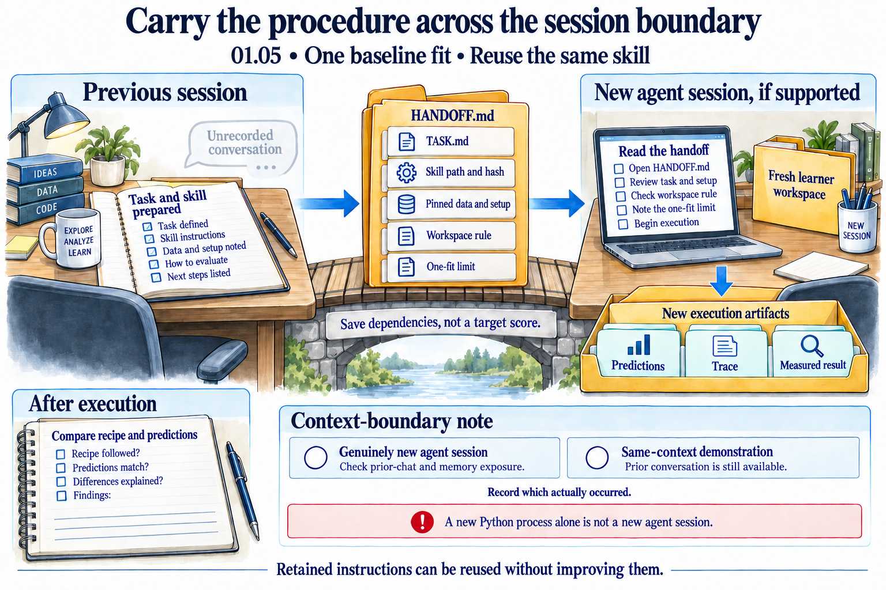
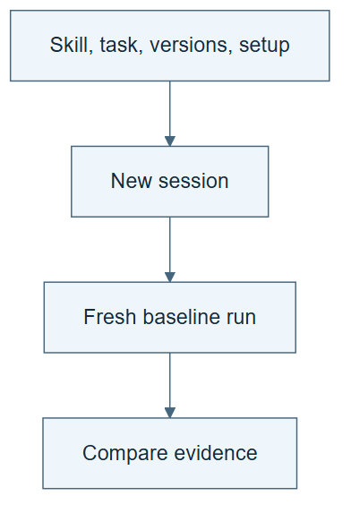

# 01.05 · Reuse the skill in a fresh session

[Course](../../README.md) · [Theme](../README.md)

**You are here:** Theme 01, One experiment → lab 5 of 5. [Find this theme in the course map](../../COURSE-MAP.md#theme-01) · [Whole-course mindmap](../../COURSE-MAP.md#whole-course-mindmap).

## What you will build

A handoff that another session can execute from files alone.

## Why this matters

A process that depends on unrecorded chat details is fragile. Persistence should be visible in artifacts.

## Before you start

Complete [01.04: Check outputs with a separate calculation](../step_04_separate_the_check/README.md). You need the concepts and the reports named below, not its old chat. If you start here directly, ask the tutor to prepare the listed starting state and explain the missing prerequisite first.

Open the coding agent at the repository root. Read [the tutor skill](../../skills/rsi-tutor/SKILL.md) and this lab's [brief](BRIEF.md). The agent keeps this lab's notes in <code>rsi-work/01-05</code>, outside the repository, and reports the absolute path. If the lab continues an earlier experiment, keep that experiment in its original workspace with its existing budget and locks. A new notes folder does not reset an experiment. The agent checks local Python and the [tool requirements](../../tools/README.md) before execution. You do not write code or configuration.

**Starting state:** The learner-owned baseline skill, task brief, and pinned repository. Start a genuinely new agent session if your host supports it.

**Budget:** One baseline fit in a new workspace. Plan about 20–35 minutes of reading and discussion; this is an author estimate, not a measured student duration. Coding-agent inference may use a paid online service. Record its cost separately when available.

## How it works

A fresh session has a new working context. Check whether the host also supplies earlier conversation, shared memory, or other retained information. Record that exposure rather than assuming it is absent. The session reads the stored skill and task to recover the procedure. If it behaves the same way, that supports reuse. It does not show the procedure improved: the retained instructions have not changed.

**A concrete example.** A new session reading “repeat our successful run” lacks the decisions hidden in “our.” In the [two-session handoff test](../../../how-did-i-generate-it/rsi/validation/fresh-session-results/README.md), a fresh agent received the task and skill without the old conversation or an expected score. Its one baseline fit reproduced all 4,358 earlier predictions. A second fresh agent received no task brief, identified the missing inputs and stopped with zero fits. The complete agent did see historical filenames during discovery; that exposure and the shared filesystem are disclosed. Equal predictions show that the unchanged procedure can be reused. They do not show that it improved.



*The bridge shows the intended file-based handoff, not proven isolation. The new session must be able to read the exact skill and dependencies; a hash without the file is insufficient. Inspect imported conversation, host memory, and other exposure before describing the boundary. If the host cannot provide a fresh session, label the exercise a same-context demonstration. The earlier checkmarks depict prepared inputs; the output tray contains no measured result yet. Compare after execution, without supplying the old score as a target. Reusing the same skill establishes no adaptive improvement.*

[Open the illustration at full size](../../assets/illustrations/fresh-session-handoff-v2.png).

<details>
<summary>See the step diagram</summary>



*Read the diagram:* A new session receives saved files. It should not need an unrecorded explanation from the previous chat.

</details>

## Run the lab

Start with this prompt. The tutor pauses for your prediction before it runs the next step.

```text
Read rsi/AGENTS.md and
rsi/skills/rsi-tutor/SKILL.md.
Guide me through lab 01.05, Reuse the skill
in a fresh session, one step at a time.
Read its README and BRIEF. Prepare its
separate workspace.
You write and run the implementation. Keep
the reports and failures.
Ask me to predict the result before the
experiment.
```

**Make a prediction:** Which information must survive outside the old conversation for the run to succeed?

### 1. Prepare the handoff

Retain only the necessary starting information.

```text
Create HANDOFF.md with the task, skill path
and hash, environment setup, workspace rule,
and one-fit limit. Do not include the
earlier metric as a target to imitate.
```

**Observe:** The handoff describes how to run, not what number to manufacture.

### 2. Run from files

Test the real context boundary available.

```text
In the new session, read HANDOFF.md and run
the fixed skill. Record whether this was a
genuinely fresh session or a same-context
simulation. Compare the new predictions with
the old recipe.
```

**Observe:** The procedure is recovered from files. Any weaker session boundary is stated.

## Check your result

The handoff identifies every required artifact. The new run is real. The report distinguishes fixed reuse from adaptive improvement.

### Open these outputs

The agent keeps these in your lab workspace or records the original experiment path when reusing evidence.

| Output | What to inspect |
|---|---|
| HANDOFF.md | Names every required file, the exact skill version, setup, workspace rule, and one-fit limit. |
| Context-boundary note | States whether a genuinely new agent session was used. A new Python process alone does not count. |
| New run and comparison | Show that the retained procedure was read and executed, then compare its predictions with the earlier recipe. |

Ask the agent to open the actual files and show the command exit status. A written description of a run is not a run. Keep a short <code>LAB-NOTE.md</code> with your prediction, measured observation, explanation, and one limit. The tutor must mark skipped learner responses as skipped.

## Try one change

Remove the task brief from a handoff copy. Have the new session identify the missing scientific choices instead of guessing a flattering metric.

## If something goes wrong

If the new session asks about an unstated scientific choice, add that choice to the handoff and retain the gap as a finding. If the host cannot provide another session, perform a labelled same-context check and leave fresh-session reuse unverified. Do not simulate forgetting and call it isolation.

Say “Stop this lab” to stop further work. Ask the agent to save <code>PROGRESS.md</code> with the last completed step and remaining budget. To resume, have it read that file and inspect active processes first. A reset creates a new sibling workspace; it does not erase failures or alter the source data. See the [recovery rules](../../tools/README.md) for interrupted tool runs.

## Key takeaways

- Stored instructions can survive a session boundary.
- Persistence is a mechanism; improvement is a measured claim.
- A handoff should state its dependencies explicitly.

## Check your understanding

Answer before opening the explanation. You can ask the tutor for a hint.

1. What persisted here?
2. What observation supports reuse?
3. Does an identical score show self-improvement?
4. What if the host cannot start a fresh context?

<details>
<summary>Hint</summary>

Imagine handing the folder to someone who has never read this chat. What must they know to run the experiment without being told what answer to print?

</details>

<details>
<summary>Explained answers</summary>

1. The task and skill files, not necessarily the old model context.

2. A new execution reads the retained procedure and follows its specified actions.

3. No. It supports repeatability of the fixed process.

4. Label the same-context exercise honestly. Do not claim isolation that was not tested.

</details>

## What's next

The fixed process works. Its weaknesses now give you a reason to repeat with feedback. Continue to [02.01: Let a failure motivate a second attempt](../../02_loop_engineering/step_01_why_repeat/README.md).
