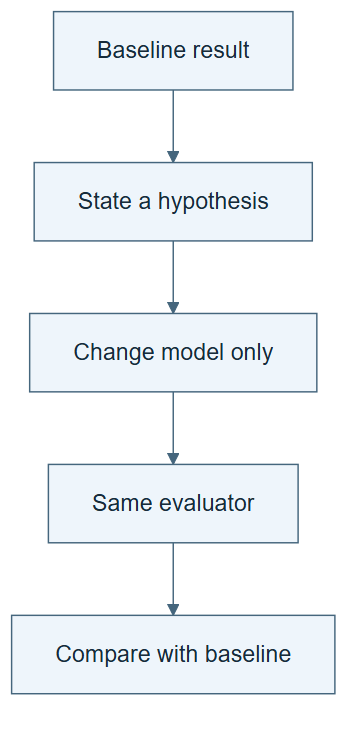

# 02.01 · Let a failure motivate a second attempt

[Course](../../README.md) · [Theme](../README.md)

**You are here:** Theme 02, Dependable workflows → lab 1 of 6. [Find this theme in the course map](../../COURSE-MAP.md#theme-02) · [Whole-course mindmap](../../COURSE-MAP.md#whole-course-mindmap).

## What you will build

A controlled comparison between a constant baseline and a calendar-based linear model.

## Why this matters

The baseline ignores the daily demand pattern. Another identical attempt cannot supply that missing relationship.

## Before you start

Complete [01.05: Reuse the skill in a fresh session](../../01_process_without_loops/step_05_reuse_the_skill/README.md). You need the concepts and the reports named below, not its old chat. If you start here directly, ask the tutor to prepare the listed starting state and explain the missing prerequisite first.

Open the coding agent at the repository root. Read [the tutor skill](../../skills/rsi-tutor/SKILL.md) and this lab's [brief](BRIEF.md). The agent creates a separate sibling workspace named <code>rsi-work/02-01</code> and reports its absolute path. It checks local Python and the [tool requirements](../../tools/README.md) before execution. You do not write code or configuration.

**Starting state:** The bike data card and the constant baseline’s hour-by-hour errors. Use a fresh comparison workspace.

**Budget:** Two fits: constant and linear, both with calendar features and seed 17. Plan about 20–35 minutes of reading and discussion; this is an author estimate, not a measured student duration. Coding-agent inference may use a paid online service. Record its cost separately when available.

## How it works

An improvement hypothesis connects an observed error to a proposed change. Here the median predicts the same count at every hour. A linear model with encoded calendar categories can assign different contributions to different hours. Holding the feature set fixed isolates the model-family change.

**A concrete example.** A constant predictor gives the same answer at 3 a.m. and 5 p.m. A model with calendar categories can assign different contributions to those hours. In the saved author run, replacing the constant model with a calendar linear model changed selection MAE from 159.95 to 109.81. Both used the same calendar input group; the comparison isolates a model change rather than adding weather at the same time.



*Read the diagram:* The weak result motivates a specific new candidate. The evaluator stays fixed.

## Run the lab

Start with this prompt. The tutor pauses for your prediction before it runs the next step.

```text
Read rsi/AGENTS.md and
rsi/skills/rsi-tutor/SKILL.md.
Guide me through lab 02.01, Let a failure
motivate a second attempt, one step at a
time.
Read its README and BRIEF. Prepare its
separate workspace.
You write and run the implementation. Keep
the reports and failures.
Ask me to predict the result before the
experiment.
```

**Make a prediction:** Will the linear model reduce the selection MAE? What result would contradict your explanation?

### 1. Inspect the failure pattern

Choose a change for a reason.

```text
Inspect the baseline error-by-hour report.
Explain the likely limitation without
reading final evaluation rows. Write a
hypothesis for replacing the constant
predictor with a calendar-based linear
model.
```

**Observe:** The hypothesis names a mechanism and a possible failure.

### 2. Run the comparison

Measure a controlled change.

```text
Use run-ml-experiment to fit
constant/calendar and linear/calendar with
seed 17 in one fresh workspace. Compare
their selection MAE and hourly errors. Keep
both. Do not select on final data.
```

**Observe:** The author’s pinned run favored the linear model; your own measured result decides the conclusion.

## Check your result

The data, split, metric, seed, and feature set match. Only the model family changes. COMPARISON.md retains both results and costs.

### Open these outputs

The agent keeps these in your lab workspace or records the original experiment path when reusing evidence.

| Output | What to inspect |
|---|---|
| Hypothesis or proposal | Links the observed hourly error pattern to the model-family change before fitting the alternative. |
| Two candidate directories | Retain constant/calendar and linear/calendar, with the same seed and scientific contract. |
| COMPARISON.md and hourly error reports | Show the aggregate comparison and whether particular hours still have large errors. |

Ask the agent to open the actual files and show the command exit status. A written description of a run is not a run. Keep a short <code>LAB-NOTE.md</code> with your prediction, measured observation, explanation, and one limit. The tutor must mark skipped learner responses as skipped.

## Try one change

Inspect a slice where the new model is still weak. Explain why a better average does not imply every hour improved.

## If something goes wrong

If both model family and feature group changed, keep that run but do not interpret it as the specified controlled comparison. If the linear candidate loses, check execution and then retain the losing result; a plausible diagnosis does not guarantee a gain. Never inspect final scores to rescue the choice.

Say “Stop this lab” to stop further work. Ask the agent to save <code>PROGRESS.md</code> with the last completed step and remaining budget. To resume, have it read that file and inspect active processes first. A reset creates a new sibling workspace; it does not erase failures or alter the source data. See the [recovery rules](../../tools/README.md) for interrupted tool runs.

## Key takeaways

- A useful retry follows a testable diagnosis.
- Change one factor when you want to isolate its effect.
- Improvement on average can coexist with local regressions.

## Check your understanding

Answer before opening the explanation. You can ask the tutor for a hint.

1. Why would repeating the median fit give little new information?
2. What factor changes in this comparison?
3. Does lower selection MAE prove a general gain?
4. What should happen if the hypothesis fails?

<details>
<summary>Hint</summary>

Name the one changed factor and each factor held fixed. Then find one observation that would make you doubt the proposed explanation.

</details>

<details>
<summary>Explained answers</summary>

1. The same deterministic recipe lacks the same hourly distinctions.

2. The model family. Calendar inputs and the evaluation contract stay fixed.

3. No. It is evidence on the selection period; transfer and final evaluation need separate checks.

4. Keep the failure and revise the explanation. Do not change the metric after seeing the result.

</details>

## What's next

A second attempt helps here. Give repeated attempts explicit state and a limit. Continue to [02.02: Give the loop state and a budget](../step_02_bounded_state/README.md).
