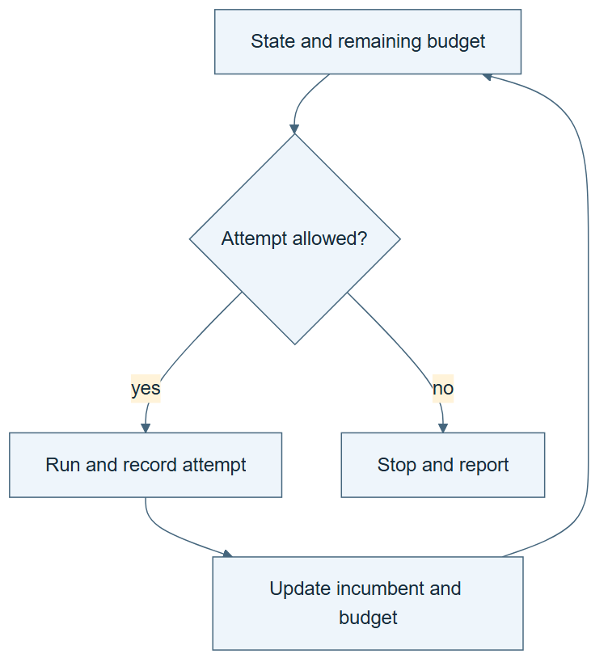

# 02.02 · Give the loop state and a budget

[Course](../../README.md) · [Theme](../README.md)

## What you will build

A three-attempt loop with a current candidate, best candidate, ledger, and stopping rule.

## Why this matters

“Keep trying until it works” leaves both resource use and success undefined.

## Before you start

Complete [02.01: Let a failure motivate a second attempt](../step_01_why_repeat/README.md). You need the concepts and the reports named below, not its old chat. If you start here directly, ask the tutor to prepare the listed starting state and explain the missing prerequisite first.

Open the coding agent at the repository root. Read [the tutor skill](../../skills/rsi-tutor/SKILL.md) and this lab's [brief](BRIEF.md). The agent creates a separate sibling workspace named <code>rsi-work/02-02</code> and reports its absolute path. It checks local Python and the [tool requirements](../../tools/README.md) before execution. You do not write code or configuration.

**Starting state:** The controlled comparison from 02.01. New workspace; fixed bike contract.

**Budget:** Three fits total: constant, linear, and tree with calendar inputs and seed 17. Plan about 20–35 minutes of reading and discussion; this is an author estimate, not a measured student duration. Coding-agent inference may use a paid online service. Record its cost separately when available.

## How it works

Loop state is the information needed for the next step: attempts used, candidates tried, current result, and retained best result. The best candidate changes only when the new valid score is better under the fixed rule. Rejected candidates remain part of the experiment.

**A concrete example.** Suppose three illustrative candidates have MAE 160, 110, and 125. After the third fit, the current candidate has error 125, but the retained best still has error 110. The loop stops because it spent three attempts. Stopping and choosing the retained output are different decisions.



*Read the diagram:* Each admitted attempt spends budget, even when it fails. State determines whether another attempt may start.

## Run the lab

Start with this prompt. The tutor pauses for your prediction before it runs the next step.

```text
Read rsi/AGENTS.md and rsi/skills/rsi-tutor/SKILL.md.
Guide me through lab 02.02, Give the loop state and a budget, one step at a time.
Read its README and BRIEF. Prepare its separate workspace.
You write and run the implementation. Keep the reports and failures.
Ask me to predict the result before the experiment.
```

**Make a prediction:** If the third candidate is worse, should the loop return it or the earlier best?

### 1. Declare the state

Make the next action inspectable.

```text
Write LOOP.md with attempt limit three, permitted recipes, lower-MAE retention rule, tie rule, and stop conditions. Keep task, metric, and partitions fixed.
```

**Observe:** The loop can decide when to stop before any score is known.

### 2. Execute three steps

Follow the declared loop.

```text
Run constant, linear, and tree with calendar inputs and seed 17. After each fit, update a readable state note with current and retained candidate. Stop after attempt three and run the comparison tool.
```

**Observe:** The retained result may come from an earlier attempt.

## Check your result

Exactly three attempts are recorded. The retained candidate satisfies the declared rule. The last candidate is not automatically selected.

### Open these outputs

The agent keeps these in your lab workspace or records the original experiment path when reusing evidence.

| Output | What to inspect |
|---|---|
| LOOP.md | Declares three attempts, allowed recipes, lower-MAE retention, tie handling, and stop conditions. |
| State after each attempt | Shows both the current candidate and retained best, plus attempts used and remaining. |
| trials.csv and COMPARISON.md | Preserve all three results and the choice supported by the declared rule. |

Ask the agent to open the actual files and show the command exit status. A written description of a run is not a run. Keep a short <code>LAB-NOTE.md</code> with your prediction, measured observation, explanation, and one limit. The tutor must mark skipped learner responses as skipped.

## Try one change

Set the limit to one in a new workspace. Predict which artifact can be produced and which comparisons cannot.

## If something goes wrong

If the latest candidate replaces a better earlier result, inspect the retention condition. If the comparison shows the wrong attempt limit, check the frozen contract and the first run’s budget argument. Do not increase the contract limit after results arrive. Failed admitted attempts still consume their slots.

Say “Stop this lab” to stop further work. Ask the agent to save <code>PROGRESS.md</code> with the last completed step and remaining budget. To resume, have it read that file and inspect active processes first. A reset creates a new sibling workspace; it does not erase failures or alter the source data. See the [recovery rules](../../tools/README.md) for interrupted tool runs.

## Key takeaways

- A loop needs state as well as repetition.
- Retention and termination are separate decisions.
- Failed and rejected attempts consume resources too.

## Check your understanding

Answer before opening the explanation. You can ask the tutor for a hint.

1. Why keep the current and best candidates separate?
2. Does a three-fit limit measure total cost?
3. What happens on a tie?
4. Is a bounded search already RSI?

<details>
<summary>Hint</summary>

Use two labels on the ledger: “just evaluated” and “best retained so far.” Move each label only when its own rule says to move it.

</details>

<details>
<summary>Explained answers</summary>

1. The latest proposal can be worse than a previously retained result.

2. No. Proposal, reading, review, startup, and agent inference also cost resources.

3. Follow the declared rule; this course retains the earlier candidate.

4. No. It optimizes task candidates under a fixed search procedure.

</details>

## What's next

The loop can repeat. Now make the feedback change its choice. Continue to [02.03: Turn an error into a different action](../step_03_use_feedback/README.md).
