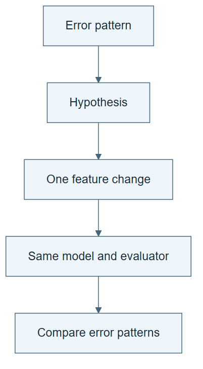

# 02.03 · Turn an error into a different action

[Course](../../README.md) · [Theme](../README.md)

## What you will build

A feedback note that causes a documented change in the next experiment.

## Why this matters

Passing a score back to an agent is not enough. You need to see how the feedback affects its decision.

## Before you start

Complete [02.02: Give the loop state and a budget](../step_02_bounded_state/README.md). You need the concepts and the reports named below, not its old chat. If you start here directly, ask the tutor to prepare the listed starting state and explain the missing prerequisite first.

Open the coding agent at the repository root. Read [the tutor skill](../../skills/rsi-tutor/SKILL.md) and this lab's [brief](BRIEF.md). The agent creates a separate sibling workspace named <code>rsi-work/02-03</code> and reports its absolute path. It checks local Python and the [tool requirements](../../tools/README.md) before execution. You do not write code or configuration.

**Starting state:** A linear/calendar bike candidate and its error-by-hour report. New comparison workspace.

**Budget:** Two fits: linear/calendar and linear/all, seed 17. Plan about 20–35 minutes of reading and discussion; this is an author estimate, not a measured student duration. Coding-agent inference may use a paid online service. Record its cost separately when available.

## How it works

A scalar score says how well a candidate performed. Error slices help locate the weakness. A hypothesis then connects that weakness to an intervention. Adding weather inputs tests whether information beyond the calendar helps this fixed model; it does not prove weather causes demand.

**A concrete example.** In the saved author walkthrough, the linear model with calendar fields has selection MAE 109.81. Adding weather to that same model reduces it to 99.18. Changing the model to a tree while keeping calendar fields instead gives 125.05. One proposal helps and another hurts. Keeping the interventions separate tells you which change produced each result. Your own run must supply its own measurements.



*Read the diagram:* Use an observed error to choose one intervention. Keep other factors fixed to make the comparison interpretable.

## Run the lab

Start with this prompt. The tutor pauses for your prediction before it runs the next step.

```text
Read rsi/AGENTS.md and rsi/skills/rsi-tutor/SKILL.md.
Guide me through lab 02.03, Turn an error into a different action, one step at a time.
Read its README and BRIEF. Prepare its separate workspace.
You write and run the implementation. Keep the reports and failures.
Ask me to predict the result before the experiment.
```

**Make a prediction:** Could adding relevant-looking inputs make selection error worse?

### 1. Write a diagnosis

Turn observations into a falsifiable proposal.

```text
Read the selection error slices. Write FEEDBACK.md with an observed weakness, a proposed weather-feature test, an alternative explanation, and the expected result. Do not inspect final outcomes.
```

**Observe:** The diagnosis separates observed facts from guesses.

### 2. Use the feedback

Record the decision it changed.

```text
Fit linear/calendar and linear/all with the same seed and contract. Record in DECISION.md exactly which feedback led to the feature change. Compare errors and retain both candidates.
```

**Observe:** The trace connects feedback to an actual different action.

## Check your result

The next action differs in the declared feature set. The report does not infer causation from prediction performance. Harmful feedback remains visible.

### Open these outputs

The agent keeps these in your lab workspace or records the original experiment path when reusing evidence.

| Output | What to inspect |
|---|---|
| FEEDBACK.md | Separates the observed weakness, weather-feature hypothesis, alternative explanation, and predicted outcome. |
| DECISION.md | Names the feedback that changed the next action before that candidate is fitted. |
| Two candidate records | Keep linear/calendar and linear/all under the same model family, seed, split, and metric. |

Ask the agent to open the actual files and show the command exit status. A written description of a run is not a run. Keep a short <code>LAB-NOTE.md</code> with your prediction, measured observation, explanation, and one limit. The tutor must mark skipped learner responses as skipped.

## Try one change

Replace the diagnosis with “try harder.” Explain why this is less useful than naming a testable change.

## If something goes wrong

If the agent explains the feature choice only after seeing its score, label the explanation retrospective and do not claim it was the decision rule. If error slices do not support a weather-specific diagnosis, record that uncertainty: adding weather remains a testable hypothesis. A poorer candidate is retained as evidence and rejected as the preferred recipe.

Say “Stop this lab” to stop further work. Ask the agent to save <code>PROGRESS.md</code> with the last completed step and remaining budget. To resume, have it read that file and inspect active processes first. A reset creates a new sibling workspace; it does not erase failures or alter the source data. See the [recovery rules](../../tools/README.md) for interrupted tool runs.

## Key takeaways

- Feedback helps when it changes an action.
- Error slices suggest hypotheses; they do not prove causes.
- An added input can hurt through noise, shift, or model mismatch.

## Check your understanding

Answer before opening the explanation. You can ask the tutor for a hint.

1. What distinguishes feedback from a repeated score?
2. What stays fixed here?
3. Can improved prediction establish weather’s causal effect?
4. How should misleading feedback be handled?

<details>
<summary>Hint</summary>

Draw three boxes: observation, hypothesis, action. Only the first is already measured. The experiment tests the connection between the other two.

</details>

<details>
<summary>Explained answers</summary>

1. Useful feedback informs a concrete next decision that can be tested.

2. Model family, seed, data roles, and metric; the feature group changes.

3. No. Observational prediction and causal identification require different designs.

4. Keep its proposal and outcome, reject the change under the fixed rule, and revise the diagnosis.

</details>

## What's next

Feedback can also send a loop in circles. Add explicit detection and stopping. Continue to [02.04: Stop repeated failure and oscillation](../step_04_stop_the_loop/README.md).
