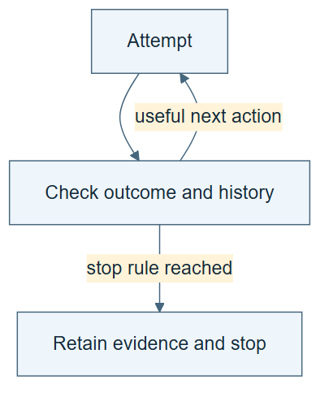

# 02.04 · Stop repeated failure and oscillation

[Course](../../README.md) · [Theme](../README.md)

**You are here:** Theme 02, Dependable workflows → lab 4 of 6. [Find this theme in the course map](../../COURSE-MAP.md#theme-02) · [Whole-course mindmap](../../COURSE-MAP.md#whole-course-mindmap).

## What you will build

A loop controller that stops on a repeated recipe, exhausted budget, or unchanged failure.

## Why this matters

An agent can alternate between two ideas and describe each as progress. A ledger makes the repetition visible.

## Before you start

Complete [02.03: Turn an error into a different action](../step_03_use_feedback/README.md). You need the concepts and the reports named below, not its old chat. If you start here directly, ask the tutor to prepare the listed starting state and explain the missing prerequisite first.

Open the coding agent at the repository root. Read [the tutor skill](../../skills/rsi-tutor/SKILL.md) and this lab's [brief](BRIEF.md). The agent keeps this lab's notes in <code>rsi-work/02-04</code>, outside the repository, and reports the absolute path. If the lab continues an earlier experiment, keep that experiment in its original workspace with its existing budget and locks. A new notes folder does not reset an experiment. The agent checks local Python and the [tool requirements](../../tools/README.md) before execution. You do not write code or configuration.

**Starting state:** The three-attempt loop and recorded candidate recipes.

**Budget:** At most two new fits; duplicate proposals must be detected before fitting. Plan about 20–35 minutes of reading and discussion; this is an author estimate, not a measured student duration. Coding-agent inference may use a paid online service. Record its cost separately when available.

## How it works

A recipe fingerprint identifies task, model, features, seed, and tool version. If those are unchanged, a proposal may repeat an earlier attempt. A duplicate check is a controller rule, distinct from the metric. Some repeated stochastic trials are intentional; record that purpose rather than disguising repetition as novelty.

**A concrete example.** The [audited request trace](../../evidence/2026-09-22/loop-state-feedback/STOP-RULES-REVIEW.md) records linear/calendar → tree/calendar → linear/calendar → forest/calendar. Only the first two fit. The repeated linear recipe is refused as a duplicate; the distinct forest recipe is refused because the two-fit budget is spent. Neither refusal gets an invented score. A source check confirms that duplication is tested before fitting; the controller and experiment contracts bind the recorded tool versions.


*This sequence assumes requests 1 and 2 have consumed the two allowed fit slots. Check duplicates before budget so request 3 records the duplicate reason; request 4 is distinct and demonstrates the budget refusal. The tree and forest drawings are mnemonics for model names. The request trace records admitted and refused work; the fit ledger records actual attempts. A refusal has no executed model score, but proposal and checking costs can still exist. The drawn gates state intended controller behavior, which you must test.*

[Open the illustration at full size](../../assets/illustrations/duplicate-and-budget-stops-v1.png).

<details>
<summary>See the step diagram</summary>



*Read the diagram:* A loop needs a path out. Repeated failure, oscillation, or exhausted budget can trigger the declared stop rule.

</details>

## Run the lab

Start with this prompt. The tutor pauses for your prediction before it runs the next step.

```text
Read rsi/AGENTS.md and
rsi/skills/rsi-tutor/SKILL.md.
Guide me through lab 02.04, Stop repeated
failure and oscillation, one step at a time.
Read its README and BRIEF. Prepare its
separate workspace.
You write and run the implementation. Keep
the reports and failures.
Ask me to predict the result before the
experiment.
```

**Make a prediction:** Should the sequence linear → tree → linear count as three new ideas?

### 1. Build the stop check

Give repetition an observable definition.

```text
Generate a controller in my workspace that
fingerprints proposed recipes and rejects
unlabelled duplicates. Preserve the sequence
linear/calendar, tree/calendar,
linear/calendar, all with seed 17, as a
teaching input. Check duplicate identity
before remaining budget so the third request
records the duplicate reason. Use a distinct
forest/calendar request to test budget
exhaustion. Write this check order and its
stop rules in LOOP.md.
```

**Observe:** The third proposal is recognized as a duplicate.

### 2. Test the limit

Verify behavior, including rejection.

```text
Execute at most the first two recipes.
Attempt the duplicate and an over-budget
request. Keep the refusal records and show
that neither starts an extra fit.
```

**Observe:** The attempt ledger and execution count agree.

## Check your result

The controller produces a real refusal for both duplicate and over-budget requests. Rejections are recorded without fabricated model scores.

### Open these outputs

The agent keeps these in your lab workspace or records the original experiment path when reusing evidence.

| Output | What to inspect |
|---|---|
| Generated controller and LOOP.md | Define recipe identity, duplicate handling, the total attempt limit, and stop behavior. |
| Request trace | Records the two admitted recipes, duplicate refusal, and distinct over-budget refusal. |
| Fit ledger | Shows no extra model fit for either refused request. A refusal has a reason, not an invented score. |

Ask the agent to open the actual files and show the command exit status. A written description of a run is not a run. Keep a short <code>LAB-NOTE.md</code> with your prediction, measured observation, explanation, and one limit. The tutor must mark skipped learner responses as skipped.

## Try one change

Label a repeated seed experiment as an intentional reproducibility check. Explain why its purpose and cost should remain explicit.

## If something goes wrong

If the duplicate runs again, inspect which fields the fingerprint includes and whether it is checked before fitting. If an over-budget request succeeds after restart, inspect whether the limit and spent attempts were reloaded. To study intentional replication, declare a separate comparison that permits it; do not relabel an accidental repeat after it happens.

Say “Stop this lab” to stop further work. Ask the agent to save <code>PROGRESS.md</code> with the last completed step and remaining budget. To resume, have it read that file and inspect active processes first. A reset creates a new sibling workspace; it does not erase failures or alter the source data. See the [recovery rules](../../tools/README.md) for interrupted tool runs.

## Key takeaways

- A stop rule is part of the method.
- Repeated proposals can be detected from recipe identity.
- Intentional replication is useful, but it is not a new hypothesis.

## Check your understanding

Answer before opening the explanation. You can ask the tutor for a hint.

1. What is oscillation here?
2. Why not stop only when the score improves?
3. Can a refused request have a score?
4. When can repetition be valid?

<details>
<summary>Hint</summary>

Compare recipe identity before comparing scores. A new explanation for an unchanged recipe does not create a new experimental intervention.

</details>

<details>
<summary>Explained answers</summary>

1. Returning between previously tried choices without new evidence or a declared replication purpose.

2. An improvement may never occur; the loop would have no resource bound.

3. Not an executed model score. It has a refusal reason and any incurred proposal cost.

4. When it tests reproducibility or stochastic variation under a declared protocol and budget.

</details>

## What's next

A bounded loop may still be interrupted. Preserve enough state to resume it correctly. Continue to [02.05: Resume without losing the experiment](../step_05_resume/README.md).
