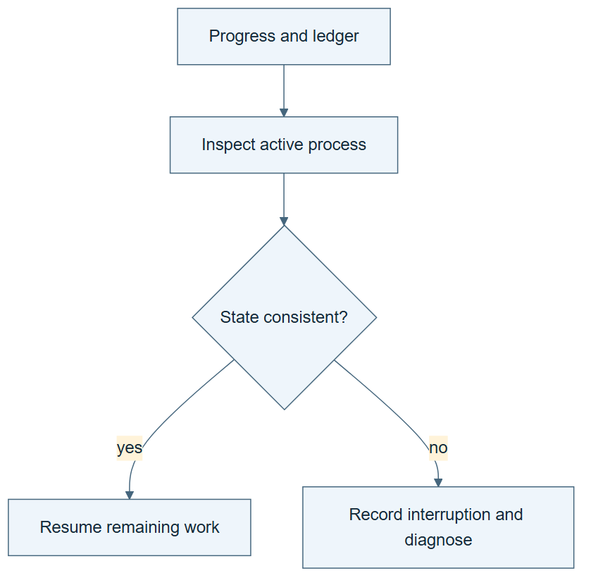

# 02.05 · Resume without losing the experiment

[Course](../../README.md) · [Theme](../README.md)

**You are here:** Theme 02, Dependable workflows → lab 5 of 6. [Find this theme in the course map](../../COURSE-MAP.md#theme-02) · [Whole-course mindmap](../../COURSE-MAP.md#whole-course-mindmap).

## What you will build

A checkpoint and a resumed loop that retains candidate identities and spent budget.

## Why this matters

Restarting the program should not silently restart the scientific experiment.

## Before you start

Complete [02.04: Stop repeated failure and oscillation](../step_04_stop_the_loop/README.md). You need the concepts and the reports named below, not its old chat. If you start here directly, ask the tutor to prepare the listed starting state and explain the missing prerequisite first.

Open the coding agent at the repository root. Read [the tutor skill](../../skills/rsi-tutor/SKILL.md) and this lab's [brief](BRIEF.md). The agent keeps this lab's notes in <code>rsi-work/02-05</code>, outside the repository, and reports the absolute path. If the lab continues an earlier experiment, keep that experiment in its original workspace with its existing budget and locks. A new notes folder does not reset an experiment. The agent checks local Python and the [tool requirements](../../tools/README.md) before execution. You do not write code or configuration.

**Starting state:** A fresh three-attempt loop workspace. Stop after its first completed candidate.

**Budget:** Three total fits across both sessions, not three per session. Plan about 20–35 minutes of reading and discussion; this is an author estimate, not a measured student duration. Coding-agent inference may use a paid online service. Record its cost separately when available.

## How it works

A checkpoint records durable state: contract, completed and interrupted attempts, retained candidate, remaining budget, and next action. A process ID or live lock is different: it tells you whether work may still be running. Resuming must reconcile both.

**A concrete example.** A three-attempt experiment stops after candidate 1. Its checkpoint says one used and two remaining. Opening another session changes neither number. The [additional author walkthrough](../../evidence/2026-09-22/interrupted-attempt/README.md) starts a separate interrupted fixture: trial-001 remains charged even though no estimator trained. After two refusal checks and explicit reconciliation, one real fit becomes trial-002. It does not overwrite trial-001 or refill the three-slot budget. The walkthrough preserves its failed launcher-PID check and subsequent correction.


*This depicts an orderly pause after trial-001, not interruption during its fit. The right-hand files represent the remaining possible attempt identities, not already successful results. Inspect live work and actual artifacts before resuming; a saved lock alone does not prove a process is active. An admitted attempt that is later interrupted still occupies its slot and keeps its known cost. Reconcile a stale progress note with the durable ledger rather than silently refilling the budget. A program restart does not itself establish a fresh agent context.*

[Open the illustration at full size](../../assets/illustrations/resume-shared-budget-v1.png).

<details>
<summary>See the step diagram</summary>



*Read the diagram:* Resume from recorded state only after reconciling unfinished work. Starting again must not erase spent attempts.

</details>

## Run the lab

Start with this prompt. The tutor pauses for your prediction before it runs the next step.

```text
Read rsi/AGENTS.md and
rsi/skills/rsi-tutor/SKILL.md.
Guide me through lab 02.05, Resume without
losing the experiment, one step at a time.
Read its README and BRIEF. Prepare its
separate workspace.
You write and run the implementation. Keep
the reports and failures.
Ask me to predict the result before the
experiment.
```

**Make a prediction:** After one fit and a restart, how many attempts remain in a three-attempt experiment?

### 1. Stop at a boundary

Save a state you can inspect.

```text
Run only the constant/calendar candidate.
Save PROGRESS.md with its ID, contract,
consumed attempt, two remaining attempts,
and the next planned action. Stop further
fitting.
```

**Observe:** The checkpoint accounts for completed work.

### 2. Resume from files

Continue the same experiment.

```text
Read PROGRESS.md and the actual ledger.
Inspect active processes and locks. Resume
the next two distinct recipes without
overwriting the first trial. Stop at the
original total limit.
```

**Observe:** The final ledger contains the whole experiment across sessions.

## Check your result

Candidate IDs are unique. The first result survives. The restart does not replenish attempts. A stale lock is inspected before removal.

### Open these outputs

The agent keeps these in your lab workspace or records the original experiment path when reusing evidence.

| Output | What to inspect |
|---|---|
| PROGRESS.md at the stop boundary | Records the completed candidate, contract, spent and remaining attempts, retained result, and next action. |
| Original candidate artifacts | Remain unchanged after resumption. |
| Combined ledger and final state | Show unique identities across sessions and the original three-attempt limit. |

Ask the agent to open the actual files and show the command exit status. A written description of a run is not a run. Keep a short <code>LAB-NOTE.md</code> with your prediction, measured observation, explanation, and one limit. The tutor must mark skipped learner responses as skipped.

## Try one change

Prepare a labelled teaching checkpoint with a running trial whose process has exited. Mark it interrupted and preserve its spent attempt before continuing.

## If something goes wrong

If a lock exists, inspect the worker PID it records; a launcher can have a different PID. Match the available process identity and status before touching the lock. Preserve an exited worker’s interrupted trial and known cost. If the checkpoint disagrees with the durable ledger, reconcile the artifacts first. If source or contract changed, keep the experiment intact and use a separate reviewed experiment.

Say “Stop this lab” to stop further work. Ask the agent to save <code>PROGRESS.md</code> with the last completed step and remaining budget. To resume, have it read that file and inspect active processes first. A reset creates a new sibling workspace; it does not erase failures or alter the source data. See the [recovery rules](../../tools/README.md) for interrupted tool runs.

## Key takeaways

- A restart changes process state, not the experiment’s identity.
- Spent resources survive interruption.
- A checkpoint must agree with the actual ledger.

## Check your understanding

Answer before opening the explanation. You can ask the tutor for a hint.

1. How many attempts remain after one of three completed fits?
2. Why inspect a lock before deleting it?
3. Should an interrupted attempt disappear?
4. What if the evaluator changed before resume?

<details>
<summary>Hint</summary>

Distinguish the lifetime of the program from the lifetime of the experiment. Which state must survive when the program stops?

</details>

<details>
<summary>Explained answers</summary>

1. Two, regardless of how many sessions are opened.

2. Another process may still be writing the workspace. Deleting its lock permits conflicting writes.

3. No. Keep its identity, failure state, and known cost; unknown cost stays unknown.

4. Stop and start a new reviewed experiment. Do not mix results under different contracts.

</details>

## What's next

Compare blind repetition with a procedure that uses feedback. Continue to [02.06: Compare two ways to spend the same attempts](../step_06_compare_loops/README.md).
