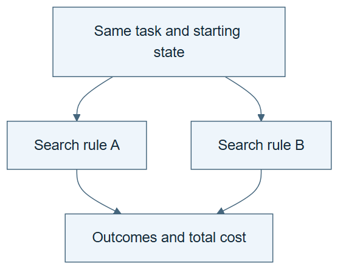

# 02.06 · Compare two ways to spend the same attempts

[Course](../../README.md) · [Theme](../README.md)

## What you will build

A small comparison between fixed retries and feedback-guided revisions.

## Why this matters

A better final candidate can result from how attempts were chosen, not only from the model family.

## Before you start

Complete [02.05: Resume without losing the experiment](../step_05_resume/README.md). You need the concepts and the reports named below, not its old chat. If you start here directly, ask the tutor to prepare the listed starting state and explain the missing prerequisite first.

Open the coding agent at the repository root. Read [the tutor skill](../../skills/rsi-tutor/SKILL.md) and this lab's [brief](BRIEF.md). The agent creates a separate sibling workspace named <code>rsi-work/02-06</code> and reports its absolute path. It checks local Python and the [tool requirements](../../tools/README.md) before execution. You do not write code or configuration.

**Starting state:** The bike task, fixed contract, and two clean workspaces. Predeclare both procedures.

**Budget:** Four fits total: two per procedure. Count proposal and review overhead separately. Plan about 20–35 minutes of reading and discussion; this is an author estimate, not a measured student duration. Coding-agent inference may use a paid online service. Record its cost separately when available.

## How it works

Procedure A repeats a declared baseline recipe. Procedure B uses the first result to choose one permitted change. Both begin with the same candidate and receive two fits. This isolates a simple allocation difference, while remaining too small to establish a broad research advantage.




*Read the diagram:* Both search rules start from the same conditions and receive the same total attempt allowance.


## Run the lab

Start with this prompt. The tutor pauses for your prediction before it runs the next step.

```text
Read rsi/AGENTS.md and rsi/skills/rsi-tutor/SKILL.md.
Guide me through lab 02.06, Compare two ways to spend the same attempts, one step at a time.
Read its README and BRIEF. Prepare its separate workspace.
You write and run the implementation. Keep the reports and failures.
Ask me to predict the result before the experiment.
```

**Make a prediction:** Can a feedback-guided procedure lose despite having a sensible explanation?

### 1. Declare the comparison

Prevent a favorable retrospective choice.

```text
Write COMPARISON-PLAN.md. Arm A runs constant/calendar twice. Arm B runs constant/calendar then chooses one model change from selection error evidence. Use seed 17 and two attempts per arm. Record the decision before its fit.
```

**Observe:** The comparison rule exists before the second results.

### 2. Run and interpret

Measure retained outputs and costs.

```text
Execute both arms in separate workspaces. Compare retained selection MAE, attempted recipes, elapsed fit time, and available agent cost. State the same-context limitation if no fresh agent context was used.
```

**Observe:** The report distinguishes model-fit budget from total research cost.

## Check your result

Both arms start from the same recipe and get two fits. The adaptive choice is recorded before evaluation. The conclusion is limited to this small comparison.

Ask the agent to open the actual files and show the command exit status. A written description of a run is not a run. Keep a short <code>LAB-NOTE.md</code> with your prediction, measured observation, explanation, and one limit. The tutor must mark skipped learner responses as skipped.

## Try one change

Give one arm ten attempts only as a clearly separate exercise. Explain why its better result would not establish a better method at equal resources.

## If something goes wrong

If the expected artifact is missing, inspect the last command and its exit status before running again. If a check fails, preserve the failing result and diagnose that check; do not weaken it to obtain a pass.

Say “Stop this lab” to stop further work. Ask the agent to save <code>PROGRESS.md</code> with the last completed step and remaining budget. To resume, have it read that file and inspect active processes first. A reset creates a new sibling workspace; it does not erase failures or alter the source data. See the [recovery rules](../../tools/README.md) for interrupted tool runs.

## Key takeaways

- A search procedure determines how a budget is spent.
- Matched fit counts do not guarantee matched total cost.
- A better solver result is not yet a better improver.

## Check your understanding

Answer before opening the explanation. You can ask the tutor for a hint.

1. What is compared here?
2. Why record the adaptive choice before fitting?
3. Does one winning comparison prove universal superiority?
4. What would make this recursive?

<details>
<summary>Hint</summary>

Trace what changed, what stayed fixed, and which observation supports the conclusion. A filename or a confident explanation is not enough evidence.

</details>

<details>
<summary>Explained answers</summary>

1. Two fixed procedures for choosing task-level experiments.

2. It prevents rewriting the hypothesis to match a result already seen.

3. No. More tasks and repeated controlled comparisons are needed.

4. A revision to the improvement procedure would need to govern later improvement work, with separate evidence for its effectiveness.

</details>

## What's next

The loop treats every case similarly. Add branches and dependencies for different kinds of work. Continue to [03.01: Draw the dependencies](../../03_graph_engineering/step_01_dependencies/README.md).
