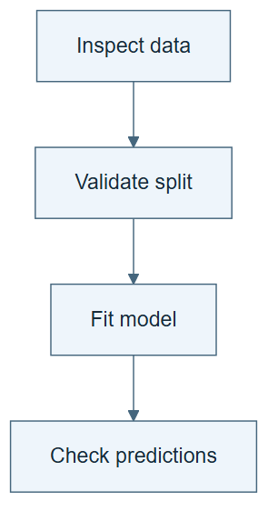

# 03.01 · Draw the dependencies

[Course](../../README.md) · [Theme](../README.md)

## What you will build

An execution graph for the process you already ran.

## Why this matters

A numbered list hides why one action must precede another. Dependencies explain that order.

## Before you start

Complete [02.06: Compare two ways to spend the same attempts](../../02_loop_engineering/step_06_compare_loops/README.md). You need the concepts and the reports named below, not its old chat. If you start here directly, ask the tutor to prepare the listed starting state and explain the missing prerequisite first.

Open the coding agent at the repository root. Read [the tutor skill](../../skills/rsi-tutor/SKILL.md) and this lab's [brief](BRIEF.md). The agent creates a separate sibling workspace named <code>rsi-work/03-01</code> and reports its absolute path. It checks local Python and the [tool requirements](../../tools/README.md) before execution. You do not write code or configuration.

**Starting state:** The fixed process, its trace, and a fresh diagram workspace.

**Budget:** No model fits. One graph validation and one deliberately invalid ordering. Plan about 20–35 minutes of reading and discussion; this is an author estimate, not a measured student duration. Coding-agent inference may use a paid online service. Record its cost separately when available.

## How it works

Draw each action as a node. An arrow from inspect data to validate split means the latter needs the former’s output. A directed acyclic graph, or DAG, has directed arrows and no cycle. A loop is a cycle, so a workflow containing a retry is not a DAG unless the retry is represented as a separate bounded operation.




*Read the diagram:* An arrow is a prerequisite: the destination needs the source to finish first.


## Run the lab

Start with this prompt. The tutor pauses for your prediction before it runs the next step.

```text
Read rsi/AGENTS.md and rsi/skills/rsi-tutor/SKILL.md.
Guide me through lab 03.01, Draw the dependencies, one step at a time.
Read its README and BRIEF. Prepare its separate workspace.
You write and run the implementation. Keep the reports and failures.
Ask me to predict the result before the experiment.
```

**Make a prediction:** Can the metric checker run before predictions exist?

### 1. Name the dependencies

Explain order through required inputs.

```text
Create WORKFLOW.md with nodes frame, inspect, split, fit, check, report. For each edge, name the artifact it carries. Render a simple diagram and retain the editable source.
```

**Observe:** Every arrow has a reason.

### 2. Validate an ordering

Turn the graph into a small executable check.

```text
Generate a local graph-order checker. Verify the normal sequence, then try an order that checks predictions before fitting. Keep the failure and explanation.
```

**Observe:** The invalid order fails because a required artifact is unavailable.

## Check your result

The graph has explicit edges and a valid order. The checker rejects the invalid order. The diagram labels artifacts rather than implying unexplained communication.

Ask the agent to open the actual files and show the command exit status. A written description of a run is not a run. Keep a short <code>LAB-NOTE.md</code> with your prediction, measured observation, explanation, and one limit. The tutor must mark skipped learner responses as skipped.

## Try one change

Remove the inspect-to-split edge in a copy. Explain what important information the split designer could now miss.

## If something goes wrong

If the expected artifact is missing, inspect the last command and its exit status before running again. If a check fails, preserve the failing result and diagnose that check; do not weaken it to obtain a pass.

Say “Stop this lab” to stop further work. Ask the agent to save <code>PROGRESS.md</code> with the last completed step and remaining budget. To resume, have it read that file and inspect active processes first. A reset creates a new sibling workspace; it does not erase failures or alter the source data. See the [recovery rules](../../tools/README.md) for interrupted tool runs.

## Key takeaways

- Dependencies describe what an action needs.
- A valid order respects every prerequisite.
- A diagram becomes more useful when its edges name artifacts.

## Check your understanding

Answer before opening the explanation. You can ask the tutor for a hint.

1. What does an arrow mean here?
2. Can two nodes appear in either order?
3. Is a graph with a retry edge always a DAG?
4. What does the invalid-order test establish?

<details>
<summary>Hint</summary>

Trace what changed, what stayed fixed, and which observation supports the conclusion. A filename or a confident explanation is not enough evidence.

</details>

<details>
<summary>Explained answers</summary>

1. The destination needs a declared result from the source; it is not merely a visual sequence.

2. Yes, if neither depends on the other and their side effects do not conflict.

3. No. A retry can create a directed cycle.

4. That the checker enforces one actual dependency, not that every possible workflow is correct.

</details>

## What's next

Dependencies give an order. Branches let different conditions choose different routes. Continue to [03.02: Route different failures differently](../step_02_branch/README.md).
