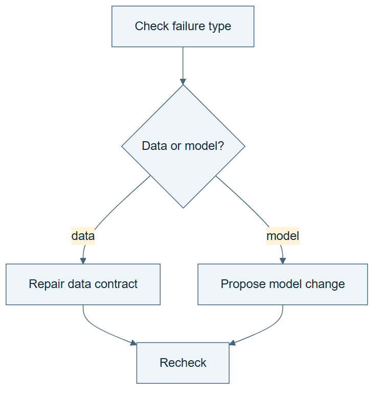

# 03.02 · Route different failures differently

[Course](../../README.md) · [Theme](../README.md)

**You are here:** Theme 03, Dependable workflows → lab 2 of 6. [Find this theme in the course map](../../COURSE-MAP.md#theme-03) · [Whole-course mindmap](../../COURSE-MAP.md#whole-course-mindmap).

## What you will build

A branch that sends invalid data to repair and valid data to modeling.

## Why this matters

Trying another model cannot fix a missing target or a leaked feature. The response should match the failure.

## Before you start

Complete [03.01: Draw the dependencies](../step_01_dependencies/README.md). You need the concepts and the reports named below, not its old chat. If you start here directly, ask the tutor to prepare the listed starting state and explain the missing prerequisite first.

Open the coding agent at the repository root. Read [the tutor skill](../../skills/rsi-tutor/SKILL.md) and this lab's [brief](BRIEF.md). The agent creates a separate sibling workspace named <code>rsi-work/03-02</code> and reports its absolute path. It checks local Python and the [tool requirements](../../tools/README.md) before execution. You do not write code or configuration.

**Starting state:** The data report and dependency graph. Make teaching copies; preserve pinned data.

**Budget:** No fits required. Test two data fixtures and one ambiguous case. Plan about 20–35 minutes of reading and discussion; this is an author estimate, not a measured student duration. Coding-agent inference may use a paid online service. Record its cost separately when available.

## How it works

A branch is a decision with explicit conditions. If required fields are absent, stop before fitting. If data checks pass, proceed. If the evidence is incomplete, report uncertainty. Do not route an unknown condition into the success branch by default.

**A concrete example.** A sample containing cnt can pass the required-target check. A sample missing cnt is invalid. A missing check report is unknown: it supplies no verdict at all. Both invalid and unknown should stop this route, but for different reasons. Recording those reasons tells the next step whether to repair data or obtain missing evidence.



*Read the diagram:* Different failures require different routes. A data problem should not trigger an expensive model search.

## Run the lab

Start with this prompt. The tutor pauses for your prediction before it runs the next step.

```text
Read rsi/AGENTS.md and
rsi/skills/rsi-tutor/SKILL.md.
Guide me through lab 03.02, Route different
failures differently, one step at a time.
Read its README and BRIEF. Prepare its
separate workspace.
You write and run the implementation. Keep
the reports and failures.
Ask me to predict the result before the
experiment.
```

**Make a prediction:** What should happen when a data check has no result at all?

### 1. Define the branch

Make each route meaningful.

```text
Generate a small routing tool with states
valid, invalid, and unknown. Use a valid
sample, a copy missing cnt, and a missing
check report. Write the route conditions in
WORKFLOW.md.
```

**Observe:** Unknown has its own stop or review route.

### 2. Run all routes

Test the conditions instead of only the happy path.

```text
Execute each fixture through the router.
Save ROUTES.md with input, condition, chosen
action, and exit status. Confirm that
invalid and unknown inputs cannot reach
fitting.
```

**Observe:** The trace explains why each route was taken.

## Check your result

All three states are exercised. No invalid or unknown input reaches the fit action. Fixture mutations stay outside source data.

### Open these outputs

The agent keeps these in your lab workspace or records the original experiment path when reusing evidence.

| Output | What to inspect |
|---|---|
| WORKFLOW.md | Defines valid, invalid, and unknown conditions and their destinations. |
| Three preserved fixtures | Include the valid sample, missing-target copy, and absent-evidence case. |
| ROUTES.md | Shows each input, observed condition, chosen action, and exit status; invalid and unknown never reach fitting. |

Ask the agent to open the actual files and show the command exit status. A written description of a run is not a run. Keep a short <code>LAB-NOTE.md</code> with your prediction, measured observation, explanation, and one limit. The tutor must mark skipped learner responses as skipped.

## Try one change

Change “unknown means stop” to “unknown means pass” in a labelled copy. Show which faulty input is now accepted.

## If something goes wrong

If missing evidence reaches the success branch, inspect the router’s default case. Make unknown explicit instead of treating every non-failure value as a pass. If a fixture changed pinned source data, restore the source from its recorded version and keep the mutated fixture in the learner workspace.

Say “Stop this lab” to stop further work. Ask the agent to save <code>PROGRESS.md</code> with the last completed step and remaining budget. To resume, have it read that file and inspect active processes first. A reset creates a new sibling workspace; it does not erase failures or alter the source data. See the [recovery rules](../../tools/README.md) for interrupted tool runs.

## Key takeaways

- Different failures need different actions.
- Missing evidence is not evidence of validity.
- Branch conditions should be visible in the trace.

## Check your understanding

Answer before opening the explanation. You can ask the tutor for a hint.

1. Why should a missing target stop fitting?
2. Is unknown the same as invalid?
3. Why test every route?
4. Would another model solve the routing problem?

<details>
<summary>Hint</summary>

“The check found no error” and “the check never returned a result” are different statements. Follow each through the branch conditions.

</details>

<details>
<summary>Explained answers</summary>

1. The prediction problem cannot be trained or evaluated as declared.

2. No. One lacks evidence; the other has evidence of a violation. Both may require stopping.

3. A successful valid case does not show that invalid inputs are blocked.

4. No. The problem concerns input validity and control flow, not model capacity.

</details>

## What's next

Some checks can proceed independently. Learn how to join their results. Continue to [03.03: Join independent checks](../step_03_join/README.md).
