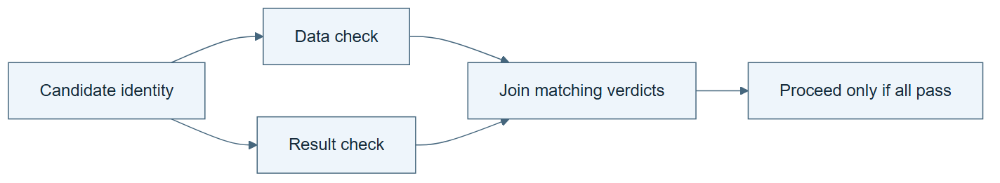

# 03.03 · Join independent checks

[Course](../../README.md) · [Theme](../README.md)

**You are here:** Theme 03, Dependable workflows → lab 3 of 6. [Find this theme in the course map](../../COURSE-MAP.md#theme-03) · [Whole-course mindmap](../../COURSE-MAP.md#whole-course-mindmap).

## What you will build

A join that waits for both a data-quality check and a resource check.

## Why this matters

One successful check must not conceal another missing or failed check.

## Before you start

Complete [03.02: Route different failures differently](../step_02_branch/README.md). You need the concepts and the reports named below, not its old chat. If you start here directly, ask the tutor to prepare the listed starting state and explain the missing prerequisite first.

Open the coding agent at the repository root. Read [the tutor skill](../../skills/rsi-tutor/SKILL.md) and this lab's [brief](BRIEF.md). The agent creates a separate sibling workspace named <code>rsi-work/03-03</code> and reports its absolute path. It checks local Python and the [tool requirements](../../tools/README.md) before execution. You do not write code or configuration.

**Starting state:** The branch router and a candidate recipe. Use small local check fixtures.

**Budget:** No model fits; four join scenarios. Plan about 20–35 minutes of reading and discussion; this is an author estimate, not a measured student duration. Coding-agent inference may use a paid online service. Record its cost separately when available.

## How it works

Two checks can inspect different properties of the same candidate. Their results must carry its identity and contract version. A join waits for both, verifies identity, then applies a declared rule. Running these checks sequentially can test the logic; actual parallel execution adds timing and coordination concerns.

**A concrete example.** Imagine the data check passes for candidate A, while the prediction check passes for candidate B. You have two passes, but no candidate has passed both checks. The join must ask “two passes for which candidate?” This is why identity belongs in the evidence, not just in a filename chosen by the agent.


*A and B denote candidate identities; v1 and v2 denote contract versions. The table gives expected fixture behavior, not observed resource availability. Run all four cases and retain actual verdicts. Missing evidence remains incomplete until the declared wait limit or stop rule applies. A matching pair can be processed sequentially; converging arrows do not prove concurrent execution or independent agent contexts. The fourth wrong-contract case is a new explicit requirement and remains unverified by the earlier three-case author run.*

[Open the illustration at full size](../../assets/illustrations/join-matching-evidence-v1.png).

<details>
<summary>See the step diagram</summary>



*Read the diagram:* A join requires data and resource passes for the same candidate and contract. Missing or mismatched evidence cannot authorize the next action.

</details>

## Run the lab

Start with this prompt. The tutor pauses for your prediction before it runs the next step.

```text
Read rsi/AGENTS.md and
rsi/skills/rsi-tutor/SKILL.md.
Guide me through lab 03.03, Join independent
checks, one step at a time.
Read its README and BRIEF. Prepare its
separate workspace.
You write and run the implementation. Keep
the reports and failures.
Ask me to predict the result before the
experiment.
```

**Make a prediction:** Should a data pass for candidate A combine with a budget pass for candidate B?

### 1. Define the join

State what must agree.

```text
Generate separate data and resource check
functions. Their results must identify
candidate and contract. Add a join that
requires both passes for the same candidate.
Do not launch agent subworkers.
```

**Observe:** The dependency structure is explicit without needing multiple agents.

### 2. Exercise mismatches

Test missing and stale results.

```text
Run four cases: both checks pass for A under
contract v1; A has only one result; data
passes for A while resources pass for B;
both name A but use different contract
versions. Retain JOIN-REPORT.md and all
check records.
```

**Observe:** Only the complete matching case proceeds.

## Check your result

The join rejects mismatched candidate identities, mismatched contract versions, and incomplete evidence. The report states whether checks ran sequentially or concurrently.

### Open these outputs

The agent keeps these in your lab workspace or records the original experiment path when reusing evidence.

| Output | What to inspect |
|---|---|
| Data and resource check records | Each names candidate identity, contract version, outcome, and whether the input is a teaching fixture. |
| Join implementation | Requires both matching passes before continuing. |
| JOIN-REPORT.md | Preserves matching, missing, wrong-candidate, and wrong-contract cases and states whether execution was sequential or concurrent. |

Ask the agent to open the actual files and show the command exit status. A written description of a run is not a run. Keep a short <code>LAB-NOTE.md</code> with your prediction, measured observation, explanation, and one limit. The tutor must mark skipped learner responses as skipped.

## Try one change

Delay one check result in a local simulation. Explain why the other result alone cannot authorize the next action.

## If something goes wrong

If a mismatched pair passes, compare the identities before combining the booleans. If one result never arrives, stop at the declared wait limit and report incomplete evidence. An invented resource-pass fixture can test join logic, but must not be presented as a measurement of available RAM, cost, or cluster capacity.

Say “Stop this lab” to stop further work. Ask the agent to save <code>PROGRESS.md</code> with the last completed step and remaining budget. To resume, have it read that file and inspect active processes first. A reset creates a new sibling workspace; it does not erase failures or alter the source data. See the [recovery rules](../../tools/README.md) for interrupted tool runs.

## Key takeaways

- Independent work still needs coordinated completion.
- Results must refer to the same candidate and contract.
- A graph supports parallelism; it does not prove parallel execution occurred.

## Check your understanding

Answer before opening the explanation. You can ask the tutor for a hint.

1. Why include candidate identity?
2. Does a join mean both checks must start simultaneously?
3. What should a missing check cause?
4. What extra risk does concurrency add?

<details>
<summary>Hint</summary>

Write the candidate name beside every pass. You need two passes for the same object under the same contract, not merely two successful checks somewhere.

</details>

<details>
<summary>Explained answers</summary>

1. Otherwise valid results from different experiments can be combined incorrectly.

2. No. It specifies the conditions for proceeding after their results exist.

3. Waiting within a limit or stopping with an incomplete state, according to the declared rule.

4. Races, stale results, conflicting writes, and harder accounting; the logic must remain explicit.

</details>

## What's next

Place a bounded retry inside this graph without losing its stop rules. Continue to [03.04: Put a bounded retry inside the graph](../step_04_cycle/README.md).
