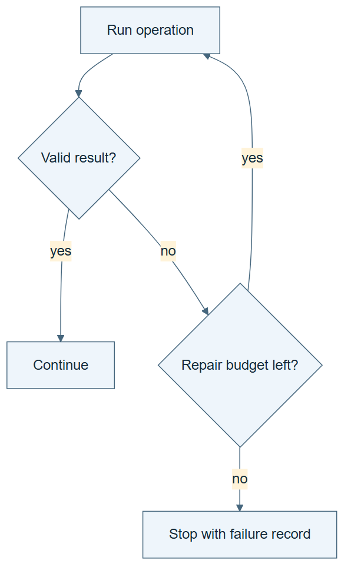

# 03.04 · Put a bounded retry inside the graph

[Course](../../README.md) · [Theme](../README.md)

**You are here:** Theme 03, Dependable workflows → lab 4 of 6. [Find this theme in the course map](../../COURSE-MAP.md#theme-03) · [Whole-course mindmap](../../COURSE-MAP.md#whole-course-mindmap).

## What you will build

A graph with one explicit repair cycle and a terminal failure path.

## Why this matters

A return arrow can hide unlimited work unless the retry state travels with it.

## Before you start

Complete [03.03: Join independent checks](../step_03_join/README.md). You need the concepts and the reports named below, not its old chat. If you start here directly, ask the tutor to prepare the listed starting state and explain the missing prerequisite first.

Open the coding agent at the repository root. Read [the tutor skill](../../skills/rsi-tutor/SKILL.md) and this lab's [brief](BRIEF.md). The agent creates a separate sibling workspace named <code>rsi-work/03-04</code> and reports its absolute path. It checks local Python and the [tool requirements](../../tools/README.md) before execution. You do not write code or configuration.

**Starting state:** The router and join. A teaching report with one correctable missing field.

**Budget:** Two repair attempts per fixture, at most four across both fixtures; no model fits. Plan about 20–35 minutes of reading and discussion; this is an author estimate, not a measured student duration. Coding-agent inference may use a paid online service. Record its cost separately when available.

## How it works

A cycle returns to an earlier action. Its state must include attempts used and the last failure. A repair can change the failing artifact, but it cannot redefine the required fields. The graph exits on success or when the original budget is exhausted.

**A concrete example.** An illustrative report lacks a required candidate ID. Repair 1 adds that ID, so rechecking succeeds. In a second fixture, both repairs change only the title. The ID remains missing; the graph exits with failure after repair 2. Both runs terminate correctly, although only one repairs the artifact.


*The blue notebook supplies the unchanged validation rule; the return edge carries the changed report and accumulated counter. Reserve each repair attempt before running it, and keep failed attempts in that fixture’s count. Two repair slots apply to each fixture, with at most four across the two runs; the expected examples use three. The smaller strips omit intermediate checks for space, but the executable controller must recheck after every repair. A third ineffective repair is not permitted. Success and failure are expected paths to test, not new execution claims.*

[Open the illustration at full size](../../assets/illustrations/bounded-repair-cycle-v1.png).

<details>
<summary>See the step diagram</summary>



*Read the diagram:* The retry cycle has a limit. Its failure path is part of the graph.

</details>

## Run the lab

Start with this prompt. The tutor pauses for your prediction before it runs the next step.

```text
Read rsi/AGENTS.md and
rsi/skills/rsi-tutor/SKILL.md.
Guide me through lab 03.04, Put a bounded
retry inside the graph, one step at a time.
Read its README and BRIEF. Prepare its
separate workspace.
You write and run the implementation. Keep
the reports and failures.
Ask me to predict the result before the
experiment.
```

**Make a prediction:** If a repair does not change the missing field, what should the second failure cause?

### 1. Add the cycle

Preserve state across the return edge.

```text
Extend the local graph with check, repair,
and recheck nodes. Permit two repairs per
fixture. Give each fixture its own counter
and preserve it across its return edge. Keep
the original validation rule fixed. Save the
graph and state transitions.
```

**Observe:** The cycle carries attempt count and failure reason.

### 2. Test success and exhaustion

Check both exit paths.

```text
Run a fixture whose first repair restores
the field, then a fixture whose repair
leaves it missing. Keep both traces. Verify
that the second run ends at the budget,
without claiming success.
```

**Observe:** A stopped failure is a valid terminal outcome.

## Check your result

Both traces end. Attempts are monotonic and bounded. The verifier rule is unchanged between checks.

### Open these outputs

The agent keeps these in your lab workspace or records the original experiment path when reusing evidence.

| Output | What to inspect |
|---|---|
| Graph and state rules | Show check → repair → recheck and both terminal exits, with a two-repair allowance per fixture and at most four repairs across both fixtures. |
| Successful repair trace | Shows the missing field becoming present and the unchanged validator accepting it. |
| Exhausted repair trace | Shows two ineffective edits and a terminal failure without another hidden attempt. |

Ask the agent to open the actual files and show the command exit status. A written description of a run is not a run. Keep a short <code>LAB-NOTE.md</code> with your prediction, measured observation, explanation, and one limit. The tutor must mark skipped learner responses as skipped.

## Try one change

Remove the failure feedback from the repair input. Predict how that could waste attempts even with a valid stop rule.

## If something goes wrong

If the repair counter returns to zero on the back edge, store it in the experiment state rather than inside one node invocation. If a repair succeeds by deleting the required-field rule, reject that result: it changed the evaluator instead of fixing the artifact. Keep ineffective edits so the failure can be explained.

Say “Stop this lab” to stop further work. Ask the agent to save <code>PROGRESS.md</code> with the last completed step and remaining budget. To resume, have it read that file and inspect active processes first. A reset creates a new sibling workspace; it does not erase failures or alter the source data. See the [recovery rules](../../tools/README.md) for interrupted tool runs.

## Key takeaways

- Cycles need explicit state and exit conditions.
- Stopping with failure is better evidence than pretending a repair worked.
- A repair changes an artifact, not the definition of validity.

## Check your understanding

Answer before opening the explanation. You can ask the tutor for a hint.

1. Why is this graph not a DAG?
2. Can a bounded loop still be unhelpful?
3. What stays fixed during repair?
4. What is the expected outcome after two ineffective repairs?

<details>
<summary>Hint</summary>

Count repairs separately from checks. The first check discovers the problem; later checks decide whether a repair worked under the same rule.

</details>

<details>
<summary>Explained answers</summary>

1. Its recheck path returns to an earlier node, forming a directed cycle.

2. Yes. It can repeat ineffective actions while respecting its budget.

3. The task and validation requirements used to judge the repair.

4. A recorded terminal failure with the spent attempts, not another hidden retry.

</details>

## What's next

Now recover a failed branch without repeating unrelated work. Continue to [03.05: Resume only the affected work](../step_05_recover/README.md).
