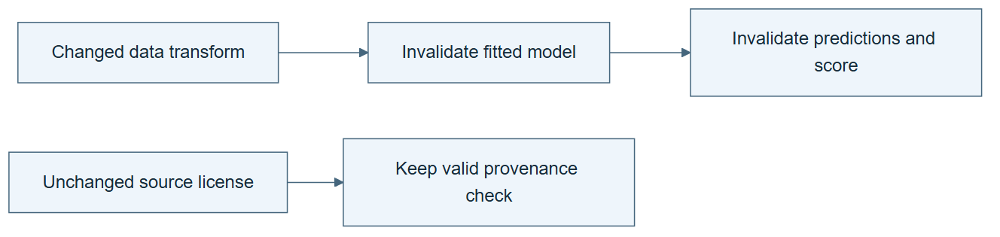

# 03.05 · Resume only the affected work

[Course](../../README.md) · [Theme](../README.md)

## What you will build

A recovery trace that preserves valid upstream artifacts and reruns affected descendants.

## Why this matters

Restarting everything wastes work. Reusing everything risks stale results. Dependencies tell you what must change.

## Before you start

Complete [03.04: Put a bounded retry inside the graph](../step_04_cycle/README.md). You need the concepts and the reports named below, not its old chat. If you start here directly, ask the tutor to prepare the listed starting state and explain the missing prerequisite first.

Open the coding agent at the repository root. Read [the tutor skill](../../skills/rsi-tutor/SKILL.md) and this lab's [brief](BRIEF.md). The agent creates a separate sibling workspace named <code>rsi-work/03-05</code> and reports its absolute path. It checks local Python and the [tool requirements](../../tools/README.md) before execution. You do not write code or configuration.

**Starting state:** The graph with data check, fit, metric check, and report. Use the existing baseline predictions.

**Budget:** No new fit unless an upstream data or recipe change actually requires it; at most one fit. Plan about 20–35 minutes of reading and discussion; this is an author estimate, not a measured student duration. Coding-agent inference may use a paid online service. Record its cost separately when available.

## How it works

If report formatting fails, valid predictions need not be recomputed. If the dataset changes, downstream transforms, model results, and reports may be stale. Recovery follows the dependency graph and artifact versions. A successful file is reusable only when its inputs still match.

**A concrete example.** A report writer crashes after predictions are saved and checked. Rewriting the report needs those existing outputs, so another fit adds no necessary evidence. Change the split instead, and the fitted recipe’s training membership and evaluation membership change. The old downstream results cannot simply be relabelled as belonging to the new split.



*Read the diagram:* Changing an upstream artifact invalidates its descendants. Unaffected independent work can remain valid.

## Run the lab

Start with this prompt. The tutor pauses for your prediction before it runs the next step.

```text
Read rsi/AGENTS.md and
rsi/skills/rsi-tutor/SKILL.md.
Guide me through lab 03.05, Resume only the
affected work, one step at a time.
Read its README and BRIEF. Prepare its
separate workspace.
You write and run the implementation. Keep
the reports and failures.
Ask me to predict the result before the
experiment.
```

**Make a prediction:** Which nodes should rerun after a report-writing failure? What if the split changed instead?

### 1. Inject a reporting failure

Keep upstream computation valid.

```text
Copy the baseline artifacts into a
diagnostic workspace. Make the report node
fail intentionally while preserving
predictions and checks. Record the failure
and dependencies.
```

**Observe:** The model output remains available despite the failed report.

### 2. Recover selectively

Use dependencies to decide what to reuse.

```text
Repair only the report node and resume. Show
that no new fit ran. Then simulate a changed
split version and list the descendants that
would need invalidation, without mixing
their old scores.
```

**Observe:** The recovery plan differs for a downstream formatting error and an upstream scientific change.

## Check your result

The successful recovery does not create an extra fit. The changed-split case invalidates all dependent evidence.

### Open these outputs

The agent keeps these in your lab workspace or records the original experiment path when reusing evidence.

| Output | What to inspect |
|---|---|
| Injected failure record | Identifies the failed report operation while preserving the existing prediction identity. |
| Recovery trace | Names the reused inputs and repaired report; the fit count does not increase. |
| Invalidation plan | Lists which descendants become stale after a changed split or substituted prediction file. |

Ask the agent to open the actual files and show the command exit status. A written description of a run is not a run. Keep a short <code>LAB-NOTE.md</code> with your prediction, measured observation, explanation, and one limit. The tutor must mark skipped learner responses as skipped.

## Try one change

Try reusing a metric report after substituting a prediction file. Require the version check to detect the stale dependency.

## If something goes wrong

If the recovery starts training automatically, inspect whether the failed node actually invalidated model inputs. If it reuses an old score after predictions changed, compare the recorded input identities. Do not overwrite stale results: retain them with their original input versions and create fresh descendants where required.

Say “Stop this lab” to stop further work. Ask the agent to save <code>PROGRESS.md</code> with the last completed step and remaining budget. To resume, have it read that file and inspect active processes first. A reset creates a new sibling workspace; it does not erase failures or alter the source data. See the [recovery rules](../../tools/README.md) for interrupted tool runs.

## Key takeaways

- Recovery should follow dependency and version information.
- A downstream failure does not always invalidate upstream work.
- Changed scientific inputs can invalidate an entire comparison.

## Check your understanding

Answer before opening the explanation. You can ask the tutor for a hint.

1. Why can report repair skip training?
2. Why does a new split require more work?
3. Is file existence enough for reuse?
4. What evidence shows selective recovery worked?

<details>
<summary>Hint</summary>

Start at the changed artifact and walk forward through dependency arrows. Work outside those descendants may remain valid if its own inputs and checks still match.

</details>

<details>
<summary>Explained answers</summary>

1. The model’s inputs and predictions remain unchanged and validated.

2. It changes training and evaluation membership, so earlier model results no longer answer the same comparison.

3. No. Its input versions and completion state must match.

4. The trace records reused artifacts and the absence of an extra fit, with the repaired report produced.

</details>

## What's next

Separate the planned graph from the data flow and actual trace. Continue to [03.06: Read the plan, data flow, and trace](../step_06_three_views/README.md).
