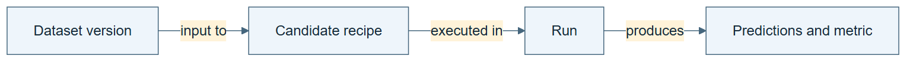

# 04.01 · Name the objects in an experiment

[Course](../../README.md) · [Theme](../README.md)

**You are here:** Theme 04, Dependable workflows → lab 1 of 5. [Find this theme in the course map](../../COURSE-MAP.md#theme-04) · [Whole-course mindmap](../../COURSE-MAP.md#whole-course-mindmap).

## What you will build

A small vocabulary for data, columns, targets, partitions, models, metrics, and evidence.

## Why this matters

“Improve the model” is ambiguous if one speaker means fitted parameters and another means the whole agent system.

## Before you start

Complete [03.06: Read the plan, data flow, and trace](../../03_graph_engineering/step_06_three_views/README.md). You need the concepts and the reports named below, not its old chat. If you start here directly, ask the tutor to prepare the listed starting state and explain the missing prerequisite first.

Open the coding agent at the repository root. Read [the tutor skill](../../skills/rsi-tutor/SKILL.md) and this lab's [brief](BRIEF.md). The agent keeps this lab's notes in <code>rsi-work/04-01</code>, outside the repository, and reports the absolute path. If the lab continues an earlier experiment, keep that experiment in its original workspace with its existing budget and locks. A new notes folder does not reset an experiment. The agent checks local Python and the [tool requirements](../../tools/README.md) before execution. You do not write code or configuration.

**Starting state:** One baseline report, its task brief, and prediction file.

**Budget:** No fits. Classify ten objects from the existing run. Plan about 20–35 minutes of reading and discussion; this is an author estimate, not a measured student duration. Coding-agent inference may use a paid online service. Record its cost separately when available.

## How it works

An entity is an object you need to distinguish. A type states what kind of object it is. The bike table is a dataset; cnt is a column playing the target role; MAE is a metric; 159.948 is a measured value for a particular candidate and partition. Keeping these separate prevents category mistakes.

**A concrete example.** The [ten-object vocabulary](../../evidence/2026-09-22/ontology-system/04-01/VOCABULARY.md) separates the constant/calendar recipe from its fitting event and learned value, 109. The runtime model was not saved as a weights file; its predictions were. MAE names the calculation, while 159.947912 rentals per hour describes a particular candidate on the selection rows. The [claim rewrites](../../evidence/2026-09-22/ontology-system/04-01/CLAIMS.md) show why lower task error, an edited skill and changed LLM weights need different names and evidence.


*The fitted model shown here is the constant baseline: it learns the training median. Other model families learn different parameters. This runner keeps the fitted object in memory during execution and saves its recipe and predictions; the picture does not imply a saved weights file. A fitting event is the action, and its trace is evidence of that action. Fill the blank measurement fields from the actual report, with candidate, partition, unit, and metric definition. No new fit is needed.*

[Open the illustration at full size](../../assets/illustrations/name-experiment-objects-v2.png).

<details>
<summary>See the step diagram</summary>



*Read the diagram:* Name distinct objects before relating them. A dataset, a candidate, and a run are not interchangeable.

</details>

## Run the lab

Start with this prompt. The tutor pauses for your prediction before it runs the next step.

```text
Read rsi/AGENTS.md and
rsi/skills/rsi-tutor/SKILL.md.
Guide me through lab 04.01, Name the objects
in an experiment, one step at a time.
Read its README and BRIEF. Prepare its
separate workspace.
You write and run the implementation. Keep
the reports and failures.
Ask me to predict the result before the
experiment.
```

**Make a prediction:** Are “MAE” and “159.948 rentals per hour” the same kind of thing?

### 1. Build the vocabulary

Ground each term in an actual artifact.

```text
Use review-domain. Create VOCABULARY.md with
object, type, plain-language definition, and
example from the baseline. Classify ten
objects: dataset, column, target role,
partition, fitted model, recipe, metric,
measurement, prediction artifact, and
fitting event.
```

**Observe:** The vocabulary distinguishes a rule from its result.

### 2. Classify a confusing case

Test whether definitions help.

```text
Classify the phrase “the model improved” in
three cases: lower selection error, edited
research skill, and changed language-model
weights. Rewrite each claim precisely.
```

**Observe:** Different mutable objects receive different names.

## Check your result

Definitions include concrete examples and do not equate a recipe with a fitted model or a metric with its measured value.

### Open these outputs

The agent keeps these in your lab workspace or records the original experiment path when reusing evidence.

| Output | What to inspect |
|---|---|
| VOCABULARY.md | Classifies concrete objects and distinguishes dataset, column, target role, partition, recipe, fitted model, metric, and measurement. |
| Three rewritten claims | Name whether a result concerns task-model error, a research-skill edit, or changed language-model weights. |

Ask the agent to open the actual files and show the command exit status. A written description of a run is not a run. Keep a short <code>LAB-NOTE.md</code> with your prediction, measured observation, explanation, and one limit. The tutor must mark skipped learner responses as skipped.

## Try one change

Replace every use of “score” with its precise metric, candidate, partition, and unit. Notice which missing context becomes visible.

## If something goes wrong

If “model” refers to several things, name each explicitly: fitted task model, research agent, or language model. If the supplied runner did not save fitted weights, do not invent a model file; identify the recipe, the fitting event, and the retained predictions. A numeric score needs candidate, data role, metric, and unit before it is interpretable.

Say “Stop this lab” to stop further work. Ask the agent to save <code>PROGRESS.md</code> with the last completed step and remaining budget. To resume, have it read that file and inspect active processes first. A reset creates a new sibling workspace; it does not erase failures or alter the source data. See the [recovery rules](../../tools/README.md) for interrupted tool runs.

## Key takeaways

- Shared names reduce ambiguous instructions.
- A role can differ from an object’s type.
- A measured value needs context to be meaningful.

## Check your understanding

Answer before opening the explanation. You can ask the tutor for a hint.

1. Is cnt inherently the target in every possible task?
2. Is a metric the same as a measurement?
3. What differs between a recipe and a fitted model?
4. Does a vocabulary alone enforce correctness?

<details>
<summary>Hint</summary>

Distinguish the instruction “calculate MAE” from the resulting number, and the recipe “fit this estimator” from the parameters learned in one execution.

</details>

<details>
<summary>Explained answers</summary>

1. No. It is a column assigned the target role in this task.

2. No. MAE is a calculation rule; its value comes from specific predictions and actual outcomes.

3. The recipe specifies how to fit; the fitted model contains parameters learned from particular training data.

4. No. Relations and executable checks are needed to test important claims.

</details>

## What's next

Connect these objects with relations that express the experiment’s meaning. Continue to [04.02: Connect data, models, and evidence](../step_02_relations/README.md).
