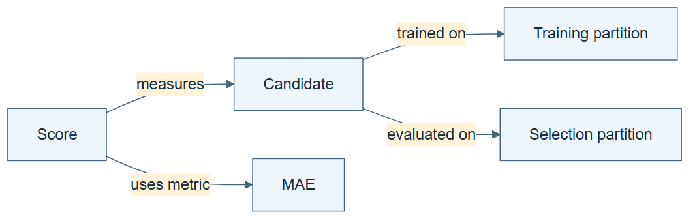

# 04.02 · Connect data, models, and evidence

[Course](../../README.md) · [Theme](../README.md)

## What you will build

A readable relation table describing one ML experiment.

## Why this matters

A list of names does not tell you which model used which data or which score supports which decision.

## Before you start

Complete [04.01: Name the objects in an experiment](../step_01_entities/README.md). You need the concepts and the reports named below, not its old chat. If you start here directly, ask the tutor to prepare the listed starting state and explain the missing prerequisite first.

Open the coding agent at the repository root. Read [the tutor skill](../../skills/rsi-tutor/SKILL.md) and this lab's [brief](BRIEF.md). The agent creates a separate sibling workspace named <code>rsi-work/04-02</code> and reports its absolute path. It checks local Python and the [tool requirements](../../tools/README.md) before execution. You do not write code or configuration.

**Starting state:** The vocabulary and baseline artifacts. Use a fresh Markdown facts file.

**Budget:** No fits; inspect one correct relation table. Plan about 20–35 minutes of reading and discussion; this is an author estimate, not a measured student duration. Coding-agent inference may use a paid online service. Record its cost separately when available.

## How it works

A relation connects two objects with a named meaning: scaler “fit on” train; search “selects on” selection; model “measured by” MAE. These facts describe the domain. An execution edge, by contrast, says which action depends on another. Both may be graphs, but they answer different questions.

**A concrete example.** “Scaler fit on train” is a statement about the meaning of a transformation. “Fit scaler before transform selection rows” is a dependency between actions. They cooperate: one says which data is permitted, the other says what must happen first. Neither statement alone supplies the other.



*Read the diagram:* These arrows describe meaning and provenance. They are not a schedule of commands.

## Run the lab

Start with this prompt. The tutor pauses for your prediction before it runs the next step.

```text
Read rsi/AGENTS.md and
rsi/skills/rsi-tutor/SKILL.md.
Guide me through lab 04.02, Connect data,
models, and evidence, one step at a time.
Read its README and BRIEF. Prepare its
separate workspace.
You write and run the implementation. Keep
the reports and failures.
Ask me to predict the result before the
experiment.
```

**Make a prediction:** Does “model measured by MAE” tell you which action runs next?

### 1. Write the facts

Turn relationships into complete sentences.

```text
Create DOMAIN.md as a Subject, Relation,
Object Markdown table. Include model uses
feature hr; scaler fit on train; search
selects on selection; model measured by MAE;
model predicts cnt. Explain each row in
plain language.
```

**Observe:** The table describes meaning rather than execution order.

### 2. Check the declared relations

Run the small supplied semantic checker.

```text
Run audit-domain on DOMAIN.md and save
DOMAIN-CHECK.md. Explain its allowed
relations and the limits of its three
invariants.
```

**Observe:** A pass means only that the supplied rules found no violation.

## Check your result

Each relation is understandable as a sentence. The checker runs and the report states its limited coverage.

### Open these outputs

The agent keeps these in your lab workspace or records the original experiment path when reusing evidence.

| Output | What to inspect |
|---|---|
| DOMAIN.md | Contains the Subject, Relation, Object facts for the declared bike experiment. |
| DOMAIN-CHECK.md | Shows the executed verdict and names the supplied checker’s limited rules. |
| Plain-language explanations | Translate each fact into a sentence and distinguish it from an execution dependency. |

Ask the agent to open the actual files and show the command exit status. A written description of a run is not a run. Keep a short <code>LAB-NOTE.md</code> with your prediction, measured observation, explanation, and one limit. The tutor must mark skipped learner responses as skipped.

## Try one change

Draw the execution graph beside the relation table. Identify one node name that appears in both but has a different role.

## If something goes wrong

If the checker reports an unknown relation, compare the intended meaning with its documented relation vocabulary; define and test any extension separately. If the table passes while an important fact is absent, add the missing fact and review the coverage. A pass is not proof that the table describes every scientific constraint.

Say “Stop this lab” to stop further work. Ask the agent to save <code>PROGRESS.md</code> with the last completed step and remaining budget. To resume, have it read that file and inspect active processes first. A reset creates a new sibling workspace; it does not erase failures or alter the source data. See the [recovery rules](../../tools/README.md) for interrupted tool runs.

## Key takeaways

- Relations connect otherwise isolated objects.
- A domain graph and a control graph serve different purposes.
- A valid table can still omit a scientifically important fact.

## Check your understanding

Answer before opening the explanation. You can ask the tutor for a hint.

1. What does an ontology add beyond a taxonomy?
2. Is this a database schema?
3. What is a knowledge graph here?
4. Does a passing check prove the whole experiment sound?

<details>
<summary>Hint</summary>

Read each row as a sentence. Does it describe what an object means or which action should execute next? Those are different kinds of relation.

</details>

<details>
<summary>Explained answers</summary>

1. It can specify relations and constraints, not just categories or parent-child groupings.

2. No. A schema describes storage structure; this table expresses selected domain meanings, though the two can inform each other.

3. A set of concrete entities and relation facts using the vocabulary.

4. No. It covers only the declared invariants and available facts.

</details>

## What's next

Add rules that distinguish plausible-looking facts from valid ones. Continue to [04.03: State rules that must always hold](../step_03_invariants/README.md).
