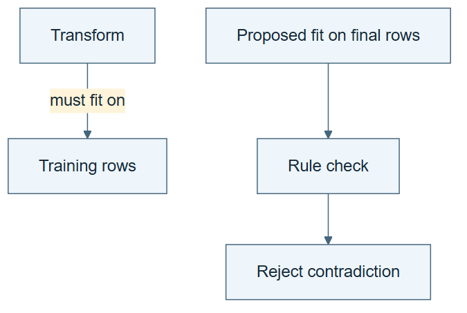

# 04.03 · State rules that must always hold

[Course](../../README.md) · [Theme](../README.md)

**You are here:** Theme 04, Dependable workflows → lab 3 of 5. [Find this theme in the course map](../../COURSE-MAP.md#theme-04) · [Whole-course mindmap](../../COURSE-MAP.md#whole-course-mindmap).

## What you will build

Three domain invariants, each with a passing and failing example.

## Why this matters

Correct spelling and valid file structure do not prevent target leakage or misuse of final data.

## Before you start

Complete [04.02: Connect data, models, and evidence](../step_02_relations/README.md). You need the concepts and the reports named below, not its old chat. If you start here directly, ask the tutor to prepare the listed starting state and explain the missing prerequisite first.

Open the coding agent at the repository root. Read [the tutor skill](../../skills/rsi-tutor/SKILL.md) and this lab's [brief](BRIEF.md). The agent keeps this lab's notes in <code>rsi-work/04-03</code>, outside the repository, and reports the absolute path. If the lab continues an earlier experiment, keep that experiment in its original workspace with its existing budget and locks. A new notes folder does not reset an experiment. The agent checks local Python and the [tool requirements](../../tools/README.md) before execution. You do not write code or configuration.

**Starting state:** DOMAIN.md and the bike task contract.

**Budget:** Six base checker cases and two additional cases for the units extension; no model fits. Plan about 20–35 minutes of reading and discussion; this is an author estimate, not a measured student duration. Coding-agent inference may use a paid online service. Record its cost separately when available.

## How it works

An invariant is a condition that must hold for every accepted record in this task. A transform fits on training data only. Search uses selection data, not final data. A prediction input must not be derived from the target. These are meaning rules; a syntactically valid table can violate them.

**A concrete example.** “The scaler was fit on final” is a clear, well-formed statement of an invalid experiment. In the [author walkthrough](../../evidence/2026-09-21/foundation-gaps/README.md#invariant-checks-0403), train-only fitting passed and final-data fitting failed. The other two rules also separated their passing and failing cases. A separate extension then required a unit label on MAE. Each observed verdict has its own preserved input; a passing fact table still cannot prove that the real experiment followed it.


*The headings state expected behavior, not recorded verdicts. The leakage case needs both the feature-use fact and its direct derivation from the target. Absence of that fact does not prove an input is valid. The supplied checker does not infer missing facts, follow arbitrary chains of derivation, or verify the table against a real run. Execute all six base cases. Then test the separate units extension with one present-unit and one missing-unit case; the original tool does not enforce that rule.*

[Open the illustration at full size](../../assets/illustrations/three-domain-invariants-v1.png).

<details>
<summary>See the step diagram</summary>



*Read the diagram:* A rule constrains a relation. Training a transform on final data violates the declared experiment meaning.

</details>

## Run the lab

Start with this prompt. The tutor pauses for your prediction before it runs the next step.

```text
Read rsi/AGENTS.md and
rsi/skills/rsi-tutor/SKILL.md.
Guide me through lab 04.03, State rules that
must always hold, one step at a time.
Read its README and BRIEF. Prepare its
separate workspace.
You write and run the implementation. Keep
the reports and failures.
Ask me to predict the result before the
experiment.
```

**Make a prediction:** Can a perfectly formatted table describe an invalid experiment?

### 1. Pair rules with examples

Make each rule testable.

```text
Write RULES.md with the three invariants.
For each, generate a passing fact table and
one failing table. Keep the intended
violation explicit.
```

**Observe:** Each example isolates one rule.

### 2. Execute the examples

Verify the rules have consequences.

```text
Use audit-domain on all six tables. Record
expected and actual verdicts in
RULE-TESTS.md. Keep every input and output.
```

**Observe:** Three valid cases pass and three targeted violations fail.

## Check your result

Every invariant has a demonstrated negative case. Unknown relations are not silently accepted.

### Open these outputs

The agent keeps these in your lab workspace or records the original experiment path when reusing evidence.

| Output | What to inspect |
|---|---|
| RULES.md | States the target-derived-input, train-only-transform, and selection-versus-final invariants. |
| Six fact tables | Give one isolated valid case and one isolated violation for each rule. |
| RULE-TESTS.md | Pairs expected and actual verdicts for the six base cases, preserving all inputs and outputs. |
| Units-extension cases | Keep the extra implementation, one measurement with units, one without, and both observed verdicts separate from the base cases. |

Ask the agent to open the actual files and show the command exit status. A written description of a run is not a run. Keep a short <code>LAB-NOTE.md</code> with your prediction, measured observation, explanation, and one limit. The tutor must mark skipped learner responses as skipped.

## Try one change

Add a new rule that MAE measurements must include units. Ask the agent to implement it in a workspace extension and run one case with units and one without. Keep this two-case extension separate from the six base cases; the original tool does not check units.

## If something goes wrong

If a negative case passes, check that the table contains the relationship needed to trigger the rule. A renamed leaked feature still needs its derivation fact. If a case triggers several rules at once, split it into smaller fixtures so each failure has a clear cause. New checks such as measurement units need an explicit extension; the supplied three-rule checker does not already enforce them.

Say “Stop this lab” to stop further work. Ask the agent to save <code>PROGRESS.md</code> with the last completed step and remaining budget. To resume, have it read that file and inspect active processes first. A reset creates a new sibling workspace; it does not erase failures or alter the source data. See the [recovery rules](../../tools/README.md) for interrupted tool runs.

## Key takeaways

- Meaning rules catch errors that formatting checks miss.
- A rule needs examples that distinguish valid from invalid cases.
- Validator coverage is explicit and can grow.

## Check your understanding

Answer before opening the explanation. You can ask the tutor for a hint.

1. Why is a failing example useful?
2. Is fitting a scaler on all rows harmless because it ignores labels?
3. Can a rule be universal across every task?
4. What should happen with an undefined relation?

<details>
<summary>Hint</summary>

A rule earns trust by separating a valid case from a closely related invalid one. Change just the fact that should cross that boundary.

</details>

<details>
<summary>Explained answers</summary>

1. It demonstrates that the checker detects the violation the rule describes.

2. No. It uses evaluation-distribution information and violates the declared train-only procedure.

3. Some principles generalize, but exact requirements depend on the task’s information setting and protocol.

4. Define its meaning and tests before relying on it; do not silently treat it as valid.

</details>

## What's next

Use these rules to diagnose a deliberately inconsistent experiment record. Continue to [04.04: Catch a plausible but invalid experiment](../step_04_catch_contradictions/README.md).
