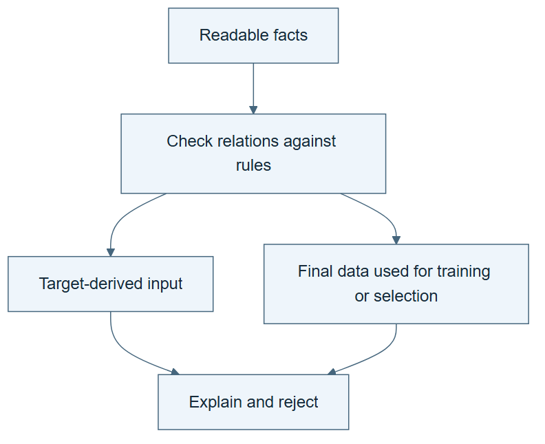

# 04.04 · Catch a plausible but invalid experiment

[Course](../../README.md) · [Theme](../README.md)

**You are here:** Theme 04, Dependable workflows → lab 4 of 5. [Find this theme in the course map](../../COURSE-MAP.md#theme-04) · [Whole-course mindmap](../../COURSE-MAP.md#whole-course-mindmap).

## What you will build

A semantic failure report and a corrected relation table.

## Why this matters

A realistic mistake combines several reasonable-looking facts. The rules must connect them.

## Before you start

Complete [04.03: State rules that must always hold](../step_03_invariants/README.md). You need the concepts and the reports named below, not its old chat. If you start here directly, ask the tutor to prepare the listed starting state and explain the missing prerequisite first.

Open the coding agent at the repository root. Read [the tutor skill](../../skills/rsi-tutor/SKILL.md) and this lab's [brief](BRIEF.md). The agent creates a separate sibling workspace named <code>rsi-work/04-04</code> and reports its absolute path. It checks local Python and the [tool requirements](../../tools/README.md) before execution. You do not write code or configuration.

**Starting state:** The supplied domain skill, original correct facts, and a separate teaching copy.

**Budget:** Two domain checks, no model fits. Plan about 20–35 minutes of reading and discussion; this is an author estimate, not a measured student duration. Coding-agent inference may use a paid online service. Record its cost separately when available.

## How it works

Suppose a model uses a feature called total_users. Another fact says total_users is derived from the target. Neither line alone states “invalid.” Together they violate the task’s input rule. A semantic check reasons over the relation between facts.

**A concrete example.** “Model uses feature total_users” can look harmless until another fact says “total_users is derived from target.” The contradiction comes from their relationship. Rename the feature to f7 in both facts and the same violation remains. A name does not remove the information carried by a column.



*Read the diagram:* A syntactically valid table can describe an invalid experiment. Meaning rules expose the contradiction.

## Run the lab

Start with this prompt. The tutor pauses for your prediction before it runs the next step.

```text
Read rsi/AGENTS.md and
rsi/skills/rsi-tutor/SKILL.md.
Guide me through lab 04.04, Catch a
plausible but invalid experiment, one step
at a time.
Read its README and BRIEF. Prepare its
separate workspace.
You write and run the implementation. Keep
the reports and failures.
Ask me to predict the result before the
experiment.
```

**Make a prediction:** Will renaming a leaked feature make it a valid input?

### 1. Create the contradiction

Make the error about meaning, not syntax.

```text
In a teaching DOMAIN.md, add model uses
feature total_users and total_users derived
from target. Also set scaler fit on final
and search selects on final. Keep the table
well formed. Run audit-domain.
```

**Observe:** The report identifies three semantic violations.

### 2. Repair the record

Correct facts without erasing the failure.

```text
Save a corrected table that removes the
leaked input, fits the scaler on train, and
selects on selection. Recheck it. Explain
which actual implementation actions would
also need correction if this were a real
run.
```

**Observe:** Editing a record alone cannot repair an already leaked experiment.

## Check your result

The original table fails with three concrete reasons. The corrected copy passes the supplied rules. The report distinguishes correcting documentation from rerunning invalid computation.

### Open these outputs

The agent keeps these in your lab workspace or records the original experiment path when reusing evidence.

| Output | What to inspect |
|---|---|
| Original teaching DOMAIN.md | Contains the well-formed leaked-input, final-fitted-scaler, and final-selection violations. |
| Failure report | Names all three semantic failures. |
| Corrected facts and recheck | Pass the supplied rules while preserving the original failed case and explaining which computations would need rerunning. |

Ask the agent to open the actual files and show the command exit status. A written description of a run is not a run. Keep a short <code>LAB-NOTE.md</code> with your prediction, measured observation, explanation, and one limit. The tutor must mark skipped learner responses as skipped.

## Try one change

Rename total_users to harmless_feature. Confirm that the derivation relation still triggers rejection.

## If something goes wrong

If renaming makes the leakage warning disappear, check whether the derivation fact was renamed consistently or accidentally deleted. If the documentation is corrected after an actual leaked fit, keep that score marked invalid for the intended comparison. Repairing the facts does not repair the training history.

Say “Stop this lab” to stop further work. Ask the agent to save <code>PROGRESS.md</code> with the last completed step and remaining budget. To resume, have it read that file and inspect active processes first. A reset creates a new sibling workspace; it does not erase failures or alter the source data. See the [recovery rules](../../tools/README.md) for interrupted tool runs.

## Key takeaways

- Renaming an object does not change its meaning.
- Relations can reveal a contradiction across separate facts.
- Fixing a report cannot retroactively repair invalid training.

## Check your understanding

Answer before opening the explanation. You can ask the tutor for a hint.

1. Why is this an ontology exercise?
2. Why should the renamed feature still fail?
3. Does the corrected table validate old leaked scores?
4. What remains outside the checker?

<details>
<summary>Hint</summary>

Follow where the feature’s information comes from. The relevant fact is its relationship to the target, not whether its name sounds suspicious.

</details>

<details>
<summary>Explained answers</summary>

1. It uses types, relations, and invariants to check the meaning of an experiment record.

2. Its derivation from the target remains the relevant fact.

3. No. The affected experiments must be rerun under the corrected protocol.

4. Unrecorded derivations and other scientific errors. The checker depends on adequate facts and declared rules.

</details>

## What's next

Domain vocabulary changes too. Trace the consequences of a revised meaning. Continue to [04.05: Change a definition without losing its consequences](../step_05_evolve_vocabulary/README.md).
