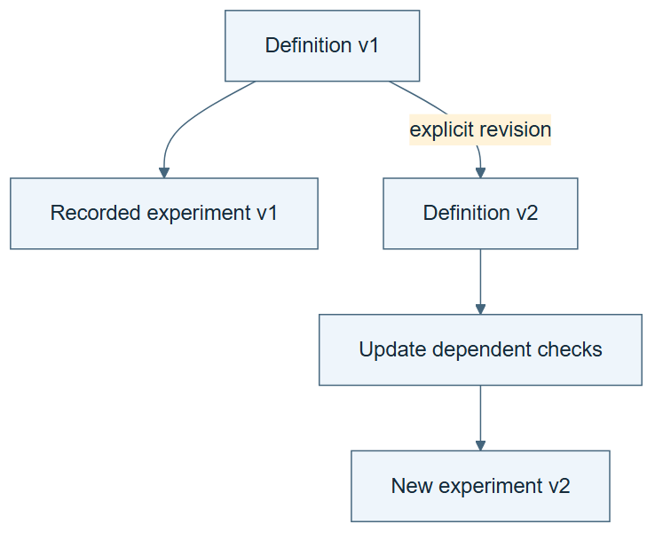

# 04.05 · Change a definition without losing its consequences

[Course](../../README.md) · [Theme](../README.md)

## What you will build

A versioned vocabulary change and an impact report for a new forecasting task.

## Why this matters

A harmless-looking word change can alter which inputs and results are valid.

## Before you start

Complete [04.04: Catch a plausible but invalid experiment](../step_04_catch_contradictions/README.md). You need the concepts and the reports named below, not its old chat. If you start here directly, ask the tutor to prepare the listed starting state and explain the missing prerequisite first.

Open the coding agent at the repository root. Read [the tutor skill](../../skills/rsi-tutor/SKILL.md) and this lab's [brief](BRIEF.md). The agent creates a separate sibling workspace named <code>rsi-work/04-05</code> and reports its absolute path. It checks local Python and the [tool requirements](../../tools/README.md) before execution. You do not write code or configuration.

**Starting state:** The retrospective bike task, vocabulary, facts, and dependency graph.

**Budget:** No fits; one impact analysis and one rule extension test. Plan about 20–35 minutes of reading and discussion; this is an author estimate, not a measured student duration. Coding-agent inference may use a paid online service. Record its cost separately when available.

## How it works

Changing “observed weather” to “weather forecast available one day earlier” changes the information contract. Existing features may no longer satisfy it. Trace from the changed concept through feature rules, data sources, candidate recipes, and evidence. Keep the old task valid on its own terms; create a new task version.

**A concrete example.** In an illustrative forecasting record, the prediction is issued at 09:00 for tomorrow at noon. Tomorrow’s observed noon temperature arrives after the issue time and is unavailable to that prediction. A weather forecast issued before 09:00 might be permitted, but the pinned bike table does not contain that archive. The availability test can use labelled synthetic timestamps; it cannot create the missing real forecast data.



*Read the diagram:* A changed definition propagates to the checks and reports that depend on it. Keep the earlier version interpretable.

## Run the lab

Start with this prompt. The tutor pauses for your prediction before it runs the next step.

```text
Read rsi/AGENTS.md and
rsi/skills/rsi-tutor/SKILL.md.
Guide me through lab 04.05, Change a
definition without losing its consequences,
one step at a time.
Read its README and BRIEF. Prepare its
separate workspace.
You write and run the implementation. Keep
the reports and failures.
Ask me to predict the result before the
experiment.
```

**Make a prediction:** Which previous scores can be reused as evidence for the new day-ahead forecasting task?

### 1. Version the definition

State the changed scientific question.

```text
Create vocabulary version 2 for a day-ahead
demand task. Define forecast origin and
input availability. Preserve version 1.
Write the change and its reason in
CHANGE.md.
```

**Observe:** The new task is distinguishable from the old one.

### 2. Trace the impact

Connect meaning changes to work that must be redone.

```text
Use the relation table and execution graph
to list affected data sources, features,
split rules, recipes, and reports. Generate
a small availability check that rejects an
observed future weather input. Save its
failing test.
```

**Observe:** The impact reaches more than a renamed column.

## Check your result

IMPACT.md identifies invalid evidence reuse and missing data. The availability rule has a demonstrated rejection. No unrun forecasting score is invented.

### Open these outputs

The agent keeps these in your lab workspace or records the original experiment path when reusing evidence.

| Output | What to inspect |
|---|---|
| Vocabulary versions 1 and 2 | Preserve the retrospective meaning and the new forecast-origin definition separately. |
| CHANGE.md and IMPACT.md | Trace affected sources, features, recipes, split assumptions, and evidence that cannot be reused as a forecast result. |
| Availability test | Rejects an input released after the prediction origin and labels any constructed timestamp fixtures as synthetic. |

Ask the agent to open the actual files and show the command exit status. A written description of a run is not a run. Keep a short <code>LAB-NOTE.md</code> with your prediction, measured observation, explanation, and one limit. The tutor must mark skipped learner responses as skipped.

## Try one change

Apply the same reasoning to wine quality: replace the binary threshold with ordinal prediction. Identify which metrics and model choices must be reconsidered.

## If something goes wrong

If a new forecast score appears without a forecast source, stop and inspect which data was actually used. Keep the activity as an impact analysis until the required historical inputs exist. If timestamps are ambiguous, define their time zone and release-time meaning before testing availability. Do not rename observed weather and treat it as a forecast.

Say “Stop this lab” to stop further work. Ask the agent to save <code>PROGRESS.md</code> with the last completed step and remaining budget. To resume, have it read that file and inspect active processes first. A reset creates a new sibling workspace; it does not erase failures or alter the source data. See the [recovery rules](../../tools/README.md) for interrupted tool runs.

## Key takeaways

- Definitions are versioned parts of an experiment.
- A semantic change can propagate into execution and evaluation.
- Old results remain evidence for their original task, not automatically for a new one.

## Check your understanding

Answer before opening the explanation. You can ask the tutor for a hint.

1. Can the old MAE be presented as the new forecast’s result?
2. Why preserve the old vocabulary?
3. How do domain and execution graphs cooperate here?
4. Does a binary-to-ordinal task change require only a new label name?

<details>
<summary>Hint</summary>

Keep two times separate: when the event occurs and when the input becomes available. The second decides whether the feature belongs in a prediction made at a given origin.

</details>

<details>
<summary>Explained answers</summary>

1. No. Its input setting differs from the new prediction question.

2. It explains historical records and prevents retroactive reinterpretation.

3. Relations identify affected meanings; dependencies identify work that consumes those changed objects.

4. No. The target representation, loss, metric, model, and interpretation may all change.

</details>

## What's next

Combine fixed tools, domain rules, and workflow control into a coordinated system. Continue to [05.01: Combine fixed components into a useful system](../../05_system_intelligence/step_01_combine_components/README.md).
