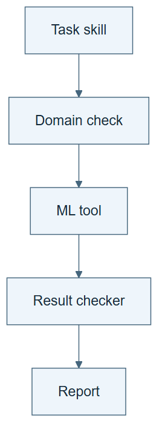

# 05.01 · Combine fixed components into a useful system

[Course](../../README.md) · [Theme](../README.md)

**You are here:** Theme 05, A system and its builder → lab 1 of 5. [Find this theme in the course map](../../COURSE-MAP.md#theme-05) · [Whole-course mindmap](../../COURSE-MAP.md#whole-course-mindmap).

## What you will build

A fixed research workflow that uses a task skill, an ML tool, domain checks, and a report checker.

## Why this matters

A language model’s answer is only one part of reliable experimental work. The surrounding system determines what it can observe, execute, and verify.

## Before you start

Complete [04.05: Change a definition without losing its consequences](../../04_ontology_engineering/step_05_evolve_vocabulary/README.md). You need the concepts and the reports named below, not its old chat. If you start here directly, ask the tutor to prepare the listed starting state and explain the missing prerequisite first.

Open the coding agent at the repository root. Read [the tutor skill](../../skills/rsi-tutor/SKILL.md) and this lab's [brief](BRIEF.md). The agent keeps this lab's notes in <code>rsi-work/05-01</code>, outside the repository, and reports the absolute path. If the lab continues an earlier experiment, keep that experiment in its original workspace with its existing budget and locks. A new notes folder does not reset an experiment. The agent checks local Python and the [tool requirements](../../tools/README.md) before execution. You do not write code or configuration.

**Starting state:** The baseline skill, workflow graph, domain rules, and output checker.

**Budget:** One bike baseline fit and the existing checks. Plan about 20–35 minutes of reading and discussion; this is an author estimate, not a measured student duration. Coding-agent inference may use a paid online service. Record its cost separately when available.

## How it works

Keep the language model and procedures fixed. The skill chooses actions; the tool fits a model; the domain rules reject invalid inputs; the output checker verifies evidence. Their coordination can improve reliability without changing model weights or any component’s instructions.

**A concrete example.** A capable language model might still accept the tempting input casual + registered. A domain checker can reject it before any fit. The whole system avoids a mistake even though the language-model weights and the rule itself stayed fixed. The improvement comes from how the components are arranged.


*These are expected paths to execute, not a recorded success. The small tables show selected fields and blank rows, not a full schema or invented predictions. The constant task model learns one training median; that ordinary fit is separate from updating an LLM or an agent procedure. Reference selection targets and row identities belong to the output check, not model fitting. Record each component’s actual versions, inputs, outputs, and checks. Test the removed-guard extension with a dry-run stub and inspect any remaining protection.*

[Open the illustration at full size](../../assets/illustrations/fixed-components-system-v2.png).

<details>
<summary>See the step diagram</summary>



*Read the diagram:* Fixed components coordinate one valid experiment. A domain check can stop an invalid request before fitting.

</details>

## Run the lab

Start with this prompt. The tutor pauses for your prediction before it runs the next step.

```text
Read rsi/AGENTS.md and
rsi/skills/rsi-tutor/SKILL.md.
Guide me through lab 05.01, Combine fixed
components into a useful system, one step at
a time.
Read its README and BRIEF. Prepare its
separate workspace.
You write and run the implementation. Keep
the reports and failures.
Ask me to predict the result before the
experiment.
```

**Make a prediction:** Which component should stop a leaked feature before fitting?

### 1. Assign responsibilities

Avoid giving every component an undefined job.

```text
Create SYSTEM.md mapping framing, data
checks, domain checks, fitting, metric
checks, and reporting to the existing
components. State what each reads and
writes.
```

**Observe:** Responsibilities and evidence paths are explicit.

### 2. Run the fixed system

Observe coordinated behavior.

```text
Run one valid baseline through the complete
workflow. Then submit a target-derived
feature fixture and confirm it stops before
fitting. Retain the full trace.
```

**Observe:** The system produces one checked result and one meaningful refusal.

## Check your result

The valid run passes the intended checks. The invalid fixture does not reach fitting. No component is silently revised during the comparison.

### Open these outputs

The agent keeps these in your lab workspace or records the original experiment path when reusing evidence.

| Output | What to inspect |
|---|---|
| SYSTEM.md | Assigns each responsibility to a component and names its inputs and outputs. |
| Valid baseline trace | Shows domain checks, fitting, result checking, and reporting for the same candidate. |
| Leaked-input refusal | Shows where the invalid fixture stopped and confirms that it did not start another fit. |

Ask the agent to open the actual files and show the command exit status. A written description of a run is not a run. Keep a short <code>LAB-NOTE.md</code> with your prediction, measured observation, explanation, and one limit. The tutor must mark skipped learner responses as skipped.

## Try one change

Remove the domain check in a labelled diagnostic copy. Replace fitting with a dry-run stub and reuse the leaked fixture without another fit. Record which protection is lost and whether another guard still blocks it.

## If something goes wrong

If every component appears responsible for “quality,” give each one a concrete job and completion check. If leakage reaches fitting, inspect whether the domain check actually ran before the fit action and whether its verdict controlled that action. Keep all component versions fixed during this comparison; a repair is a new recorded change.

Say “Stop this lab” to stop further work. Ask the agent to save <code>PROGRESS.md</code> with the last completed step and remaining budget. To resume, have it read that file and inspect active processes first. A reset creates a new sibling workspace; it does not erase failures or alter the source data. See the [recovery rules](../../tools/README.md) for interrupted tool runs.

## Key takeaways

- System capability includes tools, state, and checks around the model.
- Coordination can improve reliability with fixed components.
- This course’s term “system intelligence” is not a standard RSI level.

## Check your understanding

Answer before opening the explanation. You can ask the tutor for a hint.

1. Did the language-model weights change?
2. Which component computes MAE?
3. Does combining components prove self-improvement?
4. What does the refusal demonstrate?

<details>
<summary>Hint</summary>

Follow the candidate through the system. Which component supplies an action, which executes it, and which can reject its input or output?

</details>

<details>
<summary>Explained answers</summary>

1. No. The experiment changes system composition, not model training.

2. An executable metric tool or checker, operating on predictions and targets.

3. No. The components and their assembly can remain fixed.

4. The executed workflow blocks the specific declared violation before spending a fit.

</details>

## What's next

Different tasks may need different fixed skills. Make that choice explicit. Continue to [05.02: Choose a skill for the task](../step_02_route_tasks/README.md).
